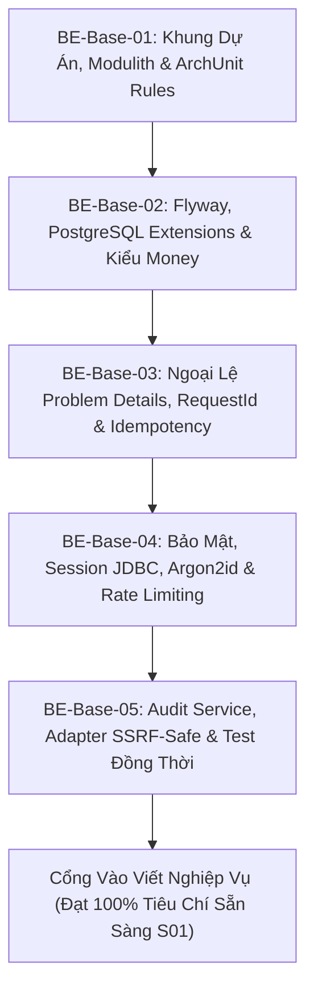

# Sổ Tay Lệnh Thực Thi Backend Base (Backend Base Prompts Playbook)

> **Mục tiêu**: Hướng dẫn xây dựng nền tảng vững chắc cho Backend (Modular Monolith Spring Boot 4 / Java 21) dựa trên 10 tài liệu tại `backend/docs/base/`.  
> Tuân thủ tuyệt đối triết lý **"Fix Harness First"**, **WIP = 1**, **Pass-State Gating**, và **12 Nguyên tắc cốt lõi** tại [00-tong-quan-va-muc-luc.md](./00-tong-quan-va-muc-luc.md).

---

## 📌 Hướng Dẫn Vận Hành (Operating Guide)

1. **Quy tắc WIP = 1**: Thực thi **TUẦN TỰ từng chặng (BE-Base-01 đến BE-Base-05)**. Chỉ chuyển chặng tiếp theo khi chặng hiện tại đã vượt qua cổng xác minh với mã thoát 0.
2. **Cổng kiểm soát (Pass-State Gating)**:
   ```powershell
   .\scripts\verify.ps1 -Target be
   ```
   Chỉ khi terminal trả về `[PASSED]`, mới được phép đánh dấu `[x] passing` trong `PROGRESS.md`.
3. **Công cụ Build**: Hệ thống sử dụng Gradle wrapper (`gradlew.bat` trên Windows, `./gradlew` trên Linux), Java 21 LTS.

---

## 🗺️ Bản Đồ 5 Chặng Xây Dựng Backend Base (Milestones)



---

## 🚀 DANH SÁCH PROMPT THỰC THI CHI TIẾT TỪNG CHẶNG

---

### Chặng BE-Base-01: Khung Dự Án, Spring Modulith & ArchUnit Rules
- **Tài liệu tham chiếu**:
  - [01-checklist-setup-truoc-khi-viet-nghiep-vu.md](./01-checklist-setup-truoc-khi-viet-nghiep-vu.md) (Mục B)
  - [02-cau-truc-kien-truc-phan-lop-va-clean-code.md](./02-cau-truc-kien-truc-phan-lop-va-clean-code.md) (Mục 1, 2, 7)
- **Mục tiêu**: Thiết lập cấu trúc package 14 module + `shared`, bean `Clock` chuẩn hóa thời gian, và các bài kiểm tra kiến trúc ArchUnit.

```markdown
Role: [BE-ARCHITECT]
Nhiệm vụ: Triển khai Chặng BE-Base-01: Khởi tạo khung dự án Spring Modulith, ArchUnit rules và Time abstraction.

Ngữ cảnh & Chỉ dẫn bắt buộc:
1. Đọc tài liệu:
   - backend/docs/base/01-checklist-setup-truoc-khi-viet-nghiep-vu.md (Mục B).
   - backend/docs/base/02-cau-truc-kien-truc-phan-lop-va-clean-code.md (Cấu trúc module, ArchUnit, YAGNI).
   - docs/harness/architecture.md.
2. Cập nhật `backend/build.gradle`:
   - Bổ sung Spring Modulith: `org.springframework.modulith:spring-modulith-starter-core:2.0.0` (hoặc bản tương thích Boot 4).
   - Bổ sung ArchUnit: `com.tngtech.archunit:archunit-junit5:1.4.1`.
   - Bổ sung test dependencies cho Modulith: `org.springframework.modulith:spring-modulith-starter-test`.
3. Triển khai trong `backend/src/main/java/`:
   - Cấu trúc package chuẩn: `com.example.homestay` (hoặc package hiện tại) gồm module `shared` và các package rỗng cho 14 module nghiệp vụ (`auth`, `listing`, `pricing`, `booking`, `payment`, `search`, etc.).
   - Tạo bean `java.time.Clock` chuẩn hệ thống tại `@Configuration` của `shared`.
   - Tạo lớp `MutableClock` trong `src/test/java/` (hỗ trợ tua nhanh thời gian phục vụ kiểm thử).
   - Cấu hình `@ConfigurationProperties` có xác thực `@Validated` cho các thuộc tính ứng dụng (profile `local`, `test`).
4. Viết bài kiểm tra kiến trúc (ArchUnit & Modulith):
   - `ArchitectureTests.java`:
     + Cấm gọi trực tiếp `Instant.now()`, `LocalDate.now()`, `LocalDateTime.now()` (bắt buộc dùng `Clock`).
     + Controller không import Repository hoặc Entity trực tiếp (phải qua Service/Use Case DTO).
     + Package `shared` không được import các module nghiệp vụ cụ thể.
   - `ModulithTests.java`: Chạy `ApplicationModules.of(BackendApplication.class).verify()`.
5. Cổng xác minh bắt buộc (Pass-State Gating):
   powershell -ExecutionPolicy Bypass -File .\scripts\verify.ps1 -Target be
6. Khi lệnh đạt [PASSED], cập nhật PROGRESS.md chuyển BE-Base-01 sang [x] passing.
```

---

### Chặng BE-Base-02: Cơ Sở Dữ Liệu Flyway, Extensions & Tiền Tệ (Money Value Object)
- **Tài liệu tham chiếu**:
  - [01-checklist-setup-truoc-khi-viet-nghiep-vu.md](./01-checklist-setup-truoc-khi-viet-nghiep-vu.md) (Mục C & D1)
  - [06-toan-ven-du-lieu-giao-dich-dong-thoi.md](./06-toan-ven-du-lieu-giao-dich-dong-thoi.md) (Mục 1, 2, 7, 8)
- **Mục tiêu**: Cấu hình Flyway migration, kích hoạt extensions PostgreSQL (`btree_gist`, `postgis`), tạo bảng nền tảng và xây dựng Value Object `Money` bất biến.

```markdown
Role: [BE-ARCHITECT]
Nhiệm vụ: Triển khai Chặng BE-Base-02: Thiết lập Flyway migration, PostgreSQL extensions, timeouts và kiểu Money bất biến.

Ngữ cảnh & Chỉ dẫn bắt buộc:
1. Đọc tài liệu:
   - backend/docs/base/06-toan-ven-du-lieu-giao-dich-dong-thoi.md (Mục 1 DB constraints, Mục 2 Transaction, Mục 7 Money, Mục 8 Migration).
2. Cập nhật `backend/build.gradle`:
   - Bật JPA: `org.springframework.boot:spring-boot-starter-data-jpa`.
   - Driver PostgreSQL: `org.postgresql:postgresql`.
   - Flyway: `org.flywaydb:flyway-core`, `org.flywaydb:flyway-database-postgresql`.
   - Testcontainers: `org.testcontainers:postgresql`, `org.springframework.boot:spring-boot-testcontainers`.
3. Triển khai trong `backend/`:
   - `application.yml` (hoặc `application.properties`):
     + `spring.jpa.open-in-view = false` (chống rò rỉ session/connection).
     + `spring.jpa.hibernate.ddl-auto = validate` (chỉ dùng Flyway để sinh DDL).
     + Cấu hình HikariCP timeouts: `connection-timeout: 30000`, `max-lifetime: 1800000`.
   - Tạo file Flyway migration `V1__init_baseline_and_extensions.sql` tại `src/main/resources/db/migration/`:
     + Extension: `CREATE EXTENSION IF NOT EXISTS btree_gist;`, `CREATE EXTENSION IF NOT EXISTS postgis;`.
     + Bảng nền `idempotency_key` (key, response_payload, status, expires_at, created_at).
     + Bảng nền `activity_log` (audit bất biến: chỉ INSERT và SELECT, có check constraint).
     + Bảng `shedlock` (name, lock_until, locked_at, locked_by).
   - Xây dựng Value Object `Money` bất biến trong `shared.domain`:
     + Thuộc tính: `long amount` (lưu đơn vị nhỏ nhất: VND là đồng, USD là cents) và `Currency currency`.
     + Phương thức thuần: `plus()`, `minus()`, `multiply()`, `allocate()` (chia tiền theo tỷ lệ không mất xu lẻ), `isSameCurrency()`.
4. Viết Unit Test:
   - `MoneyTest.java`: Kiểm thử cộng, trừ, chia phần không lệch xu lẻ cho cả VND và USD.
5. Cổng xác minh bắt buộc (Pass-State Gating):
   powershell -ExecutionPolicy Bypass -File .\scripts\verify.ps1 -Target be
6. Khi lệnh đạt [PASSED], cập nhật PROGRESS.md chuyển BE-Base-02 sang [x] passing.
```

---

### Chặng BE-Base-03: Xử Lý Ngoại Lệ Tập Trung, Problem Details & Idempotency
- **Tài liệu tham chiếu**:
  - [01-checklist-setup-truoc-khi-viet-nghiep-vu.md](./01-checklist-setup-truoc-khi-viet-nghiep-vu.md) (Mục D2, D3, D6)
  - [03-thiet-ke-api-loi-va-hop-dong.md](./03-thiet-ke-api-loi-va-hop-dong.md) (Mục 2, 4, 8)
- **Mục tiêu**: Chuẩn hóa định dạng lỗi RFC 7807 Problem Details, bộ lọc `X-Request-Id` (MDC logging), và hạ tầng chống xử lý trùng lặp (`Idempotency-Key`).

```markdown
Role: [BE-ARCHITECT]
Nhiệm vụ: Triển khai Chặng BE-Base-03: Global Exception Handler RFC 7807, RequestId MDC filter và hạ tầng Idempotency.

Ngữ cảnh & Chỉ dẫn bắt buộc:
1. Đọc tài liệu:
   - backend/docs/base/03-thiet-ke-api-loi-va-hop-dong.md (Mục 2 URL & status, Mục 4 Problem Details, Mục 8 Idempotency).
   - backend/docs/base/07-van-hanh-log-giam-sat-docker-ci.md (Mục 1 Structured Logging & MDC).
2. Triển khai trong `backend/src/main/java/`:
   - `shared.error`:
     + Enum `ErrorCode`: Danh mục mã lỗi nghiệp vụ chuẩn (ví dụ: `INVALID_INPUT`, `UNAUTHORIZED`, `FORBIDDEN`, `RESOURCE_NOT_FOUND`, `CONFLICT_CONCURRENT_ACCESS`, `IDEMPOTENCY_KEY_REUSED_WITH_DIFFERENT_PAYLOAD`, `INTERNAL_SERVER_ERROR`).
     + Lớp `BusinessException` kế thừa `RuntimeException`.
     + `@RestControllerAdvice GlobalExceptionHandler`: Bắt `MethodArgumentNotValidException` (lỗi validation field), `BusinessException`, `NoHandlerFoundException`, `Exception` chung.
     + Trả về cấu trúc Problem Details: `type`, `title`, `status`, `detail`, `code`, `instance`, `invalidParams` (nếu có lỗi trường), không bao giờ lộ stack trace hoặc câu lệnh SQL nội bộ.
   - `shared.web.filter`:
     + `RequestIdFilter`: Đọc header `X-Request-Id` (nếu không có thì tự sinh UUID), gán vào SLF4J MDC `requestId`, và đính kèm vào response header.
   - `shared.idempotency`:
     + Annotation `@Idempotent` và Interceptor/Filter kiểm tra `Idempotency-Key` header:
       * Nếu key chưa có: lưu trạng thái `PENDING`, tiếp tục thực thi và lưu kết quả response.
       * Nếu key đã có và cùng hash payload: trả về ngay response đã lưu (không chạy lại logic).
       * Nếu key đã có nhưng khác payload: trả lỗi `400 Bad Request - IDEMPOTENCY_PAYLOAD_MISMATCH`.
3. Viết test:
   - `GlobalExceptionHandlerTest.java`: Kiểm thử format Problem Details cho lỗi validation và lỗi nghiệp vụ.
   - `IdempotencyTest.java`: Kiểm thử gửi cùng key 2 lần và kiểm thử gửi cùng key khác body.
4. Cổng xác minh bắt buộc (Pass-State Gating):
   powershell -ExecutionPolicy Bypass -File .\scripts\verify.ps1 -Target be
5. Cập nhật PROGRESS.md chuyển BE-Base-03 sang [x] passing.
```

---

### Chặng BE-Base-04: Bảo Mật Nền Tảng (Spring Security 7, Session JDBC, Argon2id & Rate Limiting)
- **Tài liệu tham chiếu**:
  - [01-checklist-setup-truoc-khi-viet-nghiep-vu.md](./01-checklist-setup-truoc-khi-viet-nghiep-vu.md) (Mục D4, D5, D8)
  - [04-bao-mat-1-owasp-xac-thuc-mat-khau.md](./04-bao-mat-1-owasp-xac-thuc-mat-khau.md) (Mục 1, 2, 3)
  - [05-bao-mat-2-phan-quyen-dau-vao-upload.md](./05-bao-mat-2-phan-quyen-dau-vao-upload.md) (Mục 1, 4, 7)
- **Mục tiêu**: Cấu hình bảo mật "Mặc định từ chối", Spring Session JDBC qua cookie HttpOnly, mã hóa Argon2id, CSRF token và Rate limiting chống brute force.

```markdown
Role: [BE-SECURITY-ENGINEER]
Nhiệm vụ: Triển khai Chặng BE-Base-04: Cấu hình Spring Security 7, Spring Session JDBC, Argon2id, CSRF và Rate Limiting Bucket4j.

Ngữ cảnh & Chỉ dẫn bắt buộc:
1. Đọc tài liệu:
   - backend/docs/base/04-bao-mat-1-owasp-xac-thuc-mat-khau.md (Nguyên tắc phiên JDBC, Argon2id, Lockout).
   - backend/docs/base/05-bao-mat-2-phan-quyen-dau-vao-upload.md (Mặc định từ chối, CSRF, Rate Limiting).
2. Cập nhật `backend/build.gradle`:
   - Spring Session JDBC: `org.springframework.session:spring-session-jdbc`.
   - Bouncy Castle (Argon2): `org.bouncycastle:bcprov-jdk18on:1.80`.
   - Bucket4j: `com.bucket4j:bucket4j-core:8.10.1`.
3. Triển khai trong `backend/src/main/java/`:
   - `shared.security`:
     + `PasswordEncoder`: Sử dụng `Argon2PasswordEncoder.defaultsForSpringSecurity_v5_8()`.
     + `SecurityConfig`:
       * Chuỗi lọc SecurityFilterChain tuân thủ nguyên tắc **Mặc định từ chối**: `.anyRequest().denyAll()`, ngoại trừ các endpoint public được mở rõ ràng (`/api/v1/auth/login`, `/api/v1/auth/register`, `/api/v1/health`, Swagger docs).
       * CSRF: Sử dụng `CookieCsrfTokenRepository.withHttpOnlyFalse()` (đặt cookie `XSRF-TOKEN` để frontend Next.js đọc gửi lên header `X-XSRF-TOKEN`).
       * Session Management: Lưu qua Spring Session JDBC, cookie `SESSION` có cờ `HttpOnly`, `SameSite=Lax`.
       * Header bảo mật: X-Content-Type-Options (nosniff), X-Frame-Options (DENY), HSTS.
     + Rate Limiting: Bộ lọc Bucket4j giới hạn tốc độ gọi theo IP cho các route nhạy cảm (ví dụ tối đa 5 lần đăng nhập sai / 1 phút).
   - Tạo endpoint khung:
     + `GET /api/v1/health`: Kiểm tra sức khỏe hệ thống (Public).
     + `GET /api/v1/me`: Trả về thông tin người dùng hiện tại, vai trò và quyền (Yêu cầu đăng nhập).
4. Viết test bảo mật:
   - `SecurityConfigTest.java`:
     + Gọi endpoint bất kỳ chưa khai báo quyền bị trả về `401 Unauthorized` hoặc `403 Forbidden`.
     + POST mutation không có CSRF token bị từ chối `403`.
     + Vượt quá ngưỡng rate limit bị trả về `429 Too Many Requests`.
5. Cổng xác minh bắt buộc (Pass-State Gating):
   powershell -ExecutionPolicy Bypass -File .\scripts\verify.ps1 -Target be
6. Cập nhật PROGRESS.md chuyển BE-Base-04 sang [x] passing.
```

---

### Chặng BE-Base-05: Audit Service, Adapter SSRF-Safe & Bộ Khung Test Đồng Thời (Cổng Vào Nghiệp Vụ)
- **Tài liệu tham chiếu**:
  - [01-checklist-setup-truoc-khi-viet-nghiep-vu.md](./01-checklist-setup-truoc-khi-viet-nghiep-vu.md) (Mục D7, D10, D11, E2, E3, và Cổng vào)
  - [07-van-hanh-log-giam-sat-docker-ci.md](./07-van-hanh-log-giam-sat-docker-ci.md) (Mục 2 Audit log, Mục 5 SSRF)
  - [08-kiem-thu-chat-luong-va-dinh-nghia-hoan-thanh.md](./08-kiem-thu-chat-luong-va-dinh-nghia-hoan-thanh.md) (Mục 3 Concurrency Testing)
- **Mục tiêu**: Hoàn tất dịch vụ Audit bất biến, adapter HTTP an toàn chống SSRF, bộ khung kiểm thử đồng thời và nghiệm thu toàn bộ "Cổng vào viết nghiệp vụ".

```markdown
Role: [BE-ARCHITECT & QA-GATEKEEPER]
Nhiệm vụ: Triển khai Chặng BE-Base-05: AuditService cùng transaction, SSRF-Safe RestClient, Concurrency Test Framework và nghiệm thu Cổng vào viết nghiệp vụ.

Ngữ cảnh & Chỉ dẫn bắt buộc:
1. Đọc tài liệu:
   - backend/docs/base/01-checklist-setup-truoc-khi-viet-nghiep-vu.md (Cổng vào viết nghiệp vụ).
   - backend/docs/base/07-van-hanh-log-giam-sat-docker-ci.md (Mục 2 Audit, Mục 5 SSRF validator).
   - backend/docs/base/08-kiem-thu-chat-luong-va-dinh-nghia-hoan-thanh.md (Kiểm thử đồng thời N threads).
2. Triển khai trong `backend/src/main/java/`:
   - `shared.audit`:
     + `AuditService`: Phương thức `recordEvent(userId, action, resourceType, resourceId, details)` ghi trực tiếp vào bảng `activity_log` trong CÙNG database transaction với nghiệp vụ chính (nếu transaction rollback, log audit tự rollback; không để sót log rác).
   - `shared.integration`:
     + `SsrfSafeClient`: Cấu hình Spring `RestClient` có bộ kiểm tra IP/Domain (chặn truy cập vào các dải IP riêng tư nội bộ: `10.0.0.0/8`, `172.16.0.0/12`, `192.168.0.0/16`, `127.0.0.1`, `169.254.169.254` AWS metadata).
   - Cấu hình Springdoc OpenAPI 3.x:
     + Xuất tài liệu tại `/v3/api-docs` và Swagger UI tại `/swagger-ui.html` (chỉ bật ở profile `local`).
3. Xây dựng khung kiểm thử đồng thời (Concurrency Test Harness) trong `src/test/java/shared/test/`:
   - Lớp tiện ích `ConcurrencyTestHelper`: Nhận vào số lượng luồng (N threads) và một hành động `Callable`, sử dụng `CountDownLatch` làm rào xuất phát để ép N luồng bắn đồng thời vào cùng 1 mili-giây, đo đếm số lượng thành công / thất bại.
4. Nghiệm thu "Cổng vào viết nghiệp vụ":
   - Chạy toàn bộ test đơn vị, test bảo mật, test Modulith, test ArchUnit.
   - Xác nhận:
     [x] Biên dịch Java 21 sạch sẽ, không có warning coi là lỗi.
     [x] Mặc định từ chối và test ma trận bảo mật hoạt động.
     [x] Audit log, Problem Details, Idempotency, Time-travel MutableClock sẵn sàng.
5. Cổng xác minh bắt buộc (Pass-State Gating):
   powershell -ExecutionPolicy Bypass -File .\scripts\verify.ps1 -Target be
6. Khi lệnh đạt [PASSED], cập nhật PROGRESS.md chuyển toàn bộ BE-Base sang [x] passing và sẵn sàng cho Slice S01 Backend!
```
