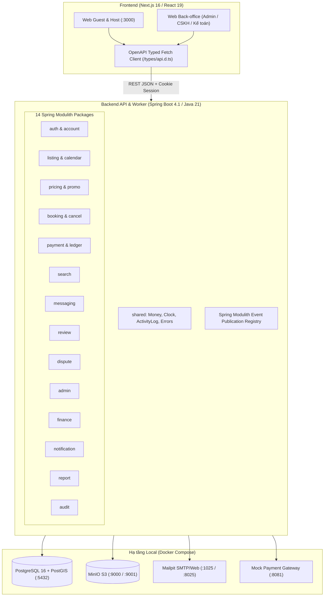

# Kiến Trúc Hệ Thống & Ranh Giới Module (Architecture & Boundaries)

Tài liệu này đóng vai trò là **Topic Doc** trong phân hệ ngữ cảnh của Harness, mô tả cấu trúc phân tầng, ranh giới giữa Frontend và Backend, cùng quy ước giao tiếp giữa 14 module nghiệp vụ.

---

## 1. Bản Đồ Tổng Thể (System Map)

Hệ thống được thiết kế theo mô hình **Modular Monolith (Spring Boot 4) + Next.js 16 (App Router)** chạy hoàn chỉnh trên môi trường local qua Docker Compose.

---

## 2. Ranh Giới Frontend - Backend (FE/BE Boundaries)

### 2.1. Phân chia trách nhiệm bất biến (Inviolable Invariants)
1. **Pricing Invariant**: Frontend **tuyệt đối không** tự tính toán giá phòng, phụ phí, thuế, chiết khấu, hoàn tiền. Toàn bộ logic tính tiền nằm độc quyền tại `PricingEngine` (Backend). Frontend chỉ hiển thị dữ liệu số do backend trả về.
2. **Time & Hold Countdown Invariant**: Đồng hồ đếm ngược giữ phòng (15 phút) dựa vào `expiresAt` do Backend trả về theo UTC, không tin cậy đồng hồ máy khách.
3. **Session & Auth Ownership**: Backend sở hữu phiên đăng nhập (Spring Session JDBC lưu vào Postgres). Cookie HttpOnly với `SameSite=Lax`. Next.js đóng vai trò rewrite reverse proxy `/api/*` sang `http://localhost:8080/api/*` để tránh phức tạp CORS.
4. **API Contract Single Source of Truth**: OpenAPI spec do `springdoc-openapi` tại `http://localhost:8080/v3/api-docs` sinh ra là hợp đồng duy nhất. Frontend cập nhật kiểu dữ liệu bằng `npm run gen:api`.

### 2.2. Bảng Phân Bổ Cổng Mạng (Port Allocation)

| Dịch vụ | Cổng Host | Vai trò |
|---|---|---|
| **Frontend (Next.js)** | `3000` | Giao diện Guest / Host |
| **Backend API (Spring Boot)** | `8080` | REST API, Swagger UI (`/swagger-ui.html`), Actuator (`/actuator`) |
| **PostgreSQL + PostGIS** | `5432` | Cơ sở dữ liệu quan hệ, exclusion constraints, session store |
| **MinIO API** | `9000` | S3-compatible Object Storage |
| **MinIO Console** | `9001` | Giao diện quản trị MinIO Web Console |
| **Mailpit Web** | `8025` | Giao diện xem email kiểm thử (inbox giả) |
| **Mailpit SMTP** | `1025` | Cổng SMTP local nhận email từ backend |
| **Mock Payment Gateway** | `8081` | Webhook & UI giả lập thanh toán thẻ, MoMo, VNPay |

---

## 3. Quy Ước Dữ Liệu (Data Conventions)

1. **Tiền tệ (Money)**:
   - Luôn là số nguyên theo đơn vị nhỏ nhất (Minor unit): `VND` (không có xu, số nguyên), `USD` (cents).
   - Truyền qua API dạng object: `{ "amount": 1500000, "currency": "VND" }`.
   - Frontend định dạng bằng `Intl.NumberFormat`.
2. **Thời gian (Timestamps)**:
   - Truyền dạng chuỗi ISO 8601 UTC: `2026-10-04T09:30:00Z`.
   - Kèm theo trường múi giờ listing IANA: `timeZone: "Asia/Ho_Chi_Minh"`.
   - Mọi tính toán logic thời gian ở backend đi qua bean `java.time.Clock` (hỗ trợ tua nhanh thời gian khi test).
3. **Chống đặt trùng (Double Booking Prevention)**:
   - Dùng `daterange` và PostGIS / PostgreSQL `EXCLUSION CONSTRAINT` (`gist`).
   - Tầng ứng dụng bắt mã lỗi SQL `23P01` và chuyển thành mã lỗi nghiệp vụ `BOOKING_OVERLAPPING_DATES` (HTTP 409).
