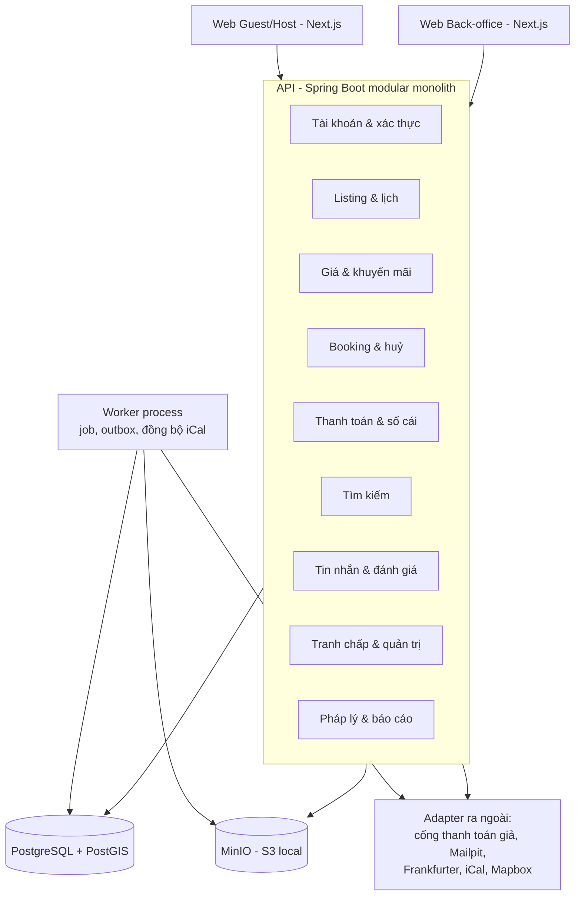

# Kiến trúc giải pháp – Hệ thống đặt phòng lưu trú (marketplace)

Phiên bản dành cho **dự án chạy local, không đưa vào thực tế**.
Dựa trên *Đặc tả nghiệp vụ v1.0 (03/10/2026)* và *Mô hình thực thể và luồng chính v1.1 (41 thực thể)*.
Phạm vi: kiến trúc tổng thể, công nghệ, luồng đặt phòng và chống đặt trùng, thanh toán, API, dữ liệu, bảo mật, chạy local, kiểm thử. Không có code.

Cập nhật: đã thêm mục 3.2 đến 3.6 (thư viện frontend/backend, giao diện kiểu Airbnb, cấu trúc repo, thứ tự đưa thư viện vào theo slice). Phiên bản chính được kiểm tra ngày 04/10/2026; khi khởi tạo dự án hãy dùng bản ổn định mới nhất của cùng dòng.

Nguyên tắc xuyên suốt: **giữ nguyên độ đúng đắn của lõi nghiệp vụ** (không đặt trùng, tiền khớp, sổ cái bất biến, snapshot), nhưng **bỏ mọi thứ chỉ phục vụ vận hành thật** (cloud, CDN, HA, tuân thủ pháp lý, cổng thanh toán thật).

---

## 1. Phân tích yêu cầu và giả định

### 1.1. Tóm tắt hệ thống

- Marketplace kiểu Airbnb: Guest, Host, Admin, CSKH, Kế toán.
- 14 module nghiệp vụ, VI + EN, đa tiền tệ, chỉ website responsive.
- Tích hợp theo đặc tả: Visa/Mastercard, MoMo, VNPay, Frankfurter v2, Mapbox, iCal, email, Admin duyệt danh tính thủ công. Ở bản local, các tích hợp thanh toán và email được **mô phỏng** (mục 4.2).

### 1.2. Giả định

| Hạng mục | Giả định |
|---|---|
| Môi trường | Một máy phát triển, chạy bằng Docker Compose; không có người dùng thật |
| Dữ liệu | Dữ liệu giả (seed), tuyệt đối không dùng CCCD/hộ chiếu/thẻ thật |
| Quy mô tham chiếu | Seed khoảng 200 listing, vài nghìn booking để thử hiệu năng tìm kiếm |
| Đội ngũ | Nhóm nhỏ hoặc cá nhân, ưu tiên đơn giản và dễ debug |
| Mục tiêu | Chứng minh thiết kế đúng: luồng đặt phòng, đồng thời, tiền, đối soát |

### 1.3. Các mối quan tâm kỹ thuật (xếp theo rủi ro)

1. **Đặt trùng phòng** (KPI-02 = 0), kể cả khi nhiều request song song.
2. **Đúng đắn thanh toán:** callback bất đồng bộ, trùng, thất lạc, thành công sau khi giữ chỗ hết hạn.
3. **Sổ cái bất biến** và đối soát.
4. **Trạng thái theo thời gian:** 15 phút, 24 giờ, check-in + 24 giờ, 14 ngày, theo múi giờ listing.
5. **Một bộ máy tính giá** dùng chung cho tìm kiếm, báo giá, thanh toán, đổi booking.
6. **Cấu hình theo quốc gia/tiền tệ**, chỉ áp dụng cho booking mới.
7. **Kiểm toán** mọi thao tác nhạy cảm.

Hệ quả của việc chạy local: các thứ thật sự khó kiểm thử là **thời gian** (chờ 24 giờ hay 14 ngày là không thực tế) và **lỗi của bên ngoài** (callback trễ, trùng, mất). Vì vậy kiến trúc bổ sung hai thành phần hỗ trợ kiểm thử: **Clock có thể tua** và **cổng thanh toán giả có thể gây lỗi** (mục 4.2, 10).

---

## 2. Kiến trúc tổng thể

**Quyết định: modular monolith + worker process**, chạy bằng Docker Compose.

Những thao tác phải nguyên tử (lịch, booking, sổ cái) nằm trong cùng một transaction cơ sở dữ liệu. Microservices sẽ biến chính các thao tác đó thành giao dịch phân tán, và còn làm việc chạy local nặng nề hơn nhiều.



Nguyên tắc tổ chức:

- 14 module = 14 package có giao diện công khai, kiểm tra ranh giới bằng Spring Modulith (`ApplicationModules.verify()` trong test, mục 3.3); mỗi module một schema DB.
- Cùng một codebase, hai tiến trình: API và worker.
- Mọi dịch vụ ngoài đứng sau một **interface adapter**, nên đổi từ giả sang thật chỉ là đổi cấu hình/triển khai adapter.

| Phương án | Ưu điểm | Nhược điểm | Kết luận |
|---|---|---|---|
| Modular monolith + worker | Transaction đơn; ít thành phần; chạy local nhẹ | Cần kỷ luật ranh giới module | **Chọn** |
| Microservices | Mở rộng độc lập | Giao dịch phân tán; rất nặng khi chạy local | Loại |
| Serverless / BaaS | Ít vận hành | Khó chạy local, khó bảo đảm bất biến | Loại |

---

## 3. Lựa chọn công nghệ

| Lớp | Khuyến nghị | Phương án thay thế và lý do không chọn |
|---|---|---|
| Frontend công khai và Guest/Host | Next.js 16 (React 19, TypeScript), Tailwind CSS v4 + shadcn/ui, next-intl, Mapbox GL JS qua react-map-gl (chi tiết mục 3.2) | Thư viện UI đóng gói sẵn (MUI, Ant Design): khó tuỳ biến thành giao diện kiểu Airbnb |
| Back-office | Ứng dụng Next.js riêng trong cùng repo (monorepo) | Dùng chung ứng dụng: lẫn công cụ nội bộ với trang công khai |
| Backend | Spring Boot 4.x (Java 21), Spring Modulith, một deployable (chi tiết mục 3.3) | NestJS: dùng được nếu đội chỉ có TypeScript; Spring Boot 3.x: hết hạn hỗ trợ mã nguồn mở vào khoảng tháng 6/2026 |
| Cơ sở dữ liệu | PostgreSQL + PostGIS (image `postgis/postgis`) | MongoDB: không phù hợp tiền và tồn kho; MySQL: thiếu exclusion constraint |
| Tìm kiếm | PostgreSQL/PostGIS | OpenSearch: thừa cho dữ liệu seed |
| Cache | Không dùng Redis; cache trong tiến trình cho cấu hình và tỷ giá | Redis: không có yêu cầu nào cần |
| Job và sự kiện | `@Scheduled` + ShedLock (khoá trong DB) và event publication registry của Spring Modulith (đóng vai trò outbox) | Kafka, RabbitMQ: thừa |
| Lưu trữ file | MinIO (tương thích S3), hai bucket: ảnh công khai, giấy tờ danh tính riêng tư | Lưu trên đĩa: khác API với S3, khó chuyển sau này |
| Email | Mailpit (hộp thư giả, có giao diện xem thư) | Nhà cung cấp thật: không cần |
| Chat | Polling hoặc SSE | WebSocket: không có push/SMS nên không cần |
| Quan sát | Log có cấu trúc + Spring Actuator; dashboard và trace là tuỳ chọn | Grafana/OTel đầy đủ: thừa |
| Chạy và đóng gói | Docker Compose, một lệnh dựng toàn bộ | Kubernetes, Terraform, AWS: không dùng |

Ghi chú: chọn Java/Spring Boot dựa trên giả định nhóm quen hệ sinh thái này; các phần còn lại không phụ thuộc lựa chọn đó. Thư viện cụ thể cho frontend và backend nằm ở mục 3.2 và 3.3.

### 3.1. Thành phần Docker Compose

| Service | Vai trò |
|---|---|
| `db` | PostgreSQL + PostGIS, volume dữ liệu |
| `minio` | Lưu ảnh listing và giấy tờ danh tính giả |
| `mailpit` | Nhận và hiển thị email thông báo |
| `api` | Spring Boot, phục vụ REST và webhook |
| `worker` | Cùng codebase, chạy job (hết hạn, payout, iCal, tỷ giá, đối soát) |
| `web` | Next.js Guest/Host |
| `backoffice` | Next.js cho Admin, CSKH, Kế toán |
| `mock-gateway` | Cổng thanh toán giả (mục 4.2) |

Dữ liệu mẫu (seed) gồm: tài khoản mỗi vai trò, vài trăm listing, giá/lịch, cấu hình quốc gia Việt Nam.

---

### 3.2. Frontend: thư viện và cách làm giao diện kiểu Airbnb

**Hướng chọn:** vì giao diện cần hiện đại và tuỳ biến nhiều, dùng bộ **primitive không áp sẵn kiểu giao diện** (Radix qua shadcn/ui) cùng Tailwind, thay vì thư viện đóng gói sẵn. Mã component nằm trong repo của bạn nên sửa tự do. Airbnb chỉ là nguồn tham khảo về **mẫu thiết kế** (bố cục, tương tác); thương hiệu, màu, logo, phông riêng của họ không được sao chép, hãy chọn màu chủ đạo và phông riêng.

| Nhóm | Khuyến nghị | Vì sao |
|---|---|---|
| Framework | Next.js 16 (App Router), React 19, TypeScript chế độ strict | Render phía server cho trang công khai, định tuyến theo thư mục, hệ sinh thái lớn |
| Package manager, repo | pnpm workspaces (monorepo) | Hai ứng dụng (web, backoffice) dùng chung design system và client API |
| Styling | Tailwind CSS v4, token thiết kế đặt trong `@theme` (màu, bo góc, bóng, phông, chuyển động) | Tuỳ biến tối đa, không chạy CSS-in-JS lúc runtime, hợp với Server Components |
| Component | shadcn/ui (trên nền Radix UI): Dialog, Popover, DropdownMenu, Tabs, Slider, Tooltip, Select | Sao chép mã vào dự án nên sửa thoải mái, có sẵn khả năng truy cập (a11y) |
| Icon | lucide-react | Mặc định của shadcn/ui, nét mảnh hiện đại |
| Phông | `next/font` với một phông sans hiện đại (ví dụ Inter, Plus Jakarta Sans) có hỗ trợ tiếng Việt | Tải tối ưu, không phụ thuộc phông riêng của Airbnb |
| Chuyển động | Motion (trước đây là Framer Motion) | Hiệu ứng ô tìm kiếm mở rộng, tim yêu thích, bảng trượt |
| Carousel ảnh | Embla Carousel (`embla-carousel-react`) | Nhẹ, vuốt mượt, dùng cho thẻ listing và gallery |
| Ngăn kéo di động | Vaul (Drawer của shadcn/ui) | Bộ lọc và khung đặt phòng dạng bottom sheet trên điện thoại |
| Thông báo nhỏ | Sonner (toast) | Đi kèm shadcn/ui |
| Form | React Hook Form + Zod + `@hookform/resolvers` | Form nhiều bước tạo listing, kiểm tra dữ liệu bằng schema dùng chung cho từng bước |
| Dữ liệu từ server | TanStack Query v5 (phía client) và `fetch` trong Server Components (trang công khai) | Cache, thử lại, cập nhật lạc quan (yêu thích), polling (chat, trạng thái thanh toán) |
| Trạng thái trên URL | nuqs | Bộ lọc tìm kiếm nằm trên URL nên chia sẻ và quay lại được |
| Client API | `openapi-typescript` + `openapi-fetch` (và `openapi-react-query` nếu muốn hook sinh sẵn) sinh từ OpenAPI của backend | Kiểu dữ liệu luôn khớp backend; thay thế: Orval |
| Đa ngôn ngữ | next-intl (ICU message) | VI/EN, định dạng ngày, số, tiền theo ngôn ngữ |
| Ngày giờ | date-fns v4 + `@date-fns/tz` | Múi giờ listing; tương thích react-day-picker |
| Lịch chọn ngày | react-day-picker v9 (chế độ chọn khoảng) | Tuỳ biến ô ngày để hiện giá, ngày bị chặn, đêm tối thiểu |
| Bản đồ | `mapbox-gl` + `react-map-gl` (bản dành cho Mapbox); marker giá tự vẽ bằng HTML, gom cụm bằng nguồn GeoJSON có `cluster` | Đúng tích hợp Mapbox theo đặc tả. Nếu không muốn dùng token: MapLibre GL cùng API tương tự |
| Tải ảnh | `react-dropzone` + `@dnd-kit` (kéo thả sắp xếp) + upload trực tiếp lên MinIO bằng URL ký sẵn | Trải nghiệm ảnh giống các nền tảng đặt phòng |
| Bảng, biểu đồ (back-office) | TanStack Table v8 (Data Table của shadcn/ui), Recharts (shadcn/ui charts) | Dùng chung hệ thống giao diện với web, ít thư viện cần học |
| Kiểm thử | Vitest + Testing Library; Playwright cho E2E | Playwright mở hai trình duyệt để thử đặt trùng và luồng thanh toán |
| Lint, định dạng | Biome (hoặc ESLint + Prettier) | Một công cụ, nhanh |

Những điều **không** nên làm ở frontend:
- Không tính giá, phí, thuế, hoàn tiền ở phía trình duyệt. Chỉ hiển thị số tiền do API trả về, để PricingEngine phía server là nguồn duy nhất (bất biến về giá).
- Đồng hồ đếm ngược giữ chỗ dựa trên thời điểm hết hạn do server trả về, không dựa vào đồng hồ máy khách.
- Không dùng thư viện đăng nhập phía Next.js (ví dụ Auth.js): backend sở hữu xác thực và phiên (mục 3.3). Next.js chuyển tiếp `/api` sang backend qua rewrite cùng origin để cookie HttpOnly hoạt động và không cần cấu hình CORS phức tạp.

**Cách chuyển mẫu Airbnb thành thành phần cụ thể**

| Mẫu giao diện | Cách làm |
|---|---|
| Ô tìm kiếm dạng viên thuốc (Địa điểm, Ngày, Khách), thu gọn khi cuộn | Popover của Radix + react-day-picker dạng khoảng + nút tăng giảm số khách; header `sticky` đổi kích thước theo vị trí cuộn, Motion cho hiệu ứng mở rộng |
| Thẻ listing: ảnh tỷ lệ 4:3 bo góc lớn, vuốt xem ảnh, nút tim | `next/image` + Embla; nút tim cập nhật lạc quan bằng TanStack Query |
| Hàng chip bộ lọc và hộp lọc đầy đủ | Dialog (máy tính) / Vaul (điện thoại); Slider khoảng giá của Radix; trạng thái lọc trên URL bằng nuqs |
| Bản đồ có marker hiển thị giá, đồng bộ với danh sách | `react-map-gl` với Marker HTML dạng nhãn giá; rê chuột vào thẻ thì làm nổi marker qua context hoặc Zustand nhỏ |
| Trang chi tiết: lưới ảnh 1 lớn + 4 nhỏ, xem toàn bộ ảnh | CSS grid + Dialog + Embla |
| Khung đặt phòng dính bên phải | Tailwind `sticky`; trên điện thoại chuyển thành thanh cố định dưới đáy, bấm mở Drawer |
| Lịch hiện giá từng đêm, ngày bị chặn, đêm tối thiểu | `DayButton` tuỳ biến của react-day-picker + `disabled` matcher từ dữ liệu khả dụng của API |
| Tạo listing nhiều bước, tự lưu nháp | React Hook Form + một schema Zod cho mỗi bước; mỗi bước lưu nháp qua API (debounce); mỗi bước một đường dẫn |
| Trạng thái tải, lỗi, rỗng | Skeleton của shadcn/ui cho mọi danh sách; Sonner cho thông báo thao tác |

**Hệ thống thiết kế dùng chung** nằm ở `packages/ui`: token (màu, bo góc 12/16/24 px và dạng viên thuốc, bóng nhẹ, thang khoảng cách 4 px, chuyển động 150 đến 250 ms), các component đã tuỳ biến và các mẫu ghép (thẻ listing, thanh tìm kiếm, khung giá). Web và back-office cùng dùng gói này để giao diện nhất quán.

**Vì sao không chọn thư viện giao diện đóng gói sẵn:**

| Thư viện | Nhận xét |
|---|---|
| MUI, Ant Design, Chakra UI | Có sẵn nhiều thành phần nhưng giao diện riêng rất đặc trưng; chỉnh thành phong cách Airbnb tốn công ghi đè, và một số dùng CSS-in-JS lúc runtime nên kém hợp với Server Components |
| Mantine, HeroUI | Hiện đại hơn, nhưng vẫn phải tuỳ biến sâu nếu muốn giống mẫu thiết kế riêng; thêm một hệ thống để học |
| React Aria Components | Rất tốt về truy cập, có thể dùng thêm cho từng thành phần phức tạp (ví dụ combobox, date picker) nếu Radix chưa đủ |
| Storybook | Hữu ích cho design system lớn; với dự án này nên bỏ qua ban đầu, dùng một trang `/dev/ui` nội bộ để xem component |

### 3.3. Backend: thư viện và công cụ

**Phiên bản nền:** Spring Boot 4.x (Spring Framework 7, Spring Security 7, Hibernate 7, Jakarta EE 11), Java 21 LTS. Spring Boot 4 chạy trên Java 17 trở lên và hỗ trợ cả Java 25; chọn Java 21 để các thư viện và công cụ tương thích rộng nhất. Boot 4 chia starter thành các module nhỏ hơn (ví dụ `spring-boot-starter-webmvc`) và dùng Jackson 3 mặc định, nên **kiểm tra thư viện bên thứ ba có hỗ trợ Boot 4 trước khi thêm** (ví dụ springdoc-openapi dòng 3.x dành cho Boot 4).

| Nhóm | Khuyến nghị | Ghi chú |
|---|---|---|
| Web, API | Spring Web MVC, Jakarta Bean Validation, bật virtual threads | Một tiến trình API đơn giản; không cần WebFlux |
| Cấu trúc module | **Spring Modulith 2.x** | Kiểm tra ranh giới giữa 14 module bằng test, sinh tài liệu module, sự kiện giữa module có lưu bền (event publication registry dạng JDBC) |
| Truy cập dữ liệu | Spring Data JPA (Hibernate) cho CRUD thông thường; **jOOQ** (bản mã nguồn mở dùng được cho PostgreSQL) cho tìm kiếm, khả dụng, báo cáo, sổ cái; `FOR UPDATE` và truy vấn đặc thù viết SQL rõ ràng | Phương án đơn giản hơn nếu muốn bớt một thư viện: JPA + `JdbcClient` với SQL thuần. Đưa jOOQ vào khi bắt đầu slice tìm kiếm (S11) |
| Migration | Flyway (SQL thuần, cả `btree_gist`, exclusion constraint, PostGIS) | Spring Modulith 2 còn hỗ trợ migration theo từng module |
| Dữ liệu địa lý | Lưu `latitude`, `longitude`; cột PostGIS sinh sẵn dùng trong SQL của jOOQ/native | Tránh phải ánh xạ kiểu hình học trong JPA |
| Bảo mật | Spring Security 7: phiên **Spring Session JDBC** (phiên lưu trong PostgreSQL, vẫn không cần Redis), mật khẩu Argon2 (`Argon2PasswordEncoder`, cần Bouncy Castle), CSRF dạng cookie cho trình duyệt, `SameSite=Lax` | Giới hạn tốc độ đăng nhập và thanh toán bằng Bucket4j là tuỳ chọn |
| Tài liệu API | springdoc-openapi 3.x (Swagger UI, xuất `openapi.json`) | Frontend sinh client từ file này |
| Ánh xạ | Java record cho DTO; MapStruct nếu cần ánh xạ entity sang DTO | Bỏ Lombok để ít rủi ro với Hibernate 7 và bản Java mới |
| Job định kỳ | `@Scheduled` + ShedLock (khoá bằng JDBC) | Worker chạy cùng jar với profile `worker`, API tắt scheduling. Hết hạn giữ chỗ được đánh giá lúc đọc nên chỉ cần job quét định kỳ, không cần hẹn giờ cho từng booking |
| Sự kiện, outbox | Event publication registry của Spring Modulith (`@ApplicationModuleListener`), có thử lại sự kiện chưa hoàn tất | Thay cho việc tự viết bảng outbox; dùng cho email và thông báo |
| HTTP ra ngoài | `RestClient` / HTTP interface của Spring cho Frankfurter, cổng thanh toán giả, Mapbox | Spring Framework 7 có sẵn retry và giới hạn đồng thời; Resilience4j chỉ thêm nếu cần circuit breaker |
| Lưu file | AWS SDK for Java v2 (`S3Client`, `S3Presigner`) trỏ tới MinIO | Chuyển sang S3 thật chỉ đổi cấu hình |
| Email | `spring-boot-starter-mail` + Thymeleaf cho mẫu HTML song ngữ, gửi tới Mailpit | Mẫu nằm trong cấu hình/tài nguyên |
| iCal | ical4j | Phân tích và sinh feed iCal |
| Tiền, thời gian | Giá trị tiền tự định nghĩa (số nguyên theo đơn vị nhỏ nhất + `java.util.Currency`), `java.time` với bean `Clock` có thể tua | Không cần Moneta |
| Quan sát | Spring Boot Actuator + Micrometer, log theo cấu trúc | Dashboard là tuỳ chọn |
| Build | Maven (wrapper), multi-module: `api` và `mock-gateway` | Gradle cũng được; Maven quen thuộc hơn cho đa số tài liệu Spring |
| Kiểm thử | JUnit 5, AssertJ, Awaitility, **Testcontainers** (PostgreSQL + PostGIS, MinIO) với `@ServiceConnection`, test đồng thời bằng `ExecutorService` + `CountDownLatch`, `ApplicationModules.verify()` của Modulith | Test chống đặt trùng chạy trên PostgreSQL thật, không dùng H2 |
| Dữ liệu seed | Datafaker | Sinh listing, người dùng, booking giả |
| Định dạng | Spotless | Tự động |

**Cổng thanh toán giả** là một ứng dụng Spring Boot nhỏ (module `mock-gateway`) có trang thanh toán dùng Thymeleaf, gửi callback ký HMAC và có công tắc gây lỗi (mục 4.2). Dùng cùng ngôn ngữ để tái sử dụng mã ký và kiểm tra chữ ký, không thêm công nghệ mới.

**Cách bắt lỗi đặt trùng:** khi cơ sở dữ liệu từ chối một khoảng ngày chồng nhau, PostgreSQL trả mã lỗi `23P01` (exclusion violation); tầng ứng dụng chuyển mã này thành kết quả «hết chỗ» thay vì lỗi hệ thống.

### 3.4. Cấu trúc repo đề xuất

```
booking/
├── apps/
│   ├── web/              # Next.js: công khai, Guest, Host
│   └── backoffice/       # Next.js: Admin, CSKH, Kế toán
├── packages/
│   ├── ui/               # design system: token Tailwind, component shadcn/ui, mẫu ghép
│   ├── api-client/       # client TypeScript sinh từ openapi.json
│   └── config/           # tsconfig, Biome dùng chung
├── backend/              # Maven multi-module
│   ├── api/              # Spring Boot; mỗi module nghiệp vụ một package (Modulith)
│   └── mock-gateway/     # cổng thanh toán giả
├── infra/
│   ├── docker-compose.yml
│   └── seed/             # dữ liệu mẫu, script reset
└── docs/                 # tài liệu kiến trúc, kế hoạch slice
```

Mỗi package trong `backend/api` tương ứng một module nghiệp vụ của đặc tả, có giao diện công khai ở package gốc và phần cài đặt trong package con không được module khác truy cập; Spring Modulith kiểm tra điều này trong test. Dùng chung (Clock, Money, ActivityLog, xử lý lỗi) nằm trong một module `shared` mở.

### 3.5. Quy ước giữa frontend và backend

- Hợp đồng API là `openapi.json` do springdoc sinh ra; lệnh `pnpm gen:api` sinh lại client. CI kiểm tra client đã được sinh lại sau khi backend đổi.
- Lỗi trả về theo một dạng thống nhất (Problem Details của Spring), gồm mã lỗi nghiệp vụ để frontend hiển thị thông báo song ngữ.
- Tiền luôn là số nguyên theo đơn vị nhỏ nhất kèm mã tiền tệ; frontend chỉ định dạng bằng `Intl.NumberFormat`.
- Thời gian truyền dạng ISO 8601 có múi giờ (UTC) kèm múi giờ IANA của listing khi cần hiển thị theo giờ địa phương.

### 3.6. Thứ tự đưa thư viện vào theo slice

Không dựng tất cả ngay từ đầu; mỗi nhóm thư viện vào dự án ở slice đầu tiên thật sự cần nó (mã slice theo kế hoạch trong thư mục `slices`).

| Slice | Thư viện đưa vào |
|---|---|
| S01 Đăng ký, đăng nhập (khung dự án) | Frontend: Next.js, Tailwind v4, shadcn/ui, React Hook Form + Zod, next-intl, TanStack Query, sinh client OpenAPI, Biome, Vitest. Backend: Spring Boot, Web, Validation, Security, Spring Session JDBC, JPA, Flyway, springdoc, Spring Modulith, mail + Thymeleaf, Testcontainers, Datafaker, Spotless |
| S03 Quản trị, phân quyền | TanStack Table (danh sách người dùng) |
| S04 Xác minh Host | AWS SDK S3 (URL ký), react-dropzone |
| S05 Listing nháp | `mapbox-gl` + `react-map-gl`, `@dnd-kit` |
| S09 Lịch listing | react-day-picker, Postgres `btree_gist`, khung kiểm thử đồng thời |
| S11 Tìm kiếm | jOOQ, PostGIS, nuqs, Embla, Vaul, gom cụm marker |
| S13 Tỷ giá | `RestClient` + adapter Frankfurter, date-fns + `@date-fns/tz` |
| S14 đến S15 Giữ chỗ, thanh toán | Motion (nếu cần hiệu ứng), module `mock-gateway`, sự kiện Modulith cho email, Playwright (thử đặt trùng bằng hai trình duyệt) |
| S21 iCal | ical4j, kiểm tra chặn địa chỉ nội bộ (SSRF) |
| S36 Chat | Polling bằng TanStack Query (chưa cần WebSocket) |
| S56 đến S59 Bảng điều khiển, báo cáo | Recharts, xuất CSV phía server |

## 4. Tích hợp ngoài khi chạy local

### 4.1. Bảng quyết định

| Tích hợp | Cách làm khi chạy local |
|---|---|
| Cổng thanh toán (Visa/MC, MoMo, VNPay) | Một **cổng giả** theo cùng interface adapter; có thể cắm sandbox VNPay/MoMo sau (mục 4.2) |
| Email | Mailpit |
| Frankfurter v2 | Gọi thật khi có mạng, lưu snapshot theo ngày; **bộ tỷ giá seed** làm dự phòng khi offline |
| Mapbox | Cần token miễn phí đặt trong biến môi trường; không có token thì giao diện tự về chế độ danh sách, không bản đồ |
| iCal | Cổng giả lập thêm một **iCal feed giả** (file tĩnh) để thử nhập, và xuất URL iCal của listing |
| Xác minh danh tính | Admin duyệt thủ công đúng như đặc tả, bằng ảnh giả |

### 4.2. Cổng thanh toán giả (mock gateway)

Đây là thành phần quan trọng nhất của bản local, vì nó cho phép kiểm thử các tình huống khó mà cổng thật không cho bạn chủ động gây ra:

- Mô phỏng ba phương thức (thẻ, MoMo, VNPay) có trang thanh toán đơn giản.
- Gửi callback có chữ ký giống cổng thật, nhưng có công tắc để: **trễ**, **gửi trùng**, **không gửi** (để thử đối soát bù), **trả thất bại**, **trả pending kéo dài**, **thành công đúng lúc giữ chỗ vừa hết hạn**.
- Có endpoint truy vấn trạng thái giao dịch và báo cáo đối soát hằng ngày dạng file, giống cổng thật.
- Hoàn tiền: có thể cấu hình thành công hoặc thất bại để thử luồng Kế toán xử lý thủ công.

Nếu muốn thử gần thực tế hơn, có thể cắm môi trường sandbox của VNPay hoặc MoMo qua cùng adapter, nhưng không bắt buộc.

---

## 5. Luồng đặt phòng và chống đặt trùng

### 5.1. Bộ bảo vệ tồn kho

- Mỗi booking hoặc giữ chỗ lưu là một **khoảng ngày nửa mở** `[check-in, check-out)`.
- PostgreSQL **exclusion constraint** trên (listing, khoảng ngày) cấm hai khoảng chồng nhau. Khoảng nửa mở cho phép ngày check-out của booking này là ngày check-in của booking khác (BR-CAL-02). Thời gian chuẩn bị được cộng vào khoảng khi ghi.
- Cơ sở dữ liệu là trọng tài cuối cùng: dù code có lỗi cũng không tạo được booking trùng.

### 5.2. Giao dịch giữ chỗ

1. Khoá dòng listing (tuần tự hoá người ghi theo từng listing). Cần khoá này vì constraint một mình không kiểm được các quy tắc như đêm tối thiểu hay thời gian chuẩn bị một cách nguyên tử.
2. Kiểm tra quy tắc: đêm tối thiểu/tối đa, thời gian báo trước, sức chứa, trạng thái listing.
3. Dọn các giữ chỗ đã hết hạn trên khoảng này.
4. Chèn khoảng giữ chỗ và booking kèm snapshot báo giá. Vi phạm constraint nghĩa là "hết chỗ".

### 5.3. Hết hạn giữ chỗ

- Truy vấn khả dụng và giao dịch giữ chỗ coi giữ chỗ quá hạn là trống, nên tính đúng đắn **không phụ thuộc** vào việc sweeper chạy đúng giờ.
- Sweeper (mỗi phút) chỉ dọn dẹp, đổi trạng thái, gửi email.

### 5.4. Request to Book

- Dùng cùng trạng thái giữ chỗ, hết hạn sau 24 giờ, không thu tiền.
- Mỗi Guest tối đa 3 yêu cầu chờ (OQ-06).
- Giá khoá khi Host chấp nhận, từ đó Guest có 24 giờ thanh toán (OQ-05).

### 5.5. iCal

- Nhập iCal đi qua cùng giao dịch ghi lịch.
- Xung đột với booking đã có: giữ booking của mình và cảnh báo Host (OQ-20).
- Worker vẫn nên chặn URL trỏ về địa chỉ nội bộ (SSRF) và giới hạn kích thước/thời gian, vì đây là thói quen thiết kế đúng và rẻ để làm. Với local, cho phép một ngoại lệ có cấu hình để trỏ tới feed giả trong Docker.

### 5.6. Máy trạng thái booking

- Một nơi duy nhất định nghĩa chuyển trạng thái, có cột version để khoá lạc quan.
- Mỗi lần chuyển trạng thái ghi `ActivityLog` trong cùng transaction.

---

## 6. Thanh toán và dòng tiền

### 6.1. Thu tiền

1. Server tính báo giá và lưu vào booking; số tiền gửi cổng thanh toán lấy từ bản ghi này, không lấy từ client (bất biến 5).
2. Người dùng được chuyển sang trang thanh toán của cổng (giả), nên ứng dụng không bao giờ xử lý dữ liệu thẻ, đúng như khi chạy thật.
3. Nguồn sự thật là callback có chữ ký cộng truy vấn trạng thái chủ động. Trang trả về trên trình duyệt chỉ là trải nghiệm. Bộ xử lý idempotent theo mã giao dịch của cổng.
4. Khi thành công, trong một transaction: nếu giữ chỗ còn hiệu lực thì xác nhận; nếu đã hết hạn nhưng khoảng ngày còn trống thì giữ lại và xác nhận; ngược lại **hoàn tiền tự động** (đúng UC-07).
5. **Giữ nguyên quy tắc 15 phút nghiêm ngặt theo đặc tả**, không thêm ân hạn. Tình huống "thành công muộn" được kiểm thử trực tiếp bằng cổng giả.
6. Đối soát hằng ngày với file báo cáo của cổng giả, cộng quét các thanh toán pending, cho KPI-07.

### 6.2. Sổ cái

- `LedgerEntry` chỉ thêm, không sửa/xoá: vai trò DB của ứng dụng không có quyền update/delete; điều chỉnh là bút toán mới (bất biến 8, BR-PAY-09).
- Ràng buộc unique để mỗi payment chỉ hoàn một lần.
- Mỗi booking: Guest trả = phí dịch vụ + commission + thuế + phần Host; hệ thống kiểm tra tổng khớp.
- Job định kỳ đánh dấu tiền đủ điều kiện payout sau check-in + 24 giờ theo giờ listing (BR-PAY-02).
- Giữ dự phòng 10%, khoản giữ khi có khiếu nại và khoản khấu trừ payout đều là bút toán.

### 6.3. Payout (mô phỏng)

- Không có ngân hàng thật. Hệ thống tạo **file batch payout hằng ngày** (CSV) và màn hình cho Kế toán đánh dấu "đã chuyển" hoặc "lỗi", sau một adapter payout.
- Retry, cộng dồn dưới ngưỡng, giữ số dư khi lỗi vẫn chạy đúng như đặc tả, vì logic nằm ở sổ cái chứ không ở ngân hàng.

### 6.4. Tiền tệ

- Lưu số tiền dạng số nguyên theo đơn vị nhỏ nhất kèm mã tiền tệ; làm tròn theo từng loại tiền.
- Tỷ giá lưu thành snapshot theo ngày; booking tham chiếu snapshot đã dùng.

---

## 7. API

- REST/JSON, hợp đồng OpenAPI (kèm Swagger UI để thử khi phát triển), phiên bản `/v1`, tách nhóm route: công khai, guest, host, nội bộ.
- Phân trang theo cursor; tiền luôn gồm số tiền + tiền tệ.
- Header `Idempotency-Key` bắt buộc cho các thao tác ghi về booking, thanh toán, hoàn tiền, payout.
- Webhook cổng thanh toán là endpoint riêng, xác thực chữ ký.
- Không cần GraphQL.

---

## 8. Dữ liệu

- 41 thực thể nằm gọn trong một PostgreSQL; mỗi module một schema.
- Cấu hình có hiệu lực theo thời điểm (effective-dated); booking lưu snapshot giá, phí, thuế, chính sách huỷ, tỷ giá (mục 3.14 của tài liệu thực thể).
- Thời gian lưu UTC, kèm múi giờ IANA của từng listing.
- Không cần partition hay tối ưu quy mô lớn.
- Tìm kiếm: PostGIS cho theo vùng/khung bản đồ, loại trừ listing có khoảng ngày chồng, tính tổng giá bằng cùng bộ máy tính giá.
- Migration quản lý bằng công cụ phiên bản (Flyway hoặc Liquibase), có script reset + seed một lệnh.

---

## 9. Bảo mật (mức hợp lý cho local)

Vẫn thiết kế đúng hướng để sau này có thể đưa lên thật, nhưng bỏ phần chỉ cần khi vận hành thật.

| Chủ đề | Quyết định |
|---|---|
| Xác thực | Tự xây trong ứng dụng: email + mật khẩu (Argon2), xác minh email qua Mailpit, session cookie HttpOnly |
| MFA cho nhân sự | **Không làm** ở bản local; để sau như một công tắc cấu hình |
| Phân quyền | Theo vai trò + kiểm tra quyền sở hữu + kiểm soát theo trường cho dữ liệu danh tính và tài chính (đây là logic nghiệp vụ, vẫn làm) |
| Kiểm toán | Mọi thao tác nhạy cảm ghi `ActivityLog` (người, thời gian, giá trị cũ/mới, lý do), vẫn làm vì là yêu cầu nghiệp vụ |
| Giấy tờ danh tính | Bucket MinIO riêng, truy cập qua URL có hạn và ghi log. Bỏ KMS/envelope encryption. Chỉ dùng ảnh giả |
| Chat | Lưu bản gốc làm bằng chứng; hiển thị bản đã che SĐT/email/liên kết trước khi xác nhận (OQ-25) |
| Chặn vùng nội bộ | SSRF guard cho iCal (mục 5.5) |
| Bỏ qua | WAF, CDN, giới hạn tốc độ phân tán, quản lý secret nâng cao (dùng file `.env`, không commit lên git) |

Tuân thủ pháp lý (khai báo lưu trú, VAT, dữ liệu cá nhân): vì không vận hành thật nên chỉ **mô hình hoá bằng cấu hình mẫu** (mục 11), không xác nhận với tư vấn pháp lý.

---

## 10. Kiểm thử và hỗ trợ phát triển local

Đây là phần thay thế cho "độ tin cậy vận hành" của bản production: thay vì HA, bạn chứng minh tính đúng đắn bằng kiểm thử.

### 10.1. Clock có thể tua

- Mọi chỗ đọc thời gian đi qua một interface `Clock`.
- Có công cụ dev (endpoint hoặc màn hình Admin chỉ bật ở môi trường local) để **tua thời gian**: qua 15 phút, 24 giờ, check-in + 24 giờ, 14 ngày.
- Nhờ vậy thử được hết hạn giữ chỗ, hết hạn yêu cầu, điều kiện payout, đóng cửa sổ đánh giá/khiếu nại mà không phải chờ.

### 10.2. Bộ kiểm thử bắt buộc

| Nhóm | Nội dung |
|---|---|
| Đồng thời | N luồng cùng đặt một listing-đêm: đúng một thành công, không có booking trùng |
| Đồng thời | Hai Guest cùng Request to Book một khoảng ngày (OQ-06) |
| Thanh toán | Callback trùng, trễ, mất (đối soát bù), thất bại, pending kéo dài |
| Thanh toán | Thành công đúng lúc giữ chỗ hết hạn: xác nhận nếu còn trống, ngược lại hoàn tiền tự động |
| Giá | Thứ tự ưu tiên giá, giảm tuần/tháng, đêm vừa lễ vừa cuối tuần, số tiền màn hình = số tiền gửi cổng |
| Sổ cái | Tổng phân bổ khớp, không sửa/xoá được bút toán, một payment hoàn một lần |
| Huỷ | Số tiền hoàn hiển thị trước khi huỷ = số tiền thực hoàn, các mốc biên của chính sách, theo múi giờ listing |
| Cấu hình | Đổi commission/phí/chính sách chỉ ảnh hưởng booking tạo sau |
| Quyền | Host không thấy listing người khác; CSKH không vào được cấu hình phí; xem danh tính có log |

### 10.3. Độ bền dữ liệu

- Dữ liệu local nằm trong volume Docker; có script `pg_dump` để sao lưu và script reset+seed để dựng lại từ đầu. Không đặt mục tiêu RPO/RTO.

### 10.4. Suy giảm có kiểm soát (vẫn nên có)

| Sự cố | Hành vi |
|---|---|
| Frankfurter không truy cập được | Dùng tỷ giá gần nhất còn hợp lệ hoặc bộ tỷ giá seed |
| Email lỗi | Outbox thử lại; thông báo trong website vẫn hiển thị |
| Mapbox không có token hoặc offline | Chế độ danh sách vẫn hoạt động |
| Cổng thanh toán giả bị tắt | Giao dịch pending được quét lại khi cổng bật lại |

---

## 11. Giá trị cấu hình mẫu (thay cho các câu hỏi còn thiếu trong đặc tả)

Mọi giá trị dưới đây nằm trong cấu hình (CountryConfig, SystemConfig), không viết cứng vào code, và chỉ là **số mẫu cho bản demo**.

| Mục | Giá trị mẫu | Tham chiếu |
|---|---|---|
| Commission Host | 12% (trong khoảng 10 đến 15%) | OQ-02 |
| Phí dịch vụ Guest | 8% | OQ-02 |
| VAT/thuế mẫu cho Việt Nam | 10%, áp trên phí dịch vụ và commission của nền tảng | OQ-04 |
| Ngưỡng "booking giá trị cao" yêu cầu xác minh Guest | 10.000.000 VND | OQ-22 |
| Ngưỡng payout tối thiểu | 100.000 VND | OQ-23 |
| Giờ chốt payout hằng ngày | 00:00 giờ Việt Nam | OQ-23 |
| Coupon của booking bị huỷ | Hoàn lại nếu Host huỷ hoặc bất khả kháng; mất nếu Guest huỷ | BR-PRM-06 |
| Kháng nghị quyết định tranh chấp | Một lần trong 7 ngày, Admin cấp cao xem xét lại | BR-DSP-06 |
| Ngày cuối tuần | Tối thứ Sáu và thứ Bảy | OQ-27 |

---

## 12. Các quyết định kiến trúc (ADR tóm tắt)

| # | Quyết định | Lý do chính |
|---|---|---|
| ADR-01 | Modular monolith + worker, chạy bằng Docker Compose | Nguyên tử giữa lịch, booking, sổ cái; chạy local nhẹ |
| ADR-02 | PostgreSQL là kho dữ liệu duy nhất; exclusion constraint trên khoảng ngày | Bất biến "không đặt trùng" do DB bảo đảm |
| ADR-03 | Hết hạn giữ chỗ đánh giá lúc đọc; sweeper chỉ dọn dẹp | Đúng đắn không phụ thuộc lịch chạy job |
| ADR-04 | Callback cổng thanh toán + đối soát là sự thật thanh toán | Trình duyệt không đáng tin; callback có thể thất lạc |
| ADR-05 | Sổ cái chỉ thêm, tiền dạng số nguyên | Bất biến 8, 14; kiểm toán và đối soát |
| ADR-06 | Event publication registry của Spring Modulith (đóng vai trò outbox) + `@Scheduled` với ShedLock, không dùng message broker | Khối lượng nhỏ; sự kiện lưu bền cùng giao dịch nghiệp vụ |
| ADR-07 | Tìm kiếm bằng PostgreSQL/PostGIS, không Redis | Đủ cho dữ liệu seed |
| ADR-08 | Mọi dịch vụ ngoài sau interface adapter, local dùng bản giả | Đổi sang thật mà không đụng logic nghiệp vụ |
| ADR-09 | Clock có thể tua và cổng thanh toán giả có thể gây lỗi | Kiểm thử được thời gian và lỗi bên ngoài |
| ADR-10 | Next.js cho web, back-office tách riêng; xác thực tự xây (Spring Security + Spring Session JDBC), không MFA | Đơn giản; phù hợp chạy local |
| ADR-11 | Frontend: Tailwind v4 + shadcn/ui (Radix) + design system dùng chung, không dùng thư viện UI đóng gói sẵn | Tuỳ biến nhiều để đạt giao diện kiểu Airbnb; sở hữu mã component |
| ADR-12 | Spring Boot 4.x trên Java 21; Spring Modulith để giữ ranh giới module | Boot 3.x đã hết hạn hỗ trợ mã nguồn mở (khoảng tháng 6/2026); kiểm tra ranh giới bằng test |
| ADR-13 | JPA cho CRUD, jOOQ/SQL rõ ràng cho tìm kiếm, khả dụng, báo cáo, sổ cái | Phần quan trọng dựa vào tính năng PostgreSQL (exclusion constraint, `FOR UPDATE`, PostGIS) |
| ADR-14 | Client API frontend sinh từ OpenAPI; frontend không tính giá | Một nguồn sự thật cho kiểu dữ liệu và số tiền |

---

## 13. Nếu sau này muốn đưa vào thực tế

Bản local cố ý tránh các thứ dưới đây. Nếu có ngày triển khai thật, đây là danh sách việc phải bổ sung, và kiến trúc đã chừa sẵn chỗ (adapter, cấu hình, sổ cái) để làm mà không đập lại lõi:

| Việc cần làm | Ghi chú |
|---|---|
| Chọn cloud/region, lưu trú dữ liệu | Cần xác nhận luật về lưu trú dữ liệu người dùng |
| Cổng thanh toán thật | Kiểm tra tư cách trung gian thanh toán và khả năng chia tiền (split payment) khi giữ tiền Guest rồi trả Host |
| Payout thật | Giải ngân qua API ngân hàng hoặc giữ mô hình batch cho kế toán |
| Pháp lý | Tư vấn khai báo lưu trú, VAT/hoá đơn, bảo vệ dữ liệu cá nhân; thay số mẫu ở mục 11 |
| Bảo mật vận hành | MFA nhân sự, KMS cho giấy tờ danh tính, WAF, quản lý secret, giới hạn tốc độ |
| Độ tin cậy | Multi-AZ, sao lưu liên tục, mục tiêu RPO/RTO, giám sát và cảnh báo |
| Mở rộng khi có bằng chứng | Redis, OpenSearch, read replica, tách service |
