# 01 · User Flow – Giai đoạn 1 (Nền tảng, Host đăng tin, Guest tìm thấy listing)

> Phạm vi: 13 slice S01–S13, 21 màn hình (P01–P10, C01–C03, H02–H06, H08, A01, A03, A04, A18).
> Phạm vi tài liệu: **chỉ phần Front-end** (điều hướng, quyết định của người dùng, trạng thái giao diện). Logic BE chỉ nhắc khi ảnh hưởng tới FE.
> Bộ tài liệu: `01-user-flow` (file này) · `02-wireframes` · `03-ux-behavior` · `04-screen-data`. Mọi file đều chia theo slice, cùng mã `S01…S13` để tra chéo.

---

## 0. Quy ước

| Ký hiệu | Ý nghĩa |
|---|---|
| `P` / `C` / `H` / `A` | Màn Công khai / Chung (Guest+Host đã đăng nhập) / Host / Admin-back-office (theo `danh-sach-man-hinh-theo-actor.md`) |
| `S01…S13` | Slice theo file giai đoạn 1 |
| `FL-xx` | Mã flow (dùng trong 03-ux-behavior) |
| 🟢 / 🟡 / 🔴 | Nhánh chính / nhánh phụ / nhánh lỗi-ngoại lệ |
| `[Assumption]` | Quyết định thiết kế **chưa có trong đặc tả**, cần PO/BA xác nhận (tập hợp ở mục 7) |

**Vai trò (role) dùng trong tài liệu:** `Khách vãng lai` (chưa đăng nhập) · `Guest` · `Host` · `Admin` · `CSKH` · `Kế toán`. Một User có thể vừa là Guest vừa là Host (chế độ Guest/Host); nhân sự nội bộ chỉ vào `/admin`.

---

## 1. Bản đồ slice → màn hình → role

| Slice | Mục tiêu demo | Màn hình | Role chính | Phụ thuộc |
|---|---|---|---|---|
| S01 | Đăng ký → xác minh email → đăng nhập; quên mật khẩu | P07, P06, P09, P08 | Khách vãng lai | – |
| S02 | Hồ sơ, ngôn ngữ VI/EN, đổi mật khẩu, bật chế độ Host | C01, C02 | Guest, Host | S01 |
| S03 | Admin đăng nhập, tạo CSKH/Kế toán, phân quyền, khung back-office | A01, A18 | Admin | S01 |
| S04 | Host nộp hồ sơ xác minh, Admin duyệt/từ chối | P10, H02, C03, A03 | Guest→Host, Admin | S01, S03 |
| S05 | Tạo listing nháp: cơ bản, vị trí, ảnh | H03, H04 (bước 1–3) | Host | S04 |
| S06 | Tiện nghi, quy tắc lưu trú, giá & phí, bảng giá xem trước | H04 (bước 4–6) | Host | S05 |
| S07 | Chính sách huỷ, kiểu đặt, giấy tờ pháp lý, gửi duyệt, theo dõi trạng thái | H04 (bước 7–8), H05 | Host | S06 |
| S08 | Admin duyệt listing lần đầu → hiển thị công khai | A04 | Admin | S07, S03 |
| S09 | Lịch listing, chặn/mở ngày, chống đặt trùng | H06 | Host | S08 |
| S10 | Giá theo mùa/lễ/đặc biệt + thứ tự ưu tiên giá | H08 | Host | S06, S08 |
| S11 | Trang chủ + tìm kiếm có lọc, danh sách + bản đồ, tổng giá | P01, P02 | Khách vãng lai, Guest | S08, S09, S10 |
| S12 | Chi tiết listing, hồ sơ Host công khai, chính sách huỷ công khai | P03, P04, P05 | Khách vãng lai, Guest | S11 |
| S13 | Tiền tệ hiển thị + tỷ giá | (mở rộng C02, P02, P03) | Mọi role | S02, S11 |

**Hai đường găng của sản phẩm** (để dev/QA sắp lịch):
`S01 → S03 → S04 → S05 → S06 → S07 → S08 → S11 → S12` (đăng tin → tìm thấy) và `S08 → S09 → S10 → S11` (lịch + giá cấp dữ liệu cho tìm kiếm).

---

## 2. Sitemap & route (FE)

```
PUBLIC (layout: Public Shell)
  /                                   P01 Trang chủ
  /search?...                         P02 Kết quả tìm kiếm
  /rooms/:listingId                   P03 Chi tiết listing        (?checkin=&checkout=&adults=&children=)
  /hosts/:hostId                      P04 Hồ sơ công khai Host
  /cancellation-policies(#flexible)   P05 Chính sách huỷ
  /login                              P06   (?returnTo=)
  /register                           P07
  /forgot-password                    P08 (bước yêu cầu)
  /reset-password?token=              P08 (bước đặt lại)
  /verify-email?token=                P09
  /become-host                        P10

ACCOUNT (layout: Account Shell – cần đăng nhập)
  /account/profile                    C01
  /account/settings                   C02
  /account/verification               C03 (dùng cho Guest và Host)

HOST (layout: Host Shell – cần cờ Host)
  /host/verification                  H02 Hồ sơ xác minh Host
  /host/listings                      H03 Danh sách listing   ← trang đích mặc định của chế độ Host [Assumption A1]
  /host/listings/new                  H04 (tạo mới → redirect sang /host/listings/:id/edit/basic)
  /host/listings/:id/edit/:step       H04 step ∈ basic|location|photos|amenities|rules|pricing|policy|legal
  /host/listings/:id/status           H05 Trạng thái duyệt
  /host/listings/:id/calendar         H06 Lịch
  /host/listings/:id/pricing-rules    H08 Giá theo mùa/lễ/đặc biệt

BACK-OFFICE (layout: Admin Shell – tách hẳn khỏi site công khai)
  /admin/login                        A01
  /admin/staff                        A18 Nhân sự & phân quyền  (Admin)
  /admin/identity-reviews(/:id)       A03 Duyệt hồ sơ danh tính (Admin)
  /admin/listing-reviews(/:id)        A04 Duyệt listing         (Admin)
  /admin/403 · /admin/404

HỆ THỐNG: /403 · /404 · /500 · /maintenance · /terms-required (chỗ giữ cho màn C07 giai đoạn sau)
```

### 2.1 Ma trận quyền truy cập route (route guard)

| Route nhóm | Khách vãng lai | Guest/Host chưa xác minh email* | User đã đăng nhập | Host (chưa được duyệt) | Host (đã duyệt) | Nhân sự |
|---|---|---|---|---|---|---|
| Public `/`, `/search`, `/rooms`, `/hosts`, `/cancellation-policies` | ✅ | ✅ | ✅ | ✅ | ✅ | ✅ |
| `/login`, `/register`, `/forgot-password` | ✅ | ✅ | ↪ về `/` | ↪ | ↪ | ↪ `/admin` |
| `/account/*` | ↪ `/login?returnTo=` | – | ✅ | ✅ | ✅ | ❌ 403 |
| `/host/verification`, `/host/listings` (xem) | ↪ login | – | ↪ `/become-host` nếu chưa bật chế độ Host | ✅ | ✅ | ❌ |
| `/host/listings/new`, `edit` | ↪ login | – | ↪ `/become-host` | ❌ chặn bằng màn "Cần xác minh" (không phải 403) | ✅ | ❌ |
| `/admin/login` | ✅ | ✅ | ✅ (nhưng login bằng tài khoản Guest/Host bị từ chối) | – | – | ✅ |
| `/admin/staff` | ❌ | ❌ | ❌ | ❌ | ❌ | Chỉ **Admin** |
| `/admin/identity-reviews`, `/admin/listing-reviews` | ❌ | ❌ | ❌ | ❌ | ❌ | Chỉ **Admin** |

\* Theo S01 (demo): tài khoản chưa xác minh email **không đăng nhập được** – bị chặn tại P06 kèm nút "Gửi lại email xác minh" [Assumption A2].

---

## 3. Flow nền tảng (áp dụng cho mọi slice)

### FL-00 · Khởi động ứng dụng & phiên đăng nhập
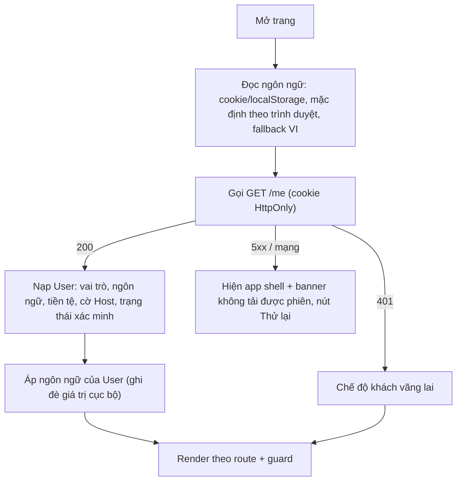
```mermaid
flowchart TD
  A["Mở trang"] --> B["Đọc ngôn ngữ: cookie/localStorage, mặc định theo trình duyệt, fallback VI"]
  B --> C["Gọi GET /me (cookie HttpOnly)"]
  C -->|"200"| D["Nạp User: vai trò, ngôn ngữ, tiền tệ, cờ Host, trạng thái xác minh"]
  C -->|"401"| E["Chế độ khách vãng lai"]
  C -->|"5xx / mạng"| F["Hiện app shell + banner không tải được phiên, nút Thử lại"]
  D --> G["Áp ngôn ngữ của User (ghi đè giá trị cục bộ)"]
  G --> H["Render theo route + guard"]
  E --> H
```
- Session hết hạn khi đang thao tác → giữ nguyên dữ liệu form (đặc biệt wizard H04), mở **modal đăng nhập lại** (không điều hướng đi) → đăng nhập xong thì gửi lại thao tác đang dở.
- Đổi mật khẩu ở thiết bị khác → mọi phiên khác nhận 401 → modal đăng nhập lại (S02 AC).

### FL-01 · Xử lý lỗi toàn cục
| Mã | Hành vi FE |
|---|---|
| 401 | Modal đăng nhập lại (FL-00). Với trang công khai: bỏ qua, coi là khách |
| 403 | Trang 403 trong đúng shell; không lộ sự tồn tại của tài nguyên người khác |
| 404 | Trang 404 + nút về trang chủ / quay lại |
| 409 | Xung đột dữ liệu (lịch bị chiếm, hồ sơ đang được người khác xử lý, trạng thái đã đổi) → thông báo cụ thể + **tải lại dữ liệu** |
| 422 | Lỗi từng trường → gắn inline + cuộn tới lỗi đầu tiên |
| 429 | Banner "Thao tác quá nhanh/ quá nhiều lần" + đếm ngược nếu BE trả `Retry-After` |
| 5xx / timeout | Toast lỗi + nút Thử lại; **không mất dữ liệu đã nhập** |
| Offline | Banner cố định "Mất kết nối"; vô hiệu nút gửi; tự retry khi online |

### FL-02 · Đa ngôn ngữ (VI/EN)
Đổi ngôn ngữ → giao diện đổi **ngay, không reload** → nếu đã đăng nhập: lưu vào User (email gửi sau đó theo ngôn ngữ mới); nếu chưa: lưu cookie. URL không chứa tiền tố ngôn ngữ [Assumption A3].

---

## 4. Flow theo slice

### S01 · Đăng ký, xác minh email, đăng nhập, quên mật khẩu (P07, P06, P09, P08)

**FL-S01-A · Đăng ký → xác minh → đăng nhập**
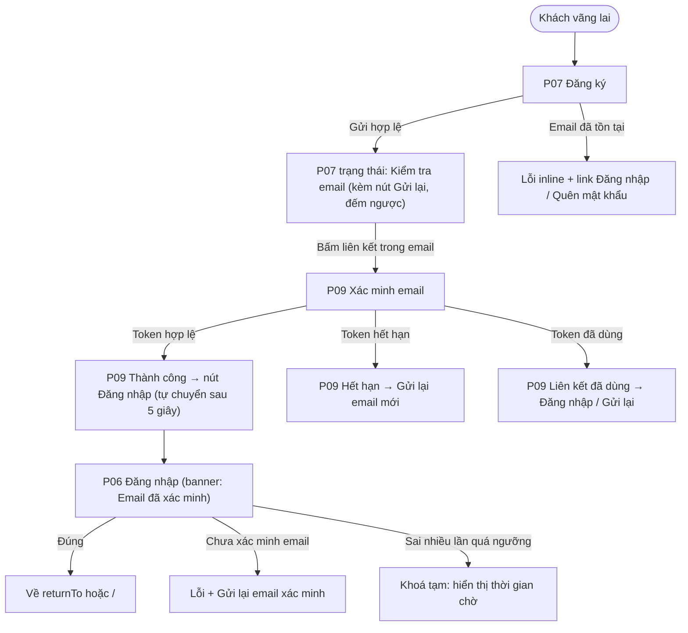
```mermaid
flowchart TD
  S(["Khách vãng lai"]) --> R["P07 Đăng ký"]
  R -->|"Gửi hợp lệ"| R2["P07 trạng thái: Kiểm tra email (kèm nút Gửi lại, đếm ngược)"]
  R -->|"Email đã tồn tại"| R3["Lỗi inline + link Đăng nhập / Quên mật khẩu"]
  R2 -->|"Bấm liên kết trong email"| V["P09 Xác minh email"]
  V -->|"Token hợp lệ"| V1["P09 Thành công → nút Đăng nhập (tự chuyển sau 5 giây)"]
  V -->|"Token hết hạn"| V2["P09 Hết hạn → Gửi lại email mới"]
  V -->|"Token đã dùng"| V3["P09 Liên kết đã dùng → Đăng nhập / Gửi lại"]
  V1 --> L["P06 Đăng nhập (banner: Email đã xác minh)"]
  L -->|"Đúng"| H["Về returnTo hoặc /"]
  L -->|"Chưa xác minh email"| L2["Lỗi + Gửi lại email xác minh"]
  L -->|"Sai nhiều lần quá ngưỡng"| L3["Khoá tạm: hiển thị thời gian chờ"]
```
**FL-S01-B · Quên / đặt lại mật khẩu**
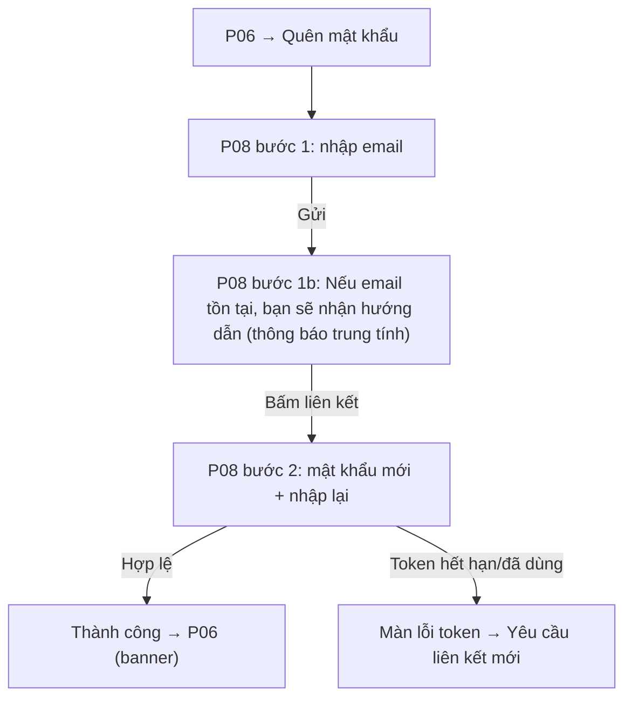
```mermaid
flowchart TD
  A["P06 → Quên mật khẩu"] --> B["P08 bước 1: nhập email"]
  B -->|"Gửi"| C["P08 bước 1b: Nếu email tồn tại, bạn sẽ nhận hướng dẫn (thông báo trung tính)"]
  C -->|"Bấm liên kết"| D["P08 bước 2: mật khẩu mới + nhập lại"]
  D -->|"Hợp lệ"| E["Thành công → P06 (banner)"]
  D -->|"Token hết hạn/đã dùng"| F["Màn lỗi token → Yêu cầu liên kết mới"]
```
Điểm quyết định: (1) thông báo "đã gửi" luôn trung tính để không lộ email nào tồn tại; (2) sau đặt lại mật khẩu, mọi phiên cũ bị đăng xuất.

---

### S02 · Hồ sơ & cài đặt (C01, C02)
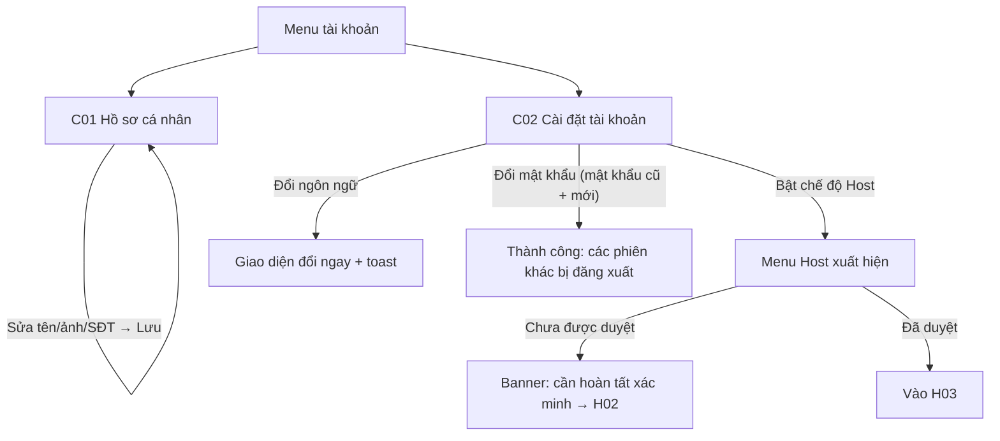
```mermaid
flowchart TD
  M["Menu tài khoản"] --> C1["C01 Hồ sơ cá nhân"]
  M --> C2["C02 Cài đặt tài khoản"]
  C1 -->|"Sửa tên/ảnh/SĐT → Lưu"| C1
  C2 -->|"Đổi ngôn ngữ"| L["Giao diện đổi ngay + toast"]
  C2 -->|"Đổi mật khẩu (mật khẩu cũ + mới)"| P["Thành công: các phiên khác bị đăng xuất"]
  C2 -->|"Bật chế độ Host"| H["Menu Host xuất hiện"]
  H -->|"Chưa được duyệt"| H1["Banner: cần hoàn tất xác minh → H02"]
  H -->|"Đã duyệt"| H2["Vào H03"]
```
Nhánh lỗi: mật khẩu cũ sai (inline); mật khẩu mới trùng cũ; ảnh sai định dạng/quá nặng; mất mạng khi lưu.

---

### S03 · Back-office: đăng nhập quản trị & phân quyền (A01, A18)
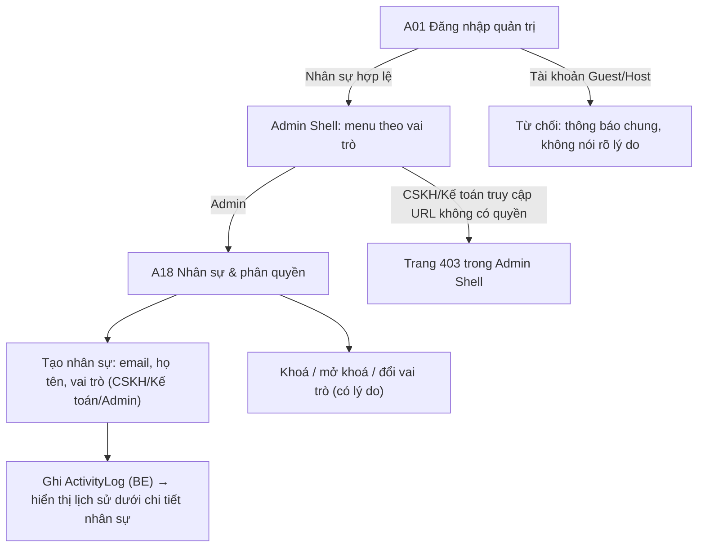
```mermaid
flowchart TD
  A["A01 Đăng nhập quản trị"] -->|"Nhân sự hợp lệ"| D["Admin Shell: menu theo vai trò"]
  A -->|"Tài khoản Guest/Host"| X["Từ chối: thông báo chung, không nói rõ lý do"]
  D -->|"Admin"| S["A18 Nhân sự & phân quyền"]
  S --> N["Tạo nhân sự: email, họ tên, vai trò (CSKH/Kế toán/Admin)"]
  S --> K["Khoá / mở khoá / đổi vai trò (có lý do)"]
  N --> LG["Ghi ActivityLog (BE) → hiển thị lịch sử dưới chi tiết nhân sự"]
  D -->|"CSKH/Kế toán truy cập URL không có quyền"| F["Trang 403 trong Admin Shell"]
```
Điểm quyết định: menu **ẩn** mục không có quyền, nhưng vẫn phải có 403 khi vào thẳng URL (S03 AC: chặn cả UI lẫn API).

---

### S04 · Xác minh Host (P10, H02, C03, A03)

**FL-S04-A · Từ "Trở thành Host" tới được duyệt**
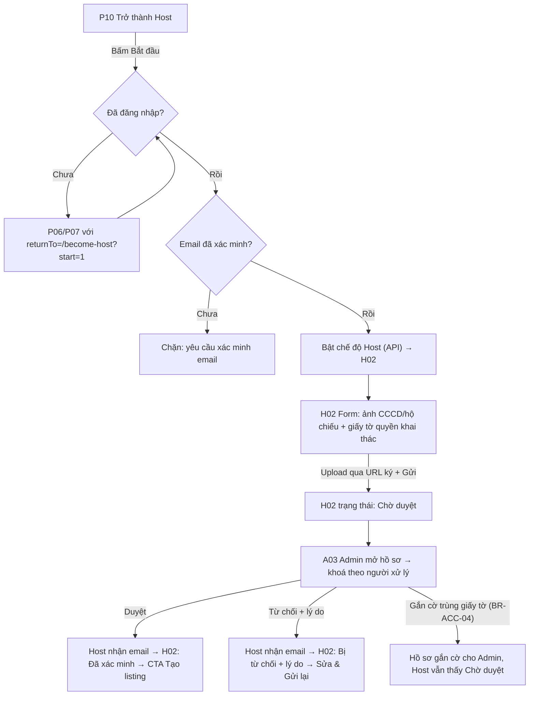
```mermaid
flowchart TD
  P["P10 Trở thành Host"] -->|"Bấm Bắt đầu"| G{"Đã đăng nhập?"}
  G -->|"Chưa"| L["P06/P07 với returnTo=/become-host?start=1"]
  L --> G
  G -->|"Rồi"| E{"Email đã xác minh?"}
  E -->|"Chưa"| E1["Chặn: yêu cầu xác minh email"]
  E -->|"Rồi"| H["Bật chế độ Host (API) → H02"]
  H --> F["H02 Form: ảnh CCCD/hộ chiếu + giấy tờ quyền khai thác"]
  F -->|"Upload qua URL ký + Gửi"| W["H02 trạng thái: Chờ duyệt"]
  W --> AD["A03 Admin mở hồ sơ → khoá theo người xử lý"]
  AD -->|"Duyệt"| OK["Host nhận email → H02: Đã xác minh → CTA Tạo listing"]
  AD -->|"Từ chối + lý do"| NO["Host nhận email → H02: Bị từ chối + lý do → Sửa & Gửi lại"]
  AD -->|"Gắn cờ trùng giấy tờ (BR-ACC-04)"| FL["Hồ sơ gắn cờ cho Admin, Host vẫn thấy Chờ duyệt"]
```
**FL-S04-B · Guest xác minh danh tính (C03)** – cùng form với H02 phần danh tính (không có giấy tờ quyền khai thác), vào từ: (a) menu tài khoản, (b) yêu cầu của hệ thống ở giai đoạn đặt phòng sau này. Sau khi duyệt, Guest quay lại `returnTo`.

**FL-S04-C · Admin duyệt (A03)**
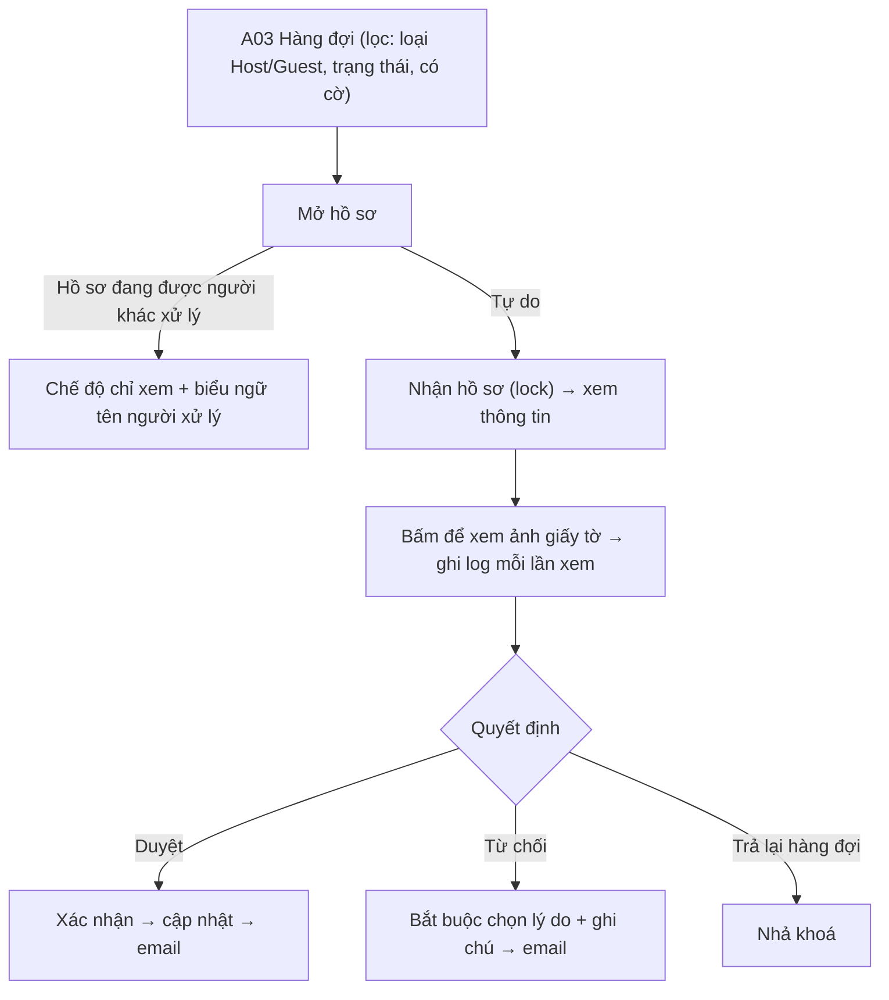
```mermaid
flowchart TD
  Q["A03 Hàng đợi (lọc: loại Host/Guest, trạng thái, có cờ)"] --> O["Mở hồ sơ"]
  O -->|"Hồ sơ đang được người khác xử lý"| RO["Chế độ chỉ xem + biểu ngữ tên người xử lý"]
  O -->|"Tự do"| CL["Nhận hồ sơ (lock) → xem thông tin"]
  CL --> IM["Bấm để xem ảnh giấy tờ → ghi log mỗi lần xem"]
  IM --> DC{"Quyết định"}
  DC -->|"Duyệt"| A1["Xác nhận → cập nhật → email"]
  DC -->|"Từ chối"| A2["Bắt buộc chọn lý do + ghi chú → email"]
  DC -->|"Trả lại hàng đợi"| A3["Nhả khoá"]
```

---

### S05 · Tạo listing nháp: cơ bản, vị trí, ảnh (H03, H04 bước 1–3)
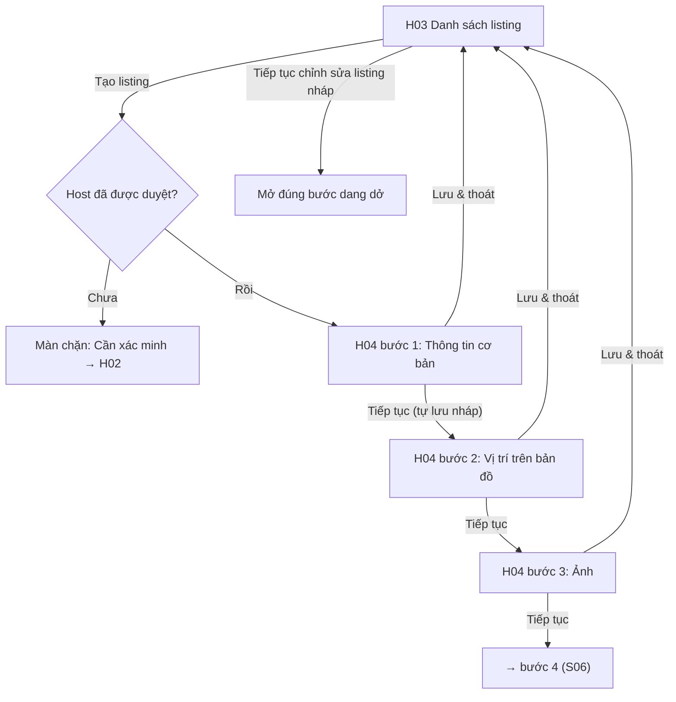
```mermaid
flowchart TD
  H3["H03 Danh sách listing"] -->|"Tạo listing"| G{"Host đã được duyệt?"}
  G -->|"Chưa"| B["Màn chặn: Cần xác minh → H02"]
  G -->|"Rồi"| S1["H04 bước 1: Thông tin cơ bản"]
  S1 -->|"Tiếp tục (tự lưu nháp)"| S2["H04 bước 2: Vị trí trên bản đồ"]
  S2 -->|"Tiếp tục"| S3["H04 bước 3: Ảnh"]
  S3 -->|"Tiếp tục"| S4["→ bước 4 (S06)"]
  S1 & S2 & S3 -->|"Lưu & thoát"| H3
  H3 -->|"Tiếp tục chỉnh sửa listing nháp"| R["Mở đúng bước dang dở"]
```
Nhánh phụ: không có token Mapbox → nhập toạ độ thủ công (S05 ghi chú); đóng trình duyệt giữa chừng → mở lại thấy đủ dữ liệu các bước đã nhập; chuyển bước bằng thanh tiến độ (chỉ cho nhảy tới bước đã hoàn thành hoặc bước kế tiếp).

---

### S06 · Tiện nghi, quy tắc lưu trú, giá & phí (H04 bước 4–6)
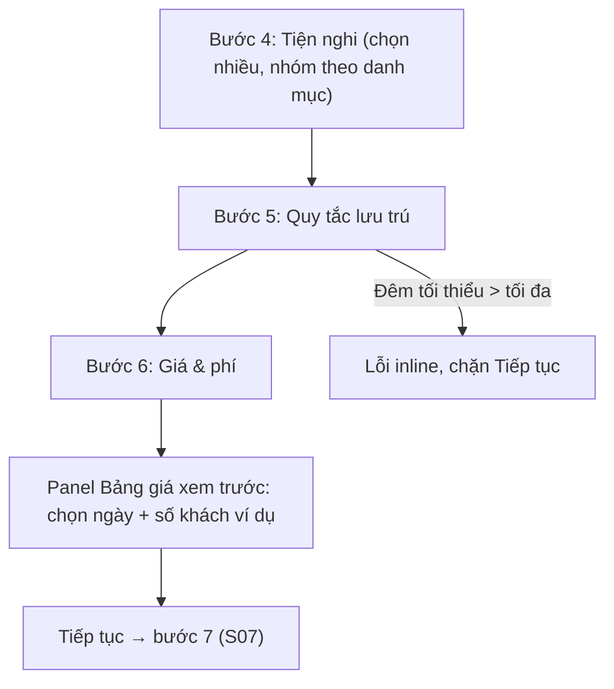
```mermaid
flowchart TD
  S4["Bước 4: Tiện nghi (chọn nhiều, nhóm theo danh mục)"] --> S5["Bước 5: Quy tắc lưu trú"]
  S5 --> S6["Bước 6: Giá & phí"]
  S6 --> PV["Panel Bảng giá xem trước: chọn ngày + số khách ví dụ"]
  PV --> OK["Tiếp tục → bước 7 (S07)"]
  S5 -->|"Đêm tối thiểu > tối đa"| E["Lỗi inline, chặn Tiếp tục"]
```

### S07 · Chính sách huỷ, kiểu đặt, giấy tờ, gửi duyệt, trạng thái (H04 bước 7–8, H05)
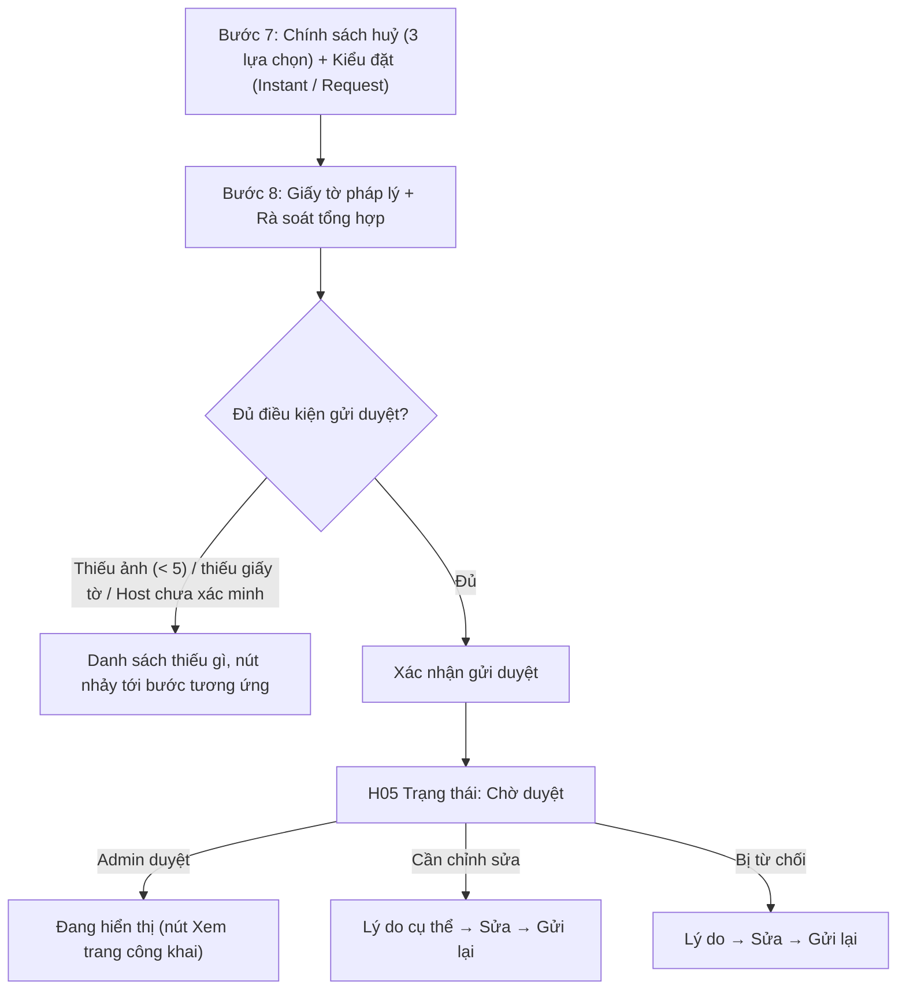
```mermaid
flowchart TD
  P7["Bước 7: Chính sách huỷ (3 lựa chọn) + Kiểu đặt (Instant / Request)"] --> P8["Bước 8: Giấy tờ pháp lý + Rà soát tổng hợp"]
  P8 --> CK{"Đủ điều kiện gửi duyệt?"}
  CK -->|"Thiếu ảnh (< 5) / thiếu giấy tờ / Host chưa xác minh"| NG["Danh sách thiếu gì, nút nhảy tới bước tương ứng"]
  CK -->|"Đủ"| SB["Xác nhận gửi duyệt"]
  SB --> H5["H05 Trạng thái: Chờ duyệt"]
  H5 -->|"Admin duyệt"| V["Đang hiển thị (nút Xem trang công khai)"]
  H5 -->|"Cần chỉnh sửa"| NE["Lý do cụ thể → Sửa → Gửi lại"]
  H5 -->|"Bị từ chối"| RJ["Lý do → Sửa → Gửi lại"]
```

### S08 · Admin duyệt listing lần đầu (A04)
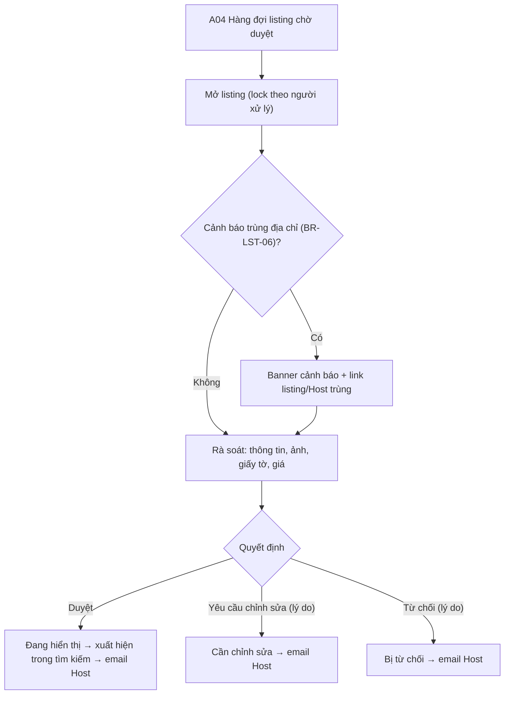
```mermaid
flowchart TD
  Q["A04 Hàng đợi listing chờ duyệt"] --> O["Mở listing (lock theo người xử lý)"]
  O --> W{"Cảnh báo trùng địa chỉ (BR-LST-06)?"}
  W -->|"Có"| WB["Banner cảnh báo + link listing/Host trùng"]
  W -->|"Không"| R["Rà soát: thông tin, ảnh, giấy tờ, giá"]
  WB --> R
  R --> D{"Quyết định"}
  D -->|"Duyệt"| A["Đang hiển thị → xuất hiện trong tìm kiếm → email Host"]
  D -->|"Yêu cầu chỉnh sửa (lý do)"| B["Cần chỉnh sửa → email Host"]
  D -->|"Từ chối (lý do)"| C["Bị từ chối → email Host"]
```
Ghi chú: bản đầu **chưa có tab so sánh cũ/mới** – chừa sẵn khung tab "Thay đổi" (disabled, tooltip "Có ở lần chỉnh sửa sau khi đã duyệt") [S08 ghi chú].

### S09 · Lịch listing (H06)
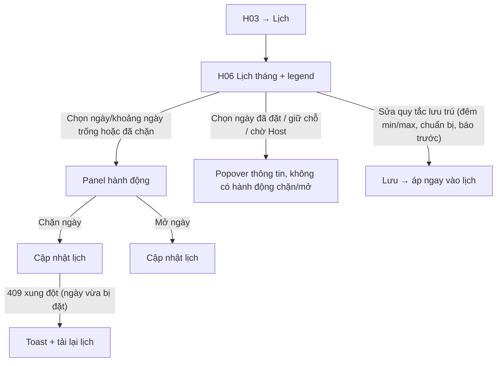
```mermaid
flowchart TD
  H3["H03 → Lịch"] --> C["H06 Lịch tháng + legend"]
  C -->|"Chọn ngày/khoảng ngày trống hoặc đã chặn"| P["Panel hành động"]
  P -->|"Chặn ngày"| B["Cập nhật lịch"]
  P -->|"Mở ngày"| O["Cập nhật lịch"]
  C -->|"Chọn ngày đã đặt / giữ chỗ / chờ Host"| I["Popover thông tin, không có hành động chặn/mở"]
  C -->|"Sửa quy tắc lưu trú (đêm min/max, chuẩn bị, báo trước)"| R["Lưu → áp ngay vào lịch"]
  B -->|"409 xung đột (ngày vừa bị đặt)"| X["Toast + tải lại lịch"]
```

### S10 · Giá theo mùa/lễ/đặc biệt (H08)
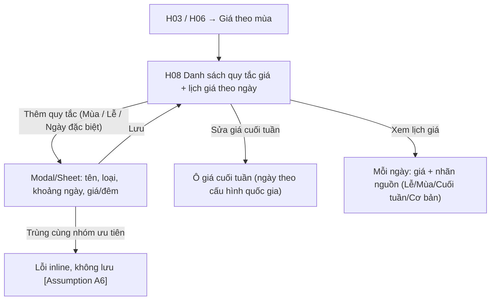
```mermaid
flowchart TD
  H3["H03 / H06 → Giá theo mùa"] --> L["H08 Danh sách quy tắc giá + lịch giá theo ngày"]
  L -->|"Thêm quy tắc (Mùa / Lễ / Ngày đặc biệt)"| M["Modal/Sheet: tên, loại, khoảng ngày, giá/đêm"]
  M -->|"Trùng cùng nhóm ưu tiên"| E["Lỗi inline, không lưu [Assumption A6]"]
  M -->|"Lưu"| L
  L -->|"Sửa giá cuối tuần"| W["Ô giá cuối tuần (ngày theo cấu hình quốc gia)"]
  L -->|"Xem lịch giá"| Cal["Mỗi ngày: giá + nhãn nguồn (Lễ/Mùa/Cuối tuần/Cơ bản)"]
```

### S11 · Trang chủ & tìm kiếm (P01, P02)
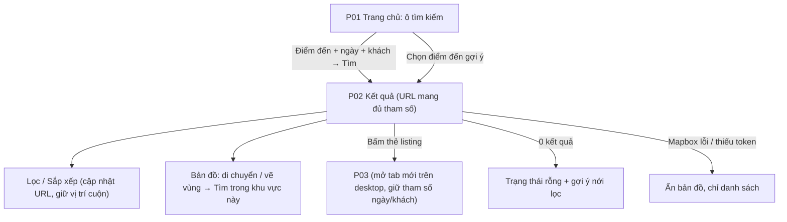
```mermaid
flowchart TD
  P1["P01 Trang chủ: ô tìm kiếm"] -->|"Điểm đến + ngày + khách → Tìm"| P2["P02 Kết quả (URL mang đủ tham số)"]
  P1 -->|"Chọn điểm đến gợi ý"| P2
  P2 --> F["Lọc / Sắp xếp (cập nhật URL, giữ vị trí cuộn)"]
  P2 --> M["Bản đồ: di chuyển / vẽ vùng → Tìm trong khu vực này"]
  P2 -->|"Bấm thẻ listing"| P3["P03 (mở tab mới trên desktop, giữ tham số ngày/khách)"]
  P2 -->|"0 kết quả"| E["Trạng thái rỗng + gợi ý nới lọc"]
  P2 -->|"Mapbox lỗi / thiếu token"| D["Ẩn bản đồ, chỉ danh sách"]
```

### S12 · Chi tiết, hồ sơ Host, chính sách huỷ (P03, P04, P05)
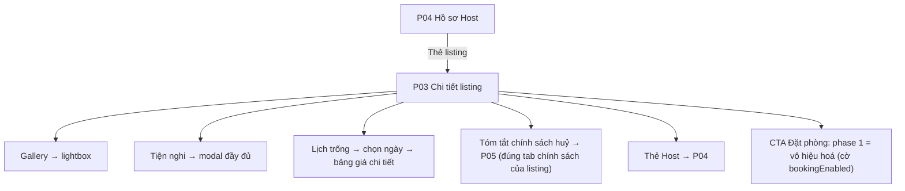
```mermaid
flowchart TD
  P3["P03 Chi tiết listing"] --> G["Gallery → lightbox"]
  P3 --> A["Tiện nghi → modal đầy đủ"]
  P3 --> CAL["Lịch trống → chọn ngày → bảng giá chi tiết"]
  P3 --> CP["Tóm tắt chính sách huỷ → P05 (đúng tab chính sách của listing)"]
  P3 --> H["Thẻ Host → P04"]
  P3 --> BK["CTA Đặt phòng: phase 1 = vô hiệu hoá (cờ bookingEnabled)"]
  P4["P04 Hồ sơ Host"] -->|"Thẻ listing"| P3
```

### S13 · Tiền tệ hiển thị (mở rộng C02, P02, P03)
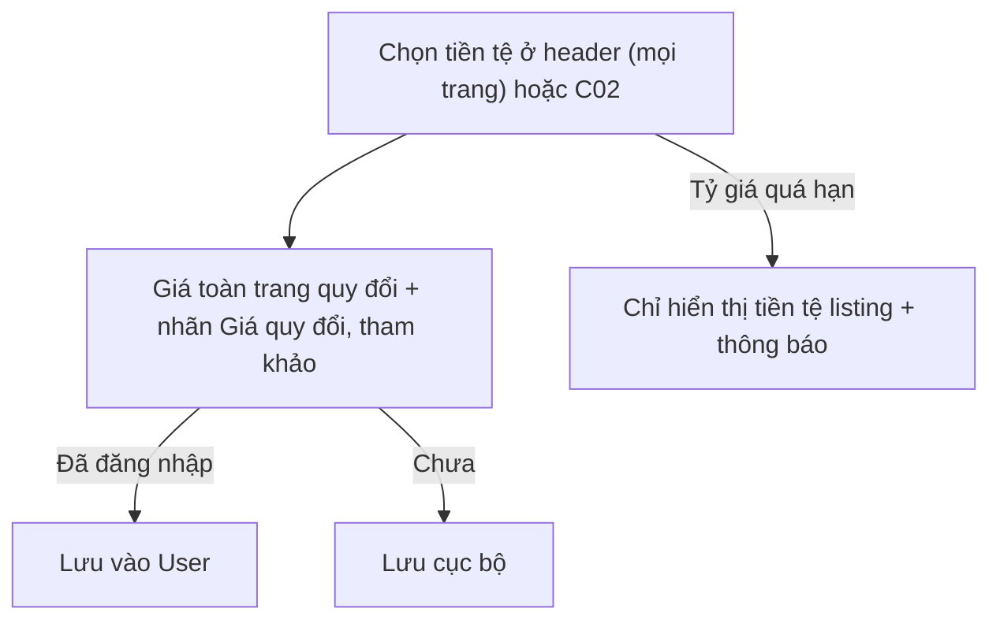
```mermaid
flowchart TD
  A["Chọn tiền tệ ở header (mọi trang) hoặc C02"] --> B["Giá toàn trang quy đổi + nhãn Giá quy đổi, tham khảo"]
  B -->|"Đã đăng nhập"| C["Lưu vào User"]
  B -->|"Chưa"| D["Lưu cục bộ"]
  A -->|"Tỷ giá quá hạn"| E["Chỉ hiển thị tiền tệ listing + thông báo"]
```

---

## 5. Hành trình xuyên slice (kiểm thử nghiệm thu giai đoạn)

| # | Hành trình | Slice đi qua | Kết quả kỳ vọng |
|---|---|---|---|
| J1 | Người mới → Host đăng tin đầu tiên → hiển thị | S01→S04→S05→S06→S07→S08 | Listing xuất hiện trong P02 |
| J2 | Guest tìm → xem chi tiết → thấy giá tổng | S11→S12→S13 | Giá tổng = tiền phòng + phụ thu + phí vệ sinh − giảm giá + phí dịch vụ + thuế |
| J3 | Host bị từ chối → sửa → gửi lại → được duyệt | S07→S08 | Lý do hiện đúng, lần gửi lại vào hàng đợi |
| J4 | Host chặn ngày → Guest không còn thấy listing khi tìm đúng ngày đó | S09→S11 | Listing biến mất khỏi kết quả |
| J5 | Host đặt giá lễ → Guest thấy giá lễ ở đúng đêm | S10→S11/S12 | Giá đêm đúng thứ tự ưu tiên |

---

## 6. Ngoài phạm vi giai đoạn 1 (FE chỉ chừa chỗ, không dựng)
Đặt phòng/thanh toán, đồng bộ iCal (H07), Host Dashboard (H01), Yêu thích, đánh giá, hộp thư, thông báo (C05/C06), đồng ý điều khoản (C07), khuyến mãi, so sánh bản cũ/mới của listing đã duyệt. Các điểm chừa chỗ được đánh dấu `🔒 Phase sau` trong 02-wireframes.

## 7. Giả định cần xác nhận (tổng hợp)

| Mã | Giả định | Lý do / ảnh hưởng |
|---|---|---|
| A1 | Giai đoạn 1 chưa có Host Dashboard (H01) → H03 là trang đích của chế độ Host | H01 không nằm trong 13 slice |
| A2 | Tài khoản chưa xác minh email không đăng nhập được | Khớp demo S01; nếu cho đăng nhập hạn chế thì phải thêm trạng thái trong header |
| A3 | Ngôn ngữ không nằm trong URL | Đơn giản hoá; nếu cần SEO đa ngôn ngữ thì đổi sang `/vi`, `/en` |
| A4 | Quy tắc mật khẩu: ≥ 8 ký tự, có chữ và số | Đặc tả chưa nêu; BE trả thông điệp lỗi chuẩn |
| A5 | Ảnh giấy tờ: JPG/PNG/PDF, ≤ 10 MB/tệp, tối đa 5 tệp mỗi loại; ảnh listing: JPG/PNG/WebP ≤ 10 MB, tối đa 30 ảnh | Cần chốt cấu hình |
| A6 | Hai quy tắc giá **cùng nhóm ưu tiên** không được chồng ngày (chặn khi lưu) | Đặc tả chỉ quy định thứ tự giữa các nhóm |
| A7 | Sức chứa có tính trẻ em hay không (P02 có ô "trẻ em") | Cần PO chốt; mặc định: trẻ em tính vào sức chứa, không tính vào ngưỡng phụ thu nếu Host không cấu hình khác |
| A8 | Lọc/sắp xếp theo điểm đánh giá ẩn ở giai đoạn 1 (chưa có đánh giá) | Cờ `reviewsEnabled=false` |
| A9 | Cần seed CountryConfig (VAT, phí dịch vụ) trước S11 vì tổng giá phải "đã gồm phí và thuế" | Phụ thuộc ngầm chưa có trong danh sách slice |
