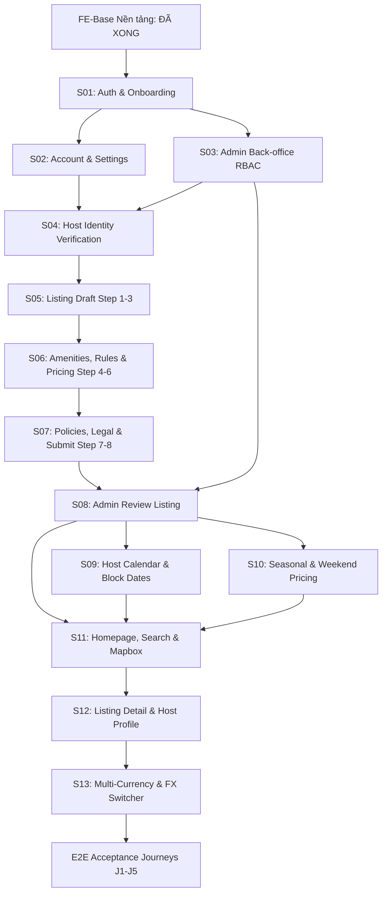

# Sổ Tay Lệnh Thực Thi Toàn Bộ Giao Đoạn 1 (Harness Prompts Playbook)

> **Dành cho Agentic Pair-Programming & Tự động hóa Loop**  
> Tuân thủ tuyệt đối các nguyên tắc: **WIP = 1**, **Pass-State Gating**, **Slice-Doc Isolation**, và **Bất biến nghiệp vụ (Invariants)**.

---

## 📌 Hướng Dẫn Vận Hành (Operating Guide)

1. **Quy tắc WIP = 1**: Chỉ thực thi **DUY NHẤT 1 Slice tại một thời điểm**. Không nhảy cóc sang slice sau khi slice trước chưa vượt qua cổng xác minh.
2. **Cổng kiểm soát (Pass-State Gating)**: Mọi slice bắt buộc phải vượt qua:
   ```powershell
   .\scripts\verify.ps1 -Target fe
   ```
   Chỉ khi terminal trả về `[PASSED]` (exit code 0), Agent mới được phép đánh dấu `[x] passing` trong `PROGRESS.md`.
3. **Chạy thủ công vs Lệnh tự động `/goal`**:
   - Chạy từng bước: Copy toàn bộ nội dung trong khung Markdown của từng Slice gửi cho Agent.
   - Chạy tự động: Thêm `/goal` vào đầu prompt để Agent tự chạy khép kín từ Code $\rightarrow$ Test $\rightarrow$ Cập nhật tiến độ.
4. **Tự Động Bàn Giao Kỹ Thuật Cho Backend (FE-to-BE Handover Contract)**:
   - Sau khi verify pass, Agent **bắt buộc tự động sinh 2 tệp** tại thư mục đặc tả của slice (`frontend/docs/giai-doan-1/slices/sXX-.../`):
     + `db-design.md`: Thiết kế CSDL quan hệ chi tiết (ER Diagram Mermaid, định nghĩa bảng PostgreSQL/PostGIS, chỉ mục, ràng buộc logic, trigger/Flyway migration).
     + `openapi.yaml`: Đặc tả OpenAPI 3.0/3.1 Contract chuẩn (REST endpoints, Request/Response body, headers, mã lỗi Problem Details RFC 9457) để BE xây dựng trực tiếp mà không cần đoán mò.
5. **Bắt Buộc Kèm Theo i18n Song Ngữ (No Hardcoded Strings)**:
   - Khi xây dựng bất kỳ màn hình hoặc component nào, **bắt buộc phải khai báo đầy đủ khóa ngôn ngữ song ngữ** trong cả hai tệp `messages/vi.json` và `messages/en.json`, sử dụng hook `useTranslations()` từ `next-intl`. Tuyệt đối không viết chuỗi tiếng Việt/tiếng Anh cứng trên giao diện.

---

## 🗺️ Bản Đồ Đường Găng 13 Slices (Execution Order)



---

## 🚀 DANH SÁCH PROMPT THỰC THI CHI TIẾT TỪNG SLICE

---

### Slice FE-S01: Đăng Ký, Xác Minh Email, Đăng Nhập & Quên Mật Khẩu
- **Màn hình**: `P06` (Đăng nhập), `P07` (Đăng ký), `P08` (Quên/Đặt lại MK), `P09` (Xác minh email).
- **Thư mục đặc tả**: `frontend/docs/giai-doan-1/slices/s01-auth/`.

```markdown
Role: [FE-BUILDER]
Nhiệm vụ: Triển khai trọn vẹn Slice FE-S01 (Auth & Onboarding) theo chuẩn Harness.

Ngữ cảnh & Chỉ dẫn bắt buộc:
1. Đọc đặc tả tại:
   - frontend/docs/giai-doan-1/slices/s01-auth/README.md (flow, wireframes P06-P09, ux-behavior, data).
   - frontend/docs/giai-doan-1/00-foundations/components-catalog.md (CMP-01 Button, CMP-02 TextField, CMP-03 PasswordField, CMP-07 Toast).
2. Triển khai trong frontend/:
   - `src/features/auth/schemas.ts`: Zod schema cho Register, Login, ForgotPassword, ResetPassword.
   - `src/features/auth/api/mock-auth.ts`: Giả lập API auth, lưu phiên cookie hoặc mock session.
   - Dựng các route trong group `(auth)`:
     + `/login`: Màn hình P06 (email/mật khẩu, ghi nhớ đăng nhập, link quên MK, returnTo).
     + `/register`: Màn hình P07 (họ tên, email, mật khẩu đạt chuẩn có thanh đo độ mạnh).
     + `/forgot-password` & `/reset-password`: Màn hình P08.
     + `/verify-email`: Màn hình P09 (trạng thái chờ, nút gửi lại email).
   - Đảm bảo i18n đầy đủ (không viết chuỗi hiển thị cứng), dùng messages `vi.json` và `en.json`.
3. Viết test:
   - `src/features/auth/__tests__/auth-forms.test.tsx`: Test validation lỗi form, tương tác nút loading.
4. Cổng xác minh bắt buộc (Pass-State Gating):
   .\scripts\verify.ps1 -Target fe
5. Cập nhật PROGRESS.md chuyển FE-S01 sang [x] passing sau khi lệnh đạt exit code 0.
```

---

### Slice FE-S02: Hồ Sơ Người Dùng & Cài Đặt Tài Khoản
- **Màn hình**: `C01` (Hồ sơ cá nhân), `C02` (Cài đặt tài khoản & Chuyển chế độ Host/Guest).
- **Thư mục đặc tả**: `frontend/docs/giai-doan-1/slices/s02-account/`.

```markdown
Role: [FE-BUILDER]
Nhiệm vụ: Triển khai trọn vẹn Slice FE-S02 (Hồ sơ & Cài đặt) theo chuẩn Harness.

Ngữ cảnh & Chỉ dẫn bắt buộc:
1. Đọc đặc tả tại frontend/docs/giai-doan-1/slices/s02-account/README.md.
2. Triển khai trong frontend/:
   - Sử dụng `AccountShell` (sub-nav ngang: Hồ sơ · Cài đặt · Xác minh).
   - `src/features/account/`:
     + `src/app/[locale]/(account)/account/profile/page.tsx` (C01): Xem/chỉnh sửa họ tên, avatar giả lập, tiểu sử, số điện thoại, ngôn ngữ mặc định.
     + `src/app/[locale]/(account)/account/settings/page.tsx` (C02): Đổi mật khẩu, cài đặt thông báo, công tắc chuyển đổi chế độ Host / Guest.
   - Quản lý trạng thái form với `react-hook-form` + `zod`, thông báo thành công qua Sonner toast.
3. Viết test:
   - `src/features/account/__tests__/account.test.tsx`.
4. Cổng xác minh (Pass-State Gating):
   .\scripts\verify.ps1 -Target fe
5. Cập nhật PROGRESS.md sang [x] passing.
```

---

### Slice FE-S03: Back-office Đăng Nhập & Phân Quyền Quản Trị
- **Màn hình**: `A01` (Admin Login), `A18` (Quản lý nhân sự CSKH/Kế toán, phân quyền).
- **Thư mục đặc tả**: `frontend/docs/giai-doan-1/slices/s03-admin-rbac/`.

```markdown
Role: [FE-BUILDER]
Nhiệm vụ: Triển khai trọn vẹn Slice FE-S03 (Admin Login & Nhân sự Back-office) theo chuẩn Harness.

Ngữ cảnh & Chỉ dẫn bắt buộc:
1. Đọc đặc tả tại frontend/docs/giai-doan-1/slices/s03-admin-rbac/README.md.
2. Triển khai trong frontend/:
   - `src/app/[locale]/(admin)/admin/login/page.tsx` (A01): Giao diện login riêng cho nhân sự, độc lập với site khách.
   - Sử dụng `AdminShell` (sidebar: Duyệt danh tính, Duyệt listing, Nhân sự).
   - `src/app/[locale]/(admin)/admin/staff/page.tsx` (A18):
     + Bảng danh sách nhân sự (DataTable CMP-24) với các vai trò: `Admin`, `CSKH`, `Kế toán`.
     + Dialog thêm mới/sửa tài khoản nhân sự và phân quyền.
     + ConfirmDialog (CMP-25) vô hiệu hóa tài khoản nhân sự có ghi nhận lý do.
3. Viết test:
   - `src/features/admin/__tests__/staff-table.test.tsx`.
4. Cổng xác minh (Pass-State Gating):
   .\scripts\verify.ps1 -Target fe
5. Cập nhật PROGRESS.md sang [x] passing.
```

---

### Slice FE-S04: Xác Minh Danh Tính Host (Host Onboarding)
- **Màn hình**: `P10` (Trang giới thiệu Host), `H02/C03` (Tải giấy tờ CCCD/Passport), `A03` (Admin duyệt hồ sơ).
- **Thư mục đặc tả**: `frontend/docs/giai-doan-1/slices/s04-host-verification/`.

```markdown
Role: [FE-BUILDER]
Nhiệm vụ: Triển khai trọn vẹn Slice FE-S04 (Xác minh danh tính Host) theo chuẩn Harness.

Ngữ cảnh & Chỉ dẫn bắt buộc:
1. Đọc đặc tả tại frontend/docs/giai-doan-1/slices/s04-host-verification/README.md.
2. Triển khai trong frontend/:
   - `src/app/[locale]/(public)/become-host/page.tsx` (P10): Trang giới thiệu trở thành Host, nút kêu gọi bắt đầu.
   - `src/app/[locale]/(account)/account/verification/page.tsx` (H02/C03): Form nộp giấy tờ tùy thân giả lập với component tải ảnh `FileUploader` (CMP-13), xem trước ảnh và StatusBadge (Chưa nộp, Chờ duyệt, Đã xác minh, Bị từ chối).
   - `src/app/[locale]/(admin)/admin/identity-reviews/page.tsx` & `[id]/page.tsx` (A03):
     + Màn hình Admin duyệt danh tính: Component `SecureImageViewer` (CMP-30) làm mờ ảnh mặc định, bấm để xem có watermark Admin.
     + Nút Phê duyệt / Từ chối (bắt buộc nhập lý do từ chối gửi về Host).
3. Viết test:
   - `src/features/verification/__tests__/verification-upload.test.tsx`.
4. Cổng xác minh (Pass-State Gating):
   .\scripts\verify.ps1 -Target fe
5. Cập nhật PROGRESS.md sang [x] passing.
```

---

### Slice FE-S05: Host Tạo Listing Nháp (Bước 1–3: Cơ Bản, Vị Trí, Ảnh)
- **Màn hình**: `H03` (Danh sách listing), `H04 Wizard` (Bước 1: Cơ bản; Bước 2: Vị trí; Bước 3: Upload ảnh).
- **Thư mục đặc tả**: `frontend/docs/giai-doan-1/slices/s05-listing-draft/`.

```markdown
Role: [FE-BUILDER]
Nhiệm vụ: Triển khai trọn vẹn Slice FE-S05 (Host Listing Wizard Bước 1-3) theo chuẩn Harness.

Ngữ cảnh & Chỉ dẫn bắt buộc:
1. Đọc đặc tả tại frontend/docs/giai-doan-1/slices/s05-listing-draft/README.md.
2. Triển khai trong frontend/:
   - Sử dụng `HostShell` với WizardNav (CMP-15) và SaveIndicator (CMP-32: "Đã lưu hh:mm").
   - `src/app/[locale]/(host)/host/listings/page.tsx` (H03): Danh sách phòng của Host, trạng thái nháp/chờ duyệt, nút "Tạo phòng mới".
   - Luồng Wizard H04:
     + Bước 1 (`/basic`): Loại hình chỗ nghỉ (Nhà riêng, Căn hộ...), số khách, phòng ngủ, giường, phòng tắm (dùng NumberStepper CMP-06).
     + Bước 2 (`/location`): Nhập địa chỉ, hiển thị bản đồ ghim vị trí xấp xỉ (MapPanel CMP-21).
     + Bước 3 (`/photos`): Tải ít nhất 5 ảnh, kéo thả sắp xếp thứ tự ảnh bìa bằng `dnd-kit` (SortablePhotoGrid CMP-28).
   - Lưu tự động nháp (Auto-save debounce 1.000ms).
3. Viết test:
   - `src/features/listing-editor/__tests__/wizard-step1-3.test.tsx`.
4. Cổng xác minh (Pass-State Gating):
   .\scripts\verify.ps1 -Target fe
5. Cập nhật PROGRESS.md sang [x] passing.
```

---

### Slice FE-S06: Tiện Nghi, Quy Tắc Lưu Trú, Giá & Phí (Bước 4–6)
- **Màn hình**: `H04 Wizard` (Bước 4: Tiện nghi; Bước 5: Quy tắc lưu trú; Bước 6: Bảng giá & Phí).
- **Thư mục đặc tả**: `frontend/docs/giai-doan-1/slices/s06-listing-amenities-pricing/`.

```markdown
Role: [FE-BUILDER]
Nhiệm vụ: Triển khai trọn vẹn Slice FE-S06 (Host Listing Wizard Bước 4-6) theo chuẩn Harness.

Ngữ cảnh & Chỉ dẫn bắt buộc:
1. Đọc đặc tả tại frontend/docs/giai-doan-1/slices/s06-listing-amenities-pricing/README.md.
2. Bất biến quan trọng (Pricing Invariant): Bảng tính giá xem trước (`PriceBreakdown` CMP-22) ở Bước 6 phải gọi hàm giả lập pricing engine chuẩn, tiền tệ luôn ở đơn vị nhỏ nhất, format qua `formatMoney`.
3. Triển khai trong frontend/:
   - Bước 4 (`/amenities`): Bộ chọn tiện nghi nhóm theo danh mục (AmenityPicker CMP-29) có tìm kiếm và đếm số lượng.
   - Bước 5 (`/rules`): Giờ nhận/trả phòng, quy tắc hút thuốc, thú cưng, tiệc tùng.
   - Bước 6 (`/pricing`): Nhập giá cơ bản mỗi đêm, giá cuối tuần, phí dọn dẹp. Hiển thị hộp xem trước số tiền khách phải trả và số tiền thực nhận của Host (sau trừ 3% phí nền tảng).
4. Viết test:
   - `src/features/listing-editor/__tests__/wizard-step4-6.test.tsx`.
5. Cổng xác minh (Pass-State Gating):
   .\scripts\verify.ps1 -Target fe
6. Cập nhật PROGRESS.md sang [x] passing.
```

---

### Slice FE-S07: Chính Sách Hủy, Giấy Tờ Pháp Lý & Gửi Duyệt
- **Màn hình**: `H04 Wizard` (Bước 7: Chính sách hủy; Bước 8: Pháp lý; `H05`: Theo dõi trạng thái duyệt).
- **Thư mục đặc tả**: `frontend/docs/giai-doan-1/slices/s07-listing-policy-submit/`.

```markdown
Role: [FE-BUILDER]
Nhiệm vụ: Triển khai trọn vẹn Slice FE-S07 (Hoàn tất tạo Listing & Gửi duyệt) theo chuẩn Harness.

Ngữ cảnh & Chỉ dẫn bắt buộc:
1. Đọc đặc tả tại frontend/docs/giai-doan-1/slices/s07-listing-policy-submit/README.md.
2. Triển khai trong frontend/:
   - Bước 7 (`/policy`): Chọn kiểu đặt phòng (Đặt ngay / Chờ phê duyệt) và Chính sách hủy (Linh hoạt, Vừa phải, Nghiêm ngặt) kèm PolicyTimeline trực quan (CMP-27).
   - Bước 8 (`/legal`): Giấy phép kinh doanh / Cam kết PCCC, ô checkbox đồng ý điều khoản.
   - Màn hình kiểm tra tổng thể trước khi bấm "Gửi duyệt" (báo đỏ nếu bước nào còn thiếu dữ liệu).
   - `src/app/[locale]/(host)/host/listings/[id]/status/page.tsx` (H05): Màn hình theo dõi trạng thái thẩm định với timeline (Nháp -> Chờ duyệt -> Đang hiển thị hoặc Bị từ chối có lý do).
3. Viết test:
   - `src/features/listing-editor/__tests__/wizard-step7-8.test.tsx`.
4. Cổng xác minh (Pass-State Gating):
   .\scripts\verify.ps1 -Target fe
5. Cập nhật PROGRESS.md sang [x] passing.
```

---

### Slice FE-S08: Admin Thẩm Định & Phê Duyệt Listing
- **Màn hình**: `A04` (Admin duyệt listing lần đầu).
- **Thư mục đặc tả**: `frontend/docs/giai-doan-1/slices/s08-admin-review-listing/`.

```markdown
Role: [FE-BUILDER]
Nhiệm vụ: Triển khai trọn vẹn Slice FE-S08 (Admin Review Listing A04) theo chuẩn Harness.

Ngữ cảnh & Chỉ dẫn bắt buộc:
1. Đọc đặc tả tại frontend/docs/giai-doan-1/slices/s08-admin-review-listing/README.md.
2. Triển khai trong frontend/:
   - `src/app/[locale]/(admin)/admin/listing-reviews/page.tsx`: Danh sách phòng chờ duyệt kèm bộ lọc khu vực/thời gian.
   - `[id]/page.tsx` (A04): Giao diện chi tiết thẩm định:
     + LockBanner (CMP-31): Cảnh báo "Đang được [Admin B] xử lý từ hh:mm".
     + Kiểm tra ảnh phòng, tiện nghi, tọa độ bản đồ, thông tin giấy phép.
     + Hộp hành động: Phê duyệt (Publish công khai) hoặc Yêu cầu sửa / Từ chối (chọn lý do mẫu + ghi chú).
3. Viết test:
   - `src/features/admin/__tests__/listing-review.test.tsx`.
4. Cổng xác minh (Pass-State Gating):
   .\scripts\verify.ps1 -Target fe
5. Cập nhật PROGRESS.md sang [x] passing.
```

---

### Slice FE-S09: Lịch Listing Của Host & Chống Đặt Trùng
- **Màn hình**: `H06` (Lịch phòng, chặn/mở ngày, số đêm tối thiểu).
- **Thư mục đặc tả**: `frontend/docs/giai-doan-1/slices/s09-listing-calendar/`.

```markdown
Role: [FE-BUILDER]
Nhiệm vụ: Triển khai trọn vẹn Slice FE-S09 (Lịch phòng Host H06) theo chuẩn Harness.

Ngữ cảnh & Chỉ dẫn bắt buộc:
1. Đọc đặc tả tại frontend/docs/giai-doan-1/slices/s09-listing-calendar/README.md.
2. Triển khai trong frontend/:
   - `src/app/[locale]/(host)/host/listings/[id]/calendar/page.tsx` (H06):
     + Lịch CalendarMonth (CMP-23): Hiển thị lưới ngày với các trạng thái rõ ràng: Trống, Đã đặt, Giữ chỗ, Host chặn (nền gạch chéo), Quá khứ.
     + Thao tác kéo/chọn khoảng ngày: Bật drawer/panel bên phải để Chặn ngày / Mở ngày hoặc điều chỉnh số đêm tối thiểu.
     + Lưu thay đổi tự động, phản hồi Sonner toast.
3. Viết test:
   - `src/features/calendar/__tests__/host-calendar.test.tsx`.
4. Cổng xác minh (Pass-State Gating):
   .\scripts\verify.ps1 -Target fe
5. Cập nhật PROGRESS.md sang [x] passing.
```

---

### Slice FE-S10: Quy Tắc Giá Theo Mùa & Ngày Lễ
- **Màn hình**: `H08` (Bảng giá theo mùa/lễ, ngày đặc biệt, thứ tự ưu tiên).
- **Thư mục đặc tả**: `frontend/docs/giai-doan-1/slices/s10-seasonal-pricing/`.

```markdown
Role: [FE-BUILDER]
Nhiệm vụ: Triển khai trọn vẹn Slice FE-S10 (Quy tắc giá mùa H08) theo chuẩn Harness.

Ngữ cảnh & Chỉ dẫn bắt buộc:
1. Đọc đặc tả tại frontend/docs/giai-doan-1/slices/s10-seasonal-pricing/README.md.
2. Triển khai trong frontend/:
   - `src/app/[locale]/(host)/host/listings/[id]/pricing-rules/page.tsx` (H08):
     + Danh sách các quy tắc giá: Giá cuối tuần, Giá mùa cao điểm (khoảng ngày), Giá ngày lễ tết.
     + Form thêm mới/sửa quy tắc giá: Chọn khoảng ngày bằng `react-day-picker`, nhập % tăng/giảm hoặc giá cố định.
     + Bảng giải thích thứ tự ưu tiên giá: `Ngày lễ > Mùa cao điểm > Cuối tuần > Giá cơ bản`.
3. Viết test:
   - `src/features/pricing/__tests__/pricing-rules.test.tsx`.
4. Cổng xác minh (Pass-State Gating):
   .\scripts\verify.ps1 -Target fe
5. Cập nhật PROGRESS.md sang [x] passing.
```

---

### Slice FE-S11: Trang Chủ, Tìm Kiếm & Bản Đồ Tương Tác
- **Màn hình**: `P01` (Trang chủ), `P02` (Kết quả tìm kiếm, danh sách + bản đồ).
- **Thư mục đặc tả**: `frontend/docs/giai-doan-1/slices/s11-home-search/`.

```markdown
Role: [FE-BUILDER]
Nhiệm vụ: Triển khai trọn vẹn Slice FE-S11 (Trang chủ & Tìm kiếm Mapbox) theo chuẩn Harness.

Ngữ cảnh & Chỉ dẫn bắt buộc:
1. Đọc đặc tả tại frontend/docs/giai-doan-1/slices/s11-home-search/README.md.
2. Triển khai trong frontend/:
   - `src/app/[locale]/(public)/page.tsx` (P01):
     + Thanh tìm kiếm dạng viên thuốc mở rộng (SearchBar CMP-18) với 3 ô: Địa điểm, Ngày đến/đi (DateRangePicker CMP-16), Số khách (GuestPicker CMP-17).
     + Carousel danh mục chỗ nghỉ (Cabin, Biệt thự, Căn hộ...).
   - `src/app/[locale]/(public)/search/page.tsx` (P02):
     + Đồng bộ toàn bộ bộ lọc lên URL query params bằng `nuqs`.
     + Hàng FilterChips & Dialog bộ lọc nâng cao (khoảng giá slider Radix, loại phòng, tiện nghi).
     + Lưới ListingCard (CMP-19) có carousel vuốt ảnh và nút tim yêu thích (optimistic update).
     + MapPanel (CMP-21) tích hợp Mapbox GL JS với marker hiển thị nhãn giá HTML và clustering. Rê chuột vào card thì làm nổi bật marker trên bản đồ.
3. Viết test:
   - `src/features/search/__tests__/search-filters.test.tsx`.
4. Cổng xác minh (Pass-State Gating):
   .\scripts\verify.ps1 -Target fe
5. Cập nhật PROGRESS.md sang [x] passing.
```

---

### Slice FE-S12: Chi Tiết Phòng, Hồ Sơ Host & Chính Sách Hủy
- **Màn hình**: `P03` (Chi tiết listing), `P04` (Hồ sơ công khai Host), `P05` (Chính sách hủy công khai).
- **Thư mục đặc tả**: `frontend/docs/giai-doan-1/slices/s12-listing-detail/`.

```markdown
Role: [FE-BUILDER]
Nhiệm vụ: Triển khai trọn vẹn Slice FE-S12 (Chi tiết Listing & Host Profile) theo chuẩn Harness.

Ngữ cảnh & Chỉ dẫn bắt buộc:
1. Đọc đặc tả tại frontend/docs/giai-doan-1/slices/s12-listing-detail/README.md.
2. Bất biến quan trọng (Pricing Invariant): Hộp đặt phòng dính (Sticky Booking Box) chỉ tính toán tổng tiền bằng API mock `PricingEngine`, không tự cộng dồn bằng mã JS cục bộ.
3. Triển khai trong frontend/:
   - `src/app/[locale]/(public)/rooms/[id]/page.tsx` (P03):
     + Gallery ảnh lưới 1 lớn + 4 nhỏ kèm nút "Xem tất cả ảnh" mở Lightbox modal (CMP-26).
     + Thông tin Host (HostCard CMP-33), danh sách tiện nghi, bản đồ vị trí.
     + Sticky Booking Box bên phải (trên desktop) / Thanh cố định dưới đáy mở Drawer (trên mobile): Chọn ngày, số khách, hiển thị chi tiết giá (PriceBreakdown CMP-22), nút "Đặt phòng".
   - `src/app/[locale]/(public)/hosts/[id]/page.tsx` (P04): Hồ sơ công khai Host, danh sách phòng của Host đó.
   - `src/app/[locale]/(public)/cancellation-policies/page.tsx` (P05): Trang giải thích chính sách hủy.
4. Viết test:
   - `src/features/listing-detail/__tests__/booking-box.test.tsx`.
5. Cổng xác minh (Pass-State Gating):
   .\scripts\verify.ps1 -Target fe
6. Cập nhật PROGRESS.md sang [x] passing.
```

---

### Slice FE-S13: Chuyển Đổi Đa Tiền Tệ & Tỷ Giá
- **Màn hình**: Mở rộng `C02`, `P02`, `P03`.
- **Thư mục đặc tả**: `frontend/docs/giai-doan-1/slices/s13-currency-exchange/`.

```markdown
Role: [FE-BUILDER]
Nhiệm vụ: Triển khai trọn vẹn Slice FE-S13 (Đa tiền tệ & Tỷ giá) theo chuẩn Harness.

Ngữ cảnh & Chỉ dẫn bắt buộc:
1. Đọc đặc tả tại frontend/docs/giai-doan-1/slices/s13-currency-exchange/README.md.
2. Triển khai trong frontend/:
   - Menu chọn tiền tệ hiển thị (VND, USD, EUR, JPY, GBP) tại Header và Cài đặt tài khoản (C02).
   - Context/Store lưu trữ tiền tệ hiện tại và bảng tỷ giá quy đổi giả lập.
   - Cập nhật hiển thị giá tiền trên ListingCard (P02), Marker bản đồ và Chi tiết phòng (P03): Giá phòng gốc theo tiền tệ của Host kèm dòng quy đổi xấp xỉ sang tiền tệ của khách.
3. Viết test:
   - `src/features/currency/__tests__/currency-switcher.test.tsx`.
4. Cổng xác minh (Pass-State Gating):
   .\scripts\verify.ps1 -Target fe
5. Cập nhật PROGRESS.md sang [x] passing.
```

---

### Giai Đoạn Nghiệm Thu Cuối: Kiểm Thử Hành Trình Xuyên Suốt (E2E Journeys J1–J5)
- **Tài liệu**: `frontend/docs/giai-doan-1/appendices/e2e-journeys.md`.

```markdown
Role: [HARNESS-CHECKER]
Nhiệm vụ: Thực hiện kiểm thử nghiệm thu 5 Hành trình xuyên suốt (J1 đến J5) trước khi chốt toàn bộ Giai đoạn 1.

Các kịch bản nghiệm thu:
1. [ ] J1: Khách vãng lai tìm kiếm phòng trên bản đồ, lọc giá, xem chi tiết và mở hộp đặt phòng.
2. [ ] J2: Đăng ký tài khoản mới, xác minh email giả lập, đăng nhập thành công.
3. [ ] J3: Trở thành Host, nộp hồ sơ CCCD, Admin duyệt danh tính.
4. [ ] J4: Host tạo listing 8 bước, lưu nháp tự động, gửi duyệt và Admin phê duyệt.
5. [ ] J5: Host quản lý lịch, chặn ngày, xem giá theo mùa hiển thị đúng trên trang tìm kiếm.

Tiêu chí đạt:
- Chạy: `.\scripts\verify.ps1 -Target fe`
- 0 lỗi linter, 0 lỗi TypeScript, toàn bộ test component pass 100%.
- Bàn giao trạng thái sạch sẵn sàng cho Giai đoạn 2 (Backend).
```
