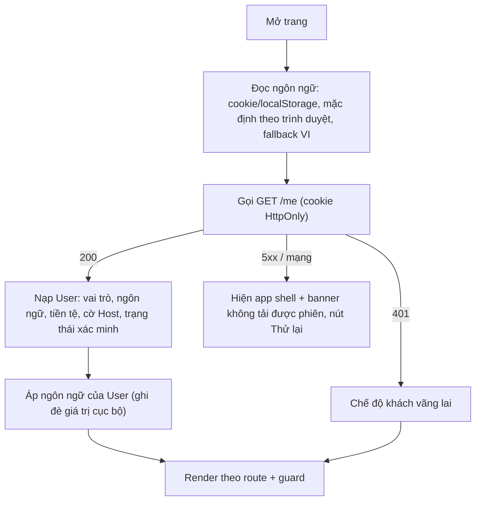

# Tài Liệu Giao Diện Giai Đoạn 1 – Bản Đồ Điều Hướng (Frontend Slices Map)

> **Mô hình tài liệu**: Phân tách theo **Vertical Slices (S01–S13)** và **Nền tảng dùng chung (Foundations)**.  
> **Nguyên tắc Agent**: Khi thực thi một task cụ thể, chỉ đọc thư mục tương ứng trong `slices/sxx-...` (kích thước ~10–20 KB) để tối ưu hóa Context Budget và ngăn chặn tình trạng tràn token.  
> **Sổ tay Prompt thực thi**: [PROMPTS_PLAYBOOK.md](./PROMPTS_PLAYBOOK.md) chứa toàn bộ danh sách prompt mẫu chuẩn Harness cho 13 Slices.

---

## 0. Quy ước

| Ký hiệu | Ý nghĩa |
|---|---|
| `P` / `C` / `H` / `A` | Màn Công khai / Chung (Guest+Host đã đăng nhập) / Host / Admin-back-office (theo `danh-sach-man-hinh-theo-actor.md`) |
| `S01…S13` | Slice theo file giai đoạn 1 |
| `FL-xx` | Mã flow (dùng trong 03-ux-behavior) |
| 🟢 / 🟡 / 🔴 | Nhánh chính / nhánh phụ / nhánh lỗi-ngoại lệ |
| `[Assumption]` | Quyết định thiết kế **chưa có trong đặc tả**, cần PO/BA xác nhận (tập hợp ở mục 7) |

**Vai trò (role) dùng trong tài liệu:** `Khách vãng lai` (chưa đăng nhập) · `Guest` · `Host` · `Admin` · `CSKH` · `Kế toán`. Một User có thể vừa là Guest vừa là Host (chế độ Guest/Host); nhân sự nội bộ chỉ vào `/admin`.

---


---

## 1. Bản đồ slice → màn hình → role

| Slice | Mục tiêu demo | Màn hình | Role chính | Phụ thuộc |
|---|---|---|---|---|
| S01 | Đăng ký → xác minh email → đăng nhập; quên mật khẩu | P07, P06, P09, P08 | Khách vãng lai | – |
| S02 | Hồ sơ, ngôn ngữ VI/EN, đổi mật khẩu, bật chế độ Host | C01, C02 | Guest, Host | S01 |
| S03 | Admin đăng nhập, tạo CSKH/Kế toán, phân quyền, khung back-office | A01, A18 | Admin | S01 |
| S04 | Host nộp hồ sơ xác minh, Admin duyệt/từ chối | P10, H02, C03, A03 | Guest→Host, Admin | S01, S03 |
| S05 | Tạo listing nháp: cơ bản, vị trí, ảnh | H03, H04 (bước 1–3) | Host | S04 |
| S06 | Tiện nghi, quy tắc lưu trú, giá & phí, bảng giá xem trước | H04 (bước 4–6) | Host | S05 |
| S07 | Chính sách huỷ, kiểu đặt, giấy tờ pháp lý, gửi duyệt, theo dõi trạng thái | H04 (bước 7–8), H05 | Host | S06 |
| S08 | Admin duyệt listing lần đầu → hiển thị công khai | A04 | Admin | S07, S03 |
| S09 | Lịch listing, chặn/mở ngày, chống đặt trùng | H06 | Host | S08 |
| S10 | Giá theo mùa/lễ/đặc biệt + thứ tự ưu tiên giá | H08 | Host | S06, S08 |
| S11 | Trang chủ + tìm kiếm có lọc, danh sách + bản đồ, tổng giá | P01, P02 | Khách vãng lai, Guest | S08, S09, S10 |
| S12 | Chi tiết listing, hồ sơ Host công khai, chính sách huỷ công khai | P03, P04, P05 | Khách vãng lai, Guest | S11 |
| S13 | Tiền tệ hiển thị + tỷ giá | (mở rộng C02, P02, P03) | Mọi role | S02, S11 |

**Hai đường găng của sản phẩm** (để dev/QA sắp lịch):
`S01 → S03 → S04 → S05 → S06 → S07 → S08 → S11 → S12` (đăng tin → tìm thấy) và `S08 → S09 → S10 → S11` (lịch + giá cấp dữ liệu cho tìm kiếm).

---


---

## 2. Sitemap & route (FE)

```
PUBLIC (layout: Public Shell)
  /                                   P01 Trang chủ
  /search?...                         P02 Kết quả tìm kiếm
  /rooms/:listingId                   P03 Chi tiết listing        (?checkin=&checkout=&adults=&children=)
  /hosts/:hostId                      P04 Hồ sơ công khai Host
  /cancellation-policies(#flexible)   P05 Chính sách huỷ
  /login                              P06   (?returnTo=)
  /register                           P07
  /forgot-password                    P08 (bước yêu cầu)
  /reset-password?token=              P08 (bước đặt lại)
  /verify-email?token=                P09
  /become-host                        P10

ACCOUNT (layout: Account Shell – cần đăng nhập)
  /account/profile                    C01
  /account/settings                   C02
  /account/verification               C03 (dùng cho Guest và Host)

HOST (layout: Host Shell – cần cờ Host)
  /host/verification                  H02 Hồ sơ xác minh Host
  /host/listings                      H03 Danh sách listing   ← trang đích mặc định của chế độ Host [Assumption A1]
  /host/listings/new                  H04 (tạo mới → redirect sang /host/listings/:id/edit/basic)
  /host/listings/:id/edit/:step       H04 step ∈ basic|location|photos|amenities|rules|pricing|policy|legal
  /host/listings/:id/status           H05 Trạng thái duyệt
  /host/listings/:id/calendar         H06 Lịch
  /host/listings/:id/pricing-rules    H08 Giá theo mùa/lễ/đặc biệt

BACK-OFFICE (layout: Admin Shell – tách hẳn khỏi site công khai)
  /admin/login                        A01
  /admin/staff                        A18 Nhân sự & phân quyền  (Admin)
  /admin/identity-reviews(/:id)       A03 Duyệt hồ sơ danh tính (Admin)
  /admin/listing-reviews(/:id)        A04 Duyệt listing         (Admin)
  /admin/403 · /admin/404

HỆ THỐNG: /403 · /404 · /500 · /maintenance · /terms-required (chỗ giữ cho màn C07 giai đoạn sau)
```

### 2.1 Ma trận quyền truy cập route (route guard)

| Route nhóm | Khách vãng lai | Guest/Host chưa xác minh email* | User đã đăng nhập | Host (chưa được duyệt) | Host (đã duyệt) | Nhân sự |
|---|---|---|---|---|---|---|
| Public `/`, `/search`, `/rooms`, `/hosts`, `/cancellation-policies` | ✅ | ✅ | ✅ | ✅ | ✅ | ✅ |
| `/login`, `/register`, `/forgot-password` | ✅ | ✅ | ↪ về `/` | ↪ | ↪ | ↪ `/admin` |
| `/account/*` | ↪ `/login?returnTo=` | – | ✅ | ✅ | ✅ | ❌ 403 |
| `/host/verification`, `/host/listings` (xem) | ↪ login | – | ↪ `/become-host` nếu chưa bật chế độ Host | ✅ | ✅ | ❌ |
| `/host/listings/new`, `edit` | ↪ login | – | ↪ `/become-host` | ❌ chặn bằng màn "Cần xác minh" (không phải 403) | ✅ | ❌ |
| `/admin/login` | ✅ | ✅ | ✅ (nhưng login bằng tài khoản Guest/Host bị từ chối) | – | – | ✅ |
| `/admin/staff` | ❌ | ❌ | ❌ | ❌ | ❌ | Chỉ **Admin** |
| `/admin/identity-reviews`, `/admin/listing-reviews` | ❌ | ❌ | ❌ | ❌ | ❌ | Chỉ **Admin** |

\* Theo S01 (demo): tài khoản chưa xác minh email **không đăng nhập được** – bị chặn tại P06 kèm nút "Gửi lại email xác minh" [Assumption A2].

---


---

## 3. Flow nền tảng (áp dụng cho mọi slice)

### FL-00 · Khởi động ứng dụng & phiên đăng nhập

- Session hết hạn khi đang thao tác → giữ nguyên dữ liệu form (đặc biệt wizard H04), mở **modal đăng nhập lại** (không điều hướng đi) → đăng nhập xong thì gửi lại thao tác đang dở.
- Đổi mật khẩu ở thiết bị khác → mọi phiên khác nhận 401 → modal đăng nhập lại (S02 AC).

### FL-01 · Xử lý lỗi toàn cục
| Mã | Hành vi FE |
|---|---|
| 401 | Modal đăng nhập lại (FL-00). Với trang công khai: bỏ qua, coi là khách |
| 403 | Trang 403 trong đúng shell; không lộ sự tồn tại của tài nguyên người khác |
| 404 | Trang 404 + nút về trang chủ / quay lại |
| 409 | Xung đột dữ liệu (lịch bị chiếm, hồ sơ đang được người khác xử lý, trạng thái đã đổi) → thông báo cụ thể + **tải lại dữ liệu** |
| 422 | Lỗi từng trường → gắn inline + cuộn tới lỗi đầu tiên |
| 429 | Banner "Thao tác quá nhanh/ quá nhiều lần" + đếm ngược nếu BE trả `Retry-After` |
| 5xx / timeout | Toast lỗi + nút Thử lại; **không mất dữ liệu đã nhập** |
| Offline | Banner cố định "Mất kết nối"; vô hiệu nút gửi; tự retry khi online |

### FL-02 · Đa ngôn ngữ (VI/EN)
Đổi ngôn ngữ → giao diện đổi **ngay, không reload** → nếu đã đăng nhập: lưu vào User (email gửi sau đó theo ngôn ngữ mới); nếu chưa: lưu cookie. URL không chứa tiền tố ngôn ngữ [Assumption A3].

---


---

## Danh Mục Tài Liệu Theo Thư Mục

### 1. Nền Tảng Dùng Chung (`00-foundations/`)
- [`design-tokens.md`](./00-foundations/design-tokens.md): Breakpoint, lưới 12 cột, hệ màu WCAG AA phong cách Airbnb, typography.
- [`shells.md`](./00-foundations/shells.md): 4 Khung trang (Public Shell, Account Shell, Host Shell, Admin Shell).
- [`components-catalog.md`](./00-foundations/components-catalog.md): Danh mục 34 UI Primitives (CMP-01 đến CMP-34).
- [`common-ux.md`](./00-foundations/common-ux.md): Quy tắc form validation, feedback, modal/bottom sheet, auto-save.
- [`common-data.md`](./00-foundations/common-data.md): Hợp đồng dữ liệu chung: Tiền tệ (Money), Thời gian (ISO UTC), Enums.

### 2. Danh Sách 13 Vertical Slices (`slices/`)
| Slice | Mã Thư Mục | Màn Hình | Mục Tiêu Nghiệp Vụ | Đường Dẫn Đặc Tả |
|---|---|---|---|---|
| **S01** | `s01-auth` | P06, P07, P08, P09 | Đăng ký, xác minh email, đăng nhập, quên mật khẩu | [slices/s01-auth/README.md](./slices/s01-auth/README.md) |
| **S02** | `s02-account` | C01, C02 | Hồ sơ, cài đặt tài khoản, đổi mật khẩu, bật Host | [slices/s02-account/README.md](./slices/s02-account/README.md) |
| **S03** | `s03-admin-rbac` | A01, A18 | Admin đăng nhập, tạo nhân sự CSKH/Kế toán, phân quyền | [slices/s03-admin-rbac/README.md](./slices/s03-admin-rbac/README.md) |
| **S04** | `s04-host-verification` | P10, H02, C03, A03 | Nộp hồ sơ xác minh CCCD/Passport, Admin duyệt danh tính | [slices/s04-host-verification/README.md](./slices/s04-host-verification/README.md) |
| **S05** | `s05-listing-draft` | H03, H04 (bước 1–3) | Tạo listing: thông tin cơ bản, chọn vị trí bản đồ, tải ảnh | [slices/s05-listing-draft/README.md](./slices/s05-listing-draft/README.md) |
| **S06** | `s06-listing-amenities-pricing` | H04 (bước 4–6) | Tiện nghi, quy tắc lưu trú, bảng giá & phí dọn dẹp | [slices/s06-listing-amenities-pricing/README.md](./slices/s06-listing-amenities-pricing/README.md) |
| **S07** | `s07-listing-policy-submit` | H04 (bước 7–8), H05 | Chính sách hủy, giấy tờ pháp lý, nộp duyệt, trạng thái | [slices/s07-listing-policy-submit/README.md](./slices/s07-listing-policy-submit/README.md) |
| **S08** | `s08-admin-review-listing` | A04 | Admin thẩm định listing lần đầu và duyệt công khai | [slices/s08-admin-review-listing/README.md](./slices/s08-admin-review-listing/README.md) |
| **S09** | `s09-listing-calendar` | H06 | Lịch listing của Host, chặn/mở ngày, chống đặt trùng | [slices/s09-listing-calendar/README.md](./slices/s09-listing-calendar/README.md) |
| **S10** | `s10-seasonal-pricing` | H08 | Giá theo mùa, ngày lễ, ngày đặc biệt + ưu tiên giá | [slices/s10-seasonal-pricing/README.md](./slices/s10-seasonal-pricing/README.md) |
| **S11** | `s11-home-search` | P01, P02 | Trang chủ, thanh tìm kiếm viên thuốc, bộ lọc, Mapbox | [slices/s11-home-search/README.md](./slices/s11-home-search/README.md) |
| **S12** | `s12-listing-detail` | P03, P04, P05 | Chi tiết phòng, photo gallery, hồ sơ Host, chính sách hủy | [slices/s12-listing-detail/README.md](./slices/s12-listing-detail/README.md) |
| **S13** | `s13-currency-exchange` | C02, P02, P03 | Chọn tiền tệ hiển thị và bảng tỷ giá quy đổi | [slices/s13-currency-exchange/README.md](./slices/s13-currency-exchange/README.md) |

### 3. Phụ Lục & Kiểm Thử Nghiệm Thu (`appendices/`)
- [`e2e-journeys.md`](./appendices/e2e-journeys.md): 5 Hành trình xuyên suốt J1–J5 để kiểm thử nghiệm thu.
- [`i18n-dictionary.md`](./appendices/i18n-dictionary.md): Bảng thông điệp nền tảng song ngữ (VI / EN).
- [`seed-data.md`](./appendices/seed-data.md): Bộ dữ liệu mẫu dùng cho mock API và test.
- [`privacy-matrix.md`](./appendices/privacy-matrix.md): Ma trận màn hình × dữ liệu nhạy cảm (bảo vệ quyền riêng tư).
- [`assumptions.md`](./appendices/assumptions.md): Tổng hợp các giả định và câu hỏi mở cần PO/BA xác nhận.
