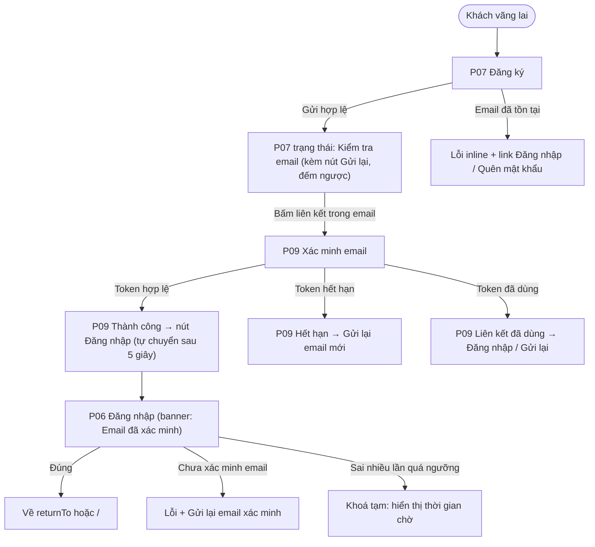
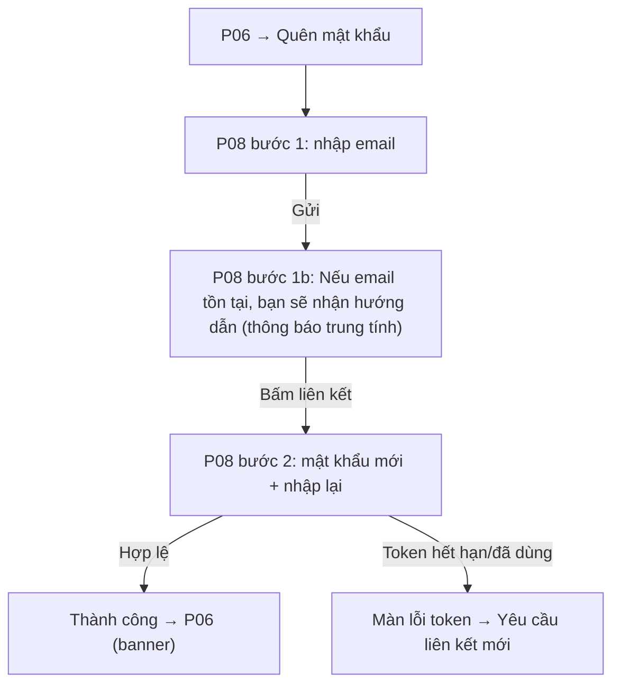

# Đặc Tả Kỹ Thuật Giao Diện · S01-AUTH

> Thư mục này đóng gói toàn bộ: **User Flow**, **Wireframes**, **UX Behavior**, và **Screen Data/API Contract** cho S01.


---

### S01 · Đăng ký, xác minh email, đăng nhập, quên mật khẩu (P07, P06, P09, P08)

**FL-S01-A · Đăng ký → xác minh → đăng nhập**

**FL-S01-B · Quên / đặt lại mật khẩu**

Điểm quyết định: (1) thông báo "đã gửi" luôn trung tính để không lộ email nào tồn tại; (2) sau đặt lại mật khẩu, mọi phiên cũ bị đăng xuất.

---


---


## S01 · Đăng ký, xác minh email, đăng nhập, quên mật khẩu

### P07 · Đăng ký
| Mục | Giá trị |
|---|---|
| Route / Role | `/register` · Khách vãng lai |
| Component | CMP-02 (Họ tên, Email), CMP-03 (Mật khẩu), CMP-05 (đồng ý điều khoản), CMP-01, CMP-08, CMP-14 |
| Action | Gửi đăng ký · Đăng nhập (link) · Đổi ngôn ngữ · Xem Điều khoản/Quyền riêng tư (mở tab mới) |
| State | **Default** · **Validating** (inline khi rời ô) · **Submitting** (nút loading, khoá form) · **Error trường** (email sai định dạng, mật khẩu yếu, chưa tick điều khoản) · **Error email đã tồn tại** · **Error mạng/5xx** (banner + giữ dữ liệu) · **Success → "Kiểm tra email"** (có Gửi lại, đếm ngược 60s; Đổi email) |

🖥 Desktop (form giữa trang, 440px; cột trái minh hoạ ẩn dưới 1024)
```
┌───────────────────────────────────────────────────────────────────────────┐
│ Public Header                                                              │
├───────────────────────────────────────────────────────────────────────────┤
│  ┌─────────────────────────────┐   ┌────────────────────────────────┐     │
│  │  ▢  Minh hoạ + thông điệp   │   │  Tạo tài khoản                 │     │
│  │  "Đặt chỗ ở như người bản   │   │  Họ và tên      [______________]│     │
│  │   địa"                      │   │  Email          [______________]│     │
│  │                             │   │  Mật khẩu       [__________ 👁]│     │
│  │                             │   │   ✓ ≥ 8 ký tự  ○ có chữ & số   │     │
│  │                             │   │  [x] Tôi đồng ý Điều khoản và   │     │
│  │                             │   │      Chính sách quyền riêng tư  │     │
│  │                             │   │  [        Tạo tài khoản        ]│     │
│  │                             │   │  Đã có tài khoản? Đăng nhập     │     │
│  └─────────────────────────────┘   └────────────────────────────────┘     │
└───────────────────────────────────────────────────────────────────────────┘
```
📱 Mobile (1 cột, nút sticky dưới khi bàn phím mở)
```
┌──────────────────────────────┐
│ ◈ Logo             VI▼  ☰   │
│ Tạo tài khoản                │
│ Họ và tên                    │
│ [__________________________] │
│ Email                        │
│ [__________________________] │
│ Mật khẩu                     │
│ [______________________ 👁]  │
│ ✓ ≥ 8 ký tự  ○ có chữ & số   │
│ [x] Tôi đồng ý Điều khoản…   │
│ [      Tạo tài khoản        ]│
│ Đã có tài khoản? Đăng nhập   │
└──────────────────────────────┘
```
Tablet: form giữa 480px, bỏ cột minh hoạ.

**Trạng thái thành công "Kiểm tra email" (thay thế form tại chỗ)**
```
        ┌─────────────────────────────────────┐
        │   ✉  Kiểm tra hộp thư của bạn        │
        │   Chúng tôi đã gửi liên kết xác minh │
        │   tới an***@mail.com                │
        │   [ Gửi lại email ]  (còn 52s)       │
        │   Sai email? Đăng ký lại             │
        └─────────────────────────────────────┘
```

### P06 · Đăng nhập
| Mục | Giá trị |
|---|---|
| Route / Role | `/login?returnTo=` · Khách vãng lai |
| Component | CMP-02 Email, CMP-03 Mật khẩu, CMP-05 (Ghi nhớ đăng nhập – tuỳ chọn), CMP-01, CMP-08 |
| Action | Đăng nhập · Quên mật khẩu → P08 · Đăng ký → P07 · Gửi lại email xác minh (khi lỗi chưa xác minh) |
| State | **Default** · **Submitting** · **Sai thông tin** (thông báo chung "Email hoặc mật khẩu không đúng") · **Chưa xác minh email** (banner vàng + Gửi lại) · **Tạm khoá** (banner đỏ + đếm ngược "Thử lại sau mm:ss") · **Banner thành công** (đến từ P09/P08: "Email đã xác minh"/"Đã đặt lại mật khẩu") · **Tài khoản bị khoá** · **Lỗi mạng** |

🖥 Desktop
```
┌───────────────────────────────────────────────────────────┐
│ Public Header                                              │
│              ┌─────────────────────────────────┐          │
│              │ [✓ Email đã được xác minh]       │ ← banner │
│              │ Đăng nhập                        │          │
│              │ Email    [____________________]  │          │
│              │ Mật khẩu [______________ 👁]     │          │
│              │ [x] Ghi nhớ        Quên mật khẩu?│          │
│              │ [         Đăng nhập            ] │          │
│              │ Chưa có tài khoản? Đăng ký       │          │
│              └─────────────────────────────────┘          │
└───────────────────────────────────────────────────────────┘
```
📱 Mobile: cùng nội dung 1 cột, full-width, banner nằm trên cùng, nút "Đăng nhập" sticky đáy.
Tablet: như desktop, khung 480px.

### P09 · Xác minh email
| Mục | Giá trị |
|---|---|
| Route / Role | `/verify-email?token=` · Khách vãng lai (mở từ email) |
| Component | CMP-08, CMP-01, CMP-11, minh hoạ trạng thái |
| Action | Đăng nhập · Gửi lại email · Về trang chủ |
| State | **Đang xác minh** (skeleton + spinner nhỏ) · **Thành công** (✓, nút Đăng nhập, tự chuyển sau 5s, có thể huỷ đếm) · **Hết hạn** (⚠ + Gửi lại – cần nhập email) · **Đã dùng** (ℹ + Đăng nhập) · **Token không hợp lệ** (✕ + Gửi lại) · **Lỗi mạng** (Thử lại) |

```
🖥/📱 (một thẻ giữa trang, 480px; mobile full-width)
┌───────────────────────────────────┐
│               ✓                   │
│     Email đã được xác minh         │
│  Bạn có thể đăng nhập ngay bây giờ │
│  [          Đăng nhập           ] │
│  Tự động chuyển sau 5 giây · Huỷ   │
└───────────────────────────────────┘
```

### P08 · Quên / đặt lại mật khẩu (2 bước, cùng màn)
| Mục | Giá trị |
|---|---|
| Route / Role | `/forgot-password` (bước 1) · `/reset-password?token=` (bước 2) · Khách vãng lai |
| Component | CMP-02 Email, CMP-03 Mật khẩu mới + Nhập lại, CMP-01, CMP-08 |
| Action | Gửi liên kết · Quay lại đăng nhập · Đặt lại mật khẩu · Yêu cầu liên kết mới |
| State | **B1 Default / Submitting / Đã gửi (trung tính)** · **B1 429** (gửi quá nhiều) · **B2 Default / Validating / Submitting** · **B2 Mật khẩu không khớp / yếu** · **B2 Token hết hạn hoặc đã dùng** (màn lỗi + yêu cầu liên kết mới) · **B2 Thành công** → P06 |

```
Bước 1 (🖥 440px / 📱 full-width)             Bước 2
┌──────────────────────────────────┐      ┌──────────────────────────────────┐
│ Quên mật khẩu?                    │      │ Đặt mật khẩu mới                  │
│ Nhập email để nhận liên kết đặt lại│      │ Mật khẩu mới      [_________ 👁] │
│ Email [__________________________]│      │  ✓ ≥ 8 ký tự  ○ có chữ & số       │
│ [     Gửi liên kết đặt lại      ] │      │ Nhập lại          [_________ 👁] │
│ ← Quay lại đăng nhập              │      │ [    Đặt lại mật khẩu          ] │
└──────────────────────────────────┘      └──────────────────────────────────┘
```

---


---


## S01 · Đăng ký, xác minh email, đăng nhập, quên mật khẩu

**Validation (P07 / P06 / P08)**
| Trường | Quy tắc | Thông điệp (VI) |
|---|---|---|
| Họ tên | bắt buộc, 2–80 ký tự, cắt khoảng trắng đầu/cuối | "Vui lòng nhập họ và tên (2–80 ký tự)" |
| Email | bắt buộc, định dạng email, chuẩn hoá chữ thường, tối đa 254 | "Email chưa đúng định dạng" |
| Mật khẩu | ≥ 8 ký tự, gồm chữ và số [A4]; tối đa 128; cho dán; không cắt khoảng trắng | "Mật khẩu cần ít nhất 8 ký tự, gồm chữ và số" |
| Điều khoản | phải tick | "Bạn cần đồng ý Điều khoản để tiếp tục" |
| Nhập lại mật khẩu (P08 B2) | trùng mật khẩu mới | "Mật khẩu nhập lại chưa khớp" |

**Hành vi chính**
1. **Danh sách yêu cầu mật khẩu** đổi ○→✓ theo thời gian thực; thanh độ mạnh chỉ là gợi ý, không chặn.
2. **Email đã tồn tại** (P07): lỗi inline kèm "Đăng nhập" / "Quên mật khẩu?" [O1: cân nhắc phản hồi trung tính để tránh dò email; hiện chọn inline cho dễ dùng, bù bằng giới hạn tần suất 429].
3. **Màn "Kiểm tra email"**: nút **Gửi lại** có đếm ngược 60 s; sau 3 lần/giờ → 429 → thông báo "Bạn đã yêu cầu quá nhiều lần, thử lại sau mm:ss". Có "Sai email? Đăng ký lại" (đưa về form, giữ họ tên).
4. **P09 gọi API xác minh đúng 1 lần khi mount** (bảo vệ khỏi gọi đôi do StrictMode/refresh – token dùng một lần nếu gọi 2 lần sẽ báo "đã dùng" sai). Dùng `useRef`/cờ để chặn lần gọi thứ hai.
5. **Đăng nhập**:
   - Lỗi sai thông tin luôn chung chung ("Email hoặc mật khẩu không đúng").
   - Chưa xác minh email → banner vàng + nút **Gửi lại email xác minh** (A2).
   - Tạm khoá (BE trả `lockedUntil`) → banner đỏ đếm ngược; nút Đăng nhập disabled tới khi hết; không tiết lộ số lần còn lại.
   - Sau đăng nhập: `returnTo` (**chỉ chấp nhận đường dẫn nội bộ bắt đầu bằng `/`**, không `//` và không URL đầy đủ – chống open redirect) → nếu không có: nhân sự → `/admin`; Host đang ở chế độ Host → `/host/listings`; còn lại → `/`.
   - Đã đăng nhập mà vào `/login` → chuyển về trang đích mặc định.
6. **Quên mật khẩu**: thông báo "đã gửi" luôn trung tính ("Nếu email tồn tại, chúng tôi đã gửi hướng dẫn"). Khi mở trang đặt lại, FE **kiểm tra token ngay khi tải** (trước khi người dùng nhập) → token hỏng hiện màn lỗi + yêu cầu liên kết mới. Thành công → về P06 kèm banner; **mọi phiên cũ bị đăng xuất** (BE).
7. Đổi ngôn ngữ trên trang auth **giữ nguyên giá trị đã nhập**, chỉ đổi nhãn/thông điệp.
8. Enter gửi form; Esc không làm gì; focus tự đặt vào ô đầu tiên khi mở trang (trừ mobile để tránh bật bàn phím không mong muốn).

**Edge case**: dán email có khoảng trắng (cắt); trình quản lý mật khẩu tự điền (không validate lỗi "trống" sai); mở liên kết xác minh ở trình duyệt khác (vẫn thành công, đăng nhập ở thiết bị gốc); người dùng đã xác minh bấm lại liên kết cũ ("Đã dùng" kèm nút Đăng nhập, không báo lỗi đỏ).

---


---


## S01 · Đăng ký, xác minh email, đăng nhập, quên mật khẩu

### Dữ liệu nhập / hiển thị
| Màn | Trường | Kiểu | Nguồn | Bắt buộc | Quy tắc | Hiển thị cho |
|---|---|---|---|---|---|---|
| P07 | fullName | text | User.fullName | ✓ | 2–80 | Chủ sở hữu |
| P07 | email | email | User.email | ✓ | định dạng, ≤254, chữ thường, duy nhất | Chủ sở hữu |
| P07 | password | secret | User (băm Argon2, **Chỉ BE**) | ✓ | [A4] ≥8, chữ+số, ≤128 | – (không bao giờ trả về) |
| P07 | acceptTerms | boolean | (ghi UserConsent ở giai đoạn sau) | ✓ | phải true | – |
| P07 (sau gửi) | maskedEmail | text | – | – | "an***@mail.com" | Chủ sở hữu |
| P07 (sau gửi) | resendAvailableIn | số giây | SystemConfig | – | 60 s | |
| P06 | email, password, rememberMe | | | ✓,✓,✗ | | |
| P06 (lỗi) | lockedUntil, attemptsLocked | ISO | User/BE | – | không trả số lần còn lại | |
| P09 | token | string (query) | – | ✓ | dùng một lần, có hạn | |
| P09 (kết quả) | result | `VERIFIED｜EXPIRED｜USED｜INVALID` | – | – | | |
| P08 B1 | email | | | ✓ | | |
| P08 B2 | token, newPassword, confirmPassword | | | ✓ | trùng khớp; chính sách mật khẩu | |

### API đề xuất
| Method & path | Mục đích | Phản hồi chính |
|---|---|---|
| `POST /auth/register` | Đăng ký | 201 `{ emailMasked, resendAvailableIn }` · 409 email tồn tại · 422 · 429 |
| `POST /auth/verify-email` `{token}` | Xác minh (**gọi 1 lần**) | 200 `{result}` |
| `POST /auth/resend-verification` `{email}` | Gửi lại | 204 · 429 `{retryAfterSec}` |
| `POST /auth/login` | Đăng nhập; đặt cookie HttpOnly | 200 `User` · 401 · 403 `EMAIL_UNVERIFIED` · 423 `{lockedUntil}` |
| `POST /auth/logout` | Đăng xuất | 204 |
| `POST /auth/forgot-password` `{email}` | Yêu cầu đặt lại | 202 (luôn trung tính) |
| `GET /auth/reset-password/validate?token=` | Kiểm tra token ngay khi mở trang | 200 `{valid, reason?}` |
| `POST /auth/reset-password` `{token,newPassword}` | Đặt lại | 204 · 410 token hết hạn/đã dùng |
| `GET /me` | Khởi tạo phiên | 200 `User` · 401 |

### Cấu hình liên quan (SystemConfig – seed)
`auth.maxFailedAttempts`, `auth.lockMinutes`, `auth.verifyTokenTtlHours`, `auth.resetTokenTtlMinutes`, `auth.resendCooldownSec` (60), `auth.resendMaxPerHour` (3), `auth.passwordMinLength` (8).

### Dữ liệu seed cho demo (S01 AC: mỗi vai trò có tài khoản mẫu)
| Tài khoản mẫu | Vai trò | Trạng thái |
|---|---|---|
| `guest@demo.test` | Guest | Đã xác minh email |
| `host.pending@demo.test` | Host | Đã bật chế độ Host, hồ sơ **chưa nộp** |
| `host@demo.test` | Host | Hồ sơ **đã duyệt**, có vài listing ở các trạng thái khác nhau |
| `admin@demo.test` · `support@demo.test` · `accountant@demo.test` | Admin · CSKH · Kế toán | Hoạt động |
| `unverified@demo.test` | Guest | **Chưa xác minh email** (để thử đường lỗi P06) |
Mật khẩu mẫu ghi trong README seed; Mailpit xem email tại cổng được cấu hình trong Docker Compose.

---

