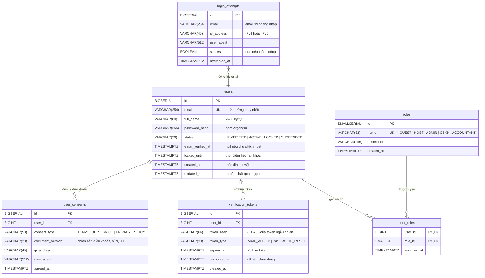

# Thiết Kế Cơ Sở Dữ Liệu Chi Tiết — Slice S01 (Auth)

Tài liệu này đặc tả thiết kế cấu trúc dữ liệu quan hệ cho phân hệ Xác thực & Phân quyền (**Authentication & Authorization**), tương ứng với Slice `FE-S01` (Giao diện) và Module `BE-M01` (Backend Modular Monolith).

Tệp migration tương ứng: [`V1__create_auth_schema.sql`](file:///e:/github-tutorio-demo/homestaybooking/backend/src/main/resources/db/migration/V1__create_auth_schema.sql).

---

## 1. Sơ Đồ Thực Thể - Quan Hệ (ER Diagram)



---

## 2. Chi Tiết Thực Thể & Ràng Buộc (Tables & Constraints)

### 2.1. Bảng `users`
- **Mục đích**: Lưu thông tin gốc của mọi chủ thể tài khoản trong hệ thống.
- **Ràng buộc toàn vẹn**:
  - `uq_users_email`: `UNIQUE(email)` ngăn ngừa trùng lặp email ở mức vật lý.
  - `chk_users_email_lowercase`: `CHECK (email = LOWER(email))` đảm bảo dữ liệu luôn được chuẩn hoá về chữ thường trước khi ghi.
  - `chk_users_status`: `CHECK (status IN ('UNVERIFIED', 'ACTIVE', 'LOCKED', 'SUSPENDED'))`.
- **Tự động hoá**: Trigger `trg_users_updated_at` gọi hàm `set_updated_at_column()` gán `clock_timestamp()` cho `updated_at` mỗi khi có cập nhật bản ghi.

### 2.2. Bảng `roles` & `user_roles`
- **Mục đích**: Quản lý ma trận phân quyền RBAC (Role-Based Access Control). Một tài khoản có thể có nhiều vai trò (ví dụ: vừa là `GUEST`, vừa là `HOST`).
- **Khóa chính kết hợp**: `PRIMARY KEY (user_id, role_id)`.
- **Ràng buộc khóa ngoại**:
  - Xóa tài khoản (`users`) sẽ tự động xóa các vai trò được cấp (`ON DELETE CASCADE`).
  - Không thể xóa một `role` trong bảng `roles` nếu đang có người dùng nắm giữ (`ON DELETE RESTRICT`).

### 2.3. Bảng `verification_tokens`
- **Mục đích**: Cấp phát mã xác thực kích hoạt email (P09, P07) và đặt lại mật khẩu (P08 B1, B2).
- **Nguyên lý bảo mật**:
  - Không bao giờ lưu token thô vào cơ sở dữ liệu. Token thô gửi qua email (dài 32–64 bytes ngẫu nhiên cryptographic) được băm bằng `SHA-256` trước khi lưu vào `token_hash`.
  - Giảm thiểu rủi ro khi database bị rò rỉ: kẻ tấn công không thể dùng token để chiếm tài khoản.
- **Ràng buộc**: `CHECK (token_type IN ('EMAIL_VERIFY', 'PASSWORD_RESET'))`.

### 2.4. Bảng `login_attempts`
- **Mục đích**: Theo dõi số lần đăng nhập thất bại theo email và IP để kích hoạt cơ chế khóa tạm thời (Temporary Account Lock - HTTP 423) chống brute-force và credential stuffing.
- **Dữ liệu lưu vết**: Email mục tiêu, IP client (hỗ trợ IPv6 đến 45 ký tự), User-Agent, trạng thái thành công/thất bại, thời gian UTC.

### 2.5. Bảng `user_consents`
- **Mục đích**: Lưu trữ bằng chứng pháp lý khi người dùng tích chọn checkbox `acceptTerms` tại form đăng ký P07 (`Điều khoản dịch vụ` và `Chính sách quyền riêng tư`).

---

## 3. Chiến Lược Chỉ Mục (Index Optimization)

| Chỉ mục | Bảng | Cột | Mục đích sử dụng |
|---|---|---|---|
| `idx_users_email` | `users` | `email` | Tra cứu người dùng cực nhanh khi đăng nhập (`WHERE email = ?`) |
| `idx_users_status` | `users` | `status` | Hỗ trợ lọc người dùng active/locked phục vụ thống kê & quản trị |
| `idx_tokens_lookup` | `verification_tokens` | `token_hash, token_type` | Kiểm tra token hợp lệ khi click liên kết xác minh hoặc đổi mật khẩu |
| `idx_tokens_user_id` | `verification_tokens` | `user_id, token_type` | Hủy hoặc vô hiệu hóa các token cũ khi người dùng yêu cầu gửi lại |
| `idx_login_attempts_email_ip` | `login_attempts` | `email, ip_address, attempted_at DESC` | Đếm số lần đăng nhập sai của cặp email-IP trong 15 phút gần nhất |
| `idx_login_attempts_email_recent` | `login_attempts` | `email, attempted_at DESC` | Tính toán số lần nhập sai liên tiếp của tài khoản |

---

## 4. Xử Lý Bất Biến & Đồng Thời (Concurrency & Invariants)

### 4.1. Token Single-Use Atomic Consumption (Chống Race Condition)
Để đảm bảo một token chỉ được sử dụng đúng 1 lần duy nhất ngay cả khi có nhiều request đồng thời (double-click hoặc tấn công lặp lại):
```sql
UPDATE verification_tokens
SET consumed_at = clock_timestamp()
WHERE token_hash = :tokenHash
  AND token_type = :tokenType
  AND consumed_at IS NULL
  AND expires_at > clock_timestamp()
RETURNING user_id;
```
- Nếu câu lệnh trả về `user_id`: Token hợp lệ và tiêu thụ thành công.
- Nếu câu lệnh trả về `0 rows`: Token đã hết hạn, không tồn tại hoặc đã được tiêu thụ ở request trước đó (chuyển sang HTTP `410 Gone` hoặc trạng thái `USED/EXPIRED`).

### 4.2. Khóa Tạm Thời (Temporary Account Lock - P06)
- Nếu người dùng nhập sai quá 5 lần liên tiếp trong vòng 15 phút:
  ```sql
  UPDATE users
  SET status = 'LOCKED',
      locked_until = clock_timestamp() + INTERVAL '15 minutes'
  WHERE id = :userId;
  ```
- Khi đăng nhập, nếu `locked_until > clock_timestamp()`, backend lập tức từ chối và trả về HTTP `423 Locked` kèm thời gian `lockedUntil`.
- Khi `clock_timestamp() >= locked_until`, backend tự động mở khóa trạng thái tài khoản.
