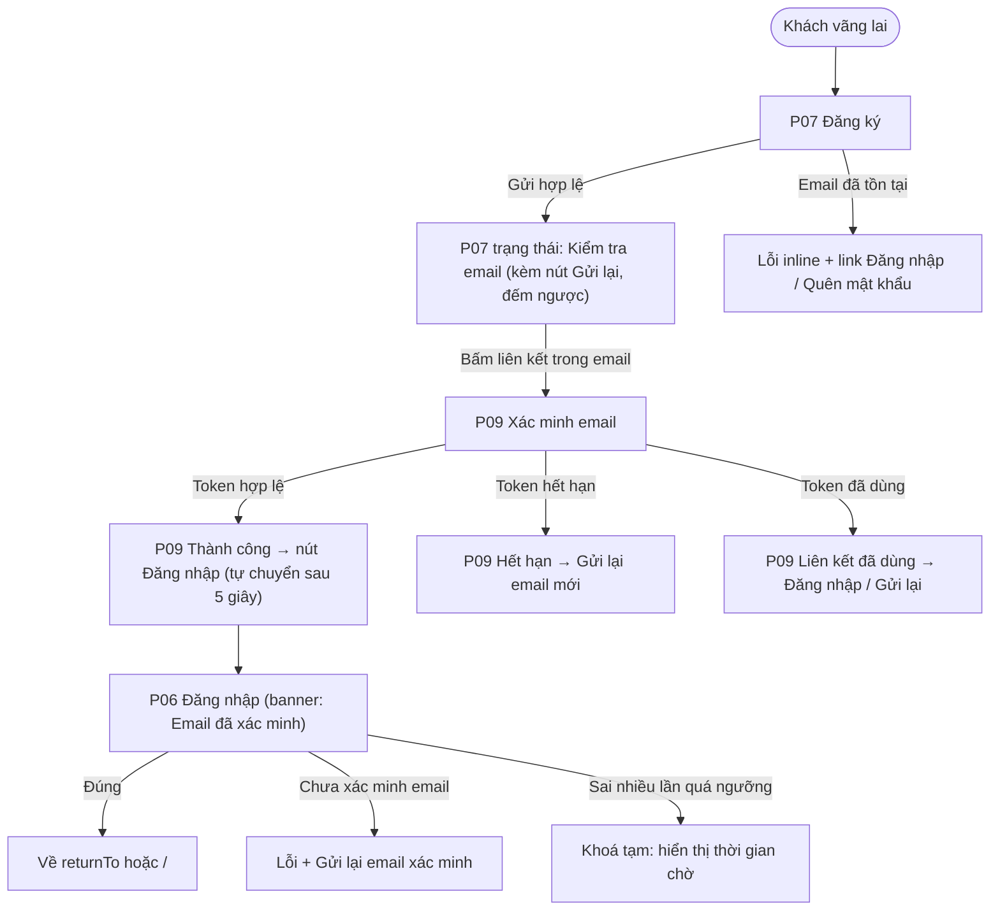
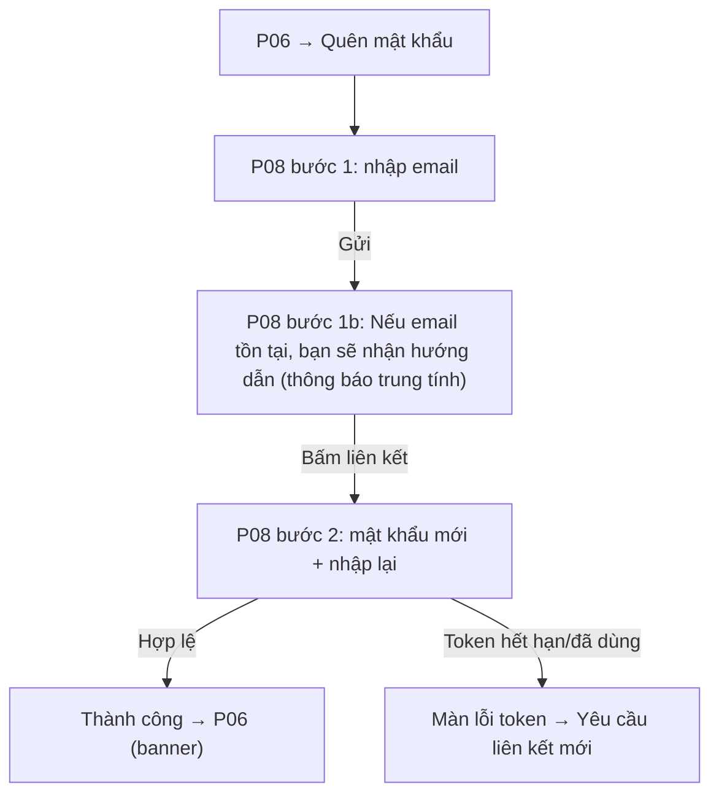

### S01 · Đăng ký, xác minh email, đăng nhập, quên mật khẩu (P07, P06, P09, P08)

**FL-S01-A · Đăng ký → xác minh → đăng nhập**

**FL-S01-B · Quên / đặt lại mật khẩu**

Điểm quyết định: (1) thông báo "đã gửi" luôn trung tính để không lộ email nào tồn tại; (2) sau đặt lại mật khẩu, mọi phiên cũ bị đăng xuất.

---

