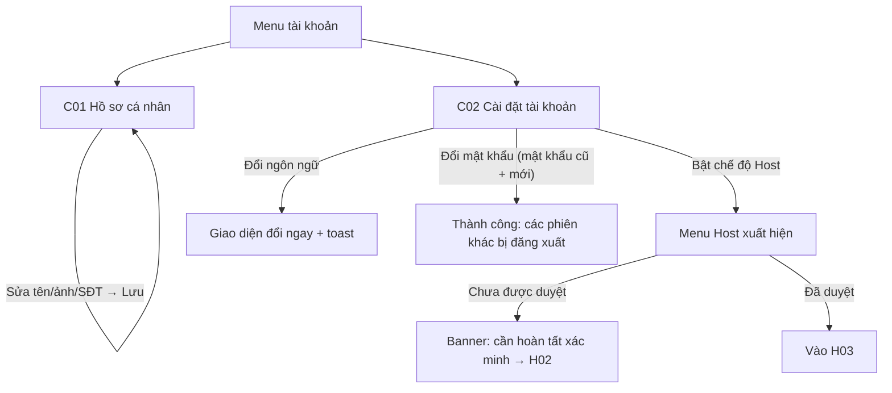

# Đặc Tả Kỹ Thuật Giao Diện · S02-ACCOUNT

> Thư mục này đóng gói toàn bộ: **User Flow**, **Wireframes**, **UX Behavior**, và **Screen Data/API Contract** cho S02.


---

### S02 · Hồ sơ & cài đặt (C01, C02)

Nhánh lỗi: mật khẩu cũ sai (inline); mật khẩu mới trùng cũ; ảnh sai định dạng/quá nặng; mất mạng khi lưu.

---


---


## S02 · Hồ sơ và cài đặt tài khoản

### C01 · Hồ sơ cá nhân
| Mục | Giá trị |
|---|---|
| Route / Role | `/account/profile` · Guest, Host (đã đăng nhập) |
| Component | Account Shell, CMP-13 (ảnh đại diện – chọn/cắt), CMP-02 (Họ tên, SĐT, Giới thiệu*), CMP-02 readonly (Email), CMP-10 (trạng thái xác minh danh tính), CMP-01, CMP-32 |
| Action | Đổi ảnh · Lưu thay đổi · Huỷ thay đổi · Đi tới Xác minh danh tính (C03) · Đi tới Cài đặt |
| State | **Loading** (skeleton) · **Default** · **Dirty** (nút Lưu bật, cảnh báo rời trang) · **Saving** · **Saved** (toast) · **Lỗi trường** · **Lỗi tải ảnh** (sai định dạng/quá nặng) · **Lỗi mạng** |
\* "Giới thiệu bản thân" ngắn dùng cho hồ sơ Host công khai (P04) [Assumption – cần PO chốt có/không].

🖥 Desktop
```
┌────────────────────────────────────────────────────────────────────────┐
│ Public Header                                                           │
│ Tài khoản   [ Hồ sơ ] Cài đặt  Xác minh                                 │
│ ┌──────────────┐  ┌────────────────────────────────────────────────┐   │
│ │   ( ▢ ảnh )  │  │ Họ và tên    [__________________________]      │   │
│ │ [Đổi ảnh]    │  │ Email        an@mail.com   ✓ Đã xác minh        │   │
│ │ JPG/PNG ≤5MB │  │ Số điện thoại[__________________________]      │   │
│ │              │  │ Giới thiệu   [__________________________]      │   │
│ │ Xác minh DT: │  │                                      0/300      │   │
│ │ [Chưa nộp]   │  │ [ Huỷ ]                       [ Lưu thay đổi ]  │   │
│ │ Xác minh ngay→│  └────────────────────────────────────────────────┘   │
│ └──────────────┘                                                        │
└────────────────────────────────────────────────────────────────────────┘
```
📱 Mobile: ảnh + trạng thái xác minh nằm trên cùng (căn giữa), form 1 cột, thanh nút **sticky đáy** [Huỷ][Lưu]. Tablet: 2 cột như desktop, ảnh thu nhỏ.

### C02 · Cài đặt tài khoản
| Mục | Giá trị |
|---|---|
| Route / Role | `/account/settings` · Guest, Host |
| Component | CMP-04 (Ngôn ngữ), CMP-04 (Tiền tệ hiển thị – 🔒 bật ở S13), CMP-03 ×3 (mật khẩu cũ/mới/nhập lại), CMP-05 Switch (Chế độ Host), CMP-25 ConfirmDialog, CMP-08 |
| Action | Đổi ngôn ngữ (áp dụng ngay) · Đổi mật khẩu · Bật/tắt chế độ Host · Đăng xuất mọi thiết bị* |
| State | **Loading** · **Default** · **Đổi ngôn ngữ**: đang áp dụng → giao diện đổi, toast · **Đổi mật khẩu**: Default/Submitting/Sai mật khẩu cũ/Trùng mật khẩu cũ/Thành công (banner "Các thiết bị khác đã đăng xuất") · **Chế độ Host**: Tắt/Bật-chưa xác minh (kèm banner → H02)/Bật-đã duyệt · **Lỗi mạng** |
\* Tuỳ chọn, không có trong đặc tả.

🖥 Desktop
```
┌────────────────────────────────────────────────────────────────────────┐
│ Tài khoản   Hồ sơ [ Cài đặt ] Xác minh                                   │
│ ┌─ Ngôn ngữ & Tiền tệ ─────────────────────────────────────────────┐   │
│ │ Ngôn ngữ        [Tiếng Việt ▼]                                     │   │
│ │ Tiền tệ hiển thị[VND ▼]   ⓘ Giá quy đổi chỉ để tham khảo (S13)     │   │
│ └────────────────────────────────────────────────────────────────────┘   │
│ ┌─ Mật khẩu ───────────────────────────────────────────────────────┐   │
│ │ Mật khẩu hiện tại [__________ 👁]                                  │   │
│ │ Mật khẩu mới      [__________ 👁]                                  │   │
│ │ Nhập lại          [__________ 👁]            [ Đổi mật khẩu ]       │   │
│ └────────────────────────────────────────────────────────────────────┘   │
│ ┌─ Chế độ Host ────────────────────────────────────────────────────┐   │
│ │ Cho thuê chỗ ở trên nền tảng              ( ● Bật  )               │   │
│ │ ⚠ Bạn cần xác minh để tạo listing  → Hoàn tất xác minh             │   │
│ └────────────────────────────────────────────────────────────────────┘   │
└────────────────────────────────────────────────────────────────────────┘
```
📱 Mobile: ba khối xếp dọc thành **accordion** (mặc định mở khối vừa tương tác); nút trong từng khối full-width. Tablet: 1 cột 600px.

---


---


## S02 · Hồ sơ và cài đặt

**Hồ sơ (C01)**
- Ảnh đại diện: chọn → cắt vuông (kéo/zoom) → xem trước → Lưu; JPG/PNG/WebP ≤ 5 MB [A5]; có "Xoá ảnh". Lỗi định dạng/kích thước hiện ngay dưới ô, không gọi API.
- Họ tên 2–80; SĐT (tuỳ chọn) chuẩn hoá +84/0…, không xác minh qua SMS (FR-ACC-01); Giới thiệu ≤ 300.
- Email **chỉ đọc** (đổi email ngoài phạm vi giai đoạn 1); hiển thị "✓ Đã xác minh".
- Nút Lưu chỉ bật khi dirty; Huỷ khôi phục giá trị đã lưu; thay đổi dirty + rời trang → ConfirmDialog.
- Khối "Xác minh danh tính": hiển thị badge trạng thái (xem 0.5 wireframe) và CTA tương ứng (Chưa nộp → "Xác minh ngay", Bị từ chối → "Xem lý do & nộp lại").

**Cài đặt (C02)**
- **Đổi ngôn ngữ**: áp dụng **tức thì** (không reload): tải gói ngôn ngữ, đổi nhãn, định dạng ngày/số, `html lang`; gọi API lưu (optimistic; lỗi → hoàn lại ngôn ngữ cũ + toast lỗi). Toast: "Đã đổi sang English. Email gửi sau đó sẽ dùng ngôn ngữ này."
- **Đổi mật khẩu**: cần mật khẩu hiện tại; mật khẩu mới ≠ mật khẩu cũ; sau thành công xoá cả 3 ô, hiện banner "Đã đổi mật khẩu. Các thiết bị khác đã bị đăng xuất" (S02 AC); phiên hiện tại giữ nguyên. Sai mật khẩu cũ → lỗi tại ô đó, không xoá ô khác.
- **Chế độ Host**: công tắc **một chiều** ở giai đoạn 1 [A11]: Bật → toast + menu Host xuất hiện + (nếu chưa duyệt) banner cố định "Hoàn tất xác minh để tạo listing →H02"; sau khi bật, công tắc đổi thành dòng trạng thái "Đã bật chế độ Host" (việc chuyển qua lại giữa **hiển thị** Guest/Host dùng bộ chuyển ở header – FR-ACC-02).
- Khối Tiền tệ: ở giai đoạn 1 hiển thị disabled kèm "Sắp có"; bật ở S13.

---


---


## S02 · Hồ sơ và cài đặt

| Màn | Trường | Kiểu | Nguồn | Bắt buộc | Quy tắc | Hiển thị cho |
|---|---|---|---|---|---|---|
| C01 | avatar | ảnh | User.avatarUrl | ✗ | JPG/PNG/WebP ≤5MB [A5], cắt vuông | Công khai (khi là Host: P04) |
| C01 | fullName | text | User.fullName | ✓ | 2–80 | Công khai (rút gọn tuỳ ngữ cảnh) |
| C01 | email | text (đọc) + emailVerified | User | – | không sửa được | Chủ sở hữu |
| C01 | phone | tel | User.phone | ✗ | chuẩn hoá | Chủ sở hữu |
| C01 | bio | textarea | User.bio | ✗ | ≤300 [Assumption] | Công khai (P04) |
| C01 | verificationStatus | enum | IdentityVerification | – | badge | Chủ sở hữu |
| C02 | language | select | User.language | ✓ | `vi/en` | Chủ sở hữu |
| C02 | displayCurrency | select | User.displayCurrency | ✗ | disabled tới S13 | Chủ sở hữu |
| C02 | currentPassword / newPassword / confirm | secret | – | ✓ | khác mật khẩu cũ; chính sách mật khẩu | – |
| C02 | hostModeEnabled | switch | User.isHost | – | một chiều [A11] | Chủ sở hữu |

| API | Mục đích |
|---|---|
| `PATCH /me` `{fullName,phone,bio,language,displayCurrency}` | Cập nhật hồ sơ/cài đặt |
| `POST /me/avatar` (qua luồng upload 0.3) · `DELETE /me/avatar` | Ảnh đại diện |
| `POST /me/password` `{current,new}` | Đổi mật khẩu → 204 (BE đăng xuất phiên khác) · 422 `WRONG_CURRENT` |
| `POST /me/host-mode` | Bật chế độ Host → 200 `{isHost:true, hostVerification}` |

---

