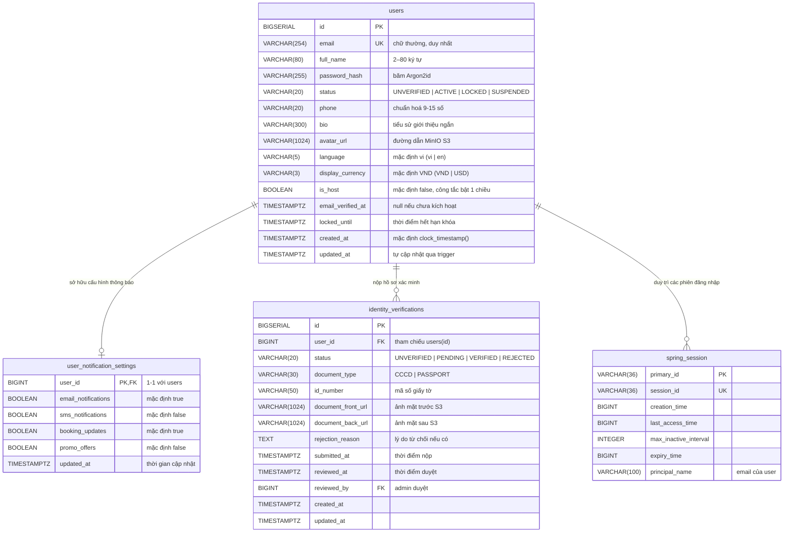

# Thiết Kế Cơ Sở Dữ Liệu Chi Tiết — Slice S02 (Account & Settings)

Tài liệu này đặc tả thiết kế cấu trúc dữ liệu quan hệ cho phân hệ Hồ Sơ Người Dùng & Cài Đặt Tài Khoản (**User Profile & Account Settings**), tương ứng với Slice `FE-S02` (Giao diện C01, C02) và Module `BE-M02` (Account Management / Spring Modulith).

Tệp migration tương ứng: [`V2__create_account_profile_schema.sql`](file:///e:/github-tutorio-demo/homestaybooking/backend/src/main/resources/db/migration/V2__create_account_profile_schema.sql).

---

## 1. Sơ Đồ Thực Thể - Quan Hệ (ER Diagram)



---

## 2. Chi Tiết Các Bảng & Cột

### 2.1 Bảng `users` (Bổ sung các cột hồ sơ & cài đặt qua ALTER TABLE)

| Tên cột | Kiểu dữ liệu | Ràng buộc | Mô tả |
|---|---|---|---|
| `phone` | `VARCHAR(20)` | `NULL`, Regex kiểm tra `^(\+?[0-9]{9,15})$` | Số điện thoại liên hệ cá nhân |
| `bio` | `VARCHAR(300)` | `NULL` | Giới thiệu bản thân công khai (hiển thị khi làm Host P04) |
| `avatar_url` | `VARCHAR(1024)` | `NULL` | URL ảnh đại diện lưu trữ trên MinIO/S3 |
| `language` | `VARCHAR(5)` | `NOT NULL DEFAULT 'vi'`, `CHECK (language IN ('vi', 'en'))` | Ngôn ngữ ưu tiên nhận email và hiển thị |
| `display_currency` | `VARCHAR(3)` | `NOT NULL DEFAULT 'VND'`, `CHECK (display_currency IN ('VND', 'USD'))` | Tiền tệ hiển thị tham khảo |
| `is_host` | `BOOLEAN` | `NOT NULL DEFAULT FALSE` | Cờ xác định tài khoản đã kích hoạt chế độ Host |

### 2.2 Bảng `user_notification_settings` (Cài đặt thông báo)

| Tên cột | Kiểu dữ liệu | Ràng buộc | Mô tả |
|---|---|---|---|
| `user_id` | `BIGINT` | `PRIMARY KEY`, `REFERENCES users(id) ON DELETE CASCADE` | Khóa chính và khóa ngoại 1-1 với tài khoản |
| `email_notifications` | `BOOLEAN` | `NOT NULL DEFAULT TRUE` | Bật/tắt thông báo qua email |
| `sms_notifications` | `BOOLEAN` | `NOT NULL DEFAULT FALSE` | Bật/tắt thông báo qua tin nhắn SMS |
| `booking_updates` | `BOOLEAN` | `NOT NULL DEFAULT TRUE` | Nhận nhắc nhở lịch đặt/huỷ phòng |
| `promo_offers` | `BOOLEAN` | `NOT NULL DEFAULT FALSE` | Nhận bản tin ưu đãi & khuyến mãi |
| `updated_at` | `TIMESTAMPTZ` | `NOT NULL DEFAULT clock_timestamp()` | Thời điểm cập nhật cuối |

### 2.3 Bảng `identity_verifications` (Liên kết trạng thái xác minh C01 & C02)

| Tên cột | Kiểu dữ liệu | Ràng buộc | Mô tả |
|---|---|---|---|
| `id` | `BIGSERIAL` | `PRIMARY KEY` | Khóa chính định danh hồ sơ |
| `user_id` | `BIGINT` | `NOT NULL`, `REFERENCES users(id) ON DELETE CASCADE` | Người dùng nộp hồ sơ xác minh |
| `status` | `VARCHAR(20)` | `NOT NULL DEFAULT 'UNVERIFIED'`, `CHECK (status IN ('UNVERIFIED', 'PENDING', 'VERIFIED', 'REJECTED'))` | Trạng thái xét duyệt danh tính |
| `document_type` | `VARCHAR(30)` | `NULL` | Loại giấy tờ: CCCD hoặc PASSPORT |
| `id_number` | `VARCHAR(50)` | `NULL` | Số CCCD/Hộ chiếu |
| `document_front_url` | `VARCHAR(1024)` | `NULL` | Đường dẫn ảnh mặt trước (MinIO bucket bảo mật) |
| `document_back_url` | `VARCHAR(1024)` | `NULL` | Đường dẫn ảnh mặt sau |
| `rejection_reason` | `TEXT` | `NULL` | Lý do từ chối (hiển thị khi trạng thái REJECTED) |
| `submitted_at` | `TIMESTAMPTZ` | `NULL` | Thời điểm gửi hồ sơ xét duyệt |
| `reviewed_at` | `TIMESTAMPTZ` | `NULL` | Thời điểm ban quản trị duyệt |
| `reviewed_by` | `BIGINT` | `NULL`, `REFERENCES users(id)` | Admin thực hiện duyệt |
| `created_at` | `TIMESTAMPTZ` | `NOT NULL DEFAULT clock_timestamp()` | Ngày tạo bản ghi |
| `updated_at` | `TIMESTAMPTZ` | `NOT NULL DEFAULT clock_timestamp()` | Ngày cập nhật |

---

## 3. Chỉ Mục (Database Indexes)

```sql
-- Tìm kiếm nhanh hồ sơ xác minh mới nhất theo user_id
CREATE INDEX idx_identity_verifications_user_id ON identity_verifications(user_id);

-- Lọc danh sách hồ sơ cần duyệt cho Admin (A03)
CREATE INDEX idx_identity_verifications_status ON identity_verifications(status);

-- Tối ưu truy vấn kiểm tra phiên người dùng trong Spring Session khi đổi mật khẩu
CREATE INDEX idx_spring_session_principal ON SPRING_SESSION(principal_name);
```

---

## 4. Ràng Buộc Nghiệp Vụ & Quy Tắc ACID (Invariants)

1. **Thu hồi phiên khi Đổi mật khẩu (ACID Durability)**:
   - Khi người dùng đổi mật khẩu thành công tại `POST /api/v1/me/password`:
     ```sql
     DELETE FROM SPRING_SESSION 
     WHERE principal_name = :email 
       AND session_id != :currentSessionId;
     ```
   - Phiên hiện tại được bảo lưu, toàn bộ phiên trên các thiết bị hoặc trình duyệt khác bị đăng xuất ngay lập tức.
2. **Kích hoạt Chế độ Host (Một chiều ở Giai đoạn 1)**:
   - Khi `is_host` chuyển thành `TRUE`, không cho phép chuyển ngược lại về `FALSE` qua API `POST /api/v1/me/host-mode`.
   - Nếu tài khoản chưa có bản ghi xác minh danh tính, hệ thống tự động khởi tạo bản ghi `identity_verifications` ở trạng thái `UNVERIFIED`.
3. **Giới hạn dung lượng và loại tệp Avatar**:
   - Tệp tải lên bucket S3/MinIO tối đa 5MB, MIME type giới hạn trong `image/jpeg`, `image/png`, `image/webp`.

---

## 5. DDL Bản Nháp Flyway Migration (`V2__create_account_profile_schema.sql`)

```sql
-- 1. Bổ sung các cột thông tin tài khoản
ALTER TABLE users 
    ADD COLUMN phone VARCHAR(20),
    ADD COLUMN bio VARCHAR(300),
    ADD COLUMN avatar_url VARCHAR(1024),
    ADD COLUMN language VARCHAR(5) NOT NULL DEFAULT 'vi',
    ADD COLUMN display_currency VARCHAR(3) NOT NULL DEFAULT 'VND',
    ADD COLUMN is_host BOOLEAN NOT NULL DEFAULT FALSE;

ALTER TABLE users 
    ADD CONSTRAINT chk_users_language CHECK (language IN ('vi', 'en')),
    ADD CONSTRAINT chk_users_display_currency CHECK (display_currency IN ('VND', 'USD'));

-- 2. Bảng cài đặt thông báo
CREATE TABLE user_notification_settings (
    user_id BIGINT PRIMARY KEY,
    email_notifications BOOLEAN NOT NULL DEFAULT TRUE,
    sms_notifications BOOLEAN NOT NULL DEFAULT FALSE,
    booking_updates BOOLEAN NOT NULL DEFAULT TRUE,
    promo_offers BOOLEAN NOT NULL DEFAULT FALSE,
    updated_at TIMESTAMPTZ NOT NULL DEFAULT clock_timestamp(),

    CONSTRAINT fk_notification_settings_user FOREIGN KEY (user_id) REFERENCES users(id) ON DELETE CASCADE
);

-- Trigger cập nhật timestamp
CREATE TRIGGER trg_user_notification_settings_updated_at
BEFORE UPDATE ON user_notification_settings
FOR EACH ROW
EXECUTE FUNCTION set_updated_at_column();

-- 3. Bảng xác minh danh tính
CREATE TABLE identity_verifications (
    id BIGSERIAL PRIMARY KEY,
    user_id BIGINT NOT NULL,
    status VARCHAR(20) NOT NULL DEFAULT 'UNVERIFIED',
    document_type VARCHAR(30),
    id_number VARCHAR(50),
    document_front_url VARCHAR(1024),
    document_back_url VARCHAR(1024),
    rejection_reason TEXT,
    submitted_at TIMESTAMPTZ,
    reviewed_at TIMESTAMPTZ,
    reviewed_by BIGINT,
    created_at TIMESTAMPTZ NOT NULL DEFAULT clock_timestamp(),
    updated_at TIMESTAMPTZ NOT NULL DEFAULT clock_timestamp(),

    CONSTRAINT fk_identity_verifications_user FOREIGN KEY (user_id) REFERENCES users(id) ON DELETE CASCADE,
    CONSTRAINT fk_identity_verifications_reviewer FOREIGN KEY (reviewed_by) REFERENCES users(id),
    CONSTRAINT chk_identity_verifications_status CHECK (status IN ('UNVERIFIED', 'PENDING', 'VERIFIED', 'REJECTED'))
);

CREATE TRIGGER trg_identity_verifications_updated_at
BEFORE UPDATE ON identity_verifications
FOR EACH ROW
EXECUTE FUNCTION set_updated_at_column();

CREATE INDEX idx_identity_verifications_user_id ON identity_verifications(user_id);
CREATE INDEX idx_identity_verifications_status ON identity_verifications(status);
```
