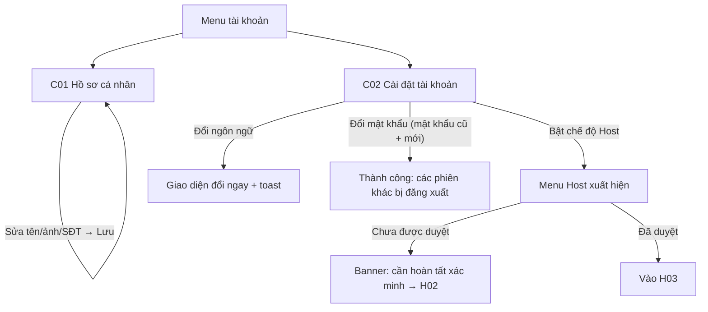

### S02 · Hồ sơ & cài đặt (C01, C02)

```mermaid
flowchart TD
  M["Menu tài khoản"] --> C1["C01 Hồ sơ cá nhân"]
  M --> C2["C02 Cài đặt tài khoản"]
  C1 -->|"Sửa tên/ảnh/SĐT → Lưu"| C1
  C2 -->|"Đổi ngôn ngữ"| L["Giao diện đổi ngay + toast"]
  C2 -->|"Đổi mật khẩu (mật khẩu cũ + mới)"| P["Thành công: các phiên khác bị đăng xuất"]
  C2 -->|"Bật chế độ Host"| H["Menu Host xuất hiện"]
  H -->|"Chưa được duyệt"| H1["Banner: cần hoàn tất xác minh → H02"]
  H -->|"Đã duyệt"| H2["Vào H03"]
```
Nhánh lỗi: mật khẩu cũ sai (inline); mật khẩu mới trùng cũ; ảnh sai định dạng/quá nặng; mất mạng khi lưu.

---

