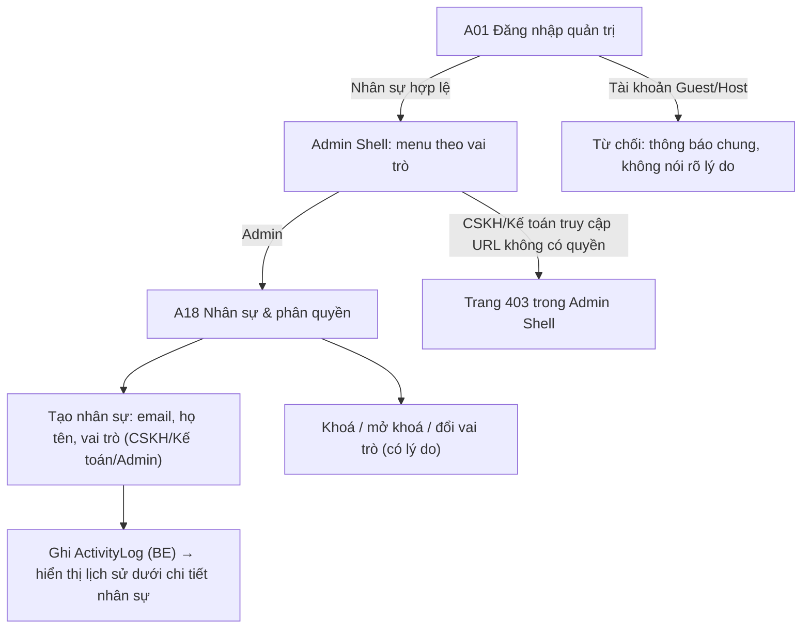

# Đặc Tả Kỹ Thuật Giao Diện · S03-ADMIN-RBAC

> Thư mục này đóng gói toàn bộ: **User Flow**, **Wireframes**, **UX Behavior**, và **Screen Data/API Contract** cho S03.


---

### S03 · Back-office: đăng nhập quản trị & phân quyền (A01, A18)

Điểm quyết định: menu **ẩn** mục không có quyền, nhưng vẫn phải có 403 khi vào thẳng URL (S03 AC: chặn cả UI lẫn API).

---


---


## S03 · Đăng nhập quản trị, nhân sự và phân quyền

### A01 · Đăng nhập quản trị
| Mục | Giá trị |
|---|---|
| Route / Role | `/admin/login` · Admin, CSKH, Kế toán |
| Component | CMP-02, CMP-03, CMP-01, CMP-08; **không** có link Đăng ký/Quên mật khẩu công khai [Assumption: reset do Admin thực hiện] |
| Action | Đăng nhập |
| State | Default · Submitting · Sai thông tin · Tạm khoá · **Không có quyền back-office** (thông báo chung) · Tài khoản bị khoá · Lỗi mạng |
```
🖥/📱 (nền `--bg-canvas`, thẻ trắng giữa trang, logo xám `--gray-900`, không Public Header)
┌─────────────────────────────────┐
│  ◈ Admin Console                 │
│  Email    [__________________]   │
│  Mật khẩu [____________ 👁]      │
│  [         Đăng nhập          ]  │
└─────────────────────────────────┘
```

### A18 · Nhân sự và phân quyền
| Mục | Giá trị |
|---|---|
| Route / Role | `/admin/staff` · **Admin** |
| Component | Admin Shell, CMP-24 DataTable (Họ tên, Email, Vai trò, Trạng thái, Lần đăng nhập cuối), CMP-09 Drawer "Tạo/Sửa nhân sự", CMP-25 ConfirmDialog (lý do), CMP-10, CMP-12, tab "Lịch sử thay đổi" |
| Action | Tạo nhân sự · Đổi vai trò · Khoá/Mở khoá · Xem lịch sử · Tìm/Lọc theo vai trò, trạng thái |
| State | Loading (skeleton bảng) · Default · **Rỗng** (chưa có nhân sự ngoài bạn) · Lọc không kết quả · Drawer: Default/Submitting/Email trùng/Lỗi trường · **Không thể tự khoá/hạ quyền chính mình** (nút disabled + tooltip) · Thành công (toast) · Lỗi mạng · **403** (vai trò khác vào URL) |

🖥 Desktop
```
┌─────────┬────────────────────────────────────────────────────────────────┐
│ Duyệt DT│ Nhân sự và phân quyền                         [ + Tạo nhân sự ]  │
│ Duyệt tin│ [🔍 Tìm tên/email] [Vai trò ▼] [Trạng thái ▼]                    │
│ ▶Nhân sự│ ┌────────────┬─────────────┬─────────┬──────────┬──────────┬───┐│
│         │ │ Họ tên     │ Email       │ Vai trò │ Trạng thái│ Đăng nhập │ ⋮ ││
│         │ ├────────────┼─────────────┼─────────┼──────────┼──────────┼───┤│
│         │ │ Lan CSKH   │ lan@…       │ CSKH    │ ● Hoạt động│ 10 phút   │ ⋮ ││
│         │ │ Minh KT    │ minh@…      │ Kế toán │ ⏸ Đã khoá │ 3 ngày    │ ⋮ ││
│         │ └────────────┴─────────────┴─────────┴──────────┴──────────┴───┘│
│         │ ‹ 1 2 3 ›                                                         │
└─────────┴────────────────────────────────────────────────────────────────┘
Drawer phải 420px "Tạo nhân sự": Họ tên · Email · Vai trò (CSKH/Kế toán/Admin) · [Tạo & gửi lời mời]
```
📱 Mobile: bộ lọc gom vào nút "Lọc"; mỗi nhân sự = thẻ dọc (tên, vai trò badge, trạng thái, ⋮); "Tạo nhân sự" là FAB góc dưới phải; drawer → full-screen.
Tablet: bảng giữ 4 cột (ẩn "Đăng nhập cuối").

---


---


## S03 · Back-office: đăng nhập quản trị và phân quyền

- **A01**: tách giao diện và tên miền con/đường dẫn `/admin`; không có đăng ký/quên mật khẩu công khai; lỗi quyền hiển thị chung ("Tài khoản không có quyền truy cập") – không nói tài khoản có tồn tại hay không.
- **Phiên back-office**: hết hạn do không hoạt động sau 30 phút [A12]; cảnh báo modal ở phút 28 ("Phiên sắp hết hạn – Tiếp tục làm việc") với đếm ngược.
- **Menu theo vai trò** (hằng số, không hard-code từng màn):

| Vai trò | Mục menu giai đoạn 1 |
|---|---|
| Admin | Duyệt hồ sơ danh tính · Duyệt listing · Nhân sự và phân quyền |
| CSKH | (không có mục nào ở giai đoạn 1 – màn hình đích mặc định "Chưa có công việc nào được giao" + 403 khi vào URL khác) |
| Kế toán | như CSKH |

- **A18 – Tạo nhân sự**: drawer gồm Họ tên, Email, Vai trò → "Tạo và gửi lời mời" (BE gửi email đặt mật khẩu tái sử dụng luồng P08 [A12b]). Sau tạo: dòng mới nổi bật 3 s, trạng thái "Chờ kích hoạt".
- **Khoá/mở khoá/đổi vai trò**: luôn mở `ConfirmDialog` có trường **Lý do** (bắt buộc, ≥ 10 ký tự) và hiển thị hậu quả ("Nhân sự sẽ bị đăng xuất ngay"). Kết quả ghi log (người làm, thời gian, giá trị cũ/mới) và hiện ở tab **Lịch sử** của nhân sự.
- **Bảo vệ**: không tự khoá/hạ quyền chính mình; không hạ quyền/khoá Admin cuối cùng → nút disabled + tooltip lý do (BE vẫn kiểm tra).
- Bảng: phân trang phía máy chủ 20 dòng/trang, sắp xếp theo cột, tìm kiếm debounce 300 ms, giữ bộ lọc trong URL.
- **403** hiển thị trong chính Admin Shell (giữ menu), nội dung "Bạn không có quyền xem trang này" + nút Về trang chủ quản trị.

---


---


## S03 · Back-office: đăng nhập quản trị, nhân sự, phân quyền

### A01
| Trường | Ghi chú |
|---|---|
| email, password | Cùng cơ chế phiên cookie; endpoint riêng `POST /admin/auth/login` (từ chối nếu không có `staffRole`) |

### A18 – bảng nhân sự
| Cột / trường | Nguồn | Quy tắc / ghi chú |
|---|---|---|
| fullName, email | User | |
| staffRole | User | `ADMIN｜SUPPORT｜ACCOUNTANT` (hiển thị: Admin, CSKH, Kế toán) |
| status | User | `ACTIVE｜INVITED｜LOCKED` |
| lastLoginAt | User | ISO |
| createdBy / createdAt | ActivityLog | |
| **Tab Lịch sử**: hành động, người làm, thời gian, giá trị cũ→mới, lý do | ActivityLog | BR-ADM-03 |
| Form tạo: fullName, email, staffRole | | Email duy nhất; gửi lời mời [A12b] |
| Dialog khoá/đổi vai trò: reason | | bắt buộc, ≥10 ký tự |

| API | Mục đích |
|---|---|
| `GET /admin/staff?query=&role=&status=&page=` | Danh sách |
| `POST /admin/staff` | Tạo + gửi lời mời |
| `PATCH /admin/staff/:id/role` `{role,reason}` | Đổi vai trò |
| `POST /admin/staff/:id/lock` · `/unlock` `{reason}` | Khoá/mở khoá |
| `GET /admin/staff/:id/activity` | Lịch sử |
| Mã lỗi riêng | `403 FORBIDDEN_ROLE`, `409 LAST_ADMIN`, `409 SELF_ACTION` |

**Ma trận quyền menu (hằng số FE):** Admin = {identity-reviews, listing-reviews, staff}; CSKH, Kế toán = {} ở giai đoạn 1.

---

