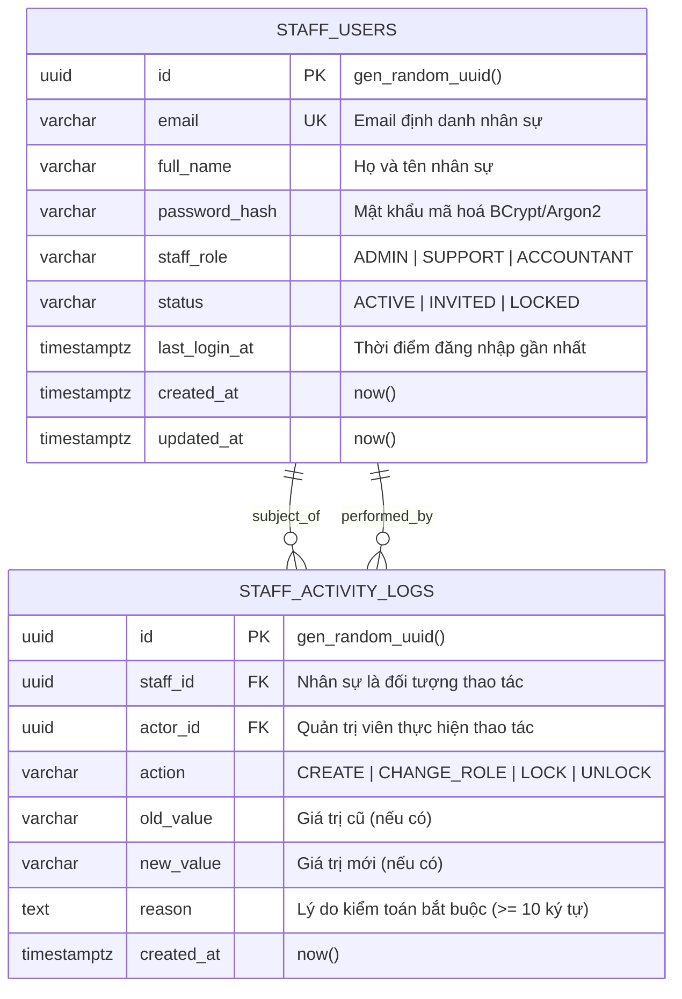

# Thiết Kế Cơ Sở Dữ Liệu · S03 Back-office & Phân Quyền Quản Trị (RBAC)

> **Tệp Hợp Đồng Bàn Giao Kỹ Thuật (FE-to-BE Handover Contract)**  
> Sinh tự động bởi chuẩn quy trình Harness Giai đoạn 1 sau khi hoàn tất UI/Mock Slice FE-S03.

---

## 1. Sơ Đồ Thực Thể Quan Hệ (ER Diagram)



---

## 2. Chi Tiết Lược Đồ Bảng (PostgreSQL DDL)

### 2.1. Bảng `staff_users`
```sql
CREATE TYPE staff_role_enum AS ENUM ('ADMIN', 'SUPPORT', 'ACCOUNTANT');
CREATE TYPE staff_status_enum AS ENUM ('ACTIVE', 'INVITED', 'LOCKED');

CREATE TABLE staff_users (
    id UUID PRIMARY KEY DEFAULT gen_random_uuid(),
    email VARCHAR(255) NOT NULL,
    full_name VARCHAR(100) NOT NULL,
    password_hash VARCHAR(255),
    staff_role staff_role_enum NOT NULL DEFAULT 'SUPPORT',
    status staff_status_enum NOT NULL DEFAULT 'INVITED',
    last_login_at TIMESTAMPTZ,
    created_at TIMESTAMPTZ NOT NULL DEFAULT now(),
    updated_at TIMESTAMPTZ NOT NULL DEFAULT now(),
    CONSTRAINT uq_staff_users_email UNIQUE (email)
);

CREATE INDEX idx_staff_users_role ON staff_users(staff_role);
CREATE INDEX idx_staff_users_status ON staff_users(status);
```

### 2.2. Bảng `staff_activity_logs`
```sql
CREATE TYPE staff_activity_action_enum AS ENUM ('CREATE', 'CHANGE_ROLE', 'LOCK', 'UNLOCK');

CREATE TABLE staff_activity_logs (
    id UUID PRIMARY KEY DEFAULT gen_random_uuid(),
    staff_id UUID NOT NULL REFERENCES staff_users(id) ON DELETE CASCADE,
    actor_id UUID NOT NULL REFERENCES staff_users(id),
    action staff_activity_action_enum NOT NULL,
    old_value VARCHAR(64),
    new_value VARCHAR(64),
    reason TEXT NOT NULL CHECK (char_length(trim(reason)) >= 10),
    created_at TIMESTAMPTZ NOT NULL DEFAULT now()
);

CREATE INDEX idx_staff_activity_staff_id ON staff_activity_logs(staff_id);
CREATE INDEX idx_staff_activity_created_at ON staff_activity_logs(created_at DESC);
```

---

## 3. Ràng Buộc Nghiệp Vụ Cốt Lõi (Invariants & Guardrails)
1. **BR-ADM-01 (Bảo vệ Admin duy nhất)**: Không được phép khoá hoặc hạ quyền người dùng có vai trò `ADMIN` nếu số lượng quản trị viên hoạt động (`ACTIVE`) còn lại $\le 1$ (mã lỗi `409 LAST_ADMIN`).
2. **BR-ADM-02 (Chặn tự thao tác)**: Quản trị viên không được phép tự hạ quyền hoặc tự khoá tài khoản của chính mình (mã lỗi `409 SELF_ACTION`).
3. **BR-ADM-03 (Bắt buộc lý do kiểm toán)**: Mọi thao tác thay đổi vai trò hoặc khoá/mở khoá bắt buộc phải ghi nhận vào `staff_activity_logs` với `reason` có độ dài tối thiểu 10 ký tự.
