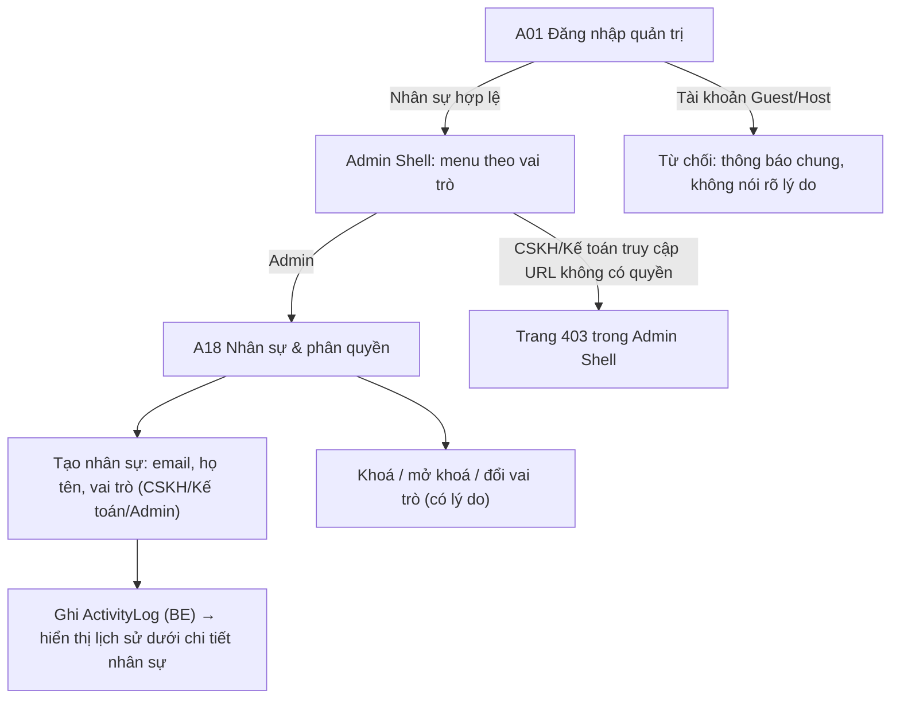

### S03 · Back-office: đăng nhập quản trị & phân quyền (A01, A18)

```mermaid
flowchart TD
  A["A01 Đăng nhập quản trị"] -->|"Nhân sự hợp lệ"| D["Admin Shell: menu theo vai trò"]
  A -->|"Tài khoản Guest/Host"| X["Từ chối: thông báo chung, không nói rõ lý do"]
  D -->|"Admin"| S["A18 Nhân sự & phân quyền"]
  S --> N["Tạo nhân sự: email, họ tên, vai trò (CSKH/Kế toán/Admin)"]
  S --> K["Khoá / mở khoá / đổi vai trò (có lý do)"]
  N --> LG["Ghi ActivityLog (BE) → hiển thị lịch sử dưới chi tiết nhân sự"]
  D -->|"CSKH/Kế toán truy cập URL không có quyền"| F["Trang 403 trong Admin Shell"]
```
Điểm quyết định: menu **ẩn** mục không có quyền, nhưng vẫn phải có 403 khi vào thẳng URL (S03 AC: chặn cả UI lẫn API).

---

