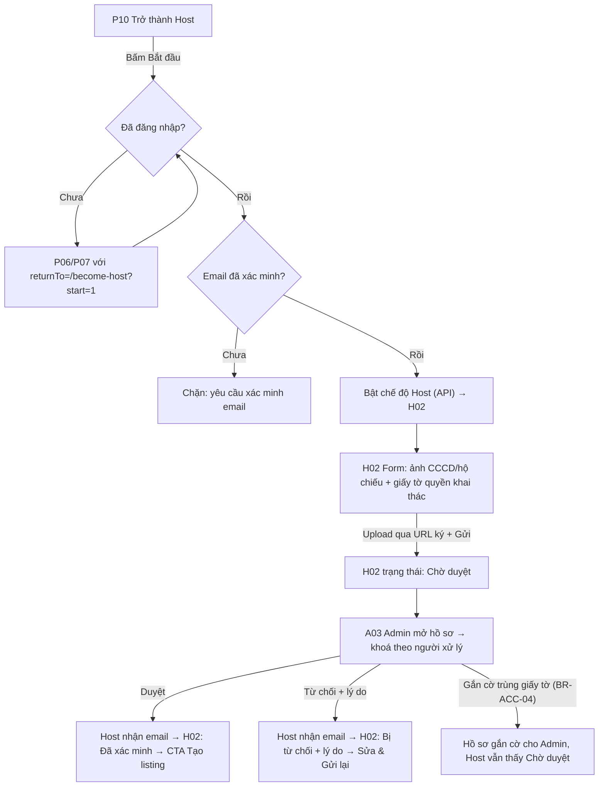
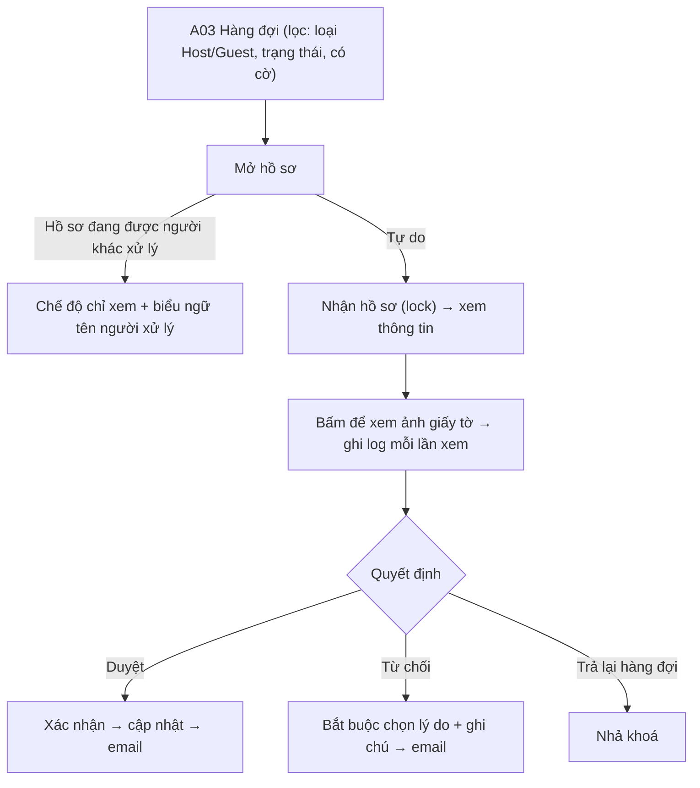

# Đặc Tả Kỹ Thuật Giao Diện · S04-HOST-VERIFICATION

> Thư mục này đóng gói toàn bộ: **User Flow**, **Wireframes**, **UX Behavior**, và **Screen Data/API Contract** cho S04.


---

### S04 · Xác minh Host (P10, H02, C03, A03)

**FL-S04-A · Từ "Trở thành Host" tới được duyệt**

**FL-S04-B · Guest xác minh danh tính (C03)** – cùng form với H02 phần danh tính (không có giấy tờ quyền khai thác), vào từ: (a) menu tài khoản, (b) yêu cầu của hệ thống ở giai đoạn đặt phòng sau này. Sau khi duyệt, Guest quay lại `returnTo`.

**FL-S04-C · Admin duyệt (A03)**


---


---


## S04 · Hồ sơ xác minh Host và Admin duyệt

### P10 · Trở thành Host
| Mục | Giá trị |
|---|---|
| Route / Role | `/become-host` · Khách vãng lai, Guest |
| Component | Hero + CMP-01 CTA, khối lợi ích (3), khối "Cách thức hoạt động" (4 bước: Đăng ký → Xác minh → Đăng tin → Nhận khách), khối **Cần chuẩn bị gì** (CCCD/hộ chiếu, giấy tờ quyền khai thác), FAQ accordion, CMP-08 |
| Action | Bắt đầu (→ FL-S04-A) · Xem Trợ giúp · Quay lại |
| State | **Khách vãng lai** (CTA = "Đăng ký để bắt đầu") · **Guest chưa xác minh email** (CTA bị chặn kèm banner) · **Guest đủ điều kiện** (CTA = "Bắt đầu") · **Đã là Host chưa duyệt** (CTA = "Tiếp tục xác minh") · **Đã duyệt** (CTA = "Tới Listing của tôi") · Đang gọi API (CTA loading) · Lỗi |
```
🖥 Desktop                                           📱 Mobile
┌──────────────────────────────────────────┐   ┌───────────────────────────┐
│ Header                                    │   │ Header                    │
│ ┌──────────────────────┬───────────────┐ │   │ Cho thuê chỗ ở của bạn    │
│ │ Cho thuê chỗ ở của   │      ▢        │ │   │ [  Bắt đầu  ]             │
│ │ bạn trên Homestay    │   hình ảnh    │ │   │ ▢ hình                    │
│ │ [  Bắt đầu  ]        │               │ │   │ Lợi ích ①②③ (dọc)        │
│ └──────────────────────┴───────────────┘ │   │ Cách hoạt động 1-4 (dọc)  │
│ Lợi ích:  ① ② ③                          │   │ Cần chuẩn bị gì (checklist)│
│ Cách hoạt động: 1 → 2 → 3 → 4             │   │ FAQ ▾                     │
│ Cần chuẩn bị: ▢CCCD/hộ chiếu ▢Giấy tờ KT  │   │ [ Bắt đầu ] sticky đáy    │
│ FAQ ▾                                     │   └───────────────────────────┘
└──────────────────────────────────────────┘
```

### H02 · Hồ sơ xác minh Host (và C03 · Xác minh danh tính cho Guest – cùng component)
| Mục | H02 | C03 |
|---|---|---|
| Route / Role | `/host/verification` · Host | `/account/verification` · Guest, Host |
| Phần form | A. Thông tin cá nhân (họ tên theo giấy tờ, ngày sinh, SĐT) · B. Giấy tờ danh tính (loại: CCCD / hộ chiếu; mặt trước, mặt sau; số giấy tờ) · C. Giấy tờ quyền khai thác chỗ ở | Chỉ A + B |
| Component | CMP-13 ×(3–4), CMP-02, CMP-04 (loại giấy tờ), CMP-10, CMP-08, CMP-01, hướng dẫn ảnh đạt chuẩn (checklist: rõ nét, đủ 4 góc, không loá) |
| Action | Chọn/chụp ảnh · Xem trước · Xoá/Thay tệp · Gửi hồ sơ · Lưu nháp · **Sửa & gửi lại** (khi bị từ chối) · Rút hồ sơ* |
| State (cấp màn) | **Chưa nộp** (form trống) · **Đang nhập** (nháp tự lưu) · **Đang tải tệp** (progress từng tệp) · **Gửi** (loading) · **Chờ duyệt** (form khoá, đọc-only, mốc thời gian gửi) · **Đã xác minh** (✓, CTA "Tạo listing") · **Bị từ chối** (khối lý do nổi bật, form mở lại, trường bị nêu tô viền) · **Cần cập nhật** (giấy tờ hết hạn) · **Lỗi tệp** (sai định dạng/quá nặng/ảnh mờ do BE) · **Mất mạng khi tải** (tệp lỗi có nút Thử lại) |
| State (cấp tệp) | Trống · Đang tải x% · Đã tải ✓ · Lỗi ✕ (Thử lại / Xoá) |

🖥 Desktop (H02 – trạng thái "Bị từ chối")
```
┌────────┬────────────────────────────────────────────────────────────────┐
│ Sidebar│ Hồ sơ xác minh Host                    Trạng thái: [✕ Bị từ chối]│
│        │ ┌────────────────────────────────────────────────────────────┐ │
│        │ │ ⚠ Lý do từ chối: Ảnh mặt sau CCCD bị mờ. Vui lòng chụp lại. │ │
│        │ └────────────────────────────────────────────────────────────┘ │
│        │ A. Thông tin cá nhân                                            │
│        │   Họ tên theo giấy tờ [__________]  Ngày sinh [__/__/____]       │
│        │ B. Giấy tờ danh tính   Loại (●CCCD ○Hộ chiếu)  Số [__________]   │
│        │   ┌───────────────┐ ┌───────────────┐                           │
│        │   │ Mặt trước ✓   │ │ Mặt sau ✕ mờ  │ ← viền đỏ                 │
│        │   │ ▢ xem trước   │ │ [Thay tệp]    │                           │
│        │   └───────────────┘ └───────────────┘                           │
│        │ C. Giấy tờ quyền khai thác chỗ ở  ┌──────────────┐ [+ Thêm tệp]  │
│        │                                    │ so_do.pdf ✓  │               │
│        │                                    └──────────────┘               │
│        │ ─────────────────────────────────────────────────────────────── │
│        │ [ Lưu nháp ]                              [ Sửa & gửi lại ]       │
└────────┴────────────────────────────────────────────────────────────────┘
```
📱 Mobile: khối A/B/C xếp dọc, **stepper 3 bước** trên cùng (A › B › C); mỗi ô tệp rộng full-width với nút **"Chụp ảnh"** và **"Chọn từ thư viện"**; thanh nút sticky đáy. Tablet: 2 cột cho cặp ảnh mặt trước/sau.
Màn "Chờ duyệt": thay form bằng thẻ tóm tắt + dòng thời gian (Đã gửi → Đang xem xét → Kết quả) + danh sách tệp đã nộp (chỉ tên, không xem ảnh lại nếu không cần).

### A03 · Duyệt hồ sơ danh tính (Host và Guest)
| Mục | Giá trị |
|---|---|
| Route / Role | `/admin/identity-reviews` (danh sách), `/admin/identity-reviews/:id` (chi tiết) · **Admin** |
| Component | CMP-24 DataTable (Người nộp, Loại Host/Guest, Ngày gửi, Trạng thái, Cờ ⚑, Người đang xử lý), bộ lọc, CMP-31 LockBanner, CMP-30 SecureImageViewer, panel thông tin, CMP-25 ConfirmDialog (Duyệt / Từ chối + lý do), CMP-10, khối "Cờ rủi ro" (trùng giấy tờ → link tới tài khoản kia) |
| Action | Mở hồ sơ (nhận khoá) · Bấm để xem ảnh (ghi log) · Duyệt · Từ chối (chọn lý do + ghi chú) · Trả lại hàng đợi (nhả khoá) · Lọc/Tìm |
| State (danh sách) | Loading · Default · Rỗng ("Không còn hồ sơ chờ") · Lọc không kết quả · Lỗi |
| State (chi tiết) | **Đang tải** · **Tự do** (nhận khoá thành công) · **Bị khoá bởi người khác** (chỉ xem, nút quyết định disabled) · **Mất khoá** (hết hạn/ bị tiếp quản → banner + chuyển chỉ xem) · **Ảnh che mờ / đã hiển thị / URL hết hạn (bấm xem lại → ghi log lần nữa)** · **Gắn cờ trùng** · **Đã xử lý** (hồ sơ đã được người khác duyệt → chỉ xem) · **Đang gửi quyết định** · Lỗi 409 |

🖥 Desktop – chi tiết (chia 2 cột)
```
┌─────────┬────────────────────────────────────────────────────────────────────────┐
│ ▶Duyệt DT│ ← Hồ sơ #1042  Host   ⏳ Chờ duyệt                [ Trả lại hàng đợi ] │
│ Duyệt tin│ ⚑ Giấy tờ trùng với tài khoản Host khác: nguyen.b@…  [Xem tài khoản]    │
│ Nhân sự │ ┌──────────────────────────┐ ┌─────────────────────────────────────┐ │
│         │ │ ẢNH GIẤY TỜ              │ │ THÔNG TIN                           │ │
│         │ │ ┌──────────────────────┐ │ │ Họ tên theo giấy tờ: Nguyễn Văn A    │ │
│         │ │ │ ░░░ che mờ ░░░       │ │ │ Số giấy tờ: 0791********             │ │
│         │ │ │ [👁 Bấm để xem]      │ │ │ Ngày sinh / SĐT / Email tài khoản    │ │
│         │ │ │ watermark: Admin·giờ │ │ │ Giấy tờ quyền khai thác: [tệp.pdf]   │ │
│         │ │ └──────────────────────┘ │ │ Lịch sử: gửi lần 1 (từ chối), lần 2  │ │
│         │ │ Mặt trước | Mặt sau | KT │ │                                     │ │
│         │ └──────────────────────────┘ └─────────────────────────────────────┘ │
│         │ ──────────────────────────────────────────────────────────────────── │
│         │ [ Từ chối… ]                                          [ Duyệt hồ sơ ]  │
└─────────┴────────────────────────────────────────────────────────────────────────┘
Dialog "Từ chối": Lý do (▼ danh mục bắt buộc) + Ghi chú gửi Host (bắt buộc) + [Xác nhận từ chối]
```
📱 Mobile/Tablet: danh sách = thẻ; chi tiết = 1 cột: LockBanner → cờ → tab [Ảnh | Thông tin | Lịch sử] → thanh quyết định sticky đáy [Từ chối][Duyệt]. Ảnh giấy tờ mở toàn màn hình, cho phóng to.

---


---


## S04 · Xác minh Host và Admin duyệt

**P10 – logic CTA**
| Trạng thái người dùng | CTA | Hành vi |
|---|---|---|
| Chưa đăng nhập | "Đăng ký để bắt đầu" | → P07 với `returnTo=/become-host?start=1` |
| Đã đăng nhập, chưa xác minh email | "Bắt đầu" (disabled) + banner | Banner: "Xác minh email trước" + Gửi lại |
| Đủ điều kiện | "Bắt đầu" | Gọi bật chế độ Host → H02 |
| Là Host, hồ sơ chưa nộp/bị từ chối/chờ duyệt | "Tiếp tục xác minh" | → H02 |
| Host đã duyệt | "Tới Listing của tôi" | → H03 |

**H02 / C03 – form & tải tệp**
- Tệp: JPG/PNG/PDF (giấy tờ danh tính chỉ ảnh), ≤ 10 MB/tệp, tối đa 2 tệp danh tính (trước/sau) và 5 tệp quyền khai thác [A5]. Kiểm tra loại/kích thước phía FE trước khi tải.
- **Tải trực tiếp lên kho riêng bằng URL ký** ngay khi chọn tệp (tối đa 3 tệp song song); mỗi ô hiển thị progress %, nút Huỷ, Thử lại khi lỗi; xem trước bằng `URL.createObjectURL` (huỷ khi rời trang).
- Nút **Gửi hồ sơ** bật khi: thông tin bắt buộc hợp lệ + mọi tệp bắt buộc **đã tải xong**. Trước khi gửi: ConfirmDialog "Sau khi gửi, bạn không thể sửa hồ sơ cho tới khi có kết quả".
- Thông tin văn bản tự lưu nháp (30 s); **tệp chưa gửi được lưu giữ** khi quay lại (hiển thị tên tệp + "Đã tải").
- Sau khi gửi: form chuyển sang chế độ chỉ đọc; **số giấy tờ che (giữ 4 số cuối)**; **không hiển thị lại ảnh giấy tờ** (chỉ tên tệp, trạng thái ✓) – ảnh nhạy cảm không cache (`Cache-Control: no-store`).
- **Bị từ chối**: khối lý do ở đầu trang; trường/tệp bị nêu có viền đỏ; chỉ cần thay mục bị nêu; nút "Sửa & gửi lại". **Đã xác minh**: CTA "Tạo listing". **Cần cập nhật** (giấy tờ hết hạn): banner cam, mở lại form.
- Người dùng đang mở H02 ở trạng thái Chờ duyệt: tự refetch khi quay lại tab và mỗi 60 s khi tab đang hiển thị; khi chuyển Đã xác minh → toast + CTA.
- Giấy tờ trùng tài khoản Host khác (BR-ACC-04): **không tiết lộ cho Host** thông tin về tài khoản kia; Host chỉ thấy "Đang chờ duyệt".

**A03 – hành vi duyệt**
| Chủ đề | Hành vi |
|---|---|
| Hàng đợi | Mặc định sắp **cũ nhất trước**; cột "Chờ" hiển thị thời gian đã chờ ("3 giờ"); lọc theo loại (Host/Guest), trạng thái, cờ ⚑, "Của tôi"; bấm hàng → mở chi tiết |
| Khoá bản ghi (soft lock) | Mở chi tiết → gọi nhận khoá. **Heartbeat 60 s**; khoá hết hạn sau 5 phút không heartbeat [A13]; nhả khi đóng, sau quyết định, hoặc "Trả lại hàng đợi". Người thứ hai mở → LockBanner "Đang được {tên} xử lý từ {giờ}" + chế độ chỉ xem, nút quyết định disabled |
| Mất khoá giữa chừng | Banner đỏ "Hồ sơ đã được người khác tiếp nhận" → mọi nút quyết định disabled; nút "Nhận lại" nếu khoá còn tự do |
| Xem ảnh giấy tờ | Mặc định **che mờ**; bấm "Bấm để xem" → gọi API ghi log (**mỗi lần xem = 1 log**: ai, khi nào, bản ghi nào, BR-ACC-05) → nhận URL ký hết hạn ngắn (120 s [A13b]) → hiển thị kèm **watermark** (tên Admin + giờ). Hết hạn/ chuyển tab >60 s → tự che lại; xem lại = log lần nữa. Chặn menu chuột phải/kéo ảnh (chỉ mang tính răn đe, ghi chú trong dev docs) |
| Quyết định | **Duyệt**: ConfirmDialog nhẹ; với hồ sơ có cờ ⚑ cần tick "Tôi đã kiểm tra cảnh báo trùng giấy tờ" trước khi bật nút. **Từ chối**: bắt buộc chọn lý do (danh mục: Ảnh mờ · Giấy tờ hết hạn · Thông tin không khớp · Giấy tờ không hợp lệ · Khác) + ghi chú gửi Host (≥ 10 ký tự) |
| Sau quyết định | Toast "Đã duyệt hồ sơ #1042 · Email đã gửi cho Host" → tự mở hồ sơ kế tiếp (bật/tắt bằng tuỳ chọn "Tự mở hồ sơ kế tiếp") |
| Xung đột | 409 "Hồ sơ đã được xử lý" → chuyển chỉ xem + hiển thị kết quả |
| Dùng lại cho Guest (C03) | Hàng đợi chung; cột Loại phân biệt; chi tiết ẩn mục "Giấy tờ quyền khai thác" khi là Guest |

---


---


## S04 · Xác minh Host và Admin duyệt

### P10
| Dữ liệu | Nguồn | Ghi chú |
|---|---|---|
| Nội dung tĩnh (lợi ích, bước, FAQ) | i18n | Không lấy từ API |
| Trạng thái CTA: `anonymous｜emailUnverified｜eligible｜hostPending｜hostRejected｜hostApproved` | `GET /me` | Quyết định nhãn/đích nút |

### H02 / C03 – hồ sơ xác minh
| Trường | Kiểu | Nguồn | Bắt buộc | Quy tắc | Hiển thị cho |
|---|---|---|---|---|---|
| legalName | text | IdentityVerification | ✓ | 2–100, theo giấy tờ | Chủ sở hữu, Admin |
| dateOfBirth | date | IdentityVerification | ✓ | ≥18 tuổi [Assumption] | Chủ sở hữu, Admin |
| idType | `CCCD｜PASSPORT` | IdentityVerification | ✓ | | Chủ sở hữu, Admin |
| idNumber | text | IdentityVerification | ✓ | Theo loại; **che 4 số cuối sau khi gửi** (UI) | Chủ sở hữu (che), Admin (đủ, có log) |
| idFront / idBack (Passport: 1 ảnh) | Attachment | ID_FRONT/ID_BACK | ✓ | JPG/PNG/PDF ≤10MB [A5] | Chỉ Admin (qua API log). Chủ sở hữu chỉ thấy tên tệp |
| operatingRightDocs[] | Attachment (≤5) | OPERATING_RIGHT | ✓ chỉ H02 | | Admin |
| status | enum 0.5 | IdentityVerification | – | | Chủ sở hữu |
| submittedAt / decidedAt | ISO | | – | | Chủ sở hữu |
| rejectionReason | `{category, note}` | IdentityVerification | – | chỉ khi REJECTED | Chủ sở hữu |
| flaggedDuplicate | boolean | ActivityLog (cờ rủi ro) | – | **Chỉ Admin** | Admin |

### A03 – Admin duyệt
**Danh sách:** id, applicantName, applicantType (`HOST｜GUEST`), submittedAt, waitingFor (tính từ submittedAt), status, flag ⚑, lockedBy.
**Chi tiết:** toàn bộ trường H02 (đầy đủ) + `history[]` (các lần gửi, kết quả) + `duplicateOf` (link tài khoản trùng) + danh sách tệp (`id, purpose, fileName`, **không** URL).
**Quyết định:** `{ decision: 'APPROVE｜REJECT', reasonCategory?, note?, acknowledgedFlag? }`.

| API | Mục đích |
|---|---|
| `GET /host/verification` · `PUT /host/verification` (nháp) · `POST /host/verification/submit` | H02 |
| `GET /me/verification` · `PUT` · `POST …/submit` | C03 |
| `GET /admin/identity-reviews?type=&status=&flag=&mine=&page=` | Hàng đợi |
| `POST /admin/identity-reviews/:id/lock` (+ heartbeat/release) | Khoá |
| `POST /admin/identity-reviews/:id/documents/:attId/view` | **Ghi log + trả `signedUrl` (sống ~120 s)** |
| `POST /admin/identity-reviews/:id/decision` | Duyệt/từ chối (ghi ActivityLog, gửi email) |

**Danh mục lý do từ chối (seed):** `BLURRY`, `EXPIRED_DOC`, `MISMATCH`, `INVALID_DOC`, `OTHER`.

---

