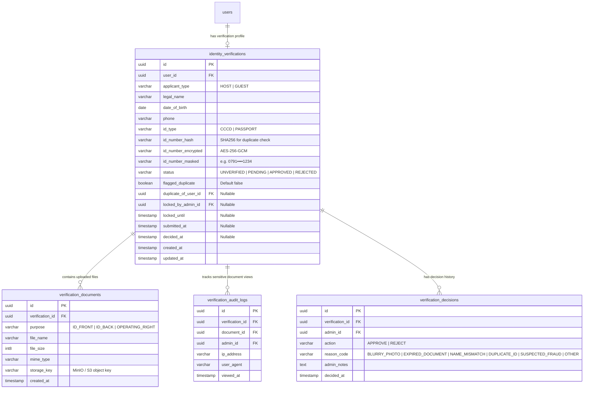

# Thiết kế Cơ sở Dữ liệu: Slice FE-S04 (Xác minh danh tính Host & Duyệt Admin)

> **Mục tiêu**: Lưu trữ hồ sơ định danh công dân (CCCD / Hộ chiếu), giấy tờ quyền khai thác homestay, cơ chế Soft-lock phân luồng duyệt, và Nhật ký kiểm toán bảo mật (BR-ACC-05, audit log truy cập tài liệu nhạy cảm).

---

## 1. Sơ đồ Thực thể quan hệ (ERD)



---

## 2. Đặc tả Bảng & Cột Chi tiết

### Bảng 1: `identity_verifications`

| Tên Cột | Kiểu Dữ Liệu | Ràng Buộc | Ý Nghĩa / Ghi Chú Nghiệp Vụ |
|---|---|---|---|
| `id` | `UUID` | `PRIMARY KEY DEFAULT gen_random_uuid()` | Định danh duy nhất hồ sơ xác minh |
| `user_id` | `UUID` | `NOT NULL UNIQUE REFERENCES users(id)` | Mỗi tài khoản chỉ có 1 hồ sơ xác minh chính |
| `applicant_type` | `VARCHAR(20)` | `NOT NULL` | `'HOST'` hoặc `'GUEST'` |
| `legal_name` | `VARCHAR(120)` | `NOT NULL` | Họ tên pháp lý theo giấy tờ tuỳ thân (2 - 100 ký tự) |
| `date_of_birth` | `DATE` | `NOT NULL` | Ngày sinh; Bắt buộc đủ $\ge 18$ tuổi |
| `phone` | `VARCHAR(20)` | `NOT NULL` | Số điện thoại liên lạc chính thức |
| `id_type` | `VARCHAR(20)` | `NOT NULL` | `'CCCD'` (12 số) hoặc `'PASSPORT'` (1 chữ cái + 7 số) |
| `id_number_hash` | `VARCHAR(64)` | `NOT NULL` | Hash SHA-256 của số định danh dùng để tra cứu cờ trùng (`flagged_duplicate`) mà không giải mã |
| `id_number_encrypted` | `TEXT` | `NOT NULL` | Mã hoá bảo mật bằng khoá nội bộ KMS (AES-256-GCM) |
| `id_number_masked` | `VARCHAR(30)` | `NOT NULL` | Chuỗi che mờ 4 số giữa hiển thị an toàn cho Frontend (ví dụ `0791••••1234`) |
| `status` | `VARCHAR(20)` | `NOT NULL DEFAULT 'UNVERIFIED'` | `'UNVERIFIED'`, `'PENDING'`, `'APPROVED'`, `'REJECTED'` |
| `flagged_duplicate` | `BOOLEAN` | `NOT NULL DEFAULT FALSE` | Cờ cảnh báo nội bộ: số giấy tờ đã tồn tại ở tài khoản khác |
| `duplicate_of_user_id`| `UUID` | `NULL REFERENCES users(id)` | Khóa ngoại chỉ tới tài khoản nghi vấn trùng số giấy tờ |
| `locked_by_admin_id` | `UUID` | `NULL REFERENCES users(id)` | Soft lock: Admin đang thụ lý duyệt hồ sơ |
| `locked_until` | `TIMESTAMP WITH TIME ZONE` | `NULL` | Thời điểm hết hạn khoá soft lock (mặc định 5 phút) |
| `submitted_at` | `TIMESTAMP WITH TIME ZONE` | `NULL` | Thời điểm người dùng nhấn Gửi xét duyệt |
| `decided_at` | `TIMESTAMP WITH TIME ZONE` | `NULL` | Thời điểm Admin đưa ra quyết định Phê duyệt / Từ chối |
| `created_at` | `TIMESTAMP WITH TIME ZONE` | `NOT NULL DEFAULT now()` | |
| `updated_at` | `TIMESTAMP WITH TIME ZONE` | `NOT NULL DEFAULT now()` | |

---

### Bảng 2: `verification_documents`

| Tên Cột | Kiểu Dữ Liệu | Ràng Buộc | Ý Nghĩa / Ghi Chú |
|---|---|---|---|
| `id` | `UUID` | `PRIMARY KEY DEFAULT gen_random_uuid()` | Mã tài liệu định danh |
| `verification_id` | `UUID` | `NOT NULL REFERENCES identity_verifications(id) ON DELETE CASCADE` | |
| `purpose` | `VARCHAR(30)` | `NOT NULL` | `'ID_FRONT'`, `'ID_BACK'`, `'OPERATING_RIGHT'` |
| `file_name` | `VARCHAR(255)` | `NOT NULL` | Tên tệp gốc do người dùng tải lên |
| `file_size` | `BIGINT` | `NOT NULL` | Kích thước tính theo byte (Tối đa 10MB) |
| `mime_type` | `VARCHAR(100)` | `NOT NULL` | `image/jpeg`, `image/png`, `image/webp`, `application/pdf` |
| `storage_key` | `VARCHAR(500)` | `NOT NULL UNIQUE` | Khóa đối tượng trong MinIO / Private S3 bucket |
| `created_at` | `TIMESTAMP WITH TIME ZONE` | `NOT NULL DEFAULT now()` | |

---

### Bảng 3: `verification_decisions`

| Tên Cột | Kiểu Dữ Liệu | Ràng Buộc | Ý Nghĩa / Ghi Chú |
|---|---|---|---|
| `id` | `UUID` | `PRIMARY KEY DEFAULT gen_random_uuid()` | |
| `verification_id` | `UUID` | `NOT NULL REFERENCES identity_verifications(id)` | |
| `admin_id` | `UUID` | `NOT NULL REFERENCES users(id)` | Quản trị viên đưa ra quyết định |
| `action` | `VARCHAR(20)` | `NOT NULL` | `'APPROVE'` hoặc `'REJECT'` |
| `reason_code` | `VARCHAR(50)` | `NULL` | Mã lý do từ chối chuẩn hoá (`BLURRY_PHOTO`, v.v.) |
| `admin_notes` | `TEXT` | `NULL` | Ghi chú chi tiết cho đương đơn |
| `decided_at` | `TIMESTAMP WITH TIME ZONE` | `NOT NULL DEFAULT now()` | |

---

### Bảng 4: `verification_audit_logs` (Bắt buộc theo BR-ACC-05)

| Tên Cột | Kiểu Dữ Liệu | Ràng Buộc | Ý Nghĩa / Ghi Chú |
|---|---|---|---|
| `id` | `UUID` | `PRIMARY KEY DEFAULT gen_random_uuid()` | |
| `verification_id` | `UUID` | `NOT NULL REFERENCES identity_verifications(id)` | |
| `document_id` | `UUID` | `NOT NULL REFERENCES verification_documents(id)` | |
| `admin_id` | `UUID` | `NOT NULL REFERENCES users(id)` | Admin đã yêu cầu mở xem ảnh giải mã |
| `ip_address` | `VARCHAR(45)` | `NULL` | Địa chỉ IP truy cập |
| `user_agent` | `TEXT` | `NULL` | Trình duyệt & thiết bị sử dụng |
| `viewed_at` | `TIMESTAMP WITH TIME ZONE` | `NOT NULL DEFAULT now()` | Ghi nhận thời điểm cấp signed URL 120s |

---

## 3. Chỉ mục (Indexes) & Hiệu năng

```sql
-- 1. Index tra cứu nhanh cờ trùng số giấy tờ (duplicate detection)
CREATE INDEX idx_identity_verif_id_hash ON identity_verifications(id_number_hash);

-- 2. Index lọc danh sách hàng đợi duyệt của Admin theo trạng thái & vai trò
CREATE INDEX idx_identity_verif_queue ON identity_verifications(status, applicant_type, submitted_at DESC);

-- 3. Index kiểm tra soft lock hết hạn
CREATE INDEX idx_identity_verif_locks ON identity_verifications(locked_by_admin_id, locked_until) WHERE locked_by_admin_id IS NOT NULL;

-- 4. Index tài liệu theo hồ sơ xác minh
CREATE INDEX idx_verif_docs_verif_id ON verification_documents(verification_id, purpose);

-- 5. Index kiểm toán tra cứu truy cập tài liệu nhạy cảm
CREATE INDEX idx_verif_audit_logs ON verification_audit_logs(verification_id, document_id, viewed_at DESC);
```

---

## 4. Bất biến Nghiệp vụ & Ràng buộc toàn vẹn

1. **Tuổi tối thiểu 18 tuổi**: `CHECK (date_of_birth <= CURRENT_DATE - INTERVAL '18 years')`.
2. **Soft Lock Concurrency**: Khi Admin mở hồ sơ, gọi UPDATE với điều kiện `locked_until IS NULL OR locked_until < now() OR locked_by_admin_id = :currentAdminId`. Thời gian lock tối đa 5 phút.
3. **Cờ trùng lặp (BR-ACC-05)**: Khi nộp hồ sơ, hệ thống tự động kiểm tra `SELECT id, user_id FROM identity_verifications WHERE id_number_hash = :hash AND user_id != :currentUserId AND status IN ('PENDING', 'APPROVED')`. Nếu tìm thấy, đánh dấu `flagged_duplicate = true` và gán `duplicate_of_user_id`. Cờ này tuyệt đối không trả về cho Frontend phía đương đơn.
