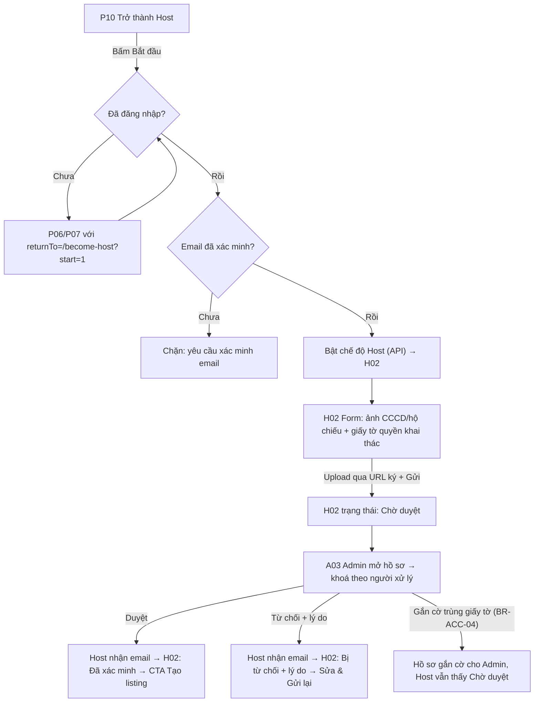
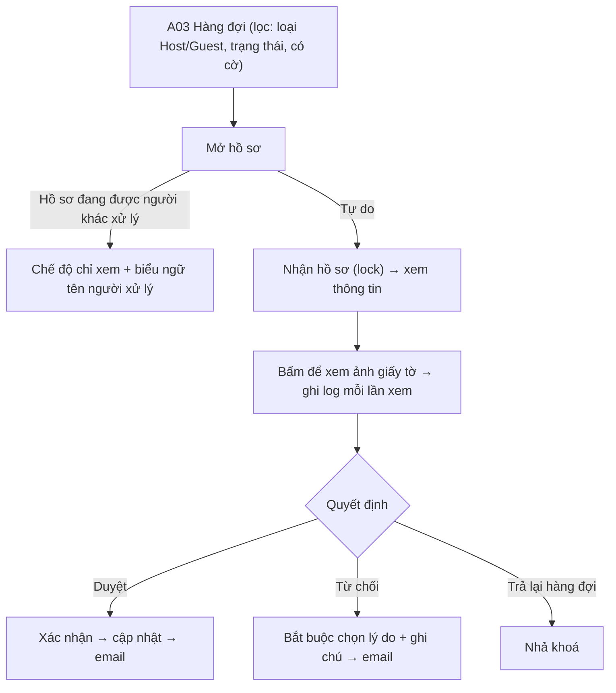

### S04 · Xác minh Host (P10, H02, C03, A03)

**FL-S04-A · Từ "Trở thành Host" tới được duyệt**

**FL-S04-B · Guest xác minh danh tính (C03)** – cùng form với H02 phần danh tính (không có giấy tờ quyền khai thác), vào từ: (a) menu tài khoản, (b) yêu cầu của hệ thống ở giai đoạn đặt phòng sau này. Sau khi duyệt, Guest quay lại `returnTo`.

**FL-S04-C · Admin duyệt (A03)**

---

