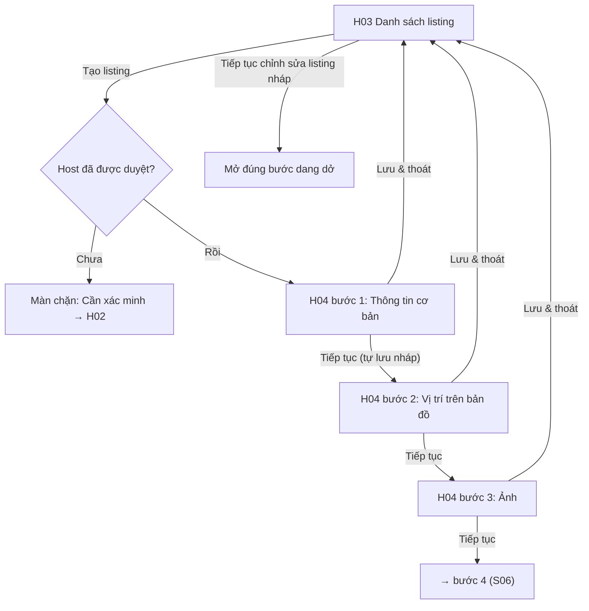

# Đặc Tả Kỹ Thuật Giao Diện · S05-LISTING-DRAFT

> Thư mục này đóng gói toàn bộ: **User Flow**, **Wireframes**, **UX Behavior**, và **Screen Data/API Contract** cho S05.


---

### S05 · Tạo listing nháp: cơ bản, vị trí, ảnh (H03, H04 bước 1–3)

Nhánh phụ: không có token Mapbox → nhập toạ độ thủ công (S05 ghi chú); đóng trình duyệt giữa chừng → mở lại thấy đủ dữ liệu các bước đã nhập; chuyển bước bằng thanh tiến độ (chỉ cho nhảy tới bước đã hoàn thành hoặc bước kế tiếp).

---


---


## S05 · Host tạo listing nháp: thông tin cơ bản, vị trí, ảnh

### H03 · Danh sách listing
| Mục | Giá trị |
|---|---|
| Route / Role | `/host/listings` · Host (cả chưa duyệt – xem được nhưng không tạo được) |
| Component | Host Shell, banner trạng thái xác minh (CMP-08), CMP-19 biến thể "ListingRowHost" (ảnh bìa, tên, khu vực, CMP-10 trạng thái, tiến độ nháp "5/8 bước", ngày cập nhật), menu ⋮, CMP-01 "Tạo listing", bộ lọc trạng thái, CMP-12, CMP-11 |
| Action | Tạo listing · Tiếp tục chỉnh sửa (nháp) · Sửa · Xem trạng thái duyệt (→H05) · Xem trước công khai · 🔒 Lịch (→H06, hiện từ khi Đang hiển thị/Tạm ẩn) · 🔒 Giá theo mùa (→H08) · Tạm ẩn/Hiện* · Xoá nháp (có xác nhận)* |
| State | **Loading** · **Default** · **Rỗng, chưa xác minh** (EmptyState: "Hoàn tất xác minh để tạo listing" → H02) · **Rỗng, đã xác minh** ("Tạo listing đầu tiên") · **Lọc không kết quả** · **Host chưa xác minh** (nút Tạo bị disabled + tooltip; danh sách nháp cũ nếu có vẫn xem) · **Lỗi tải** (Thử lại) · **Đang xoá nháp** |
\* Ngoài danh sách nghiệm thu S05–S08; để trong menu nhưng bật khi có slice tương ứng.

🖥 Desktop
```
┌────────┬──────────────────────────────────────────────────────────────────────┐
│ Sidebar│ Listing của tôi                                  [ + Tạo listing ]    │
│ ▶Listing│ [⚠ Hồ sơ xác minh đang chờ duyệt – bạn chưa thể tạo listing  Xem →]   │
│ Xác minh│ Lọc: [Tất cả ▼]                                                       │
│        │ ┌──────────────────────────────────────────────────────────────────┐ │
│        │ │ ▢  Nhà trên đồi Đà Lạt          [● Đang hiển thị]            ⋮  │ │
│        │ │    Đà Lạt · Nguyên căn · 4 khách    Cập nhật 2 ngày trước        │ │
│        │ │    [Xem trạng thái] [Sửa] [Lịch] [Giá]                           │ │
│        │ ├──────────────────────────────────────────────────────────────────┤ │
│        │ │ ▢  (chưa có tên)                 [Nháp · 5/8 bước]           ⋮  │ │
│        │ │    ▓▓▓▓▓░░░                      [ Tiếp tục chỉnh sửa ]          │ │
│        │ └──────────────────────────────────────────────────────────────────┘ │
└────────┴──────────────────────────────────────────────────────────────────────┘
```
📱 Mobile: mỗi listing là thẻ dọc (ảnh trên, thông tin dưới), hành động chính 1 nút full-width + ⋮ cho phần còn lại; "Tạo listing" = FAB. Tablet: lưới 2 cột.

### H04 · Tạo/sửa listing (wizard 8 bước) – khung chung cho S05, S06, S07
| Mục | Giá trị |
|---|---|
| Route / Role | `/host/listings/:id/edit/:step` · Host đã được duyệt |
| Bước | 1 Thông tin cơ bản · 2 Vị trí · 3 Ảnh *(S05)* · 4 Tiện nghi · 5 Quy tắc lưu trú · 6 Giá & phí *(S06)* · 7 Chính sách huỷ & kiểu đặt · 8 Giấy tờ pháp lý & Rà soát gửi duyệt *(S07)* |
| Component chung | CMP-15 WizardNav, CMP-32 SaveIndicator, CMP-01 (Quay lại / Lưu & thoát / Tiếp tục), CMP-08 (lỗi cấp bước), CMP-25 (thoát khi có thay đổi chưa lưu) |
| State cấp wizard | **Loading nháp** · **Default** · **Dirty** (chưa lưu) · **Đang lưu** · **Đã lưu** · **Lưu thất bại** (giữ dữ liệu cục bộ + Thử lại) · **Phiên hết hạn** (modal đăng nhập lại, không mất dữ liệu) · **Listing không tồn tại/không phải của bạn** (404) · **Listing đã Chờ duyệt** (form chuyển sang chỉ đọc kèm banner) · **Listing Cần chỉnh sửa/Bị từ chối** (hiện khối lý do ở đầu, trường liên quan được đánh dấu) |
| State cấp bước (WizardNav) | ○ Chưa làm · ◐ Đang làm · ✓ Hoàn thành · ⚠ Có lỗi/thiếu (khi gửi duyệt) · 🔒 Chưa mở (phải hoàn thành bước trước) |

🖥 Desktop – khung chung
```
┌────────┬────────────────────────────────────────────────────────────────────────┐
│ Sidebar│ ← Listing của tôi                 Đã lưu 10:42        [ Lưu & thoát ]    │
│ (thu gọn)│ ┌──────────────┐ ┌─────────────────────────────────────┐ ┌───────────┐ │
│        │ │ WizardNav    │ │ NỘI DUNG BƯỚC (tối đa 640px)         │ │ Gợi ý /   │ │
│        │ │ ✓ 1 Cơ bản   │ │                                      │ │ Xem trước │ │
│        │ │ ✓ 2 Vị trí   │ │  …form…                              │ │ (tuỳ bước)│ │
│        │ │ ◐ 3 Ảnh      │ │                                      │ │ ⓘ mẹo     │ │
│        │ │ ○ 4 Tiện nghi│ │                                      │ │           │ │
│        │ │ ○ 5 Quy tắc  │ │ ────────────────────────────────     │ │           │ │
│        │ │ ○ 6 Giá      │ │ [ ← Quay lại ]        [ Tiếp tục → ] │ │           │ │
│        │ │ ○ 7 Chính sách│ └─────────────────────────────────────┘ └───────────┘ │
│        │ │ ○ 8 Gửi duyệt│                                                         │
│        │ └──────────────┘                                                         │
└────────┴────────────────────────────────────────────────────────────────────────┘
```
📱 Mobile – khung chung
```
┌──────────────────────────────┐
│ ←   Tạo listing   [Lưu & thoát]│
│ Bước 3/8 · Ảnh   ▓▓▓░░░░░    │ ← thanh tiến độ, bấm để mở danh sách bước (bottom sheet)
│ Đã lưu 10:42                  │
├──────────────────────────────┤
│  NỘI DUNG BƯỚC (1 cột)        │
│  (gợi ý ⓘ thu thành dòng gập) │
├──────────────────────────────┤
│ [ ← Quay lại ] [ Tiếp tục → ] │ ← sticky đáy
└──────────────────────────────┘
```
Tablet: WizardNav thu thành thanh ngang trên cùng, bỏ cột gợi ý (chuyển thành khối gập).

#### Bước 1 · Thông tin cơ bản
Component: CMP-05 Radio thẻ (Nguyên căn / Phòng riêng), CMP-02 (Tên listing, Mô tả), CMP-06 ×4 (Số khách tối đa, Phòng ngủ, Giường, Phòng tắm), CMP-04 (Giờ nhận phòng, Giờ trả phòng), CMP-04 (Tiền tệ listing – mặc định VND).
Action: Tiếp tục (validate + lưu nháp) · Lưu & thoát.
State: Default · Lỗi trường (thiếu tên, mô tả < số ký tự tối thiểu, số khách < 1) · Đang lưu · Đã lưu · Lưu thất bại.
```
🖥 / 📱 (1 cột; desktop có thêm cột gợi ý bên phải)
 Loại hình *       [ ◉ Nguyên căn ] [ ○ Phòng riêng ]
 Tên listing *     [____________________________]  0/80
 Mô tả *           [____________________________]  0/2000
                   [____________________________]
 Số khách tối đa   [−] 4 [+]     Phòng ngủ [−] 2 [+]
 Giường            [−] 3 [+]     Phòng tắm [−] 1 [+]
 Giờ nhận phòng    [14:00 ▼]     Giờ trả phòng [12:00 ▼]
 Tiền tệ listing   [VND ▼]  ⓘ không đổi được sau khi có booking
```

#### Bước 2 · Vị trí trên bản đồ
Component: CMP-21 MapPanel (marker kéo được, tìm địa chỉ), CMP-04 Khu vực (Location seed: Tỉnh/Thành → Khu vực), CMP-02 Địa chỉ chính xác (riêng tư), CMP-02 Toạ độ thủ công (Vĩ độ/Kinh độ – khi thiếu token), vòng tròn "vùng hiển thị công khai", CMP-08 giải thích riêng tư.
Action: Tìm địa chỉ · Kéo ghim · Dùng vị trí hiện tại* · Nhập toạ độ tay · Tiếp tục.
State: **Map loading** · **Default** · **Địa chỉ không tìm thấy** · **Ghim ngoài khu vực đã chọn** (cảnh báo) · **Không có token / Mapbox lỗi** (ẩn bản đồ, hiện form toạ độ + banner) · **Lỗi trường** · Đang lưu/Đã lưu.
```
🖥 Desktop (form trái – bản đồ phải)                📱 Mobile (bản đồ trên 240px, form dưới)
┌───────────────────────┬────────────────────────┐   ┌──────────────────────────┐
│ Khu vực * [Lâm Đồng ▼] │ ┌────────────────────┐ │   │ ┌──────────────────────┐ │
│          [Đà Lạt ▼]    │ │  🔍 tìm địa chỉ    │ │   │ │ 🔍 tìm địa chỉ        │ │
│ Địa chỉ chính xác *    │ │      ◯ ← vùng công │ │   │ │      ◯  📍           │ │
│ [____________________] │ │       📍 ghim kéo  │ │   │ └──────────────────────┘ │
│ ⓘ Chỉ khách đã đặt     │ │                    │ │   │ Khu vực * [Đà Lạt ▼]      │
│   thành công mới thấy  │ └────────────────────┘ │   │ Địa chỉ chính xác *       │
│ Toạ độ: 11.94, 108.45  │ Khách thấy: "Phường 3, │   │ [______________________]  │
│ (sửa tay)              │ Đà Lạt" và vùng khoanh │   │ ⓘ Địa chỉ không hiển thị  │
└───────────────────────┴────────────────────────┘   │ công khai                 │
                                                      └──────────────────────────┘
```

#### Bước 3 · Ảnh
Component: CMP-13 FileUploader (nhiều tệp), CMP-28 SortablePhotoGrid, bộ đếm "x/5 tối thiểu · y/30", nhãn "Ảnh bìa", nút chú thích tuỳ chọn.
Action: Thêm ảnh · Kéo-thả sắp xếp / nút ↑↓ · Đặt làm ảnh bìa · Xoá · Thử lại tệp lỗi · Tiếp tục.
State: **Trống** · **Đang tải (progress từng ảnh)** · **Một số ảnh lỗi** · **Đủ tối thiểu** · **Đang sắp xếp** · **Dưới 5 ảnh** (cho phép Tiếp tục khi lưu nháp; chỉ chặn ở bước gửi duyệt – S07) · **Vượt giới hạn** · **Mất mạng** (hàng đợi, tự tiếp tục).
```
🖥 Desktop                                           📱 Mobile
┌──────────────────────────────────────────┐   ┌──────────────────────────┐
│ Ảnh chỗ ở   3/5 tối thiểu · tối đa 30     │   │ Ảnh chỗ ở  3/5 tối thiểu  │
│ ┌──────────────────────────────────────┐ │   │ ┌──────────────────────┐ │
│ │  ⬆ Kéo ảnh vào đây hoặc [Chọn ảnh]   │ │   │ │ [📷 Chụp] [🖼 Thư viện]│ │
│ └──────────────────────────────────────┘ │   │ └──────────────────────┘ │
│ ┌─────────┐┌────┐┌────┐┌────┐             │   │ ┌─────────┐ ┌────────┐   │
│ │▢ BÌA    ││ ▢  ││ ▢  ││░░░ │ ← đang tải │   │ │▢ BÌA    │ │ ▢      │   │
│ │         ││    ││    ││ 62%│             │   │ │         │ │ ↑ ↓ ⋮  │   │
│ └─────────┘└────┘└────┘└────┘             │   │ └─────────┘ └────────┘   │
│ ⚠ IMG_204.jpg lỗi: quá 10MB  [Thử lại][Xoá]│   │ ⚠ IMG_204.jpg lỗi [Thử lại]│
└──────────────────────────────────────────┘   └──────────────────────────┘
```

---


---


## S05 · Host tạo listing nháp

**Danh sách (H03)**
- Mặc định sắp **cập nhật gần nhất trước**; lọc theo trạng thái; thẻ nháp hiển thị tiến độ "x/8 bước" (số bước đã hoàn thành) và nút "Tiếp tục chỉnh sửa" mở **bước dang dở** (bước đầu tiên chưa hoàn thành).
- **Tạo listing** khi Host chưa được xác minh: nút disabled + tooltip; nếu bấm bằng bàn phím/mobile → modal "Cần xác minh trước" với CTA → H02. Kiểm tra lại ở API (S05 AC).
- Xoá nháp: ConfirmDialog; chỉ với trạng thái Nháp (BR-LST-05: listing có booking không xoá được – menu ẩn mục Xoá).

**Wizard (H04) – chung**
- **Tạo bản ghi nháp khi bấm Tiếp tục lần đầu ở bước 1** (không tạo bản ghi rỗng khi vừa mở `/new`); sau đó URL chuyển sang `/host/listings/:id/edit/:step`.
- **Lưu nháp**: (a) khi bấm Tiếp tục / Quay lại / Lưu & thoát, (b) 30 s sau lần sửa cuối khi dirty (lưu một phần, **không hiển thị lỗi validate**). SaveIndicator: "Đang lưu…" → "Đã lưu 10:42" → hoặc "Lưu thất bại – Thử lại" (giữ dữ liệu cục bộ, thử lại tự động khi online).
- **Điều hướng bước**: Tiếp tục = validate chặt bước hiện tại + lưu + sang bước kế. WizardNav: bước đã **hoàn thành** hoặc **kế tiếp** bấm được; các bước sau đó là 🔒. Quay lại luôn được. Dữ liệu các bước đã nhập **còn nguyên** khi quay lại (S05 AC).
- **Hai tab cùng sửa**: mỗi bản ghi có phiên bản; lưu với phiên bản cũ → 409 → banner Tải lại.
- **Phiên hết hạn** khi đang sửa: modal đăng nhập lại; đăng nhập xong tự lưu lại thay đổi cục bộ.
- Listing đang **Chờ duyệt**: wizard mở ở chế độ chỉ đọc + banner "Đang chờ duyệt – bạn không thể chỉnh sửa".

**Bước 1 – validation**: Tên 10–80 ký tự [A5b]; Mô tả 50–2000; Số khách 1–30; Phòng ngủ 0–20 (0 = studio); Giường ≥ 1; Phòng tắm ≥ 0,5 bước 0,5; Giờ nhận ≤ Giờ trả không bắt buộc (khác ngày hợp lệ); Tiền tệ listing khoá sau lần duyệt đầu.

**Bước 2 – bản đồ**
- Khu vực bắt buộc (Tỉnh/Thành → Khu vực từ danh mục); Địa chỉ chính xác bắt buộc ≤ 200 ký tự.
- **Ghim**: kéo ghim hoặc chọn kết quả tìm kiếm; sau khi kéo, hỏi một lần "Cập nhật địa chỉ theo vị trí ghim?" (không tự ghi đè nếu người dùng đã gõ).
- **Quyền riêng tư**: vẽ **vòng tròn vùng hiển thị công khai** quanh ghim + dòng chú thích; nhắc "Địa chỉ chính xác chỉ gửi cho khách sau khi đặt phòng được xác nhận" (BR-SRC-04). Địa chỉ chính xác **không** xuất hiện trong bất kỳ API công khai nào.
- Ghim nằm ngoài vùng của khu vực đã chọn → cảnh báo mềm (không chặn).
- **Thiếu token/Mapbox lỗi**: ẩn bản đồ, hiển thị ô Vĩ độ/Kinh độ (−90…90 / −180…180, tối đa 6 số lẻ) + banner "Bản đồ tạm thời không dùng được. Bạn có thể nhập toạ độ thủ công." (S05 ghi chú rủi ro).

**Bước 3 – ảnh**
- Định dạng JPG/PNG/WebP ≤ 10 MB; tối đa 30 ảnh [A5]; HEIC → thông báo "Hãy chuyển sang JPG/PNG" (hoặc BE chuyển đổi).
- Chọn nhiều ảnh cùng lúc; tải song song tối đa 3; mỗi ảnh có progress, Huỷ, Thử lại; mất mạng → hàng đợi, tự tiếp tục.
- **Thứ tự**: kéo-thả (chuột/cảm ứng) + nút ↑/↓ và "Đặt làm ảnh bìa" (bàn phím, mobile). Lưu thứ tự **optimistic**, debounce 500 ms; lỗi → trả lại thứ tự cũ + toast. **Ảnh đầu tiên = ảnh bìa** (nhãn "Ảnh bìa").
- Xoá ảnh: lập tức biến mất + toast **Hoàn tác 5 s** rồi mới gọi xoá thật.
- Dưới 5 ảnh: **không chặn** Tiếp tục; chỉ hiển thị "x/5" (chặn thật ở bước 8 – S07).

---


---


## S05 · Host tạo listing nháp

### H03 – danh sách listing (mỗi dòng)
| Trường | Nguồn | Ghi chú |
|---|---|---|
| id, title (có thể rỗng khi nháp), coverPhotoUrl | Listing, ListingPhoto | |
| regionName | Location | Khu vực xấp xỉ |
| propertyType, maxGuests | Listing | |
| status | enum 0.5 | |
| draftProgress `{completedSteps, totalSteps:8, resumeStep}` | BE tính | Để nút "Tiếp tục" mở đúng bước |
| updatedAt | Listing | |
| capabilities `{canEdit, canPreview, canViewStatus, canOpenCalendar, canOpenPricing, canDelete}` | BE tính | FE chỉ đọc cờ, không tự suy luận (G2) |
| Tổng: `canCreate` + `createBlockedReason` (`HOST_NOT_VERIFIED`) | BE | |

### H04 – bước 1 · Thông tin cơ bản (`Listing`)
| Trường | Kiểu | Bắt buộc | Quy tắc |
|---|---|---|---|
| propertyType | `ENTIRE_PLACE｜PRIVATE_ROOM` | ✓ | |
| title | text | ✓ | 10–80 [A5b] |
| description | text | ✓ | 50–2000 |
| maxGuests | int | ✓ | 1–30 |
| bedrooms / beds / bathrooms | int / int / decimal(0.5) | ✓ | 0–20 / ≥1 / ≥0 |
| checkInTime / checkOutTime | HH:mm | ✓ | |
| currency | CurrencyCode | ✓ | mặc định theo quốc gia; khoá sau lần duyệt đầu |
| (nền) version | int | – | Phát hiện xung đột 2 tab |

### H04 – bước 2 · Vị trí (`Location`, `Listing`)
| Trường | Kiểu | Bắt buộc | Hiển thị cho | Ghi chú |
|---|---|---|---|---|
| regionId | id | ✓ | Công khai (tên khu vực) | Cascading Tỉnh → Khu vực |
| exactAddress | text ≤200 | ✓ | **Chủ sở hữu, Admin** (không bao giờ Công khai) | BR-SRC-04 |
| exactLat / exactLng | decimal | ✓ | **Chủ sở hữu, Admin** | Nhập tay khi `mapboxEnabled=false` |
| publicArea `{centerLat, centerLng, radiusM, label}` | | – (BE sinh) | Công khai | Dùng để vẽ vòng tròn xấp xỉ; BE làm mờ toạ độ |

### H04 – bước 3 · Ảnh (`ListingPhoto`)
| Trường | Kiểu | Quy tắc |
|---|---|---|
| id, url (nhiều kích thước), width, height | | |
| order | int | Thứ tự hiển thị; `order=0` = ảnh bìa |
| caption | text ≤120 | Tuỳ chọn; dùng làm `alt` |
| status | `UPLOADING｜READY｜REJECTED` | |
| Tổng hợp | `count`, `minRequired` (5), `maxAllowed` (30) | Từ `/config/public` |

| API (S05) | Mục đích |
|---|---|
| `GET /host/listings?status=` | H03 |
| `POST /host/listings` (kèm dữ liệu bước 1) | Tạo nháp → trả `id` |
| `GET /host/listings/:id` | Nạp toàn bộ nháp (mọi bước) |
| `PATCH /host/listings/:id` `{…, version}` | Lưu một phần; 409 nếu `version` cũ |
| `PUT /host/listings/:id/photos/order` `{photoIds[]}` | Sắp xếp |
| `POST /host/listings/:id/photos` (qua luồng upload) · `PATCH/DELETE …/photos/:pid` | Ảnh |
| `DELETE /host/listings/:id` | Xoá nháp |
| `GET /geocode?q=` · `GET /geocode/reverse?lat=&lng=` | Gợi ý địa chỉ (qua BE để giấu token nếu cần) |

---

