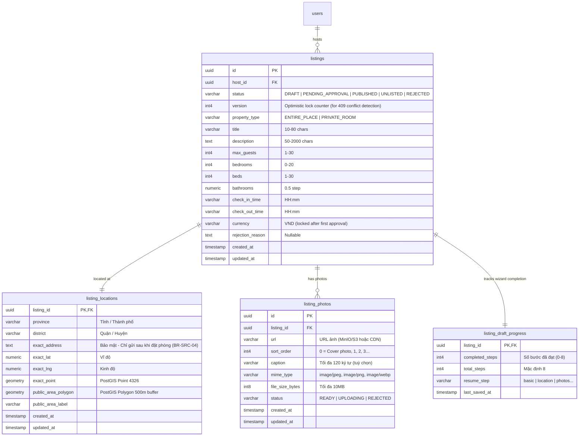

# Thiết kế Cơ sở Dữ liệu: Slice FE-S05 (Host Tạo Listing Nháp: Cơ bản, Vị trí, Ảnh)

> **Mục tiêu**: Lưu trữ dữ liệu chỗ nghỉ (Listing) ở trạng thái nháp (DRAFT) đa bước, địa chỉ toạ độ địa lý (PostGIS), vùng hiển thị công khai bảo vệ riêng tư (BR-SRC-04), và thư viện hình ảnh có sắp xếp thứ tự linh hoạt (Order-based photo storage).

---

## 1. Sơ đồ Thực thể quan hệ (ERD)

---

## 2. Chi tiết Cấu trúc Bảng (PostgreSQL & PostGIS)

### 2.1 Bảng `listings`
| Cột | Kiểu | Ràng buộc | Mô tả |
|---|---|---|---|
| `id` | `uuid` | PK, `default gen_random_uuid()` | Mã định danh chỗ nghỉ |
| `host_id` | `uuid` | FK `users(id)`, NOT NULL | Chủ homestay |
| `status` | `varchar(30)` | NOT NULL, DEFAULT `'DRAFT'` | Trạng thái listing |
| `version` | `int4` | NOT NULL, DEFAULT `1` | Khóa lạc quan (Optimistic Concurrency Control) |
| `property_type` | `varchar(30)` | NOT NULL, CHECK in (`ENTIRE_PLACE`, `PRIVATE_ROOM`) | Loại hình lưu trú |
| `title` | `varchar(100)` | NOT NULL, CHECK `length(title) >= 10 AND length(title) <= 80` | Tiêu đề hiển thị |
| `description` | `text` | NOT NULL, CHECK `length(description) >= 50 AND length(description) <= 2000` | Mô tả chi tiết |
| `max_guests` | `int4` | NOT NULL, CHECK `max_guests >= 1 AND max_guests <= 30` | Sức chứa tối đa |
| `bedrooms` | `int4` | NOT NULL, CHECK `bedrooms >= 0 AND bedrooms <= 20` | Phòng ngủ (0 = Studio) |
| `beds` | `int4` | NOT NULL, CHECK `beds >= 1 AND beds <= 30` | Số giường |
| `bathrooms` | `numeric(3, 1)` | NOT NULL, CHECK `bathrooms >= 0.5 AND bathrooms <= 10.0` | Phòng tắm (bước 0.5) |
| `check_in_time` | `varchar(10)` | NOT NULL, DEFAULT `'14:00'` | Giờ nhận phòng |
| `check_out_time` | `varchar(10)` | NOT NULL, DEFAULT `'12:00'` | Giờ trả phòng |
| `currency` | `varchar(10)` | NOT NULL, DEFAULT `'VND'` | Tiền tệ thanh toán |
| `rejection_reason` | `text` | NULL | Lý do yêu cầu chỉnh sửa từ Admin |
| `created_at` | `timestamptz` | NOT NULL, `default now()` | Thời gian khởi tạo |
| `updated_at` | `timestamptz` | NOT NULL, `default now()` | Cập nhật gần nhất |

### 2.2 Bảng `listing_locations`
| Cột | Kiểu | Ràng buộc | Mô tả |
|---|---|---|---|
| `listing_id` | `uuid` | PK, FK `listings(id)` ON DELETE CASCADE | 1-1 với listing |
| `province` | `varchar(100)` | NOT NULL | Tỉnh / Thành phố |
| `district` | `varchar(100)` | NOT NULL | Quận / Huyện |
| `exact_address` | `varchar(255)` | NOT NULL | **BẢO MẬT**: Không bao giờ trả về API tìm kiếm |
| `exact_lat` | `numeric(10, 6)` | NOT NULL | Vĩ độ chính xác (-90 đến 90) |
| `exact_lng` | `numeric(10, 6)` | NOT NULL | Kinh độ chính xác (-180 đến 180) |
| `exact_point` | `geometry(Point, 4326)` | GENERATED ALWAYS AS `ST_SetSRID(ST_MakePoint(exact_lng, exact_lat), 4326)` STORED | Điểm toạ độ PostGIS |
| `public_area_buffer` | `geometry(Polygon, 4326)` | NULL | Vòng tròn bán kính mờ 500m hiển thị cho khách |
| `public_area_label` | `varchar(150)` | NULL | Nhãn khu vực hiển thị xấp xỉ |

### 2.3 Bảng `listing_photos`
| Cột | Kiểu | Ràng buộc | Mô tả |
|---|---|---|---|
| `id` | `uuid` | PK, `default gen_random_uuid()` | Mã ảnh |
| `listing_id` | `uuid` | FK `listings(id)` ON DELETE CASCADE | Listing sở hữu |
| `url` | `text` | NOT NULL | Đường dẫn ảnh CDN/MinIO |
| `sort_order` | `int4` | NOT NULL, DEFAULT `0` | Thứ tự hiển thị. `0` = Ảnh bìa |
| `caption` | `varchar(120)` | NULL | Chú thích ảnh (dùng làm alt text) |
| `mime_type` | `varchar(50)` | NOT NULL | `image/jpeg`, `image/png`, `image/webp` |
| `file_size_bytes` | `int8` | NOT NULL, CHECK `file_size_bytes <= 10485760` | Tối đa 10MB |
| `status` | `varchar(20)` | NOT NULL, DEFAULT `'READY'` | `READY`, `UPLOADING`, `REJECTED` |

---

## 3. Ràng Buộc Nghiệp Vụ Bất Biến (Invariants & Rules)

1. **Khóa lạc quan (Optimistic Concurrency Control)**:
   - Khi frontend gửi `PATCH /api/v1/host/listings/:id`, bắt buộc gửi kèm `version`.
   - Nếu `version` gửi lên khác với `version` hiện tại trong database, backend từ chối với mã lỗi `409 CONFLICT`.
2. **Quyền riêng tư địa chỉ (BR-SRC-04)**:
   - Cột `exact_address` và `exact_point` tuyệt đối không được trả về trong các endpoint công khai (Guest search, listing detail công khai).
   - Chỉ trả về `public_area_polygon` hoặc `public_area_label`. Chỉ khi đơn đặt phòng chuyển sang `CONFIRMED`, guest mới được cấp quyền đọc `exact_address`.
3. **Thứ tự ảnh (Order Guarantee)**:
   - Backend hỗ trợ batch reorder qua `PUT /api/v1/host/listings/:id/photos/order` cập nhật transaction đảm bảo `sort_order` liên tục từ `0` đến `N-1`.
   - Ảnh có `sort_order = 0` được coi là ảnh bìa (`cover_photo`).
