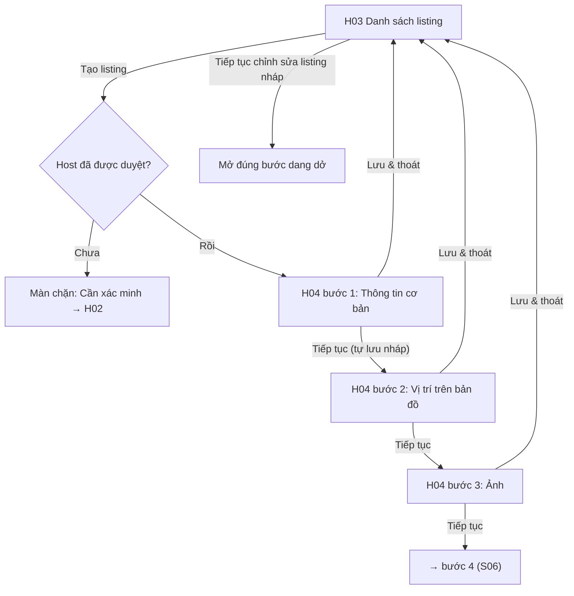

### S05 · Tạo listing nháp: cơ bản, vị trí, ảnh (H03, H04 bước 1–3)

Nhánh phụ: không có token Mapbox → nhập toạ độ thủ công (S05 ghi chú); đóng trình duyệt giữa chừng → mở lại thấy đủ dữ liệu các bước đã nhập; chuyển bước bằng thanh tiến độ (chỉ cho nhảy tới bước đã hoàn thành hoặc bước kế tiếp).

---

