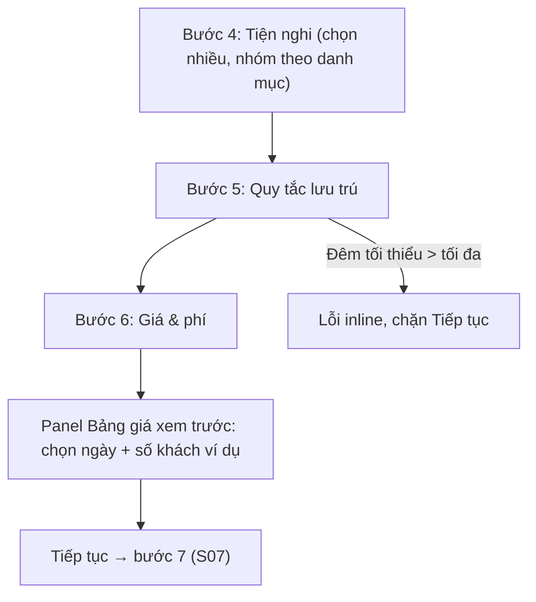

# Đặc Tả Kỹ Thuật Giao Diện · S06-LISTING-AMENITIES-PRICING

> Thư mục này đóng gói toàn bộ: **User Flow**, **Wireframes**, **UX Behavior**, và **Screen Data/API Contract** cho S06.


---

### S06 · Tiện nghi, quy tắc lưu trú, giá & phí (H04 bước 4–6)



---


## S06 · Tiện nghi, quy tắc lưu trú, giá & phí

#### Bước 4 · Tiện nghi
Component: CMP-29 AmenityPicker (tìm kiếm; nhóm: Thiết yếu, Phòng bếp, Giải trí, An toàn, Ngoài trời…; chọn bằng checkbox thẻ), bộ đếm đã chọn.
State: Loading danh mục (skeleton) · Default · Đang tìm (lọc tại chỗ) · Không có kết quả tìm · Lỗi tải danh mục (Thử lại) · Đã chọn ≥1.
```
🖥 Desktop (lưới 3 cột)                              📱 Mobile (1 cột, nhóm gập)
 [🔍 Tìm tiện nghi]            Đã chọn 6              [🔍 Tìm]            Đã chọn 6
 ▾ Thiết yếu                                           ▾ Thiết yếu
  [x] Wi-Fi  [x] Điều hoà  [ ] Máy nước nóng             [x] Wi-Fi
 ▾ Phòng bếp                                              [x] Điều hoà
  [x] Bếp    [ ] Tủ lạnh  [ ] Lò vi sóng                  [ ] Máy nước nóng
                                                        ▸ Phòng bếp (1)
```

#### Bước 5 · Quy tắc lưu trú
Component: CMP-06 (Đêm tối thiểu, Đêm tối đa, Thời gian chuẩn bị giữa 2 booking [đêm], Báo trước tối thiểu [ngày/giờ], Giới hạn đặt xa nhất [tháng]), CMP-02 Nội quy (hút thuốc, thú cưng, tiệc tùng, giờ yên tĩnh – chọn Có/Không + ghi chú), CMP-08 giải thích.
State: Default · **Lỗi chéo trường** (tối thiểu > tối đa → cả hai ô viền đỏ + dòng lỗi) · Lỗi trường · Đang lưu/Đã lưu.
```
 Đêm tối thiểu [−] 1 [+]      Đêm tối đa [−] 30 [+]
 ✕ Đêm tối thiểu không được lớn hơn đêm tối đa             ← lỗi chéo
 Thời gian chuẩn bị giữa hai booking   [Không ▼ | 1 đêm | 2 đêm]   ⓘ
 Báo trước tối thiểu    [Cùng ngày ▼]   Đặt xa nhất [12 tháng ▼]
 Nội quy:  Hút thuốc (○ Có ◉ Không)  Thú cưng (○ Có ◉ Không)  Tiệc (○ Có ◉ Không)
           Giờ yên tĩnh [22:00 ▼] – [07:00 ▼]    Ghi chú thêm [____________]
```
(Desktop: hai cột nhãn–ô; Mobile: 1 cột, mỗi nhóm trong thẻ riêng.)

#### Bước 6 · Giá & phí + Bảng giá xem trước
Component: CMP-02 số tiền có hậu tố tiền tệ (Giá cơ bản/đêm; Phí vệ sinh [1 lần/booking]; Phụ thu thêm khách: *Số khách tính giá cơ bản* + *Mức phụ thu mỗi khách thêm/đêm*; Giảm tuần [%, từ 7 đêm]; Giảm tháng [%, từ 28 đêm]), **CMP-22 PriceBreakdown (xem trước)** kèm CMP-16 chọn ngày ví dụ + CMP-17 số khách ví dụ.
Action: Nhập giá · Đổi ngày/khách ví dụ · Mở rộng "giá từng đêm" · Tiếp tục.
State: Default · **Preview loading** (skeleton, gọi PricingEngine) · **Preview OK** · **Preview lỗi** (Thử lại) · **Chưa đủ dữ liệu** ("Nhập giá cơ bản để xem trước") · **Lỗi trường** (giá ≤ 0, % ngoài 0–100, giảm tháng < giảm tuần → cảnh báo mềm) · **Ngày ví dụ vi phạm đêm tối thiểu/tối đa** (hiển thị lý do trong preview).
```
🖥 Desktop (form trái – preview phải, sticky)          📱 Mobile (preview nằm cuối, thu gọn)
┌───────────────────────────┬──────────────────────┐   ┌──────────────────────────┐
│ Giá cơ bản/đêm  [1.200.000]₫│ XEM TRƯỚC BẢNG GIÁ   │   │ Giá cơ bản/đêm [1.200.000]₫│
│ Phí vệ sinh     [  200.000]₫│ Ngày [12/12 – 15/12]  │   │ Phí vệ sinh    [  200.000]₫│
│ Phụ thu thêm khách          │ Khách [ 5 ▼ ]         │   │ Phụ thu thêm khách …       │
│  Giá cho [ 2 ] khách đầu    │ ────────────────────  │   │ Giảm tuần [10]% / tháng [20]%│
│  Mỗi khách thêm [100.000]₫  │ 3 đêm × 1.200.000  3,6tr│   │ ▾ Xem trước bảng giá       │
│ Giảm tuần  [10]% (≥7 đêm)   │ Phụ thu (3 khách thêm   │   │ ┌──────────────────────┐ │
│ Giảm tháng [20]% (≥28 đêm)  │  × 3 đêm)          900k│   │ │ Ngày [12/12–15/12]   │ │
│ ⓘ Đủ cả hai ngưỡng → áp     │ Phí vệ sinh        200k│   │ │ 3 đêm × 1.200.000 3,6tr│ │
│   mức giảm tháng            │ Giảm giá            0  │   │ │ …                    │ │
│                             │ ▸ Giá từng đêm          │   │ │ Tổng tiền host đặt 4,7tr│ │
│                             │ Tổng               4,7tr│   │ └──────────────────────┘ │
│                             │ ⓘ Phí dịch vụ & thuế    │   └──────────────────────────┘
│                             │  sẽ hiển thị khi khách xem│
└───────────────────────────┴──────────────────────┘
```
Ghi chú thiết kế: preview ở bước 6 chỉ thể hiện các khoản **Host kiểm soát**; phí dịch vụ & thuế do nền tảng cấu hình và chỉ hiện ở P03 (xem A9 trong 01-user-flow).

---


---


## S06 · Tiện nghi, quy tắc lưu trú, giá & phí

- **Tiện nghi**: tìm kiếm không phân biệt dấu/hoa thường; danh mục gập/mở, nhớ trạng thái; bộ đếm "Đã chọn n"; không bắt buộc số tối thiểu (chốt O2).
- **Quy tắc lưu trú**: kiểm tra chéo ngay khi đổi số: tối thiểu > tối đa → cả hai ô báo "Đêm tối thiểu không được lớn hơn đêm tối đa" và chặn Tiếp tục (S06 AC). Đặt xa nhất phải lớn hơn báo trước. Thông báo ⓘ: "Thay đổi chỉ áp dụng cho đặt phòng mới".
- **Ô tiền** (giá, phí): `inputmode="numeric"`, tự thêm dấu phân cách khi gõ, bỏ ký tự lạ khi dán; VND không thập phân; > 0 cho giá cơ bản; ≥ 0 cho phí; giới hạn trên theo cấu hình (BE trả `maxAmount`). Hậu tố tiền tệ cố định theo tiền tệ listing.
- **Phụ thu thêm khách**: "Số khách tính giá cơ bản" ≤ Số khách tối đa; ô phụ thu bị disabled nếu hai số bằng nhau (không có khách "thêm").
- **Giảm tuần/tháng**: 0–100 (%); tuần áp từ **7 đêm**, tháng từ **28 đêm** [A14]; cảnh báo mềm nếu giảm tháng < giảm tuần ("Giảm theo tháng thường cao hơn giảm theo tuần"); chú thích "Khi đủ điều kiện cả hai, hệ thống áp mức giảm tháng" (BR-PRC-02).
- **Bảng giá xem trước**:
  - Ngày và số khách ví dụ mặc định: nhận phòng sau 14 ngày, 3 đêm, số khách = số khách tính giá cơ bản + 1 (nếu còn chỗ); có **nút nhanh 3 đêm / 7 đêm / 28 đêm** để kiểm tra giảm tuần/tháng.
  - Gọi lại sau 500 ms khi bất kỳ trường giá đổi (huỷ request trước); đang tính → skeleton **chỉ ở phần số**, giữ khung.
  - Nếu ngày ví dụ vi phạm đêm tối thiểu/tối đa: hiển thị dòng giải thích thay cho bảng ("Khoảng này ít hơn số đêm tối thiểu (2)").
  - Hiển thị **chỉ các khoản Host kiểm soát**; ghi chú phí dịch vụ & thuế (A9). "Giá từng đêm" mở rộng, mỗi đêm có nhãn nguồn giá (Cơ bản, hoặc Cuối tuần/Mùa/Lễ khi S10 có).
  - Chưa nhập giá cơ bản → hiển thị trạng thái gợi ý, **không** hiển thị 0 ₫.

---


---


## S06 · Tiện nghi, quy tắc lưu trú, giá & phí

### Bước 4 – Tiện nghi (`ListingAmenity`)
`amenityIds[]` (đã chọn) + danh mục `Amenity {id, key, name, category, icon}`.

### Bước 5 – Quy tắc lưu trú (trên `Listing`)
| Trường | Kiểu | Quy tắc |
|---|---|---|
| minNights / maxNights | int | ≥1; min ≤ max (S06 AC) |
| prepNights | int | 0–3 – thời gian chuẩn bị giữa 2 booking |
| minNoticeHours | int | 0–720 – báo trước tối thiểu |
| maxAdvanceMonths | int | 1–24; > thời gian báo trước |
| houseRules `{smoking, pets, parties: boolean, quietHoursFrom, quietHoursTo, notes}` | object | Hiển thị Công khai ở P03 |

### Bước 6 – Giá & phí (`ListingPricing`)
| Trường | Kiểu | Quy tắc |
|---|---|---|
| baseNightlyPrice | Money | > 0 |
| cleaningFee | Money | ≥ 0, một lần/booking |
| baseGuests | int | 1…maxGuests |
| extraGuestFee | Money | ≥ 0 / khách thêm / đêm |
| weeklyDiscountPct | decimal | 0–100, áp từ 7 đêm [A14] |
| monthlyDiscountPct | decimal | 0–100, áp từ 28 đêm; đủ cả hai → lấy mức tháng (BR-PRC-02) |

### Bảng giá xem trước – `GET /host/listings/:id/pricing-preview?checkin=&checkout=&guests=`
| Trường phản hồi | Ghi chú |
|---|---|
| nights | int |
| nightlyBreakdown[] `{date, price: Money, source: BASE｜WEEKEND｜SEASON｜HOLIDAY｜SPECIAL}` | Hiện ở "Giá từng đêm" |
| roomSubtotal, extraGuestTotal, cleaningFee, discount (số âm) `{type: WEEKLY｜MONTHLY, pct}`, hostTotal | Money; **chưa gồm phí dịch vụ/thuế** (A9) |
| violations[] `{code: MIN_NIGHTS｜MAX_NIGHTS｜NOTICE｜ADVANCE, message}` | Hiển thị thay cho bảng |
| currency | tiền tệ listing |

---

