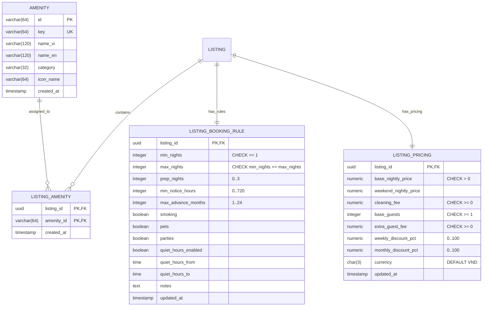

# Thiết Kế Cơ Sở Dữ Liệu · Slice S06: Tiện Nghi, Quy Tắc Lưu Trú, Giá & Phí

> **Tài liệu bàn giao FE-to-BE Handover Contract**  
> Slice: `FE-S06` (H04 Bước 4–6: Amenities, House Rules, Pricing Engine Preview)  
> Module Backend tương ứng: `listing-service` / `pricing-service`

---

## 1. Sơ Đồ Thực Thể Quan Hệ (Mermaid ERD)



---

## 2. Bảng Dữ Liệu Chi Tiết

### Bảng `amenities` (Danh mục tiện nghi chuẩn hệ thống)
| Cột | Kiểu | Ràng buộc | Diễn giải |
|---|---|---|---|
| `id` | `VARCHAR(64)` | PRIMARY KEY | Khóa chính tiện nghi (vd: `amenity-wifi`) |
| `key` | `VARCHAR(64)` | NOT NULL, UNIQUE | Mã định danh chuẩn (vd: `WIFI`) |
| `name_vi` | `VARCHAR(120)` | NOT NULL | Tên tiếng Việt |
| `name_en` | `VARCHAR(120)` | NOT NULL | Tên tiếng Anh |
| `category` | `VARCHAR(32)` | NOT NULL | Danh mục (`ESSENTIAL`, `KITCHEN`, `BATHROOM`, `ENTERTAINMENT`, `SAFETY`, `OUTDOOR`) |
| `icon_name` | `VARCHAR(64)` | NOT NULL | Tên icon Lucide/SVG hiển thị |
| `created_at` | `TIMESTAMPTZ` | NOT NULL, DEFAULT now() | Thời gian tạo |

### Bảng `listing_amenities` (Bảng nối n-n tiện nghi chỗ nghỉ)
| Cột | Kiểu | Ràng buộc | Diễn giải |
|---|---|---|---|
| `listing_id` | `UUID` | PK, FK -> `listings(id)` ON DELETE CASCADE | ID chỗ nghỉ |
| `amenity_id` | `VARCHAR(64)` | PK, FK -> `amenities(id)` ON DELETE RESTRICT | ID tiện nghi |
| `created_at` | `TIMESTAMPTZ` | NOT NULL, DEFAULT now() | Thời điểm gán |

### Bảng `listing_booking_rules` (Quy tắc lưu trú & Nội quy)
| Cột | Kiểu | Ràng buộc | Diễn giải |
|---|---|---|---|
| `listing_id` | `UUID` | PRIMARY KEY, FK -> `listings(id)` | Khóa ngoại 1-1 với listing |
| `min_nights` | `INTEGER` | NOT NULL, DEFAULT 1, CHECK (`min_nights >= 1`) | Đêm tối thiểu |
| `max_nights` | `INTEGER` | NOT NULL, DEFAULT 30, CHECK (`max_nights >= 1`) | Đêm tối đa |
| `prep_nights` | `INTEGER` | NOT NULL, DEFAULT 0, CHECK (`prep_nights BETWEEN 0 AND 3`) | Đêm dọn dẹp chặn giữa 2 booking |
| `min_notice_hours` | `INTEGER` | NOT NULL, DEFAULT 0, CHECK (`min_notice_hours >= 0`) | Báo trước tối thiểu (giờ) |
| `max_advance_months` | `INTEGER` | NOT NULL, DEFAULT 12, CHECK (`max_advance_months >= 1`) | Đặt xa nhất (tháng) |
| `smoking` | `BOOLEAN` | NOT NULL, DEFAULT false | Cho phép hút thuốc |
| `pets` | `BOOLEAN` | NOT NULL, DEFAULT false | Cho phép thú cưng |
| `parties` | `BOOLEAN` | NOT NULL, DEFAULT false | Cho phép tổ chức tiệc/sự kiện |
| `quiet_hours_enabled` | `BOOLEAN` | NOT NULL, DEFAULT true | Bật khung giờ yên tĩnh |
| `quiet_hours_from` | `TIME` | DEFAULT '22:00:00' | Bắt đầu giờ yên tĩnh |
| `quiet_hours_to` | `TIME` | DEFAULT '07:00:00' | Kết thúc giờ yên tĩnh |
| `notes` | `TEXT` | NULL | Ghi chú & nội quy thêm của Host |
| `updated_at` | `TIMESTAMPTZ` | NOT NULL, DEFAULT now() | Thời điểm cập nhật |

> **Ràng buộc toàn vẹn quan trọng (Cross-field Invariant)**:  
> `CONSTRAINT chk_listing_nights_order CHECK (min_nights <= max_nights)`

### Bảng `listing_pricing` (Giá cơ bản & chiết khấu thời gian)
| Cột | Kiểu | Ràng buộc | Diễn giải |
|---|---|---|---|
| `listing_id` | `UUID` | PRIMARY KEY, FK -> `listings(id)` | Khóa ngoại 1-1 |
| `base_nightly_price` | `NUMERIC(14,2)` | NOT NULL, CHECK (`base_nightly_price > 0`) | Giá cơ bản mỗi đêm |
| `weekend_nightly_price` | `NUMERIC(14,2)` | NULL, CHECK (`weekend_nightly_price >= 0`) | Giá cuối tuần (T6, T7) |
| `cleaning_fee` | `NUMERIC(14,2)` | NOT NULL, DEFAULT 0, CHECK (`cleaning_fee >= 0`) | Phí vệ sinh 1 lần |
| `base_guests` | `INTEGER` | NOT NULL, DEFAULT 1, CHECK (`base_guests >= 1`) | Số khách tính giá cơ bản |
| `extra_guest_fee` | `NUMERIC(14,2)` | NOT NULL, DEFAULT 0, CHECK (`extra_guest_fee >= 0`) | Phụ thu mỗi khách thêm / đêm |
| `weekly_discount_pct` | `NUMERIC(5,2)` | NOT NULL, DEFAULT 0, CHECK (`weekly_discount_pct BETWEEN 0 AND 100`) | % giảm từ 7 đêm |
| `monthly_discount_pct` | `NUMERIC(5,2)` | NOT NULL, DEFAULT 0, CHECK (`monthly_discount_pct BETWEEN 0 AND 100`) | % giảm từ 28 đêm |
| `currency` | `CHAR(3)` | NOT NULL, DEFAULT 'VND' | Mã tiền tệ ISO 4217 |
| `updated_at` | `TIMESTAMPTZ` | NOT NULL, DEFAULT now() | Thời điểm cập nhật |

---

## 3. Flyway Migration SQL Script Mẫu (`V6__create_amenities_and_pricing_schema.sql`)

```sql
-- 1. Create amenities table
CREATE TABLE amenities (
    id VARCHAR(64) PRIMARY KEY,
    key VARCHAR(64) NOT NULL UNIQUE,
    name_vi VARCHAR(120) NOT NULL,
    name_en VARCHAR(120) NOT NULL,
    category VARCHAR(32) NOT NULL,
    icon_name VARCHAR(64) NOT NULL,
    created_at TIMESTAMPTZ NOT NULL DEFAULT CURRENT_TIMESTAMP
);

-- 2. Create listing_amenities join table
CREATE TABLE listing_amenities (
    listing_id UUID NOT NULL REFERENCES listings(id) ON DELETE CASCADE,
    amenity_id VARCHAR(64) NOT NULL REFERENCES amenities(id) ON DELETE RESTRICT,
    created_at TIMESTAMPTZ NOT NULL DEFAULT CURRENT_TIMESTAMP,
    PRIMARY KEY (listing_id, amenity_id)
);

CREATE INDEX idx_listing_amenities_amenity_id ON listing_amenities(amenity_id);

-- 3. Create listing_booking_rules table
CREATE TABLE listing_booking_rules (
    listing_id UUID PRIMARY KEY REFERENCES listings(id) ON DELETE CASCADE,
    min_nights INTEGER NOT NULL DEFAULT 1 CHECK (min_nights >= 1),
    max_nights INTEGER NOT NULL DEFAULT 30 CHECK (max_nights >= 1),
    prep_nights INTEGER NOT NULL DEFAULT 0 CHECK (prep_nights BETWEEN 0 AND 3),
    min_notice_hours INTEGER NOT NULL DEFAULT 0 CHECK (min_notice_hours >= 0),
    max_advance_months INTEGER NOT NULL DEFAULT 12 CHECK (max_advance_months >= 1),
    smoking BOOLEAN NOT NULL DEFAULT FALSE,
    pets BOOLEAN NOT NULL DEFAULT FALSE,
    parties BOOLEAN NOT NULL DEFAULT FALSE,
    quiet_hours_enabled BOOLEAN NOT NULL DEFAULT TRUE,
    quiet_hours_from TIME DEFAULT '22:00:00',
    quiet_hours_to TIME DEFAULT '07:00:00',
    notes TEXT,
    updated_at TIMESTAMPTZ NOT NULL DEFAULT CURRENT_TIMESTAMP,
    CONSTRAINT chk_listing_nights_order CHECK (min_nights <= max_nights)
);

-- 4. Create listing_pricing table
CREATE TABLE listing_pricing (
    listing_id UUID PRIMARY KEY REFERENCES listings(id) ON DELETE CASCADE,
    base_nightly_price NUMERIC(14,2) NOT NULL CHECK (base_nightly_price > 0),
    weekend_nightly_price NUMERIC(14,2) CHECK (weekend_nightly_price >= 0),
    cleaning_fee NUMERIC(14,2) NOT NULL DEFAULT 0 CHECK (cleaning_fee >= 0),
    base_guests INTEGER NOT NULL DEFAULT 2 CHECK (base_guests >= 1),
    extra_guest_fee NUMERIC(14,2) NOT NULL DEFAULT 0 CHECK (extra_guest_fee >= 0),
    weekly_discount_pct NUMERIC(5,2) NOT NULL DEFAULT 0 CHECK (weekly_discount_pct BETWEEN 0 AND 100),
    monthly_discount_pct NUMERIC(5,2) NOT NULL DEFAULT 0 CHECK (monthly_discount_pct BETWEEN 0 AND 100),
    currency CHAR(3) NOT NULL DEFAULT 'VND',
    updated_at TIMESTAMPTZ NOT NULL DEFAULT CURRENT_TIMESTAMP
);
```
