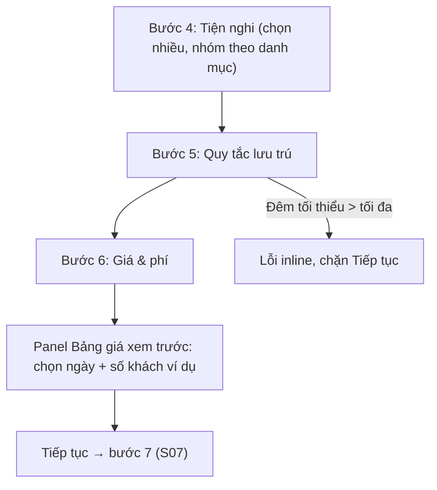

### S06 · Tiện nghi, quy tắc lưu trú, giá & phí (H04 bước 4–6)

```mermaid
flowchart TD
  S4["Bước 4: Tiện nghi (chọn nhiều, nhóm theo danh mục)"] --> S5["Bước 5: Quy tắc lưu trú"]
  S5 --> S6["Bước 6: Giá & phí"]
  S6 --> PV["Panel Bảng giá xem trước: chọn ngày + số khách ví dụ"]
  PV --> OK["Tiếp tục → bước 7 (S07)"]
  S5 -->|"Đêm tối thiểu > tối đa"| E["Lỗi inline, chặn Tiếp tục"]
```

