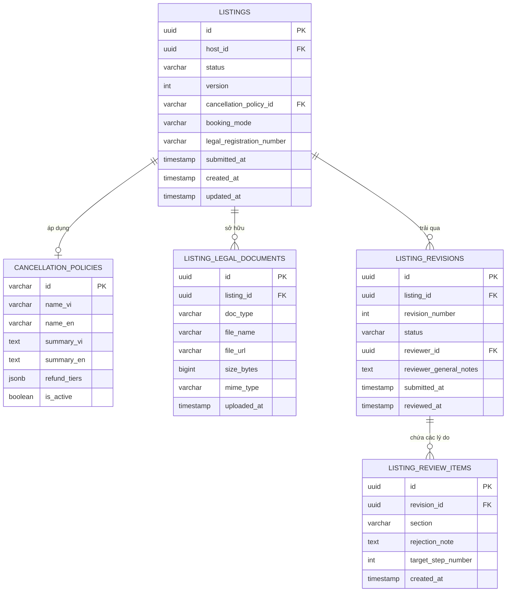

# Thiết Kế Cơ Sở Dữ Liệu · Slice FE-S07 (Chính Sách Huỷ, Kiểu Đặt, Giấy Tờ & Trạng Thái Duyệt)

> **Tài liệu bàn giao kỹ thuật FE-to-BE (Handover Contract)**  
> Slice: `FE-S07` (H04 Bước 7–8, H05 Trạng thái duyệt listing)  
> Module: `listing` & `audit/review`

---

## 1. Sơ Đồ Thực Thể Quan Hệ (ERD Mermaid)



---

## 2. Chi Tiết Bảng & Ràng Buộc Nghiệp Vụ

### Bảng `cancellation_policies`
- `id`: Mã chính sách (`FLEXIBLE`, `MODERATE`, `STRICT`).
- `refund_tiers`: Cấu trúc JSONB lưu trữ danh sách các mốc giờ và % hoàn tiền (ví dụ: `[{"hours_before": 24, "refund_pct": 100}, {"hours_before": 0, "refund_pct": 50}]`).
- Quy tắc BR-LST-03: Thay đổi chính sách huỷ của listing sau khi đã Active không làm thay đổi chính sách của các booking đã tạo trước đó (lưu snapshot `cancellation_policy_id` tại bảng `bookings`).

### Bảng `listing_legal_documents`
- `doc_type`: `OPERATING_LICENSE` (Quyền khai thác / Sổ đỏ), `BUSINESS_REGISTRATION` (Đăng ký KD), `FIRE_SAFETY` (PCCC), `OTHER`.
- Ràng buộc: Một listing phải có ít nhất 1 tài liệu loại `OPERATING_LICENSE` mới đủ điều kiện gửi duyệt (`can_submit = true`).

### Bảng `listing_revisions` & `listing_review_items`
- Lưu trữ lịch sử từng lần gửi duyệt của Host.
- Khi Admin chọn `NEEDS_CHANGES` hoặc `REJECTED`, các lý do cụ thể theo từng mục (`PHOTOS`, `LEGAL`, `PRICING`, `LOCATION`, `DESCRIPTION`, `OTHER`) được lưu tại `listing_review_items`.
- Bảo mật: Không để lộ thông tin cá nhân của Admin (`reviewer_id`) ra API cho Host; Host chỉ thấy `decided_at` và danh sách `reasons`.

---

## 3. Flyway Migration Script Mẫu (PostgreSQL)

```sql
-- V7__create_listing_policy_and_review_schema.sql

-- 1. Bảng chính sách huỷ
CREATE TABLE IF NOT EXISTS cancellation_policies (
    id VARCHAR(32) PRIMARY KEY,
    name_vi VARCHAR(100) NOT NULL,
    name_en VARCHAR(100) NOT NULL,
    summary_vi TEXT NOT NULL,
    summary_en TEXT NOT NULL,
    refund_tiers JSONB NOT NULL,
    is_active BOOLEAN NOT NULL DEFAULT TRUE
);

-- Seed 3 chính sách chuẩn
INSERT INTO cancellation_policies (id, name_vi, name_en, summary_vi, summary_en, refund_tiers)
VALUES 
('FLEXIBLE', 'Linh hoạt', 'Flexible', 'Hoàn 100% nếu huỷ trước 24 giờ nhận phòng', '100% refund up to 24 hours before check-in', '[{"hours_before": 24, "refund_pct": 100}, {"hours_before": 0, "refund_pct": 50}]'::jsonb),
('MODERATE', 'Trung bình', 'Moderate', 'Hoàn 100% nếu huỷ trước 5 ngày nhận phòng', '100% refund up to 5 days before check-in', '[{"hours_before": 120, "refund_pct": 100}, {"hours_before": 24, "refund_pct": 50}, {"hours_before": 0, "refund_pct": 0}]'::jsonb),
('STRICT', 'Nghiêm ngặt', 'Strict', 'Hoàn 50% nếu huỷ trước 7 ngày; không hoàn sau mốc đó', '50% refund up to 7 days before check-in', '[{"hours_before": 168, "refund_pct": 50}, {"hours_before": 0, "refund_pct": 0}]'::jsonb)
ON CONFLICT (id) DO NOTHING;

-- 2. Thêm cột chính sách & kiểu đặt vào listings
ALTER TABLE listings 
ADD COLUMN IF NOT EXISTS cancellation_policy_id VARCHAR(32) REFERENCES cancellation_policies(id),
ADD COLUMN IF NOT EXISTS booking_mode VARCHAR(20) DEFAULT 'INSTANT' CHECK (booking_mode IN ('INSTANT', 'REQUEST')),
ADD COLUMN IF NOT EXISTS legal_registration_number VARCHAR(100),
ADD COLUMN IF NOT EXISTS submitted_at TIMESTAMP WITH TIME ZONE;

-- 3. Bảng tài liệu pháp lý listing
CREATE TABLE IF NOT EXISTS listing_legal_documents (
    id UUID PRIMARY KEY DEFAULT gen_random_uuid(),
    listing_id UUID NOT NULL REFERENCES listings(id) ON DELETE CASCADE,
    doc_type VARCHAR(50) NOT NULL CHECK (doc_type IN ('OPERATING_LICENSE', 'BUSINESS_REGISTRATION', 'FIRE_SAFETY', 'OTHER')),
    file_name VARCHAR(255) NOT NULL,
    file_url VARCHAR(1024) NOT NULL,
    size_bytes BIGINT NOT NULL,
    mime_type VARCHAR(100),
    uploaded_at TIMESTAMP WITH TIME ZONE NOT NULL DEFAULT CURRENT_TIMESTAMP
);

CREATE INDEX IF NOT EXISTS idx_listing_legal_docs_listing_id ON listing_legal_documents(listing_id);

-- 4. Bảng lịch sử duyệt listing
CREATE TABLE IF NOT EXISTS listing_revisions (
    id UUID PRIMARY KEY DEFAULT gen_random_uuid(),
    listing_id UUID NOT NULL REFERENCES listings(id) ON DELETE CASCADE,
    revision_number INT NOT NULL DEFAULT 1,
    status VARCHAR(32) NOT NULL DEFAULT 'PENDING' CHECK (status IN ('PENDING', 'APPROVED', 'NEEDS_CHANGES', 'REJECTED')),
    reviewer_id UUID REFERENCES users(id),
    reviewer_notes TEXT,
    submitted_at TIMESTAMP WITH TIME ZONE NOT NULL DEFAULT CURRENT_TIMESTAMP,
    reviewed_at TIMESTAMP WITH TIME ZONE
);

CREATE TABLE IF NOT EXISTS listing_review_items (
    id UUID PRIMARY KEY DEFAULT gen_random_uuid(),
    revision_id UUID NOT NULL REFERENCES listing_revisions(id) ON DELETE CASCADE,
    section VARCHAR(32) NOT NULL CHECK (section IN ('PHOTOS', 'DESCRIPTION', 'LEGAL', 'PRICING', 'LOCATION', 'OTHER')),
    rejection_note TEXT NOT NULL,
    target_step_number INT NOT NULL,
    created_at TIMESTAMP WITH TIME ZONE NOT NULL DEFAULT CURRENT_TIMESTAMP
);
```
