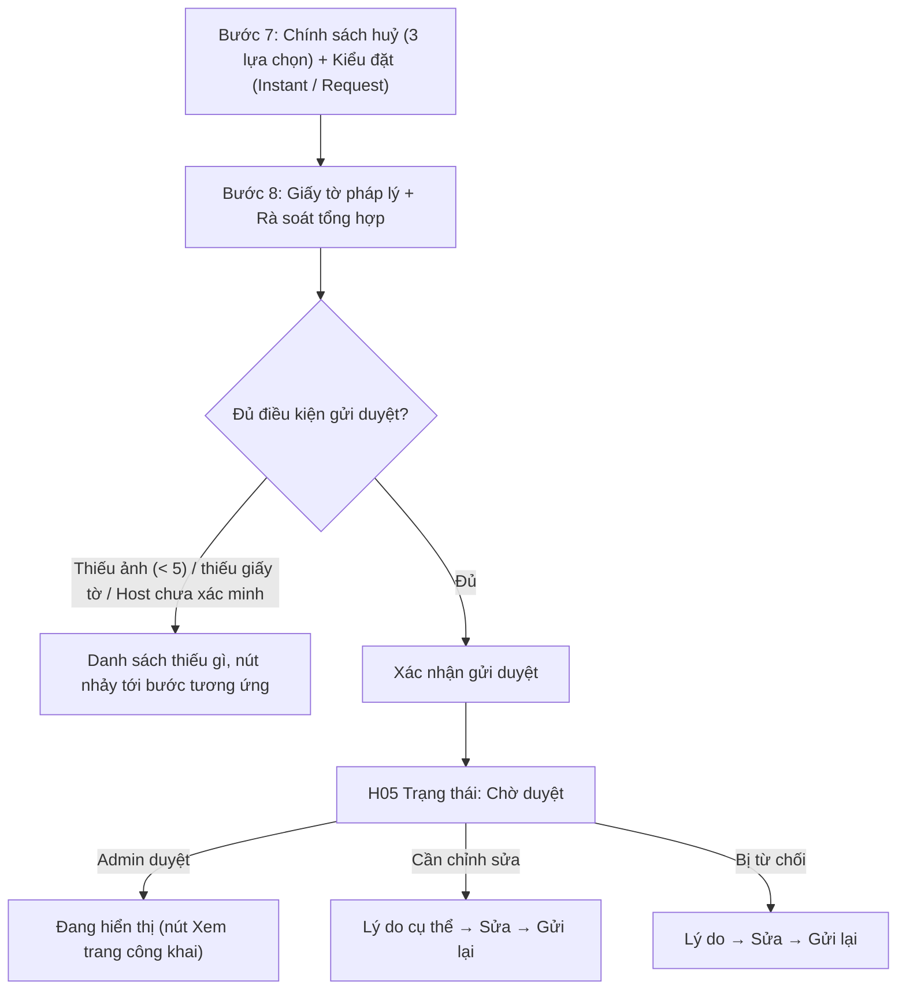

### S07 · Chính sách huỷ, kiểu đặt, giấy tờ, gửi duyệt, trạng thái (H04 bước 7–8, H05)

```mermaid
flowchart TD
  P7["Bước 7: Chính sách huỷ (3 lựa chọn) + Kiểu đặt (Instant / Request)"] --> P8["Bước 8: Giấy tờ pháp lý + Rà soát tổng hợp"]
  P8 --> CK{"Đủ điều kiện gửi duyệt?"}
  CK -->|"Thiếu ảnh (< 5) / thiếu giấy tờ / Host chưa xác minh"| NG["Danh sách thiếu gì, nút nhảy tới bước tương ứng"]
  CK -->|"Đủ"| SB["Xác nhận gửi duyệt"]
  SB --> H5["H05 Trạng thái: Chờ duyệt"]
  H5 -->|"Admin duyệt"| V["Đang hiển thị (nút Xem trang công khai)"]
  H5 -->|"Cần chỉnh sửa"| NE["Lý do cụ thể → Sửa → Gửi lại"]
  H5 -->|"Bị từ chối"| RJ["Lý do → Sửa → Gửi lại"]
```

