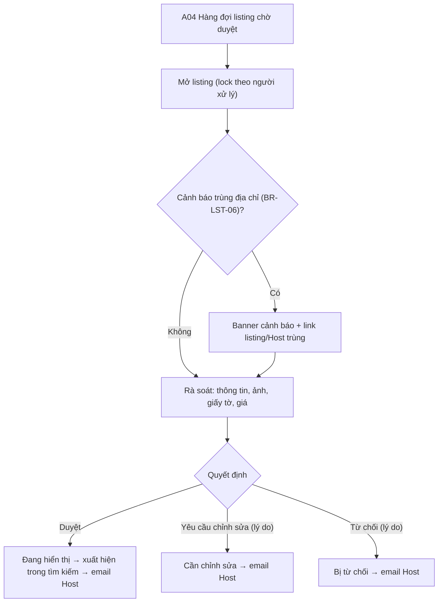

# Đặc Tả Kỹ Thuật Giao Diện · S08-ADMIN-REVIEW-LISTING

> Thư mục này đóng gói toàn bộ: **User Flow**, **Wireframes**, **UX Behavior**, và **Screen Data/API Contract** cho S08.


---

### S08 · Admin duyệt listing lần đầu (A04)

Ghi chú: bản đầu **chưa có tab so sánh cũ/mới** – chừa sẵn khung tab "Thay đổi" (disabled, tooltip "Có ở lần chỉnh sửa sau khi đã duyệt") [S08 ghi chú].


---


## S08 · Admin duyệt listing lần đầu

### A04 · Duyệt listing
| Mục | Giá trị |
|---|---|
| Route / Role | `/admin/listing-reviews` (hàng đợi), `/admin/listing-reviews/:id` · **Admin** |
| Component | CMP-24 (Listing, Host, Khu vực, Ngày gửi, Lần gửi, Cờ ⚑ trùng địa chỉ, Người đang xử lý), CMP-31 LockBanner, banner cảnh báo trùng địa chỉ (BR-LST-06), tabs [Nội dung \| Ảnh \| Giấy tờ \| Giá & chính sách \| *Thay đổi (🔒 disabled)*], CMP-26 xem ảnh, CMP-30 xem giấy tờ (có log), CMP-25 (Duyệt / Yêu cầu sửa / Từ chối + lý do), CMP-10 |
| Action | Mở & nhận khoá · Xem từng tab · Xem giấy tờ (ghi log) · **Duyệt** · **Yêu cầu chỉnh sửa** (lý do theo mục) · **Từ chối** (lý do) · Trả lại hàng đợi · Mở trang xem trước dạng công khai |
| State | Hàng đợi: Loading/Default/Rỗng/Lọc rỗng/Lỗi · Chi tiết: **Đang tải** · **Tự do** · **Bị khoá bởi người khác** · **Mất khoá** · **Có cảnh báo trùng địa chỉ** · **Đã xử lý bởi người khác** (409 → chỉ xem) · **Đang gửi quyết định** · **Thành công** (toast + quay lại hàng đợi, mở listing kế tiếp) · **Thiếu lý do** (lỗi inline, chặn gửi) · Lỗi mạng |

🖥 Desktop – chi tiết
```
┌─────────┬──────────────────────────────────────────────────────────────────────────┐
│ Duyệt DT│ ← Listing #318 · Nhà trên đồi Đà Lạt     ⏳ Chờ duyệt (lần 1)  [Trả lại]     │
│ ▶Duyệt tin│ ⚑ Địa chỉ trùng với listing #207 của Host khác  [Xem listing #207]        │
│ Nhân sự │ Tabs: [Nội dung] Ảnh  Giấy tờ  Giá & chính sách  (🔒 Thay đổi)              │
│         │ ┌────────────────────────────────┐ ┌────────────────────────────────────┐ │
│         │ │ Gallery (lightbox)             │ │ Host: Nguyễn Văn A  ✓ Đã xác minh   │ │
│         │ │ ▢▢▢▢▢                          │ │ Loại: Nguyên căn · Sức chứa 4        │ │
│         │ │ Mô tả …                        │ │ Địa chỉ chính xác (Admin thấy đủ)    │ │
│         │ │ Tiện nghi …                    │ │ [Mini map]                          │ │
│         │ │ Nội quy …                      │ │ Chính sách huỷ · Kiểu đặt · Giá      │ │
│         │ └────────────────────────────────┘ └────────────────────────────────────┘ │
│         │ ───────────────────────────────────────────────────────────────────────── │
│         │ [ Từ chối… ]   [ Yêu cầu chỉnh sửa… ]                      [ Duyệt listing ] │
└─────────┴──────────────────────────────────────────────────────────────────────────┘
Dialog lý do: ☐ Ảnh ☐ Mô tả ☐ Giấy tờ ☐ Giá ☐ Khác  + Ghi chú chi tiết gửi Host (bắt buộc)
```
📱 Mobile/Tablet: 1 cột; tabs cuộn ngang; thanh quyết định sticky đáy [Từ chối][Sửa][Duyệt] (Sửa/Từ chối mở bottom sheet nhập lý do).

---


---


## S08 · Admin duyệt listing lần đầu (A04)

- Hàng đợi, khoá bản ghi, heartbeat, mất khoá, 409: **giống A03** (dùng lại logic).
- **Cảnh báo trùng địa chỉ (BR-LST-06)**: banner vàng ở đầu chi tiết + link mở listing/Host trùng (tab mới). Duyệt khi có cảnh báo → bắt buộc tick "Tôi đã kiểm tra cảnh báo trùng địa chỉ".
- **Rà soát**: tab **Nội dung / Ảnh / Giấy tờ / Giá & chính sách**; tab **Thay đổi** (so sánh cũ/mới) hiển thị disabled kèm tooltip (S08 ghi chú). Admin thấy **địa chỉ chính xác** + mini map; xem giấy tờ theo cơ chế che-mờ-có-log (như A03).
- "Xem như khách": mở P03 ở **chế độ xem trước** trong tab mới.
- **Quyết định**:
  - **Duyệt** → Listing "Đang hiển thị", email Host.
  - **Yêu cầu chỉnh sửa**: tick các mục cần sửa (Ảnh, Mô tả, Giấy tờ, Giá, Vị trí, Khác) + ghi chú **bắt buộc** cho từng mục tick (≥ 10 ký tự). Dữ liệu này đi thẳng tới khối lý do ở H05.
  - **Từ chối**: lý do + ghi chú bắt buộc.
  - Hậu quả hiển thị rõ trong dialog ("Host sẽ nhận email và có thể sửa rồi gửi lại").
- Sau quyết định: toast + (tuỳ chọn) tự mở listing kế tiếp; hàng đợi cập nhật không cần tải lại.

---


---


## S08 · Admin duyệt listing lần đầu (A04)

| Phần | Trường | Ghi chú |
|---|---|---|
| Hàng đợi | listingId, title, hostName, regionName, submittedAt, revisionNo, flagDuplicateAddress ⚑, lockedBy, status | Sắp cũ nhất trước |
| Nội dung | toàn bộ Listing (mô tả, loại hình, sức chứa, quy tắc, nội quy), ảnh (url), tiện nghi | |
| Vị trí | **exactAddress, exactLat/Lng** | **Admin thấy đủ** |
| Giấy tờ | Attachment LISTING_LEGAL: id, type, fileName (xem qua API có log) | |
| Giá & chính sách | ListingPricing, CancellationPolicy, bookingMode | |
| Cảnh báo trùng | `duplicates[] {listingId, hostId, hostName, similarity: 'SAME_ADDRESS'}` | BR-LST-06 |
| Host | id, tên, hostVerification, số listing | |
| Quyết định | `{decision: APPROVE｜NEEDS_CHANGES｜REJECT, reasons[]: {section, note}, acknowledgedDuplicate?}` | Lý do bắt buộc khi khác APPROVE |

| API | Mục đích |
|---|---|
| `GET /admin/listing-reviews?status=&flag=&mine=&page=` | Hàng đợi |
| `POST /admin/listing-reviews/:id/lock` (+ heartbeat/release) | Khoá |
| `GET /admin/listing-reviews/:id` | Chi tiết |
| `POST /admin/listing-reviews/:id/documents/:attId/view` | Xem giấy tờ (ghi log) |
| `POST /admin/listing-reviews/:id/decision` | Quyết định (ghi ActivityLog + email Host) |
| `GET /admin/listings/:id/preview` | Dữ liệu cho P03 chế độ xem trước |

---

