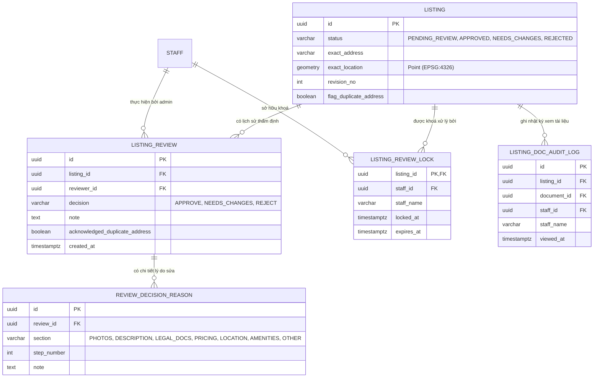

# Thiết Kế Cơ Sở Dữ Liệu · S08-ADMIN-REVIEW-LISTING (A04)

> **Phân hệ**: Quản trị thẩm định chỗ ở & Cảnh báo chống trùng lặp (Admin Back-office & Anti-fraud)  
> **Áp dụng**: PostgreSQL 16+ / PostGIS / Flyway Migration  

---

## 1. Sơ Đồ Thực Thể Quan Hệ (ER Diagram)



---

## 2. Chi Tiết Các Bảng

### 2.1. Bảng `listing_review_locks` (Khoá phân tán tránh xung đột xử lý song song - CMP-31)
```sql
CREATE TABLE IF NOT EXISTS listing_review_locks (
    listing_id UUID PRIMARY KEY REFERENCES listings(id) ON DELETE CASCADE,
    staff_id UUID NOT NULL REFERENCES staff_users(id),
    staff_name VARCHAR(100) NOT NULL,
    locked_at TIMESTAMPTZ NOT NULL DEFAULT CURRENT_TIMESTAMP,
    expires_at TIMESTAMPTZ NOT NULL DEFAULT (CURRENT_TIMESTAMP + INTERVAL '15 minutes')
);

CREATE INDEX idx_listing_review_locks_expires ON listing_review_locks(expires_at);
```

### 2.2. Bảng `listing_reviews` (Lịch sử quyết định thẩm định)
```sql
CREATE TABLE IF NOT EXISTS listing_reviews (
    id UUID PRIMARY KEY DEFAULT gen_random_uuid(),
    listing_id UUID NOT NULL REFERENCES listings(id) ON DELETE CASCADE,
    reviewer_id UUID NOT NULL REFERENCES staff_users(id),
    decision VARCHAR(30) NOT NULL CHECK (decision IN ('APPROVE', 'NEEDS_CHANGES', 'REJECT')),
    note TEXT,
    acknowledged_duplicate_address BOOLEAN DEFAULT FALSE,
    created_at TIMESTAMPTZ NOT NULL DEFAULT CURRENT_TIMESTAMP
);

CREATE INDEX idx_listing_reviews_listing ON listing_reviews(listing_id, created_at DESC);
```

### 2.3. Bảng `review_decision_reasons` (Chi tiết các mục cần sửa gửi về H05)
```sql
CREATE TABLE IF NOT EXISTS review_decision_reasons (
    id UUID PRIMARY KEY DEFAULT gen_random_uuid(),
    review_id UUID NOT NULL REFERENCES listing_reviews(id) ON DELETE CASCADE,
    section VARCHAR(30) NOT NULL CHECK (section IN ('PHOTOS', 'DESCRIPTION', 'LEGAL_DOCS', 'PRICING', 'LOCATION', 'AMENITIES', 'HOUSE_RULES', 'OTHER')),
    step_number INT NOT NULL CHECK (step_number BETWEEN 1 AND 8),
    note TEXT NOT NULL
);

CREATE INDEX idx_review_decision_reasons_review ON review_decision_reasons(review_id);
```

### 2.4. Bảng `listing_doc_audit_logs` (Nhật ký truy cập tài liệu mật - CMP-30)
```sql
CREATE TABLE IF NOT EXISTS listing_doc_audit_logs (
    id UUID PRIMARY KEY DEFAULT gen_random_uuid(),
    listing_id UUID NOT NULL REFERENCES listings(id) ON DELETE CASCADE,
    document_id UUID NOT NULL,
    staff_id UUID NOT NULL REFERENCES staff_users(id),
    staff_name VARCHAR(100) NOT NULL,
    viewed_at TIMESTAMPTZ NOT NULL DEFAULT CURRENT_TIMESTAMP
);

CREATE INDEX idx_doc_audit_logs_listing ON listing_doc_audit_logs(listing_id);
```

---

## 3. Bất Biến Nghiệp Vụ & Quy Tắc Kiểm Soát (Invariants & Rules)

1. **Quy tắc BR-LST-06 (Phát hiện trùng địa chỉ)**:
   - Khi địa chỉ `exact_address` trùng lặp với chỗ nghỉ khác có trạng thái `PUBLISHED` hoặc `PENDING_REVIEW`, hệ thống tự động gán cờ `flag_duplicate_address = TRUE`.
   - Admin chỉ có thể duyệt khi tick `acknowledged_duplicate_address = TRUE`.
2. **Quy tắc khoá phiên CMP-31**:
   - Thời gian khoá mặc định là 15 phút.
   - Heartbeat định kỳ 60s để gia hạn `expires_at`.
   - Nếu Admin khác cố tình can thiệp khi còn khoá, Backend trả về `409 Conflict: LOCKED_BY_ANOTHER`.
