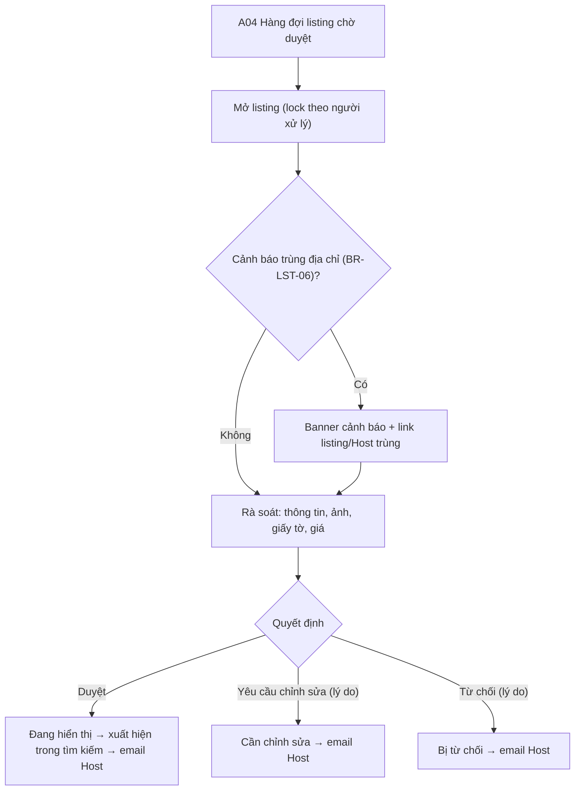

### S08 · Admin duyệt listing lần đầu (A04)

Ghi chú: bản đầu **chưa có tab so sánh cũ/mới** – chừa sẵn khung tab "Thay đổi" (disabled, tooltip "Có ở lần chỉnh sửa sau khi đã duyệt") [S08 ghi chú].

