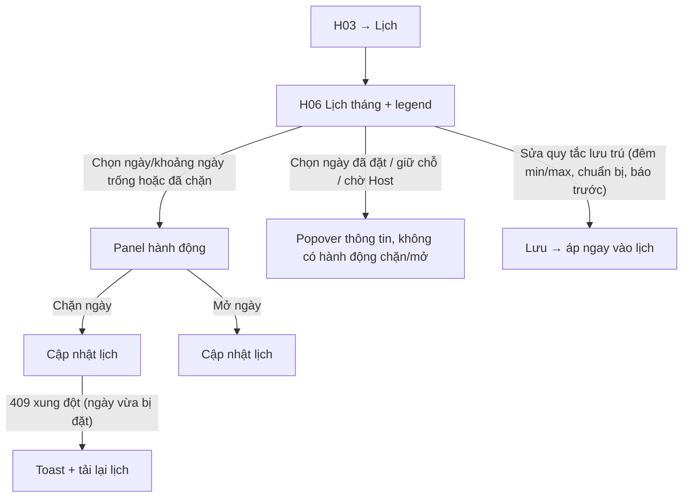

# Đặc Tả Kỹ Thuật Giao Diện · S09-LISTING-CALENDAR

> Thư mục này đóng gói toàn bộ: **User Flow**, **Wireframes**, **UX Behavior**, và **Screen Data/API Contract** cho S09.


---

### S09 · Lịch listing (H06)



---


## S09 · Lịch listing và chống đặt trùng

### H06 · Lịch listing
| Mục | Giá trị |
|---|---|
| Route / Role | `/host/listings/:id/calendar` · Host (listing Đang hiển thị / Tạm ẩn) |
| Component | CMP-23 CalendarMonth (điều hướng tháng, nút Hôm nay), legend 5 trạng thái, panel hành động (Drawer phải 380px / BottomSheet), khối **Quy tắc lưu trú** (đêm tối thiểu/tối đa, thời gian chuẩn bị, báo trước, đặt xa nhất – cùng dữ liệu bước 5), CMP-32 SaveIndicator, chip múi giờ listing, "Đồng bộ iCal gần nhất" (🔒 Phase sau – ẩn), CMP-07/08 |
| Action | Chọn 1 ngày / kéo chọn khoảng ngày · **Chặn ngày** · **Mở ngày** · Sửa quy tắc lưu trú · Chuyển tháng · Chuyển sang Giá theo mùa (H08) · Bấm ngày đã đặt → xem popover |
| State (trang) | **Loading** (skeleton lưới) · **Default** · **Rỗng** (tháng không có sự kiện – vẫn hiển thị lưới) · **Listing chưa được duyệt** (banner "Lịch mở sau khi listing được duyệt", lưới read-only) · **Lỗi tải** · **Offline** |
| State (ô ngày) | Trống · Đã đặt · Giữ chỗ · Chờ Host · Host chặn · Quá khứ · **Được chọn** · **Ngoài quy tắc đặt** (trong thời gian báo trước / quá giới hạn đặt xa: Host vẫn chặn/mở được, ô có chấm mờ "khách không đặt được") · **Hover** (tooltip trạng thái) |
| State (hành động) | Panel: Chọn trống → [Chặn] · Chọn đã chặn → [Mở] · Chọn **hỗn hợp** (cả trống + đã đặt) → chỉ áp cho ngày hợp lệ, hiển thị "Bỏ qua 2 ngày đã đặt" · **Đang áp dụng** · **409 xung đột** (ngày vừa bị đặt/giữ chỗ: toast + tải lại lịch, giữ lựa chọn còn hợp lệ) · **Thành công** (toast + Hoàn tác trong 5 giây*) |
\* Hoàn tác = gọi API ngược lại; tuỳ chọn.

🖥 Desktop
```
┌────────┬───────────────────────────────────────────────────────────────────────┐
│ Sidebar│ ← Nhà trên đồi Đà Lạt · Lịch                  Múi giờ: Asia/Ho_Chi_Minh │
│        │ [Lịch] [Giá theo mùa →]                               Đã lưu 10:42      │
│        │ ‹  Tháng 12/2026  ›   [Hôm nay]      Legend: ▢Trống ■Đã đặt ◔Giữ chỗ    │
│        │                                      ?Chờ Host ▨Chặn                     │
│        │ ┌──┬──┬──┬──┬──┬──┬──┐ ┌──────────────────────────────┐                 │
│        │ │T2│T3│T4│T5│T6│T7│CN│ │ ĐÃ CHỌN: đêm 14–16/12 (3 đêm) │                 │
│        │ ├──┼──┼──┼──┼──┼──┼──┤ │ Trạng thái: Trống            │                 │
│        │ │ 1│ 2│ 3│ 4│ 5│ 6│ 7│ │ [  Chặn 3 ngày  ]            │                 │
│        │ │ 8│ 9│10│11│12│13│14│ │ ──────────────────────────── │                 │
│        │ │15│16│▓▓│▓▓│▓▓│20│21│ │ Quy tắc lưu trú  [Sửa]       │                 │
│        │ │  │  │đặt│đặt│đặt│  │  │ │ Tối thiểu 1 · Tối đa 30 đêm   │                 │
│        │ │22│23│▨▨│▨▨│27│28│29│ │ Chuẩn bị: không · Báo trước: 0 │                 │
│        │ └──┴──┴──┴──┴──┴──┴──┘ └──────────────────────────────┘                 │
└────────┴───────────────────────────────────────────────────────────────────────┘
```
📱 Mobile
```
┌──────────────────────────────┐
│ ←  Lịch · Nhà trên đồi        │
│ [Lịch] [Giá theo mùa]         │
│ ‹ Tháng 12/2026 ›  [Hôm nay]  │
│ T2 T3 T4 T5 T6 T7 CN          │
│ 1  2  3  4  5  6  7          │
│ 8  9  10 11 12 13 14         │
│ 15 16 ▓▓ ▓▓ ▓▓ 20 21         │
│ 22 23 ▨▨ ▨▨ 27 28 29         │
│ Legend (cuộn ngang) ▢■◔?▨     │
│ ▸ Quy tắc lưu trú  [Sửa]      │
├──────────────────────────────┤
│ Đã chọn đêm 14–16/12 · 3 đêm  │ ← BottomSheet hiện khi có chọn
│ [      Chặn 3 ngày         ]  │
└──────────────────────────────┘
```
Tablet: lưới lịch + panel phải 320px. Chọn khoảng bằng chạm ngày đầu rồi ngày cuối (mobile), kéo chuột (desktop), Shift+click (bàn phím/desktop).

---


---


## S09 · Lịch listing (H06)

**Mô hình hiển thị**: mỗi ô là **một đêm** (đêm bắt đầu vào ngày đó). Booking 10→12 chiếm đêm 10 và 11; ô 12 trống (BR-CAL-02). Phần thời gian chuẩn bị hiển thị dải mờ sau booking (chỉ thông tin) [A16].

**Chọn ngày**
| Thiết bị | Cách chọn |
|---|---|
| Desktop | Click 1 ô; kéo chuột qua nhiều ô; Shift+click mở rộng; Esc bỏ chọn |
| Mobile/Tablet | Chạm ô đầu → chạm ô cuối; nút "Xoá chọn" |
| Bàn phím | Mũi tên di chuyển; Space bắt đầu/kết thúc chọn; Enter áp dụng |

- Ô **Quá khứ** không chọn được. Ô **Đã đặt / Giữ chỗ / Chờ Host** bấm → popover thông tin (loại, ngày, tên khách rút gọn nếu có – giai đoạn 1 chỉ "Đã đặt bởi nền tảng") **không** có hành động chặn/mở.
- Vùng chọn **hỗn hợp**: panel hiển thị "Áp dụng cho n ngày hợp lệ · bỏ qua m ngày đã đặt/giữ chỗ" và chỉ gửi ngày hợp lệ.
- Ngày **ngoài quy tắc đặt** (trong thời gian báo trước hoặc quá giới hạn đặt xa) vẫn chặn/mở được; ô có chấm mờ "khách không đặt được".

**Chặn/Mở**
- Cập nhật **optimistic** (ô đổi ngay) → gọi API → thất bại thì hoàn lại ô + toast lỗi.
- **409 xung đột** (ngày vừa có booking/giữ chỗ): toast "Một số ngày vừa được đặt. Lịch đã được cập nhật" + refetch + nhấp nháy viền các ngày xung đột 3 s. Thao tác **toàn bộ-hoặc-không** (không áp một phần).
- Toast thành công "Đã chặn 3 đêm (14–16/12)" kèm **Hoàn tác** 5 s (gọi thao tác ngược).

**Quy tắc lưu trú** (đêm tối thiểu/tối đa, chuẩn bị, báo trước, đặt xa nhất): sửa tại panel (cùng dữ liệu H04 bước 5); validate chéo như bước 5; lưu → toast + chú thích "Booking hiện có không bị ảnh hưởng".

**Làm tươi dữ liệu**: tải tháng đang xem + tháng kề; **refetch mỗi 60 s khi tab hiển thị** (giữ chỗ 15 phút hết hạn liên tục) và khi quay lại tab; hiển thị "Cập nhật lúc 10:42".
**Ngày "hôm nay"** lấy từ máy chủ theo múi giờ listing, không dùng đồng hồ thiết bị.
**Listing chưa Đang hiển thị/Tạm ẩn**: lưới read-only + banner giải thích.

---


---


## S09 · Lịch listing (H06)

| Dữ liệu | Kiểu | Nguồn | Ghi chú |
|---|---|---|---|
| timezone | IANA string | Location | Hiển thị chip; tính "hôm nay" |
| today | date | BE theo múi giờ listing | FE không dùng đồng hồ thiết bị |
| days[] `{date, state, bookingRef?}` | `AVAILABLE｜BOOKED｜HOLD｜PENDING_HOST｜BLOCKED｜PAST` (+ `ICAL_BLOCKED` 🔒) | CalendarBlock | Mỗi ô = một đêm |
| prepBuffer `{dates[]}` | | Listing.prepNights | Dải mờ thông tin |
| outsideBookingRules `{dates[]}` | | Listing | Ô có chấm mờ |
| rules `{minNights,maxNights,prepNights,minNoticeHours,maxAdvanceMonths}` | | Listing | Sửa tại panel |
| updatedAt | ISO | | "Cập nhật lúc …" |

| API | Mục đích |
|---|---|
| `GET /host/listings/:id/calendar?from=&to=` | Dữ liệu tháng |
| `POST /host/listings/:id/calendar/blocks` `{from, to, nights[]}` | Chặn (toàn bộ-hoặc-không) → 409 `{conflicts:[dates]}` |
| `DELETE /host/listings/:id/calendar/blocks` `{from,to}` | Mở ngày |
| `PATCH /host/listings/:id/stay-rules` | Sửa quy tắc lưu trú |

---

