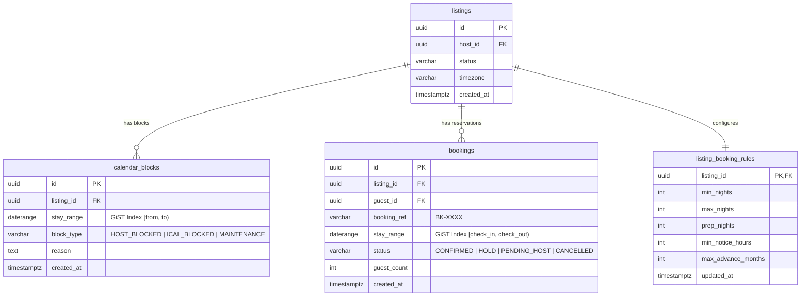

# DB Design Contract — Slice S09: Lịch Listing & Chống Đặt Trùng (H06)

> **Mục tiêu kỹ thuật**: Đảm bảo toàn vẹn dữ liệu đặt phòng theo nguyên tắc bất biến (**Non-negotiable Invariant 4**): Sử dụng kiểu dữ liệu `daterange` của PostgreSQL kết hợp `btree_gist` exclusion constraint (`23P01`) để triệt tiêu race condition và ngăn chặn hoàn toàn việc đặt trùng / chặn trùng (double-booking).

---

## 1. Sơ Đồ Thực Thể Quan Hệ (ER Diagram)



---

## 2. Lược Đồ DDL & PostgreSQL PostGIS / GiST Constraints

### 2.1 Kích hoạt Extension `btree_gist`
```sql
CREATE EXTENSION IF NOT EXISTS btree_gist;
```

### 2.2 Bảng Quy Tắc Lưu Trú (`listing_booking_rules`)
```sql
CREATE TABLE IF NOT EXISTS listing_booking_rules (
    listing_id UUID PRIMARY KEY REFERENCES listings(id) ON DELETE CASCADE,
    min_nights INT NOT NULL DEFAULT 1 CHECK (min_nights >= 1),
    max_nights INT NOT NULL DEFAULT 30 CHECK (max_nights >= min_nights),
    prep_nights INT NOT NULL DEFAULT 0 CHECK (prep_nights >= 0 AND prep_nights <= 7),
    min_notice_hours INT NOT NULL DEFAULT 0 CHECK (min_notice_hours >= 0 AND min_notice_hours <= 168),
    max_advance_months INT NOT NULL DEFAULT 6 CHECK (max_advance_months >= 1 AND max_advance_months <= 24),
    updated_at TIMESTAMPTZ NOT NULL DEFAULT CURRENT_TIMESTAMP
);
```

### 2.3 Bảng Chặn Lịch Của Host (`calendar_blocks`)
```sql
CREATE TABLE IF NOT EXISTS calendar_blocks (
    id UUID PRIMARY KEY DEFAULT gen_random_uuid(),
    listing_id UUID NOT NULL REFERENCES listings(id) ON DELETE CASCADE,
    stay_range DATERANGE NOT NULL,
    block_type VARCHAR(32) NOT NULL DEFAULT 'HOST_BLOCKED',
    reason VARCHAR(255),
    created_at TIMESTAMPTZ NOT NULL DEFAULT CURRENT_TIMESTAMP,
    updated_at TIMESTAMPTZ NOT NULL DEFAULT CURRENT_TIMESTAMP,

    -- Đảm bảo khoảng ngày hợp lệ
    CONSTRAINT chk_calendar_stay_range_not_empty CHECK (NOT isempty(stay_range)),

    -- Exclusion constraint: Không cho phép Host chặn trùng khoảng ngày đã bị chặn
    CONSTRAINT exclude_overlapping_calendar_blocks
    EXCLUDE USING gist (
        listing_id WITH =,
        stay_range WITH &&
    )
);

CREATE INDEX IF NOT EXISTS idx_calendar_blocks_listing_range 
ON calendar_blocks USING gist (listing_id, stay_range);
```

### 2.4 Exclusion Constraint Chống Đặt Trùng Tại Bảng `bookings` (BR-CAL-01)
```sql
-- Đảm bảo không thể có 2 booking đang hoạt động (CONFIRMED, HOLD, PENDING_HOST) bị trùng đêm:
ALTER TABLE bookings
ADD CONSTRAINT exclude_overlapping_active_bookings
EXCLUDE USING gist (
    listing_id WITH =,
    stay_range WITH &&
) WHERE (status IN ('CONFIRMED', 'HOLD', 'PENDING_HOST'));
```

---

## 3. Quy Tắc Xử Lý Concurrency & 409 Conflict

1. **Atomic All-or-Nothing (BR-CAL-02)**: Thao tác chặn dãy ngày phải chạy trong 1 Database Transaction duy nhất (`@Transactional(isolation = Isolation.REPEATABLE_READ)`).
2. **Kiểm tra va chạm chéo**:
   - Khi Host chặn `stay_range`, câu lệnh kiểm tra:
   ```sql
   SELECT id, booking_ref, stay_range 
   FROM bookings 
   WHERE listing_id = :listingId 
     AND status IN ('CONFIRMED', 'HOLD', 'PENDING_HOST')
     AND stay_range && :requestedRange;
   ```
   - Nếu tìm thấy bất kỳ booking nào, lập tức ROLLBACK và trả về HTTP `409 Conflict` kèm danh sách ngày xung đột `{ conflicts: [...] }` theo chuẩn RFC 7807 Problem Details.
