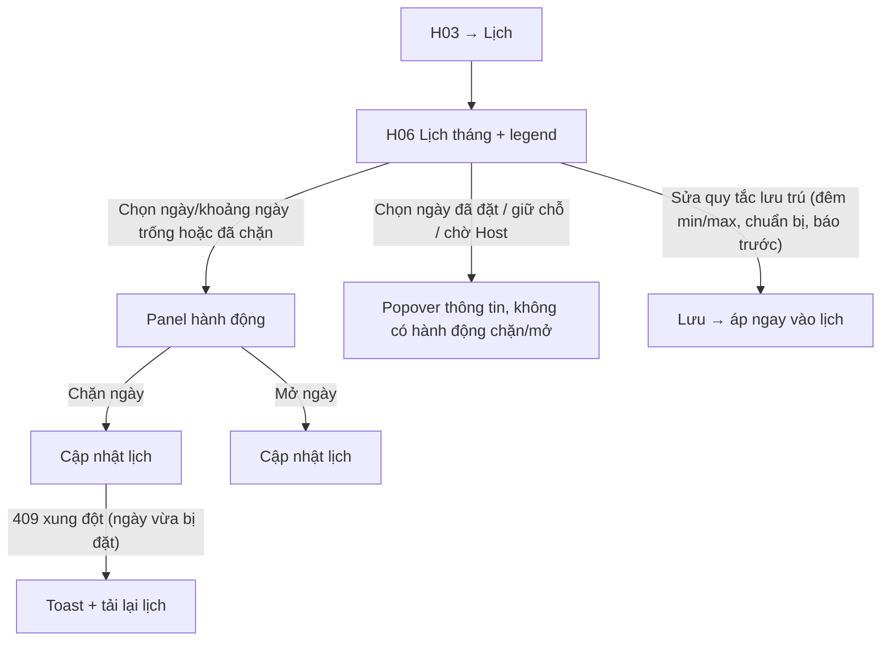

### S09 · Lịch listing (H06)

```mermaid
flowchart TD
  H3["H03 → Lịch"] --> C["H06 Lịch tháng + legend"]
  C -->|"Chọn ngày/khoảng ngày trống hoặc đã chặn"| P["Panel hành động"]
  P -->|"Chặn ngày"| B["Cập nhật lịch"]
  P -->|"Mở ngày"| O["Cập nhật lịch"]
  C -->|"Chọn ngày đã đặt / giữ chỗ / chờ Host"| I["Popover thông tin, không có hành động chặn/mở"]
  C -->|"Sửa quy tắc lưu trú (đêm min/max, chuẩn bị, báo trước)"| R["Lưu → áp ngay vào lịch"]
  B -->|"409 xung đột (ngày vừa bị đặt)"| X["Toast + tải lại lịch"]
```

