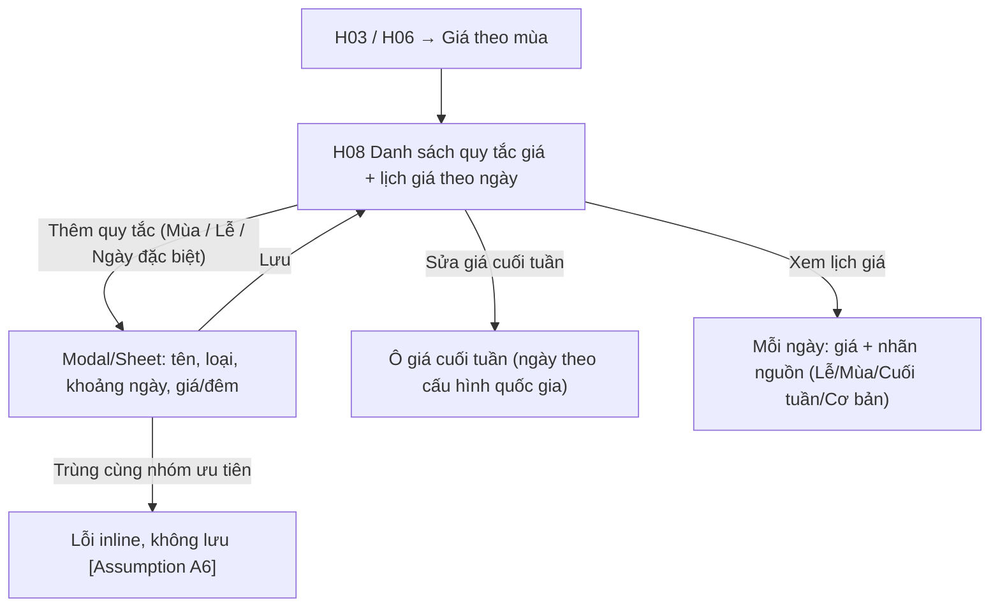

# Đặc Tả Kỹ Thuật Giao Diện · S10-SEASONAL-PRICING

> Thư mục này đóng gói toàn bộ: **User Flow**, **Wireframes**, **UX Behavior**, và **Screen Data/API Contract** cho S10.


---

### S10 · Giá theo mùa/lễ/đặc biệt (H08)



---


## S10 · Giá theo mùa, lễ, ngày đặc biệt

### H08 · Giá theo mùa/lễ/ngày đặc biệt
| Mục | Giá trị |
|---|---|
| Route / Role | `/host/listings/:id/pricing-rules` · Host (listing Đang hiển thị / Tạm ẩn) [Assumption] |
| Component | Khối **Thứ tự ưu tiên giá** (4 bậc: Đặc biệt/Lễ → Mùa → Cuối tuần → Cơ bản; sau cùng giảm tuần/tháng) dạng stepper dọc, ô **Giá cuối tuần** (kèm "Đêm áp dụng: Thứ Sáu, Thứ Bảy – theo cấu hình quốc gia"), DataTable/ListCards **Quy tắc giá** (Tên, Loại, Khoảng ngày, Giá/đêm, Trạng thái ⏳sắp tới/●đang áp dụng/⌛đã qua), Modal/Sheet **Thêm-sửa quy tắc**, CMP-23 **Lịch giá** (mỗi ô: giá + nhãn nguồn), CMP-25 xoá, CMP-32 |
| Action | Sửa giá cuối tuần · Thêm quy tắc (Mùa/Lễ/Đặc biệt) · Sửa · Xoá · Xem lịch giá theo tháng · Bấm một ngày → tooltip "Giá 1.800.000 – nguồn: Lễ 30/4" · Lọc theo loại |
| State | **Loading** · **Default** · **Rỗng** (chưa có quy tắc: "Chỉ dùng giá cơ bản và cuối tuần") · **Modal: Default/Validating/Submitting/Lỗi trường (giá ≤ 0, ngày kết thúc < bắt đầu, ngày quá khứ)/Trùng cùng nhóm ưu tiên (liệt kê quy tắc xung đột) [Assumption A6]/Lưu thành công** · **Cảnh báo ảnh hưởng** ("Quy tắc này thay đổi giá của 5 đêm đã có booking? – không ảnh hưởng booking cũ" 🔒 Phase sau) · **Lịch giá loading** · **Lỗi tải/lưu** · **Offline** |

🖥 Desktop
```
┌────────┬───────────────────────────────────────────────────────────────────────┐
│ Sidebar│ ← Nhà trên đồi Đà Lạt · Giá          [Lịch →]                           │
│        │ Thứ tự áp dụng: ① Đặc biệt/Lễ → ② Mùa → ③ Cuối tuần → ④ Cơ bản → giảm tuần/tháng│
│        │ ┌─ Giá cơ bản & cuối tuần ───────────────────────────────────────┐   │
│        │ │ Giá cơ bản 1.200.000₫ [Sửa ở bước 6]  Cuối tuần [1.500.000]₫    │   │
│        │ │ ⓘ Áp dụng cho đêm Thứ Sáu và Thứ Bảy                           │   │
│        │ └────────────────────────────────────────────────────────────────┘   │
│        │ Quy tắc giá                                  [+ Thêm quy tắc] [Loại ▼]│
│        │ ┌──────────┬────────┬───────────────┬──────────┬────────┬───┐       │
│        │ │ Tên      │ Loại   │ Khoảng ngày   │ Giá/đêm  │ Trạng thái│ ⋮ │       │
│        │ ├──────────┼────────┼───────────────┼──────────┼────────┼───┤       │
│        │ │ Tết 2027 │ Lễ     │ 05/02–12/02   │ 2.400.000│ ⏳ Sắp tới│ ⋮ │       │
│        │ │ Mùa hè   │ Mùa    │ 01/06–31/08   │ 1.600.000│ ⌛ Đã qua│ ⋮ │       │
│        │ └──────────┴────────┴───────────────┴──────────┴────────┴───┘       │
│        │ Lịch giá  ‹ Tháng 2/2027 ›   Chú thích: [Lễ][Mùa][Cuối tuần][Cơ bản]    │
│        │ │ 5 │ 6 │ 7 │ 8 │…  mỗi ô: số ngày + giá (k) + chấm màu nguồn          │
└────────┴───────────────────────────────────────────────────────────────────────┘
Modal "Thêm quy tắc": Loại (◉Lễ ○Mùa ○Ngày đặc biệt) · Tên · Khoảng ngày [DateRange] · Giá/đêm [___]₫ · [Huỷ][Lưu]
```
📱 Mobile
```
┌──────────────────────────────┐
│ ←  Giá · Nhà trên đồi         │
│ [Lịch] [Giá theo mùa]         │
│ Thứ tự áp dụng ▸ (gập)        │
│ Cơ bản 1.200.000₫  Sửa ở B6 → │
│ Cuối tuần [1.500.000]₫        │
│ Quy tắc giá          [+ Thêm] │
│ ┌──────────────────────────┐ │
│ │ Tết 2027 · Lễ   ⏳ Sắp tới │ │
│ │ 05/02–12/02 · 2.400.000₫ ⋮│ │
│ └──────────────────────────┘ │
│ Lịch giá (cuộn dọc theo tháng)│
└──────────────────────────────┘
 Thêm/Sửa → bottom sheet cao 90%
```

---


---


## S10 · Giá theo mùa, lễ, ngày đặc biệt (H08)

- **Khối thứ tự ưu tiên** (luôn hiển thị, gập được): ① Đặc biệt/Lễ → ② Mùa → ③ Cuối tuần → ④ Cơ bản; sau cùng "Giảm giá tuần/tháng áp lên tổng tiền đêm". Mục đích: Host hiểu vì sao một đêm có giá đó.
- **Giá cuối tuần**: sửa tại chỗ (Enter hoặc rời ô để lưu, SaveIndicator); nhãn đêm áp dụng lấy từ cấu hình quốc gia (VN: Thứ Sáu, Thứ Bảy).
- **Thêm/Sửa quy tắc** (Modal/Sheet): Loại · Tên (tuỳ chọn, mặc định theo loại) · Khoảng ngày (DateRange, không cho ngày quá khứ) · Giá/đêm (> 0).
  - **Trùng cùng nhóm ưu tiên** [A6]: lỗi inline liệt kê quy tắc xung đột kèm link "Sửa quy tắc đó"; không lưu. Khác nhóm chồng nhau → cho phép, hiển thị gợi ý "Trong khoảng này giá Lễ sẽ ưu tiên hơn giá Mùa".
- **Lịch giá**: mỗi ô = số ngày + giá rút gọn (1,8tr) + chấm màu nguồn; bấm ô → tooltip "Đêm 05/02: 2.400.000 ₫ – nguồn: Tết 2027 (Lễ)". Dữ liệu từ BE (G1), tải theo tháng.
- **Sửa/xoá quy tắc đang áp dụng hoặc sắp tới**: ConfirmDialog nêu hậu quả ("Giá các đêm chưa đặt trong khoảng này sẽ trở về giá mùa/cuối tuần/cơ bản. Booking đã xác nhận không bị ảnh hưởng"). Quy tắc **đã qua**: chỉ đọc.
- **Rỗng**: giải thích "Hiện tại chỉ áp dụng giá cơ bản và giá cuối tuần" + CTA Thêm quy tắc đầu tiên.
- Sau mỗi thay đổi: lịch giá và bảng quy tắc refetch; hiển thị toast.

---


---


## S10 · Giá theo mùa, lễ, ngày đặc biệt (H08)

### Quy tắc giá (`PriceRule`)
| Trường | Kiểu | Quy tắc |
|---|---|---|
| id | | |
| type | `WEEKEND｜SEASON｜HOLIDAY｜SPECIAL` | WEEKEND chỉ 1 bản ghi/listing |
| name | text ≤60 | Mặc định theo loại |
| dateFrom / dateTo | date | `SEASON/HOLIDAY/SPECIAL` bắt buộc; không quá khứ; to ≥ from; **không chồng cùng nhóm ưu tiên** (HOLIDAY+SPECIAL cùng bậc ①, SEASON bậc ②) [A6] |
| nightlyPrice | Money | > 0 |
| phase | `UPCOMING｜ACTIVE｜PAST` | BE tính (hiển thị badge) |
| weekendNights | `['FRI','SAT']` | Từ CountryConfig (Việt Nam) – chỉ đọc |

### Lịch giá – `GET /host/listings/:id/price-calendar?from=&to=`
`days[] {date, price: Money, source: BASE｜WEEKEND｜SEASON｜HOLIDAY｜SPECIAL, ruleId?}` – nguồn là kết quả của **PricingEngine**.

| API | Mục đích |
|---|---|
| `GET /host/listings/:id/pricing-rules` | Danh sách |
| `POST/PATCH/DELETE /host/listings/:id/pricing-rules/:rid` | CRUD; 409 `{conflictingRuleIds[]}` khi chồng |
| `PUT /host/listings/:id/pricing-rules/weekend` `{nightlyPrice}` | Giá cuối tuần |

**Cấu hình quốc gia (CountryConfig.VN – seed):** `weekendNights = [FRI, SAT]`.

---

