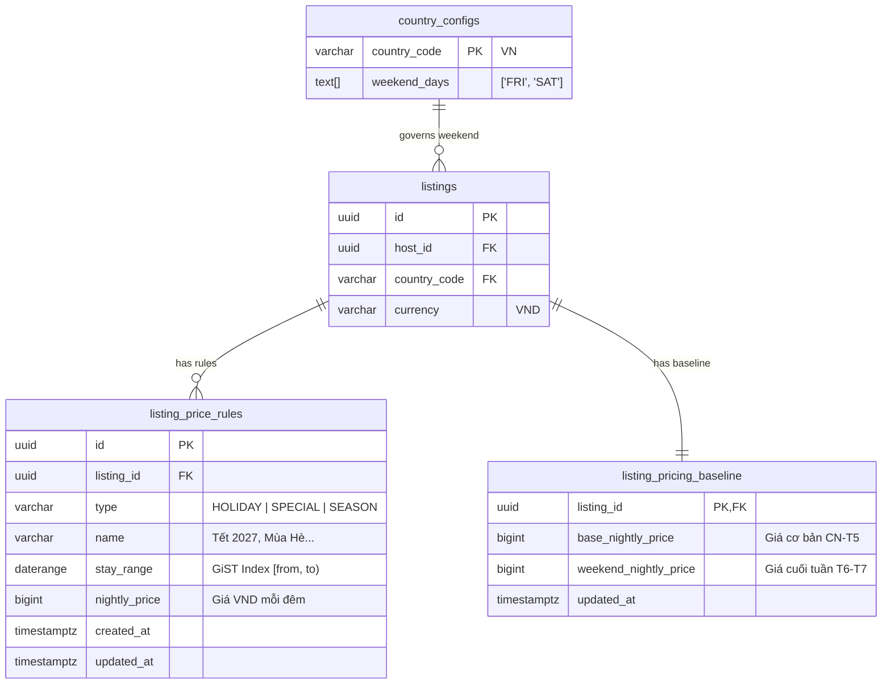

# DB Design Contract — Slice S10: Giá Theo Mùa & Ngày Lễ (H08)

> **Mục tiêu kỹ thuật**: Lưu trữ các quy tắc giá tùy biến, bảng giá cuối tuần và tính toán giá mỗi đêm theo mô hình **Ưu tiên 4 bậc (Pricing Hierarchy)** kết hợp Exclusion Constraint PostgreSQL để ngăn chặn hoàn toàn việc chồng chéo khoảng ngày trong cùng một nhóm ưu tiên ([Assumption A6]).

---

## 1. Sơ Đồ Thực Thể Quan Hệ (ER Diagram)



---

## 2. Lược Đồ DDL & PostgreSQL PostGIS / GiST Constraints

### 2.1 Kích hoạt Extension `btree_gist`
```sql
CREATE EXTENSION IF NOT EXISTS btree_gist;
```

### 2.2 Bảng Bảng Giá Cơ Sở & Cuối Tuần (`listing_pricing_baseline`)
```sql
CREATE TABLE IF NOT EXISTS listing_pricing_baseline (
    listing_id UUID PRIMARY KEY REFERENCES listings(id) ON DELETE CASCADE,
    base_nightly_price BIGINT NOT NULL CHECK (base_nightly_price >= 10000),
    weekend_nightly_price BIGINT NOT NULL CHECK (weekend_nightly_price >= 10000),
    updated_at TIMESTAMPTZ NOT NULL DEFAULT CURRENT_TIMESTAMP
);
```

### 2.3 Bảng Quy Tắc Giá Theo Mùa & Lễ (`listing_price_rules`)
```sql
CREATE TABLE IF NOT EXISTS listing_price_rules (
    id UUID PRIMARY KEY DEFAULT gen_random_uuid(),
    listing_id UUID NOT NULL REFERENCES listings(id) ON DELETE CASCADE,
    type VARCHAR(32) NOT NULL CHECK (type IN ('HOLIDAY', 'SPECIAL', 'SEASON')),
    name VARCHAR(100) NOT NULL,
    stay_range DATERANGE NOT NULL,
    nightly_price BIGINT NOT NULL CHECK (nightly_price >= 10000),
    created_at TIMESTAMPTZ NOT NULL DEFAULT CURRENT_TIMESTAMP,
    updated_at TIMESTAMPTZ NOT NULL DEFAULT CURRENT_TIMESTAMP,

    CONSTRAINT chk_price_rule_range_not_empty CHECK (NOT isempty(stay_range)),

    -- Exclusion Constraint 1: Nhóm Bậc 1 (HOLIDAY & SPECIAL) không được chồng ngày nhau [A6]
    CONSTRAINT exclude_overlapping_tier1_price_rules
    EXCLUDE USING gist (
        listing_id WITH =,
        stay_range WITH &&
    ) WHERE (type IN ('HOLIDAY', 'SPECIAL')),

    -- Exclusion Constraint 2: Nhóm Bậc 2 (SEASON) không được chồng ngày nhau [A6]
    CONSTRAINT exclude_overlapping_tier2_price_rules
    EXCLUDE USING gist (
        listing_id WITH =,
        stay_range WITH &&
    ) WHERE (type = 'SEASON')
);

CREATE INDEX IF NOT EXISTS idx_listing_price_rules_range 
ON listing_price_rules USING gist (listing_id, stay_range);
```

---

## 3. Thuật Toán Định Giá Đa Tầng (PricingEngine Hierarchy)

Khi truy vấn giá của một đêm `date` cho `listing_id`:
1. **Bậc 1 (Cao nhất)**: Tìm trong `listing_price_rules` với `type IN ('HOLIDAY', 'SPECIAL')` và `stay_range @> date`. Nếu có $\rightarrow$ Trả về giá này (Nguồn: `HOLIDAY` hoặc `SPECIAL`).
2. **Bậc 2**: Tìm trong `listing_price_rules` với `type = 'SEASON'` và `stay_range @> date`. Nếu có $\rightarrow$ Trả về giá này (Nguồn: `SEASON`).
3. **Bậc 3**: Kiểm tra ngày trong tuần (`EXTRACT(DOW FROM date)`: 5 là Thứ 6, 6 là Thứ 7 theo cấu hình Việt Nam). Nếu rơi vào cuối tuần $\rightarrow$ Trả về `weekend_nightly_price` (Nguồn: `WEEKEND`).
4. **Bậc 4 (Cơ sở)**: Mặc định trả về `base_nightly_price` (Nguồn: `BASE`).
