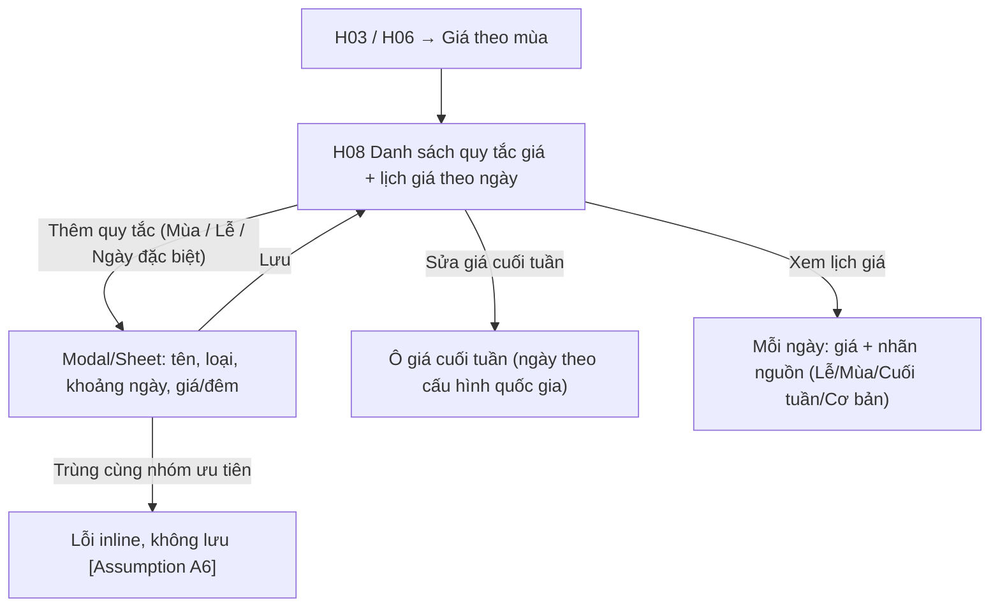

### S10 · Giá theo mùa/lễ/đặc biệt (H08)

```mermaid
flowchart TD
  H3["H03 / H06 → Giá theo mùa"] --> L["H08 Danh sách quy tắc giá + lịch giá theo ngày"]
  L -->|"Thêm quy tắc (Mùa / Lễ / Ngày đặc biệt)"| M["Modal/Sheet: tên, loại, khoảng ngày, giá/đêm"]
  M -->|"Trùng cùng nhóm ưu tiên"| E["Lỗi inline, không lưu [Assumption A6]"]
  M -->|"Lưu"| L
  L -->|"Sửa giá cuối tuần"| W["Ô giá cuối tuần (ngày theo cấu hình quốc gia)"]
  L -->|"Xem lịch giá"| Cal["Mỗi ngày: giá + nhãn nguồn (Lễ/Mùa/Cuối tuần/Cơ bản)"]
```

