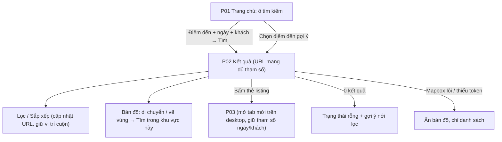

# Đặc Tả Kỹ Thuật Giao Diện · S11-HOME-SEARCH

> Thư mục này đóng gói toàn bộ: **User Flow**, **Wireframes**, **UX Behavior**, và **Screen Data/API Contract** cho S11.


---

### S11 · Trang chủ & tìm kiếm (P01, P02)



---


## S11 · Trang chủ và tìm kiếm

### P01 · Trang chủ
| Mục | Giá trị |
|---|---|
| Route / Role | `/` · Khách vãng lai, Guest (Host ở chế độ Guest) |
| Component | Public Shell, Hero + CMP-18 SearchBar (Đi đâu · Ngày · Khách), CMP-16, CMP-17, danh sách **Điểm đến phổ biến** (từ Location seed + số listing), **Chỗ ở nổi bật** (CMP-19 carousel), banner "Trở thành Host" → P10, khối Cách hoạt động (3 bước), Footer |
| Action | Nhập/chọn điểm đến (gợi ý) · Chọn ngày · Chọn khách · **Tìm** · Bấm điểm đến phổ biến · Bấm thẻ listing · Bấm "Trở thành Host" |
| State | **Loading** (skeleton hero + carousel) · **Default** · **SearchBar: rỗng / đang gợi ý / không có gợi ý / ngày không hợp lệ / thiếu điểm đến** · **Không có listing nổi bật** (ẩn khối, không hiển thị rỗng) · **Lỗi tải khối** (từng khối tự thử lại, không phá trang) · **Offline** |

🖥 Desktop
```
┌──────────────────────────────────────────────────────────────────────────┐
│ ◈ Logo                       Trở thành Host   VI▼  ₫▼  👤▼                  │
├──────────────────────────────────────────────────────────────────────────┤
│                  Tìm chỗ ở như người bản địa                              │
│ ┌──────────────────────┬──────────────────┬──────────────┬───────────┐   │
│ │ Đi đâu               │ Nhận – Trả phòng │ Khách        │ [ 🔍 Tìm ] │   │
│ │ [Đà Lạt, Lâm Đồng___]│ [12/12 → 15/12]  │ [2 người lớn]│           │   │
│ └──────────────────────┴──────────────────┴──────────────┴───────────┘   │
│ Điểm đến phổ biến                                                         │
│  [▢ Đà Lạt 120+] [▢ Hội An 85] [▢ Sa Pa 60] [▢ Vũng Tàu 74]               │
│ Chỗ ở nổi bật  ‹ ▢ ▢ ▢ ▢ ›                                                │
│ ┌──────────────────────────────────────────────────────────────────┐    │
│ │ Bạn có chỗ ở? Trở thành Host                       [ Bắt đầu ]     │    │
│ └──────────────────────────────────────────────────────────────────┘    │
└──────────────────────────────────────────────────────────────────────────┘
```
📱 Mobile
```
┌──────────────────────────────┐
│ ◈ Logo              VI▼  ☰   │
│ ┌──────────────────────────┐ │
│ │ 🔍 Bạn muốn đi đâu?       │ │ ← bấm → mở full-screen: Điểm đến › Ngày › Khách
│ │ Ngày bất kỳ · Thêm khách  │ │
│ └──────────────────────────┘ │
│ Điểm đến phổ biến →(cuộn ngang)│
│ [▢Đà Lạt][▢Hội An][▢Sa Pa]    │
│ Chỗ ở nổi bật → (carousel)     │
│ [ Banner Trở thành Host ]     │
├──────────────────────────────┤
│ 🔍Khám phá ♡ ✈ ✉ 👤           │
└──────────────────────────────┘
```
Tablet: SearchBar 1 hàng thu gọn, lưới điểm đến 3 cột.
SearchBar mobile (full-screen 3 bước, có thể chạm bước bất kỳ): `Đi đâu` (ô tìm + gợi ý + "Gần tôi"*) → `Ngày` (CMP-16 1 tháng cuộn dọc) → `Khách` (CMP-17) → nút **Tìm** sticky đáy.

### P02 · Kết quả tìm kiếm (danh sách + bản đồ)
| Mục | Giá trị |
|---|---|
| Route / Role | `/search?destination=&checkin=&checkout=&adults=&children=&sort=&price=&type=&bedrooms=&amenities=&instant=&policy=&bbox=` · Khách vãng lai, Guest |
| Component | CMP-18 SearchBar thu gọn, hàng **FilterChip** (Giá, Loại hình, Phòng ngủ, Tiện nghi, Instant Book, Chính sách huỷ, [Đánh giá 🔒]), nút **Bộ lọc** (CMP-20 FilterPanel), Select **Sắp xếp** (Liên quan, Giá ↑, Giá ↓, [Đánh giá 🔒], Mới nhất), tổng số kết quả, CMP-19 ×N, CMP-21 MapPanel + nút "Tìm trong khu vực này" + công tắc "Tìm khi di chuyển bản đồ", chip "Khu vực bản đồ ✕", phân trang "Hiển thị thêm" |
| Action | Đổi điểm đến/ngày/khách · Mở/đóng/Áp dụng/Xoá bộ lọc · Đổi sắp xếp · Di chuyển/zoom/vẽ vùng bản đồ · Bấm marker (popup thẻ) · Hover thẻ ↔ marker sáng lên · Bấm thẻ → P03 (giữ ngày/khách) · Chuyển Danh sách ⇄ Bản đồ (mobile) · Xoá tất cả bộ lọc |
| State (trang) | **Loading lần đầu** (skeleton thẻ + map placeholder) · **Loading cập nhật** (giữ kết quả cũ mờ 60% + thanh tiến trình trên, tránh nhảy layout) · **Có kết quả** · **Hết kết quả khi tải thêm** ("Bạn đã xem hết") · **0 kết quả** (EmptyState + gợi ý: Bỏ bớt bộ lọc [liệt kê chip], Đổi ngày, Mở rộng bản đồ, Xem khu vực lân cận) · **Lỗi** (Thử lại, giữ tham số) · **Offline** · **Ngày không hợp lệ** (check-out ≤ check-in → lỗi ở SearchBar) · **Không có token Mapbox/lỗi bản đồ** (ẩn bản đồ, banner nhỏ "Bản đồ tạm không khả dụng", danh sách dùng bình thường, bỏ nút Bản đồ) |
| State (giá trên thẻ) | **Có ngày** → "5.300.000 ₫ tổng · 3 đêm" + dòng nhỏ "Đã gồm phí và thuế" + "1.766.000 ₫/đêm" · **Chưa chọn ngày** → "Từ 1.200.000 ₫/đêm" · **Giá quy đổi** (S13) → nhãn "≈" + tooltip tiền tệ gốc · **Giá đang tính** (skeleton dòng giá) |
| State (thẻ) | Default · Hover · Loading ảnh (blur placeholder) · Lỗi ảnh (ảnh mặc định) · Nhãn "Instant Book" |

🖥 Desktop (≥1024: danh sách trái 55% – bản đồ phải 45%, sticky)
```
┌──────────────────────────────────────────────────────────────────────────────┐
│ ◈ Logo  [Đà Lạt │ 12/12–15/12 │ 2 người lớn │🔍]          VI▼ ₫▼ 👤▼            │
├──────────────────────────────────────────────────────────────────────────────┤
│ [Giá ▼][Loại hình ▼][Phòng ngủ ▼][Tiện nghi ▼][⚡Instant][Chính sách ▼][Bộ lọc(2)]│
│ 48 chỗ ở · Sắp xếp [Liên quan ▼]  [x] Tìm khi di chuyển bản đồ                  │
│ ┌──────────────────────────────────────┐ ┌──────────────────────────────────┐ │
│ │ ┌────────┐ Nhà trên đồi · Nguyên căn │ │          B Ả N   Đ Ồ              │ │
│ │ │ ▢ ◂ ▸  │ Phường 3, Đà Lạt · 4 khách │ │     (5,3tr)   (4,8tr)            │ │
│ │ └────────┘ 2 PN · 3 giường  ⚡Instant │ │          ● (6,1tr)               │ │
│ │            5.300.000 ₫ tổng · 3 đêm   │ │  (2,2tr)                         │ │
│ │            Đã gồm phí và thuế         │ │              [Tìm trong khu vực này]│ │
│ ├──────────────────────────────────────┤ │  [+][−]                          │ │
│ │ ┌────────┐ Phòng riêng view núi …    │ └──────────────────────────────────┘ │
│ │ └────────┘                           │                                       │
│ │ [ Hiển thị thêm ]                    │                                       │
│ └──────────────────────────────────────┘                                       │
└──────────────────────────────────────────────────────────────────────────────┘
```
📱 Mobile (mặc định Danh sách; nút nổi **Bản đồ** ⇄ **Danh sách**)
```
┌──────────────────────────────┐      ┌──────────────────────────────┐
│ ←  Đà Lạt · 12/12–15/12 · 2  │      │ ←  Đà Lạt · 12/12–15/12 · 2  │
│ [Sắp xếp ▼]      [⚙ Lọc (2)] │      │ ┌──────────────────────────┐ │
│ 48 chỗ ở                      │      │ │       BẢN ĐỒ toàn màn    │ │
│ ┌──────────────────────────┐ │      │ │   (5,3tr) (4,8tr)        │ │
│ │ ▢ ◂ ▸  ♡🔒              │ │      │ │         ●                │ │
│ │ Nhà trên đồi · Nguyên căn │ │      │ │ [Tìm trong khu vực này]  │ │
│ │ Phường 3, Đà Lạt          │ │      │ └──────────────────────────┘ │
│ │ 5.300.000 ₫ tổng · 3 đêm  │ │      │ ┌ thẻ marker được chọn ────┐ │
│ │ Đã gồm phí và thuế        │ │      │ │ ▢ Nhà trên đồi 5,3tr     │ │
│ └──────────────────────────┘ │      │ └──────────────────────────┘ │
│            [ 🗺 Bản đồ ]      │      │            [ ☰ Danh sách ]   │
└──────────────────────────────┘      └──────────────────────────────┘
```
Bộ lọc (Desktop = Modal 640px; Mobile = full-screen sheet có header [✕ Xoá tất cả] và footer sticky **[Hiển thị 48 kết quả]** – số cập nhật theo lựa chọn):
```
┌ Bộ lọc ─────────────────────────────────────────── ✕ ┐
│ Khoảng giá/đêm   [min 0 ₫]──●──────●──[max 5.000.000 ₫]│
│ Loại hình        ( ) Tất cả (●) Nguyên căn ( ) Phòng riêng│
│ Phòng ngủ        [Bất kỳ][1][2][3][4+]                   │
│ Tiện nghi        [x] Wi-Fi [x] Bếp [ ] Hồ bơi  Xem thêm ▾│
│ Đặt phòng        [ ] Chỉ Instant Book                    │
│ Chính sách huỷ   [ ] Linh hoạt [ ] Trung bình [ ] Nghiêm ngặt│
│ (🔒 Điểm đánh giá – ẩn đến khi có đánh giá)               │
│ [ Xoá tất cả ]                       [ Hiển thị 48 kết quả ]│
└──────────────────────────────────────────────────────────┘
```
Tablet: danh sách 1 cột + bản đồ thu thành bảng trượt hoặc chuyển đổi như mobile (<900px), thẻ ngang.

---


---


## S11 · Trang chủ và tìm kiếm

**SearchBar**
- **Điểm đến**: combobox (ARIA) – gợi ý sau 2 ký tự (debounce 300 ms) từ danh mục Location (khu vực + tên listing nổi bật*); phím ↑↓ Enter chọn; Esc đóng; hiển thị "Tìm gần đây" (localStorage, tối đa 5) khi ô rỗng và được focus.
- **Ngày**: không cho chọn quá khứ; trả phòng > nhận phòng; hiển thị "n đêm"; xoá ngày được. **Khách**: người lớn ≥ 1, trẻ em ≥ 0, tối đa 16 tổng [A7].
- Thiếu điểm đến khi bấm Tìm → lỗi inline "Hãy chọn điểm đến" (không điều hướng). Có thể tìm không cần ngày/khách.

**Kết quả (P02)**
- **URL là nguồn sự thật**: mọi thay đổi (điểm đến, ngày, khách, lọc, sắp xếp, vùng bản đồ) cập nhật query string; nút Back khôi phục đúng trạng thái; chia sẻ được liên kết. Thay đổi bộ lọc dùng `replace` (không đẩy lịch sử mỗi lần), thay đổi tìm kiếm chính dùng `push`.
- **Cập nhật kết quả**: giữ danh sách cũ mờ 60% + thanh tiến trình mảnh trên đầu; sau khi dữ liệu mới về thì thay thế và **giữ vị trí cuộn** nếu chỉ đổi sắp xếp/bản đồ, **cuộn lên đầu** nếu đổi bộ lọc/tìm kiếm.
- **Bộ lọc**: chip hiển thị giá trị đã chọn ("Giá: 500k–2tr"); mở panel → thay đổi **chưa áp dụng** cho tới khi bấm "Hiển thị n kết quả"; số n **cập nhật trực tiếp** (debounce 400 ms) – nếu n = 0 nút đổi thành "Không có kết quả" và disabled. "Xoá tất cả" trả về mặc định (giữ điểm đến/ngày/khách).
- **Sắp xếp**: Liên quan (mặc định) · Giá thấp→cao · Giá cao→thấp · Mới nhất · (🔒 Đánh giá – ẩn khi `reviewsEnabled=false` [A8]). Giá sắp xếp theo **tổng giá khi có ngày**, theo giá/đêm khi chưa chọn ngày.
- **Phân trang**: 24 thẻ/lần, nút **"Hiển thị thêm"** (không cuộn vô hạn tự động để chân trang truy cập được); hiển thị "Đang xem 24/48".
- **Thẻ listing**: ảnh carousel (mũi tên desktop, vuốt mobile; tải lười, ảnh đầu ưu tiên); hover thẻ làm marker tương ứng nổi bật và ngược lại; bấm thẻ: **desktop mở tab mới**, mobile mở cùng tab; giữ `checkin/checkout/adults/children` trong URL chi tiết.
- **Giá trên thẻ**: có ngày → "Tổng … · n đêm" + "Đã gồm phí và thuế" + giá/đêm trung bình phụ; chưa có ngày → "Từ … /đêm" (S11 AC). Khi tính giá chậm: skeleton dòng giá, thẻ vẫn bấm được.
- **Bản đồ**:
  - Marker hiện **tổng giá** (có ngày) hoặc giá/đêm (rút gọn "5,3tr"); gom cụm khi zoom < 12; bấm marker → popup thẻ rút gọn → bấm để mở chi tiết.
  - Di chuyển/zoom: hiện nút **"Tìm trong khu vực này"** (mặc định). Bật "Tìm khi di chuyển bản đồ" → tự cập nhật sau 500 ms. Khu vực áp dụng = khung nhìn hiện tại (bbox) [A18]; hiển thị chip "Khu vực bản đồ ✕" để gỡ.
  - Mobile: bản đồ toàn màn hình; thẻ marker đang chọn nổi ở đáy; nút ☰ trở về danh sách; giữ trạng thái bản đồ khi chuyển qua lại.
  - **Không có token Mapbox/lỗi tải**: ẩn bản đồ và nút "Bản đồ", chỉ danh sách + banner nhỏ có thể đóng (S11 AC).
- **0 kết quả**: tiêu đề "Không tìm thấy chỗ ở phù hợp"; gợi ý theo thứ tự: (1) gỡ từng bộ lọc đang bật (chip có ✕), (2) "Thử ngày khác", (3) "Xem toàn bộ {khu vực}"; hiển thị cả khi bản đồ đang thu hẹp.
- **Hiệu năng**: ảnh `srcset`/lazy; skeleton lần đầu ≤ 200 ms; mục tiêu phản hồi tìm kiếm tham khảo < 500 ms (S11 AC) – FE hiển thị loading nếu quá 200 ms.

**Trang chủ (P01)**: Điểm đến phổ biến (≤ 8, theo số listing đang hiển thị), Chỗ ở nổi bật (≤ 8, theo xếp hạng); khối nào lỗi hoặc rỗng thì **ẩn khối đó** thay vì hiện lỗi to; SearchBar mobile mở full-screen 3 bước.

---


---


## S11 · Trang chủ và tìm kiếm

### P01
| Khối | Dữ liệu | Nguồn |
|---|---|---|
| SearchBar | destinationSuggestions[] `{type: REGION｜LISTING, id, label, sublabel}` | `GET /search/suggest?q=` (Location + listing) |
| Điểm đến phổ biến (≤8) | `{regionId, name, imageUrl, listingCount}` | Location + đếm listing ACTIVE |
| Chỗ ở nổi bật (≤8) | `ListingCardDTO` (bên dưới) | Xếp hạng (BR-SRC-03 phần có dữ liệu) |

### P02 – truy vấn
| Tham số URL | Kiểu | Ghi chú |
|---|---|---|
| destination (regionId hoặc text), checkin, checkout | | Ngày theo múi giờ listing |
| adults, children | int | [A7] |
| minPrice, maxPrice | int (đơn vị tiền tệ hiển thị) | |
| type | `ENTIRE_PLACE｜PRIVATE_ROOM` | |
| bedrooms | int (4 = 4+) | |
| amenities | id[] | |
| instant | boolean | |
| policy | `FLEXIBLE｜MODERATE｜STRICT` (nhiều) | |
| sort | `RELEVANCE｜PRICE_ASC｜PRICE_DESC｜NEWEST` (+ `RATING` khi `reviewsEnabled`) | |
| bbox | `minLng,minLat,maxLng,maxLat` | Vùng bản đồ |
| cursor/page | | 24/lần |
| currency | | Từ S13 |

### ListingCardDTO (P01, P02, P04)
| Trường | Ghi chú |
|---|---|
| id, title, propertyType, areaLabel (khu vực xấp xỉ) | **Không** có địa chỉ chính xác |
| photos[] (≤5 url, kích thước thẻ) | |
| maxGuests, bedrooms, beds | |
| bookingMode (nhãn Instant) | |
| price `{ mode: 'TOTAL'｜'FROM_NIGHTLY', total?: Money, nightlyAvg?: Money, nights?, includesFeesAndTaxes: boolean, converted?: {original: Money, rateDate} }` | TOTAL khi có ngày (BR-SRC-02); FROM_NIGHTLY khi chưa chọn ngày |
| map `{lat, lng}` (**toạ độ xấp xỉ**) | Cho marker |
| rating (🔒 ẩn khi `reviewsEnabled=false`) | |

### Phản hồi tìm kiếm – `GET /search/listings`
`{ items: ListingCardDTO[], total, nextCursor, appliedFilters, facets? {priceRange{min,max}, amenityCounts}, mapMarkers[] (≤200: id, lat, lng, priceLabel), fx? {stale} }`
Thêm `GET /search/count` (cho nút "Hiển thị n kết quả" khi chỉnh bộ lọc, chỉ trả số).

---

