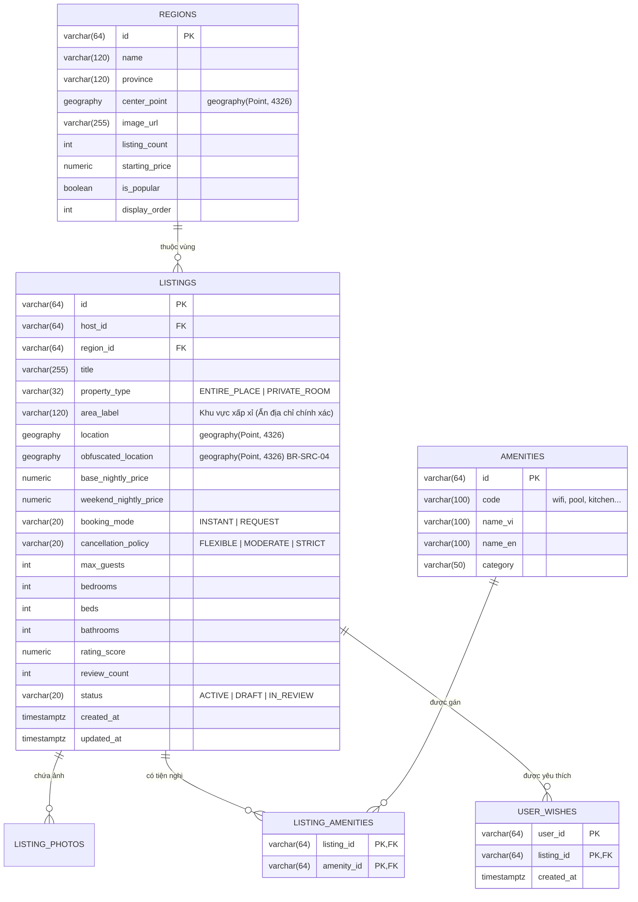

# Hợp Đồng Thiết Kế CSDL (FE-to-BE DB Handover Contract) · S11-HOME-SEARCH

> **Mục tiêu**: Cung cấp kiến trúc CSDL PostgreSQL + PostGIS đầy đủ và chuẩn xác nhất cho Module Tìm kiếm, Trang chủ và Định vị địa lý không gian (Spatial Search).

---

## 1. Biểu Đồ Thực Thể - Quan Hệ (ER Diagram)



---

## 2. Đặc Tả Bảng CSDL PostgreSQL & PostGIS

### 2.1. Kích hoạt Extension PostGIS
```sql
CREATE EXTENSION IF NOT EXISTS postgis;
```

### 2.2. Bảng `regions` (Điểm đến phổ biến)
```sql
CREATE TABLE regions (
    id VARCHAR(64) PRIMARY KEY,
    name VARCHAR(120) NOT NULL,
    province VARCHAR(120) NOT NULL,
    center_point GEOGRAPHY(Point, 4326) NOT NULL,
    image_url VARCHAR(500) NOT NULL,
    listing_count INT NOT NULL DEFAULT 0,
    starting_price NUMERIC(15, 2) NOT NULL DEFAULT 0,
    is_popular BOOLEAN NOT NULL DEFAULT FALSE,
    display_order INT NOT NULL DEFAULT 0,
    created_at TIMESTAMPTZ NOT NULL DEFAULT CURRENT_TIMESTAMP,
    updated_at TIMESTAMPTZ NOT NULL DEFAULT CURRENT_TIMESTAMP
);

CREATE INDEX idx_regions_popular ON regions(is_popular, display_order) WHERE is_popular = TRUE;
CREATE INDEX idx_regions_center_point ON regions USING GIST(center_point);
```

### 2.3. Bảng `listings` (Mở rộng cho Spatial Search)
```sql
-- Cột toạ độ thực tế và toạ độ xấp xỉ công khai BR-SRC-04
ALTER TABLE listings 
ADD COLUMN IF NOT EXISTS location GEOGRAPHY(Point, 4326),
ADD COLUMN IF NOT EXISTS obfuscated_location GEOGRAPHY(Point, 4326),
ADD COLUMN IF NOT EXISTS area_label VARCHAR(120),
ADD COLUMN IF NOT EXISTS rating_score NUMERIC(3, 2) DEFAULT 0.0,
ADD COLUMN IF NOT EXISTS review_count INT DEFAULT 0;

-- Chỉ mục không gian GiST cho truy vấn bán kính và khung nhìn Bounding Box
CREATE INDEX idx_listings_location_gist ON listings USING GIST(obfuscated_location);
CREATE INDEX idx_listings_search_composite ON listings(status, property_type, max_guests, base_nightly_price) WHERE status = 'ACTIVE';
```

---

## 3. Các Mẫu Truy Vấn Tối Ưu Cho Backend

### 3.1. Truy vấn trong Bounding Box bản đồ (`ST_MakeEnvelope`)
```sql
-- Tìm các listing ACTIVE nằm trong BBox [minLng, minLat, maxLng, maxLat]
SELECT 
    l.id,
    l.title,
    l.property_type,
    l.area_label,
    l.max_guests,
    l.bedrooms,
    l.beds,
    l.booking_mode,
    l.cancellation_policy,
    l.base_nightly_price,
    l.rating_score,
    l.review_count,
    ST_Y(l.obfuscated_location::geometry) AS lat,
    ST_X(l.obfuscated_location::geometry) AS lng
FROM listings l
WHERE l.status = 'ACTIVE'
  AND l.obfuscated_location && ST_MakeEnvelope(108.40, 11.90, 108.50, 12.00, 4326)::geography
LIMIT 24 OFFSET 0;
```

### 3.2. Truy vấn bán kính điểm đến (`ST_DWithin`)
```sql
-- Tìm listing trong bán kính 15km tính từ tâm Đà Lạt
SELECT l.id, l.title, ST_Distance(l.obfuscated_location, r.center_point) AS distance_meters
FROM listings l, regions r
WHERE r.id = 'dalat'
  AND l.status = 'ACTIVE'
  AND ST_DWithin(l.obfuscated_location, r.center_point, 15000)
ORDER BY distance_meters ASC;
```
