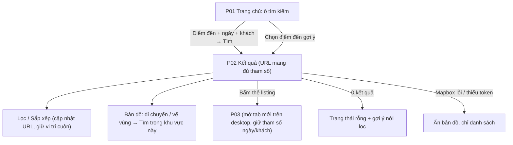

### S11 · Trang chủ & tìm kiếm (P01, P02)

```mermaid
flowchart TD
  P1["P01 Trang chủ: ô tìm kiếm"] -->|"Điểm đến + ngày + khách → Tìm"| P2["P02 Kết quả (URL mang đủ tham số)"]
  P1 -->|"Chọn điểm đến gợi ý"| P2
  P2 --> F["Lọc / Sắp xếp (cập nhật URL, giữ vị trí cuộn)"]
  P2 --> M["Bản đồ: di chuyển / vẽ vùng → Tìm trong khu vực này"]
  P2 -->|"Bấm thẻ listing"| P3["P03 (mở tab mới trên desktop, giữ tham số ngày/khách)"]
  P2 -->|"0 kết quả"| E["Trạng thái rỗng + gợi ý nới lọc"]
  P2 -->|"Mapbox lỗi / thiếu token"| D["Ẩn bản đồ, chỉ danh sách"]
```

