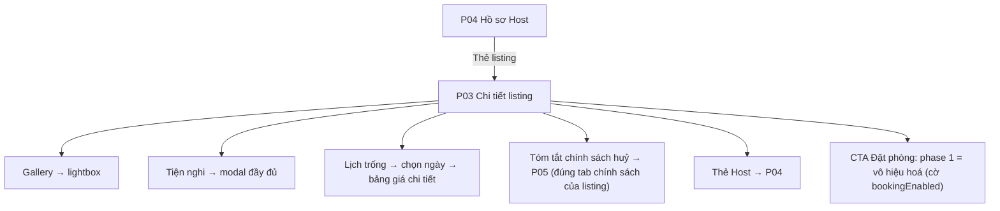

# Đặc Tả Kỹ Thuật Giao Diện · S12-LISTING-DETAIL

> Thư mục này đóng gói toàn bộ: **User Flow**, **Wireframes**, **UX Behavior**, và **Screen Data/API Contract** cho S12.


---

### S12 · Chi tiết, hồ sơ Host, chính sách huỷ (P03, P04, P05)



---


## S12 · Chi tiết listing, hồ sơ Host công khai, chính sách huỷ công khai

### P03 · Chi tiết listing
| Mục | Giá trị |
|---|---|
| Route / Role | `/rooms/:listingId?checkin=&checkout=&adults=&children=` · Khách vãng lai, Guest; **Chế độ xem trước** cho Host chủ listing và Admin (listing chưa công khai) |
| Component | CMP-26 Gallery+Lightbox, tiêu đề + khu vực xấp xỉ + loại hình + sức chứa, CMP-33 HostCard, khối **Điểm nổi bật**, Mô tả (xem thêm), CMP-29 **Tiện nghi** (10 mục + modal "Xem tất cả"), **Lịch trống** (CMP-16 chỉ đọc + chọn ngày), **Nội quy & giờ nhận/trả**, **Chính sách huỷ** (tóm tắt + CMP-27 timeline rút gọn → P05), **Vị trí** (CMP-21 vòng tròn xấp xỉ + dòng "Địa chỉ chính xác sẽ được cung cấp sau khi đặt phòng được xác nhận"), **Đánh giá** (🔒 "Chưa có đánh giá"), **Thẻ đặt phòng** (desktop sticky phải) / **Thanh giá + CTA dưới đáy** (mobile): CMP-16, CMP-17, CMP-22 PriceBreakdown, CTA |
| Action | Mở lightbox/Xem tất cả ảnh · Xem tất cả tiện nghi · Chọn ngày/khách · Mở bảng giá chi tiết/giá từng đêm · Xem chính sách huỷ → P05 · Xem hồ sơ Host → P04 · 🔒 **Đặt phòng / Gửi yêu cầu** (disabled ở giai đoạn 1: tooltip "Tính năng đặt phòng sẽ sớm ra mắt") · 🔒 Yêu thích · Chia sẻ (copy link) · Quay lại kết quả (giữ vị trí cuộn) |
| State (trang) | **Loading** (skeleton gallery + khối) · **Default** · **Không tồn tại / không còn hiển thị** (404 riêng: "Chỗ ở này hiện không khả dụng" + Gợi ý tìm chỗ khác) · **Chế độ xem trước** (banner vàng cố định "Đây là bản xem trước, chưa hiển thị công khai") · **Lỗi tải** · **Offline** |
| State (thẻ đặt phòng) | **Chưa chọn ngày** ("Từ 1.200.000 ₫/đêm" + "Thêm ngày để xem tổng giá") · **Đang tính giá** (skeleton) · **Có giá** (bảng đầy đủ: tiền phòng, phụ thu, phí vệ sinh, giảm giá [số âm, màu xanh], phí dịch vụ, thuế, **Tổng**) · **Ngày không còn trống** (lỗi + gợi ý khoảng trống gần nhất) · **Vi phạm đêm tối thiểu/tối đa/báo trước** (lỗi chỉ rõ quy tắc: "Tối thiểu 2 đêm") · **Vượt sức chứa** (GuestPicker chặn tại max + ghi chú) · **Giá quy đổi** (S13: nhãn "Giá quy đổi, chỉ tham khảo" + hiển thị giá gốc) · **Tỷ giá quá hạn** (chỉ hiển thị tiền tệ listing) · **Lỗi tính giá** (Thử lại) · **CTA disabled** (giai đoạn 1) |

🖥 Desktop
```
┌──────────────────────────────────────────────────────────────────────────────┐
│ Header                                                                        │
│ Nhà trên đồi Đà Lạt                                  [↗ Chia sẻ] [♡🔒]         │
│ ┌──────────────────────────┬──────────┬──────────┐                           │
│ │                          │   ▢      │   ▢      │                           │
│ │      ▢ ẢNH LỚN           ├──────────┼──────────┤  [ Xem tất cả 12 ảnh ]    │
│ │                          │   ▢      │   ▢      │                           │
│ └──────────────────────────┴──────────┴──────────┘                           │
│ ┌────────────────────────────────────────────┐ ┌───────────────────────────┐ │
│ │ Nguyên căn tại Phường 3, Đà Lạt             │ │ 1.200.000 ₫ / đêm          │ │
│ │ 4 khách · 2 phòng ngủ · 3 giường · 1 tắm     │ │ [12/12 → 15/12] [2 khách ▼]│ │
│ │ ── HostCard: Nguyễn A ✓ Đã xác minh · Xem →  │ │ ──────────────────────────  │ │
│ │ ── Điểm nổi bật …                           │ │ 3 đêm × 1.200.000   3.600.000│ │
│ │ ── Mô tả … [Xem thêm]                       │ │ Phụ thu thêm khách    300.000│ │
│ │ ── Tiện nghi (10) …  [Xem tất cả 28]         │ │ Phí vệ sinh           200.000│ │
│ │ ── Lịch trống (2 tháng) …                   │ │ Giảm giá                   0 │ │
│ │ ── Nội quy · Nhận phòng 14:00 – Trả 12:00    │ │ Phí dịch vụ           410.000│ │
│ │ ── Chính sách huỷ: Linh hoạt  [Xem chi tiết] │ │ Thuế                  320.000│ │
│ │ ── Vị trí: bản đồ vòng tròn xấp xỉ           │ │ Tổng                4.830.000│ │
│ │ ── Đánh giá: Chưa có đánh giá                │ │ [ Đặt phòng ] (disabled 🔒)  │ │
│ └────────────────────────────────────────────┘ │ ⓘ Chưa bị trừ tiền          │ │
│                                                  └───────────────────────────┘ │
└──────────────────────────────────────────────────────────────────────────────┘
```
📱 Mobile
```
┌──────────────────────────────┐
│ ←                  ↗   ♡🔒    │
│ ┌──────────────────────────┐ │
│ │ ▢ ẢNH (vuốt)      1/12   │ │
│ └──────────────────────────┘ │
│ Nhà trên đồi Đà Lạt           │
│ Nguyên căn · Phường 3, Đà Lạt │
│ 4 khách · 2 PN · 3 giường     │
│ ─ HostCard ─                  │
│ ─ Điểm nổi bật ─              │
│ ─ Mô tả [Xem thêm] ─          │
│ ─ Tiện nghi [Xem tất cả] ─    │
│ ─ Lịch trống (1 tháng) ─      │
│ ─ Nội quy / Nhận–Trả phòng ─  │
│ ─ Chính sách huỷ [Chi tiết] ─ │
│ ─ Vị trí (bản đồ xấp xỉ) ─    │
│ ─ Đánh giá: chưa có ─         │
├──────────────────────────────┤
│ 4.830.000 ₫ · 3 đêm  Chi tiết▲│ ← sticky đáy
│ [ Chọn ngày ]  [Đặt phòng 🔒] │
└──────────────────────────────┘
 "Chi tiết ▲" mở BottomSheet: ngày/khách + PriceBreakdown đầy đủ
```
Tablet: thẻ đặt phòng chuyển xuống thanh sticky đáy như mobile; gallery lưới 1+2.

### P04 · Hồ sơ công khai của Host
| Mục | Giá trị |
|---|---|
| Route / Role | `/hosts/:hostId` · Khách vãng lai, Guest |
| Component | Ảnh + tên + CMP-10 "Đã xác minh", ngày tham gia, số listing đang hiển thị, Giới thiệu*, (🔒 tỷ lệ/thời gian phản hồi, điểm đánh giá – ẩn đến khi có dữ liệu), lưới CMP-19 các listing **đang hiển thị** |
| Action | Bấm thẻ listing → P03 · Quay lại · Chia sẻ |
| State | Loading · Default · **Host chưa có listing đang hiển thị** (EmptyState "Host chưa có chỗ ở nào đang mở") · **Host không tồn tại/bị khoá** (404) · Lỗi tải · Không hiển thị email/SĐT/giấy tờ (bất kỳ trạng thái nào) |
```
🖥 Desktop                                                📱 Mobile
┌─────────────────────────────────────────────┐  ┌──────────────────────────┐
│ ┌────────────┐  Nguyễn Văn A  ✓ Đã xác minh │  │      ( ▢ ảnh )           │
│ │  ( ▢ ảnh ) │  Tham gia từ 03/2026         │  │  Nguyễn Văn A ✓          │
│ │            │  3 chỗ ở đang mở             │  │  Tham gia 03/2026 · 3 chỗ ở│
│ └────────────┘  Giới thiệu: …               │  │  Giới thiệu …            │
│ Chỗ ở của Nguyễn Văn A (3)                   │  │ Chỗ ở của Nguyễn Văn A   │
│ [▢ thẻ] [▢ thẻ] [▢ thẻ]                      │  │ [▢ thẻ dọc] [▢ thẻ dọc]   │
└─────────────────────────────────────────────┘  └──────────────────────────┘
```
Tablet: lưới 2 cột.

### P05 · Chính sách huỷ
| Mục | Giá trị |
|---|---|
| Route / Role | `/cancellation-policies` (anchor `#flexible` / `#moderate` / `#strict`) · Khách vãng lai, Guest, Host |
| Component | Tabs/Anchor 3 chính sách, CMP-27 **PolicyTimeline** (đường thời gian trực quan) + **PolicyTable** (cột: Thời điểm huỷ · Tiền phòng · Phí vệ sinh · Phí dịch vụ Guest), mục "Trường hợp đặc biệt" (Host huỷ, bất khả kháng), giải thích "Thời điểm tính theo giờ check-in của listing", CMP-08 |
| Action | Chuyển tab/anchor · Quay lại listing (nếu đến từ P03: nút "← Về chỗ ở") · Chia sẻ link |
| State | Loading (skeleton bảng) · Default · **Highlight chính sách của listing đang xem** (huy hiệu "Áp dụng cho chỗ ở này") · Lỗi tải (có nội dung dự phòng tĩnh?*) · Anchor không hợp lệ → mặc định tab đầu |
\* Đề xuất: dữ liệu từ `CancellationPolicy` (seed), không hard-code ở FE.
```
🖥 Desktop                                           📱 Mobile
┌──────────────────────────────────────────────┐  ┌──────────────────────────┐
│ Chính sách huỷ                                │  │ Chính sách huỷ           │
│ [ Linh hoạt ] Trung bình  Nghiêm ngặt          │  │ [Linh hoạt|Trung bình|NN]│
│ Timeline:                                     │  │ Timeline (dọc)           │
│  ──●────────────●───────────●──────▶          │  │ ● ≥24 giờ: hoàn 100%     │
│    ≥24h        <24h      sau check-in         │  │ ● <24 giờ: …             │
│    100%        −đêm đầu   chỉ đêm chưa ở       │  │ ● Sau check-in: …        │
│ ┌───────────┬────────┬────────┬───────────┐   │  │ ▸ Xem bảng chi tiết      │
│ │ Thời điểm │ Tiền phòng│ Phí VS │ Phí DV    │   │  │  (thẻ cho từng mốc)       │
│ └───────────┴────────┴────────┴───────────┘   │  │ Trường hợp đặc biệt ▸     │
│ Trường hợp đặc biệt: Host huỷ · Bất khả kháng │  └──────────────────────────┘
└──────────────────────────────────────────────┘
```

---


---


## S12 · Chi tiết listing, hồ sơ Host, chính sách huỷ

**P03**
- **Gallery**: desktop lưới 1+4 → "Xem tất cả ảnh" mở lightbox (← → Esc, đếm "3/12"); mobile carousel vuốt + chạm mở lightbox có pinch-zoom; nút Back của trình duyệt **đóng lightbox** (đẩy một mục lịch sử khi mở).
- **Thẻ đặt phòng**:
  - Khởi tạo ngày/khách từ URL; đổi ngày/khách → cập nhật URL (`replace`) và gọi báo giá (debounce 300 ms, huỷ request cũ).
  - Date picker hiển thị **ngày không trống bị gạch**, ngày vi phạm quy tắc có tooltip lý do; chọn khoảng vi phạm **đêm tối thiểu/tối đa/báo trước** → thông báo inline cụ thể ("Chỗ ở này yêu cầu tối thiểu 2 đêm") và **không** gọi báo giá.
  - Khoảng ngày không còn trống (ví dụ vừa bị đặt) → lỗi + gợi ý "Khoảng trống gần nhất: 20–23/12".
  - GuestPicker chặn tăng khi đạt sức chứa; dòng chú thích "Tối đa 4 khách".
  - Bảng giá: các dòng theo thứ tự tiền phòng → phụ thu → phí vệ sinh → giảm giá (số âm) → phí dịch vụ → thuế → **Tổng**; "Xem giá từng đêm" mở rộng; hiển thị "Đã gồm phí và thuế" (BR-PRC-06). Giá chưa tính xong → skeleton từng dòng.
  - **CTA giai đoạn 1**: nút "Đặt phòng"/"Gửi yêu cầu" (tuỳ kiểu đặt) **disabled** với tooltip/chú thích "Đặt phòng sẽ sớm ra mắt" (`bookingEnabled=false`). Khi bật: kiểm tra đăng nhập → returnTo → luồng đặt (ngoài phạm vi).
  - Mobile: thanh đáy hiển thị tổng giá (hoặc "Từ …/đêm") + nút; "Chi tiết ▲" mở sheet đầy đủ; thanh ẩn khi sheet/bàn phím mở.
- **Quyền riêng tư địa chỉ (BR-SRC-04)**: chỉ hiển thị khu vực xấp xỉ + bản đồ vòng tròn; không hiển thị toạ độ chính xác, không có nút "Chỉ đường" ở giai đoạn này.
- **Chế độ xem trước** (Host chủ listing, Admin): banner vàng cố định; mọi dữ liệu là bản đang xem (nháp/chờ duyệt); không thể chia sẻ; người khác truy cập listing chưa công khai → trang 404 "Chỗ ở này hiện không khả dụng".
- **Chia sẻ**: mobile dùng Web Share API; desktop sao chép liên kết + toast "Đã sao chép".
- **Tối ưu chia sẻ/SEO**: `<title>`, mô tả, ảnh Open Graph, canonical; liên kết chia sẻ **không** kèm thông tin riêng tư.
- **Mục Đánh giá**: "Chưa có đánh giá" (giai đoạn 1).
- Điều hướng "Quay lại kết quả": trở về P02 với **cùng bộ lọc và vị trí cuộn**.

**P04**: chỉ hiển thị listing **Đang hiển thị**; thông tin riêng tư (email, SĐT, giấy tờ) **không** bao giờ xuất hiện; Host bị khoá/không tồn tại → 404; chỉ số phản hồi/đánh giá ẩn đến khi có dữ liệu.

**P05**: lấy bảng mốc từ API; anchor theo `#flexible|#moderate|#strict`; nếu mở từ P03 → tab mặc định là chính sách của listing, gắn nhãn "Áp dụng cho chỗ ở này", có nút "← Về chỗ ở". Dòng ghi chú cố định: "Thời điểm tính theo giờ check-in của chỗ ở".

---


---


## S12 · Chi tiết listing, hồ sơ Host, chính sách huỷ

### P03 – `GET /listings/:id` (+ `?preview=1` cho Host/Admin)
| Nhóm | Trường | Hiển thị cho |
|---|---|---|
| Tổng quan | id, title, propertyType, areaLabel, maxGuests, bedrooms, beds, bathrooms | Công khai |
| Ảnh | photos[] `{id, urls, caption, order}` | Công khai |
| Mô tả | description | Công khai |
| Tiện nghi | amenities[] `{id, name, category, icon}` | Công khai |
| Quy tắc/nội quy | checkInTime, checkOutTime, houseRules, stayRules `{minNights,maxNights,minNoticeHours,maxAdvanceMonths}` | Công khai |
| Chính sách huỷ | policy `{id, key, name, summary, milestones[]}` | Công khai |
| Kiểu đặt | bookingMode | Công khai |
| Vị trí | publicArea `{centerLat, centerLng, radiusM, label}` | Công khai |
| Host | `{id, displayName, avatarUrl, verified, joinedAt, activeListingCount}` | Công khai |
| Đánh giá | `reviews: null` ở giai đoạn 1 | |
| Trạng thái | `isPreview`, `previewStatus` (khi xem trước) | Chủ sở hữu/Admin |
| **Không bao giờ trả** | exactAddress, exactLat/Lng, giấy tờ, email/SĐT Host | **Chỉ BE** |

### Lịch trống – `GET /listings/:id/availability?from=&to=`
`days[] {date, available: boolean, reason?: BOOKED｜BLOCKED｜MIN_NOTICE｜BEYOND_ADVANCE}` + `stayRules`.

### Báo giá – `GET /listings/:id/quote?checkin=&checkout=&adults=&children=&currency=`
| Trường | Ghi chú |
|---|---|
| nights, guests | |
| lines[] `{key: ROOM｜EXTRA_GUEST｜CLEANING｜DISCOUNT｜SERVICE_FEE｜TAX, label, amount: Money}` | DISCOUNT là số âm |
| nightlyBreakdown[] `{date, price, source}` | "Giá từng đêm" |
| total: Money | Đã gồm mọi phí và thuế (BR-PRC-06) |
| converted? `{rateDate, original: Money}` | S13 |
| violations[] | `UNAVAILABLE｜MIN_NIGHTS｜MAX_NIGHTS｜NOTICE｜ADVANCE｜CAPACITY`, kèm `nextAvailable? {from,to}` |
| quoteExpiresAt | Thời điểm báo giá hết hiệu lực (tham khảo) |

### P04 – `GET /hosts/:id`
`{id, displayName, avatarUrl, bio?, verified, joinedAt, activeListingCount, responseRate? (ẩn đến khi có), listings: ListingCardDTO[] (chỉ ACTIVE)}`. **Không** trả email/SĐT/giấy tờ.

### P05 – `GET /cancellation-policies`
Như 0.4; mỗi chính sách: `{key, name, summary, milestones[]: {label, window, roomRefund, cleaningRefund, serviceFeeRefund}, specialCases: {hostCancel, forceMajeure}}`. Ghi chú hiển thị: "Thời điểm tính theo giờ check-in của chỗ ở".

---

