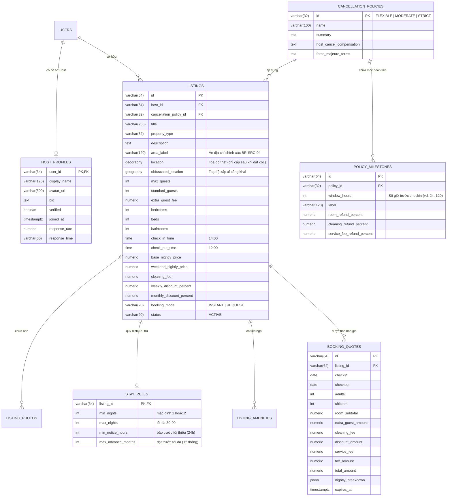

# Hợp Đồng Thiết Kế CSDL (FE-to-BE DB Handover Contract) · S12-LISTING-DETAIL

> **Mục tiêu**: Cung cấp kiến trúc CSDL PostgreSQL và mô hình thực thể quan hệ chuẩn xác cho Chi tiết Homestay (P03), Hồ sơ công khai Host (P04), Bảng chính sách hủy (P05) và Động cơ tính báo giá (Pricing Engine Quote).

---

## 1. Biểu Đồ Thực Thể - Quan Hệ (ER Diagram)



---

## 2. Đặc Tả Bảng CSDL PostgreSQL

```sql
-- 1. Bảng Chính Sách Hủy & Các Mốc Hoàn Tiền
CREATE TABLE cancellation_policies (
    id VARCHAR(32) PRIMARY KEY, -- 'FLEXIBLE', 'MODERATE', 'STRICT'
    name VARCHAR(100) NOT NULL,
    summary TEXT NOT NULL,
    host_cancel_compensation TEXT NOT NULL,
    force_majeure_terms TEXT NOT NULL,
    created_at TIMESTAMPTZ NOT NULL DEFAULT CURRENT_TIMESTAMP
);

CREATE TABLE policy_milestones (
    id VARCHAR(64) PRIMARY KEY,
    policy_id VARCHAR(32) NOT NULL REFERENCES cancellation_policies(id) ON DELETE CASCADE,
    window_hours INT NOT NULL, -- 24 (trước 24h), 0 (trong ngày checkin), -1 (sau checkin)
    label VARCHAR(120) NOT NULL,
    room_refund_percent NUMERIC(5, 2) NOT NULL,
    cleaning_refund_percent NUMERIC(5, 2) NOT NULL,
    service_fee_refund_percent NUMERIC(5, 2) NOT NULL
);

-- 2. Quy Định Lưu Trú (Stay Rules)
CREATE TABLE stay_rules (
    listing_id VARCHAR(64) PRIMARY KEY REFERENCES listings(id) ON DELETE CASCADE,
    min_nights INT NOT NULL DEFAULT 1,
    max_nights INT NOT NULL DEFAULT 30,
    min_notice_hours INT NOT NULL DEFAULT 24,
    max_advance_months INT NOT NULL DEFAULT 12
);

-- 3. Snapshots Báo Giá Tạm (Booking Quotes Cache)
CREATE TABLE booking_quotes (
    id VARCHAR(64) PRIMARY KEY,
    listing_id VARCHAR(64) NOT NULL REFERENCES listings(id) ON DELETE CASCADE,
    checkin DATE NOT NULL,
    checkout DATE NOT NULL,
    adults INT NOT NULL DEFAULT 1,
    children INT NOT NULL DEFAULT 0,
    room_subtotal NUMERIC(15, 2) NOT NULL,
    extra_guest_amount NUMERIC(15, 2) NOT NULL DEFAULT 0,
    cleaning_fee NUMERIC(15, 2) NOT NULL DEFAULT 0,
    discount_amount NUMERIC(15, 2) NOT NULL DEFAULT 0,
    service_fee NUMERIC(15, 2) NOT NULL DEFAULT 0,
    tax_amount NUMERIC(15, 2) NOT NULL DEFAULT 0,
    total_amount NUMERIC(15, 2) NOT NULL,
    nightly_breakdown JSONB NOT NULL,
    expires_at TIMESTAMPTZ NOT NULL,
    created_at TIMESTAMPTZ NOT NULL DEFAULT CURRENT_TIMESTAMP
);

CREATE INDEX idx_booking_quotes_lookup ON booking_quotes(listing_id, checkin, checkout, adults, children);
```

---

## 3. Bất Biến Nghiệp Vụ & Quyền Riêng Tư (Security & Invariants)

1. **Bảo mật toạ độ (BR-SRC-04)**: API công khai chỉ trả về `publicArea.centerLat`, `publicArea.centerLng`, và bán kính `radiusMeters` (500m). Tuyệt đối không bao giờ trả toạ độ chính xác hay số nhà/ngõ trước khi thanh toán thành công.
2. **Bảo mật Host Profile**: API hồ sơ Host công khai không bao giờ để lộ email, số điện thoại, tài khoản ngân hàng hoặc số CCCD/Hộ chiếu.
3. **Tính giá bất biến (Pricing Invariant)**: Bảng giá tổng trên Sticky Booking Box chỉ được chấp nhận khi sinh ra từ `PricingEngine` của Backend (hoặc snapshot `booking_quotes`).
