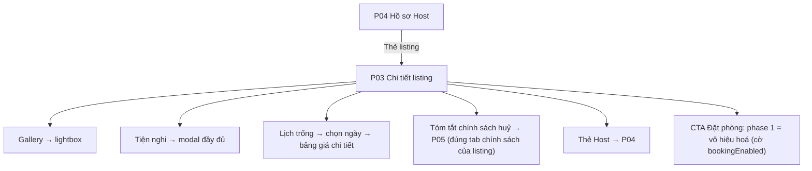

### S12 · Chi tiết, hồ sơ Host, chính sách huỷ (P03, P04, P05)

```mermaid
flowchart TD
  P3["P03 Chi tiết listing"] --> G["Gallery → lightbox"]
  P3 --> A["Tiện nghi → modal đầy đủ"]
  P3 --> CAL["Lịch trống → chọn ngày → bảng giá chi tiết"]
  P3 --> CP["Tóm tắt chính sách huỷ → P05 (đúng tab chính sách của listing)"]
  P3 --> H["Thẻ Host → P04"]
  P3 --> BK["CTA Đặt phòng: phase 1 = vô hiệu hoá (cờ bookingEnabled)"]
  P4["P04 Hồ sơ Host"] -->|"Thẻ listing"| P3
```

