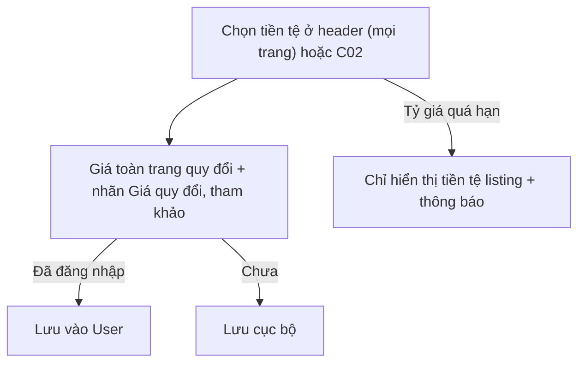

# Đặc Tả Kỹ Thuật Giao Diện · S13-CURRENCY-EXCHANGE

> Thư mục này đóng gói toàn bộ: **User Flow**, **Wireframes**, **UX Behavior**, và **Screen Data/API Contract** cho S13.


---

### S13 · Tiền tệ hiển thị (mở rộng C02, P02, P03)


---


---


## S13 · Tiền tệ hiển thị và tỷ giá (mở rộng C02, P02, P03)

| Vị trí | Thay đổi UI | State bổ sung |
|---|---|---|
| Header (Public/Account) | `₫ VND ▼` mở dropdown (Desktop) / bottom sheet (Mobile) liệt kê tiền tệ được hỗ trợ + ô tìm | Đang tải tỷ giá · Lỗi tỷ giá (dùng tiền tệ listing + toast) |
| C02 | Bật ô "Tiền tệ hiển thị" (đã chừa chỗ từ S02) | Chưa có lựa chọn → mặc định VND |
| P02 thẻ listing | Giá = giá quy đổi, tiền tố "≈", tooltip "Giá gốc 5.300.000 ₫ · Tỷ giá ngày dd/mm" | **Tỷ giá quá hạn** → hiển thị tiền tệ listing + banner trên cùng kết quả |
| P03 thẻ đặt phòng/PriceBreakdown | Mỗi dòng quy đổi; dòng cuối: "Giá quy đổi chỉ để tham khảo. Bạn sẽ thanh toán bằng {tiền tệ listing/cổng}" | Như trên + **làm tròn theo từng loại tiền** (VND 0 chữ số thập phân, USD 2…) |
```
 Dropdown tiền tệ (🖥)                       Bottom sheet (📱)
 ┌────────────────────┐                      ┌──────────────────────────┐
 │ 🔍 Tìm tiền tệ      │                      │ Tiền tệ hiển thị      ✕  │
 │ ◉ ₫ VND – Đồng VN   │                      │ 🔍 Tìm                    │
 │ ○ $ USD – Đô la Mỹ  │                      │ ◉ ₫ VND  ○ $ USD  ○ € EUR │
 │ ○ € EUR – Euro      │                      │ ⓘ Giá quy đổi tham khảo   │
 │ ⓘ Tỷ giá cập nhật   │                      │ [      Áp dụng        ]   │
 │   theo ngày         │                      └──────────────────────────┘
 └────────────────────┘
```


---


## S13 · Tiền tệ hiển thị và tỷ giá

- **Chọn tiền tệ**: header (mọi trang) hoặc C02; mở dropdown/sheet có ô tìm; chọn → áp dụng **ngay** cho toàn trang: gửi lại các truy vấn giá với `currency` mới (BE quy đổi và làm tròn), **skeleton chỉ ở các dòng giá**, phần còn lại giữ nguyên.
- Đã đăng nhập: lưu vào User; chưa đăng nhập: lưu cục bộ. Lần truy cập sau tự áp dụng.
- **Nhãn bắt buộc** (BR-SRC-05, S13 AC): mọi giá quy đổi có tiền tố "≈" + tooltip/dòng chú thích "Giá quy đổi, chỉ để tham khảo. Tiền tệ của chỗ ở: VND. Tỷ giá ngày dd/mm/yyyy"; ở bảng giá chi tiết (P03) hiển thị **thêm** số tiền theo tiền tệ listing.
- **Tỷ giá lỗi/quá hạn**: BE trả cờ `fxStale`/`fxUnavailable` → hiển thị **tiền tệ của listing** + banner nhỏ "Chưa thể quy đổi tiền tệ, đang hiển thị theo VND"; bộ chọn tiền tệ disabled cho tới khi phục hồi.
- Làm tròn theo loại tiền do BE xử lý; FE chỉ **định dạng** theo tiền tệ và ngôn ngữ.

---


---


## S13 · Tiền tệ hiển thị và tỷ giá

| Dữ liệu | Nguồn | Ghi chú |
|---|---|---|
| supportedCurrencies[] `{code, symbol, name, decimals}` | `/config/public` | |
| displayCurrency | User/local | |
| Giá trong mọi phản hồi | `Money` + `converted? {original: Money, rate, rateDate}` | BE quy đổi và làm tròn (BR-PRC-08) |
| fx `{status: OK｜STALE｜UNAVAILABLE, asOf, source}` | ExchangeRateSnapshot | STALE/UNAVAILABLE → FE về tiền tệ listing (S13 AC) |
| Truy vấn | thêm tham số `currency=` vào search/quote/price-calendar | |

---

