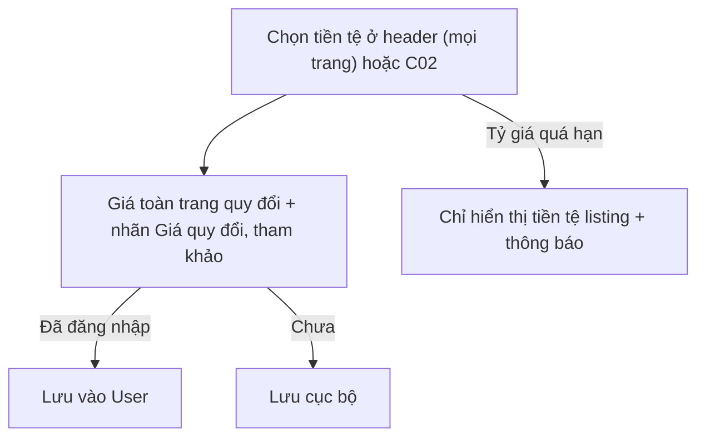

### S13 · Tiền tệ hiển thị (mở rộng C02, P02, P03)

```mermaid
flowchart TD
  A["Chọn tiền tệ ở header (mọi trang) hoặc C02"] --> B["Giá toàn trang quy đổi + nhãn Giá quy đổi, tham khảo"]
  B -->|"Đã đăng nhập"| C["Lưu vào User"]
  B -->|"Chưa"| D["Lưu cục bộ"]
  A -->|"Tỷ giá quá hạn"| E["Chỉ hiển thị tiền tệ listing + thông báo"]
```

---

